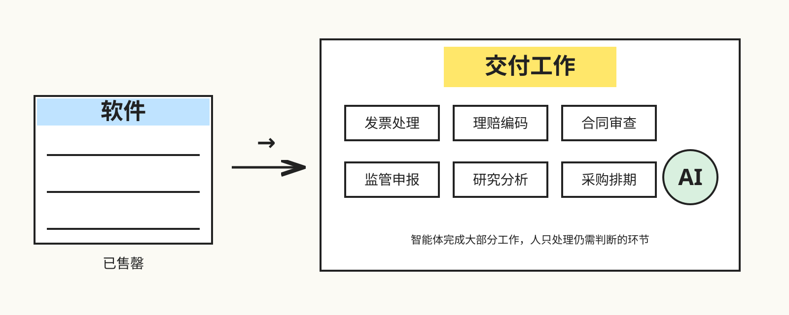
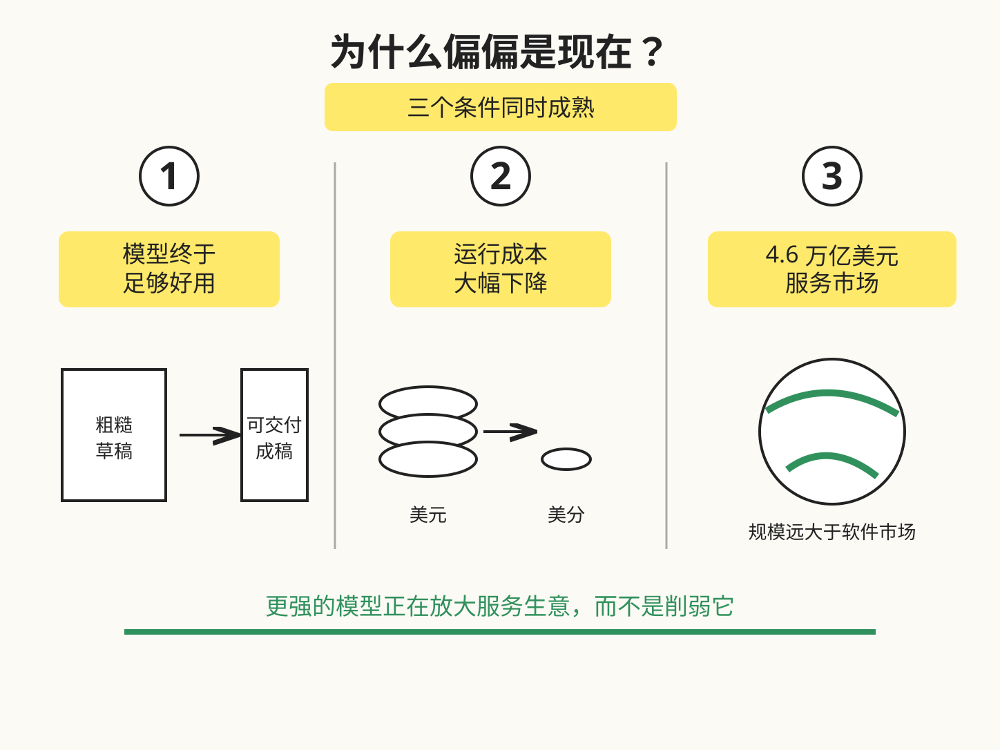
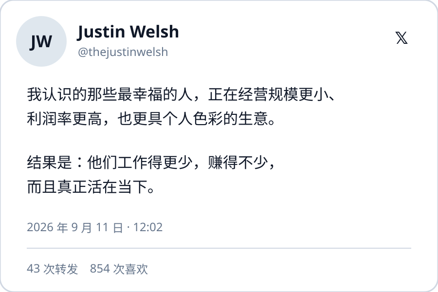
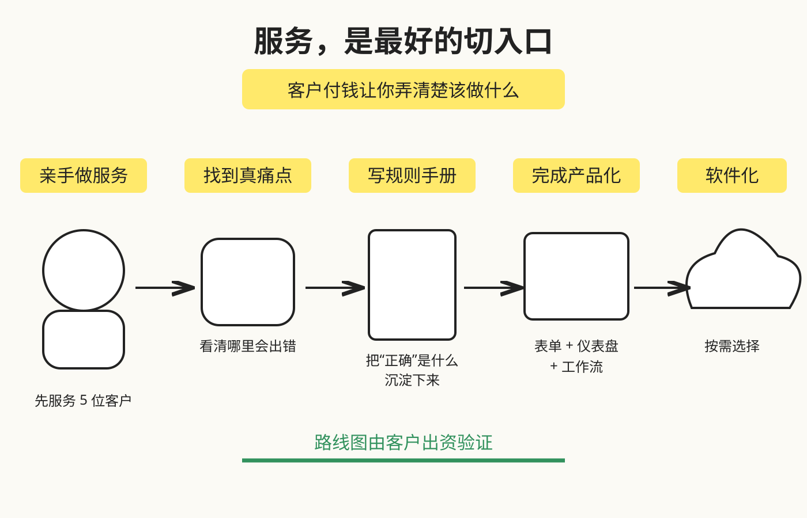
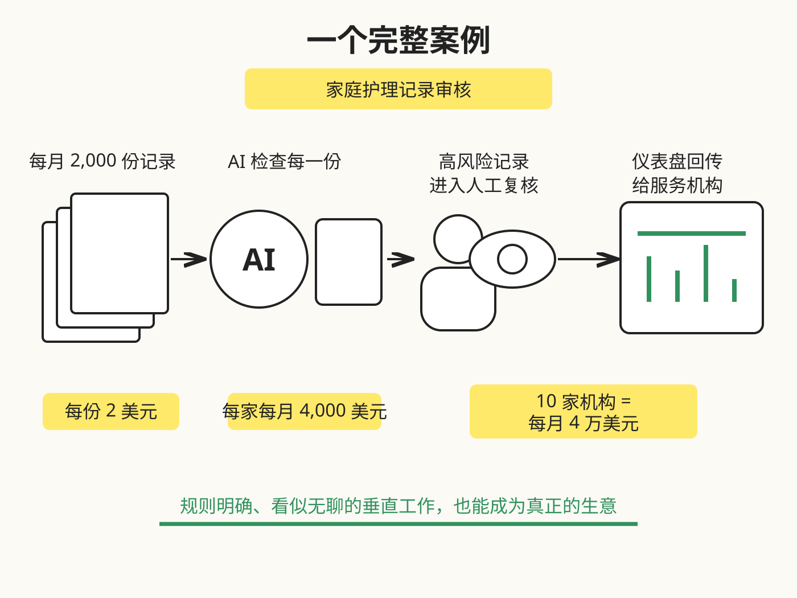
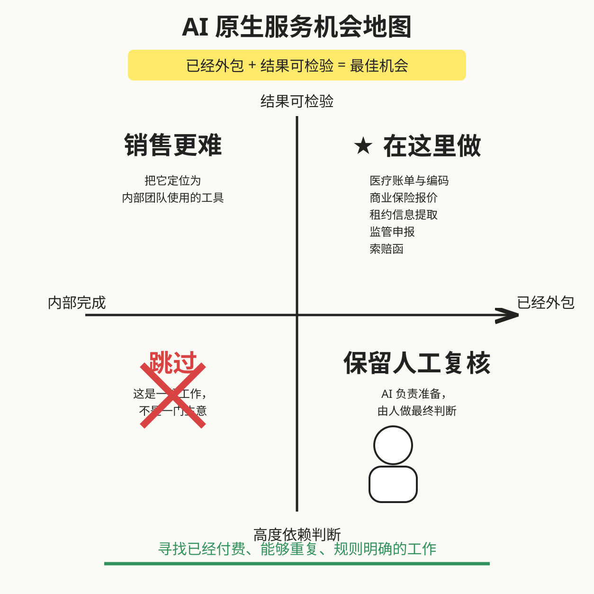

# AI 原生服务：一个价值 1000 亿美元的机会

> 作者：Greg Isenberg（[@gregisenberg](https://x.com/gregisenberg)）  
> 原文：[AI-native services: a $100B opportunity](https://x.com/gregisenberg/status/2101760050108797268)  
> 翻译 Url：[AI 原生服务：一个价值 1000 亿美元的机会](https://github.com/samz406/local_wenzhang/blob/main/docs/AI原生服务1000亿美元机会/AI原生服务-一个价值1000亿美元的机会.md)  
> 发布日期：2026 年 9 月 20 日

AI 原生服务已经来了。我认为，这是眼下最值得创业者去做的一类生意，其中可能有 1000 亿美元的市场正在等待瓜分。下面是一份完整指南：什么是 AI 原生服务、如何从零搭建，以及机会究竟分布在哪里。

这篇文章的信息密度很高。泡杯咖啡或茶，留出 15 分钟，我们直接开始。

## 背景

在我职业生涯的大部分时间里，经营服务生意意味着：能过上不错的日子，却算不上一家好公司——至少许多风险投资人是这么看的。你出售的是工时；只要停下工作，收入就会停止；整个生意还依赖少数几个随时可能离职的人。如今，这件事正在改变，而原因用一个例子就能讲清楚。

一家公司每年大约花 1 万美元购买 QuickBooks，却要每年支付约 12 万美元，雇一名会使用 QuickBooks 的会计。过去 20 年里，软件公司争夺的是那 1 万美元，因为软件可以规模化销售；另外 12 万美元则被锁在人的身上，而人无法扩张，除非再招一个人。现在，被锁住的这笔钱终于释放出来了。AI 已经能够完成会计的大部分工作，这意味着你不必再出售工具，而可以直接出售完成后的成果——例如已经结好的账——并且获得软件级的利润率。

这就是 AI 原生服务：绝大部分工作由智能体完成，少量仍然需要人的环节则交给一支精简团队。收费方式由你决定，可以按月收取固定服务费、按件计价、按用量收费，选择最适合客户的一种。所谓“AI 原生”，关键不在定价，而在于交付由软件驱动，不再依靠不断增加人头。

这篇文章会把整套方法逐一拆开：它由什么组成、如何构建，以及机会地图长什么样。

## AI 原生服务到底是什么

最简单的理解方式是：传统服务公司出售人的时间；SaaS 公司出售工具，让客户自己完成工作；AI 原生服务则替客户把事情做完，其中绝大部分工作由智能体承担。

客户并不想要一套记账软件，他们要的是账目已经结清；客户也不想要合同审查工具，他们想知道这份合同签下去是否安全。AI 原生服务直接交付这个结果。客户的体验就像雇了一家公司，只是速度更快、价格更低，而且永远不会疲惫。至于是按月、按项目还是按用量收费，是另一项独立决策。

真正的关键在于：它的底层运作方式像软件。工作由一套只需构建一次的系统完成，而不是靠永无止境地扩充团队。所以它可以按服务收费，却获得软件公司的估值——这正是整个机会所在。

## 为什么是现在

两年前，这件事还做不到。现在之所以可行，是因为几个条件同时成熟了。

第一，模型终于足以完成真正的工作：审查合同、给医疗理赔编码、起草索赔函、完成月度结账。两年前，模型交出的是一份必须由人推倒重来的粗糙草稿；今天，它交出的是一份只需人工检查的成稿。

第二，运行成本暴跌。过去要花几美元词元费用的任务，现在只需几美分。这意味着再交付一件工作的边际成本已经接近于零——正是这个数字，让一门服务生意有机会拥有软件级利润率。

第三，钱本来就在那里。美国企业每年在服务上的支出约为 4.6 万亿美元，大约是软件支出的 6 倍。这些钱付给会计、经纪人、律师助理、记账员和合规专家。过去 20 年，这个资金池几乎无法触碰，因为每一美元都绑定着一个人。如今，它成了整个经济中最大的开放市场，而且这些市场开放的程度高得有些惊人。

看看最早行动的公司就知道了。提供法律服务的 Harvey，大约 5 个月内将年收入从约 1 亿美元增长到 1.9 亿美元。EvenUp 以每封约 500 美元的价格，向人身伤害律师事务所出售索赔函；这项工作过去会占用初级律师 8～12 个小时，而它的收入已经突破 5000 万美元。Kick 为小企业提供每月 300～500 美元的记账服务，价格不到人工记账员的一半，毛利率却仍超过 70%。这些本质上都是服务公司，只不过恰好拥有软件公司的经济模型。

### 众多创业方向中，为什么要选服务

今天，大多数创业者都在 SaaS 产品、App 和代理公司之间做选择。下面我解释为什么 AI 原生服务能够胜过这三种模式。

SaaS 就像在向下运行的自动扶梯上往上爬。你出售一件工具，而它的竞争对手是每个季度都在变得更强、更便宜的基础模型。每当一家模型实验室发布新品，你的产品价值就会缩水一点。App 依赖应用商店，你必须始终陪平台起舞；因为要向苹果支付 30% 的分成，利润率也会被压低。传统代理公司仍然出售工时，收入上限由人数决定，利润率则永远困在 20%～30%。

AI 原生服务把这套逻辑完全翻转。你出售的是已经完成的工作，所以模型越强，你的生意就越好。模型进步不再与你竞争，而是在替你增加价值。

客户的预算原本就存在。你替代的是客户已经在支付的一项费用，因此不必先说服对方“你有这个问题”，也不必凭空创造一个新品类。销售话术只有一句：“我们能完成你现有服务商正在做的工作，但更快、更便宜。”这是商业世界里最容易讲清楚的推销。

它从第一天就能产生现金流。SaaS 创始人可能要花一年猜测产品市场匹配，然后才能见到收入；服务创业者完成第一份工作就能收到钱。你一边拿钱，一边学习究竟该构建什么。这也是一种更具个人色彩的生意。至少从我身边的情况看，那些经营小规模、高利润率 AI 生意的朋友，似乎都更快乐。

## 服务是最好的切入口

最妙的地方在于：服务本身，就是最好的切入口。

在还不知道最终该做什么产品之前，你可以先凭服务进入一家客户、一个细分市场、一个行业。你亲手完成工作并获得收入；每个项目都会告诉你真正的痛点在哪里、“正确”到底意味着什么、哪些环节能够交给机器。接着，把学到的东西产品化；如果愿意，再把它变成软件。你从服务一路爬向产品，而且每一级台阶都有客户为你付钱，而不是先融资，再靠猜测决定该做什么。

最大的几家 AI 公司早就理解了这个道理。前沿部署工程师模式——让工程师嵌入客户现场，不是给建议，而是亲手构建——本质上就是把服务当作进入大型企业的切入口。赢家靠这种方式敲开客户大门。你完全可以在自己熟悉的细分行业里，以更小的规模复制同一套打法。

## 组成一门 AI 原生服务生意的八个部分

每一门 AI 原生服务生意，都由相同的基本部件组成。掌握它们，你几乎可以为任何细分行业设计一套业务。

- **交付单元。** 这是最重要的一项决策。你必须出售一种定义清楚的东西：每笔理赔、每次申报、每份合同、每个月的账目、每份报告。永远不要按小时收费。固定服务费没有问题，前提是服务范围明确；你交付的仍然是具体单元，只不过从逐件结算改成每月结算。交付单元让你能够定价、重复交付，并最终把服务变成软件。选择一种终点清晰、客户看一眼就能说“完成了”的东西。

- **任务入口。** 工作如何进入你的系统。大多数服务公司都在这里悄悄亏钱：代理公司要开三次电话会议，才能界定一份工作的范围；AI 原生服务只需要一张表单。客户上传文档、填写五个字段、说明自己需要什么，到此结束。如果任务无法被定义成一张表单，说明你的交付单元还不够清晰。

- **处理引擎。** 真正执行工作的 AI，由模型、指令、示例，以及你掌握的行业背景组成。第一天，它可能只是一个写得不错的提示词和几十个示例。随着项目积累，它会逐渐变成竞争对手难以复制的东西，因为你做过的每一项工作都在塑造它。

- **规则手册。** 这才是真正的产品，却被几乎所有人低估。它是一份书面清单，明确这个细分行业中什么叫“正确”，以及 AI 可能以哪些方式犯错。例如：“家庭护理记录没有生命体征数据就不完整。”“索赔函必须引用治疗日期。”“理赔编码与诊断不匹配时，这类申请会被拒绝。”你阅读每一次输出，把发现的错误逐条记下，以这种方式一点点构建规则。完成几百个项目后，正是这本规则手册让输出值得信任，也让生意拥有防御性。

- **复核层。** 人仍然参与检查的地方。针对每个交付单元，你要决定哪些可以自动发出，哪些必须先由人查看。风险低、置信度高的工作直接交付；凡是涉及资金、法律责任或客户声誉的内容，都要经过人工检查。复核层让你可以为错误负责，又不至于被错误淹没；而且随着规则手册逐渐完善，人工复核范围会不断缩小。

- **交付方式。** 成果如何回到客户手里：客户登录的仪表盘、附带文件的邮件、展示处理状态的门户。这一层取代了客户经理。客户应该随时看见自己的任务进行到哪一步，而不必开口询问任何人。

- **定价。** 你有两个好选择和一个坏选择。按单元计价——每笔理赔、每次申报、每封信分别收费——适合业务量可预测，而且客户希望用多少付多少的场景。固定月费——针对明确范围收取固定费用——适合客户需要预算确定性，而你希望拥有可预期收入的场景。Kick 每月收取 300～500 美元提供记账服务，就是固定月费，而且是一门很好的生意。唯一应该避免的是按小时收费，因为它会把收入与员工人数绑在一起，重新掉进让代理公司难以成为好生意的陷阱。不论选择哪一种，都要对照人工替代方案来定价，而不是根据自己的成本定价。如果传统事务所收费 2500 美元，你就收 800 美元。客户觉得自己捡了便宜，而你仍然赚得丰厚，因为多交付一个单元的成本接近于零。

- **获客渠道。** 对大多数细分市场来说，最诚实的答案是：围绕真正有付款权的人整理一份精准名单，进行冷启动外联，再配一个获客诱饵——第一单免费做。假设一家家庭护理机构免费拿到十份记录的审核结果，并发现三处自己遗漏的问题，它可能当天下午就成为客户。如果你本来就在持续创作，内容营销也有效；还可以与这些企业已经在使用的软件建立合作，或利用圈子很小、人人彼此认识的行业转介绍。你不需要先拥有一群观众，只需要一条能够触达买方的渠道，而免费完成第一单就是最快的渠道。

## 把所有部件组装起来：一个真实案例

下面用真实数字，看看这些部件组装起来是什么样子。

以家庭护理记录审核为例。一家中等规模的机构每月会产生约 2000 份上门服务记录，并且每年要花大约 7 万美元雇一名护士审核，因为记录一旦不完整，理赔申请就可能被拒，或在审计中被标记。

交付单元是一份审核完成的记录。任务入口是上传：机构把当天的记录放进系统。处理引擎依据你建立的规则手册审核每一份记录，检查 20 种可能导致拒付的问题，例如生命体征缺失、药物变更描述模糊、护理内容无法支撑申报的服务等级。复核层把合格记录直接发回，将高风险记录标出来，交给人工快速查看。交付方式是一块仪表盘，展示所有记录、哪些已经通过、哪些需要修改，因此机构不必再开口询问。

你对每份记录收费 2 美元。仅一家机构，每月就是 4000 美元收入，而把一份记录送进模型的成本只有几美分。十家机构是每月 4 万美元；五十家就是每年 240 万美元，而且一个人就可以运转，因为任务入口只是上传、检查依赖规则手册、交付依赖仪表盘。最开始，你只是亲手为五家机构审核记录；那段时间写下的规则手册，如今成了整个产品。这就是它的形态：一门真正的生意，身处几乎没人争夺的细分市场，而且这个月就能开始。

## 如何构建一门 AI 原生服务生意

1. **先在后面的机会地图中选定一个格子。** 你要找的是企业已经付钱交给外部机构完成，而且拥有可检验正确答案的工作。这两个条件都很重要，后面会解释原因。

2. **找到五位客户，先以人工为主，把工作替他们做完。** 用 AI 作为处理引擎，但每份输出交付前都要亲自阅读。这时你还没有产品，你是在学习正确答案长什么样、AI 会在哪里出错、客户真正关心什么。只要亲手工作几个星期，就能获得这些认识；坐在融资演示文稿前凭空猜测，永远得不到它们。

3. **记下每一个错误。** 每次发现问题，就把它加入规则手册。完成几十份工作后，你就会得到这个细分领域中最常反复出现的 20 种错误。那份清单就是你的产品，而且只有你拥有。

4. **完成产品化。** 固定服务范围，固定价格；把任务入口变成表单，把交付变成仪表盘，再让规则手册自动运行。现在，一个人就能服务五十位客户，生意拥有软件公司的利润率，同时保留服务业务的销售周期。大多数 AI 原生服务生意最适合停在这里，而且这里已经足够好。

5. **只有在你愿意时，再把它变成软件。** 当规则手册和工作流都足够稳固，就可以允许客户自己运行。这是从产品化服务跨向产品的一步，也是估值最高的阶段。但此时的高估值是你挣来的，因为你先通过亲手工作构建软件，而不是猜测应该做什么。走到这里，如果愿意，你当然也可以选择融资。

我计划本周在 [@startupideaspod](https://x.com/startupideaspod) 的 YouTube、Spotify 和 Apple 播客中做一期节目，更深入地讨论这个主题。

## 机会地图

一个想法能否成立，几乎取决于两个问题。

第一，客户是否已经花钱请外部机构完成这项工作？如果答案是肯定的，预算已经存在，服务范围也已被定义，客户换成你几乎没有额外成本。如果工作目前由内部员工完成，你等于在试图替代对方的一名雇员，这会成为一场困难得多的谈判。

第二，是否存在可检验的正确答案？如果输出能够根据规则验证，那么 AI 加上你的规则手册就能接管它；如果必须依赖真正的主观判断，人就必须留在工作流里。

把这两个问题放进一张二维表，就会得到四个格子：

- **已经外包，结果可检验：就在这里创业。** 这是最理想的区域。客户本来就在给一家机构付费，而你是它更快、更便宜的版本，还能够证明工作结果正确。
- **结果可检验，但由内部完成：是真实机会，但更难销售。** 把它定位成团队保留并使用的工具，不要说成取代某个人。
- **已经外包，但高度依赖判断：保留人工复核，并收取高价。** AI 完成准备工作，由人做最终判断；你的价格可以接近原服务商。
- **由内部完成，而且高度依赖判断：直接跳过。** 因为这是一份工作，不是一门生意。

## 具体机会

下面这些都真实地位于地图右上角，我同时列出了适合出售的交付单元。它们都不光鲜——这是有意为之。

- **医疗账单与编码，按理赔申请收费。** 诊所已经在外包这项工作。错误编码会导致理赔被拒，因此答案可检验，而且犯错代价很高。
- **商业保险报价，按保单收费。** 经纪人的核心工作是比较保险公司并填写表格，本质上是输出可检验的任务。
- **海关与货运分类，按批货物收费。** 每次进口都需要正确编码和文件。规则严格、文档繁多，出错成本很高。
- **持牌企业监管申报，按申报次数收费。** 金融、食品、医疗企业都在花钱请专家遵循严格规则，而规则本身就是需求规格书。
- **租约信息提取与产权工作，按文档收费。** 商业房地产行业充斥着这类任务，而且早已大量外包。
- **RFP 与资助申请撰写，按申请收费。** 工作主要依赖固定结构和历史范例，客户预算也早已作为一项支出存在。
- **房产税申诉，按申诉收费，并分享节省金额。** 这项工作已经被外包，结果可检验，而且客户只在成功后付款。我最近刚做过一次，并向服务商支付了节省金额的 50%；你完全可以用 10% 的比例提供同类服务。
- **家庭护理记录审核，按记录收费。** 记录不完整就会导致账单被拒，而机构今天仍在用人工逐份审核。
- **人身伤害案件索赔函，按信函收费。** 初级律师每封都要花数小时，结构却高度重复，结果也可检查。
- **应付账款异常处理，按异常项收费。** 企业花钱让员工追踪那些无法匹配的发票，而匹配本身是一套规则。

注意其中的共同模式：企业已经花钱让某个人完成这项工作；存在可以检查的正确答案；它所在的行业仍在使用老旧软件，而且所有人都厌恶这个过程。这个组合就是信号。一旦找到，你就找到了一门生意。

我会继续在 [Ideabrowser.com](https://www.ideabrowser.com/) 增加这类机会；注册查看已经验证的创业想法是免费的。

## 什么让这门生意拥有防御性

每位创始人和投资人首先都会问：“客户为什么不直接用 ChatGPT 自己做？”答案是：他们不想要一件工具，他们想让事情被做完；一旦出错，他们还需要有人负责。诊所不会让办公室经理把理赔材料复制进聊天机器人，然后祈祷一切顺利。他们想要一家真正懂得理赔为何被拒、已经发现过三百次类似错误，而且一旦遗漏就愿意负责修正的服务商。你的规则手册与责任承担能力才是产品，模型只是引擎，而且大家用的引擎都差不多。

这才是真正的护城河。出售完成后的工作，也意味着你要为错误负责。软件公司发布一个 Bug，之后打补丁就行；服务公司提交了一笔错误理赔，却会造成真实损失，客户理应生气。所以护城河不是模型，而是规则手册——是你在一个狭窄领域里捕获并记录的数百个边缘案例。竞争对手一个下午就能下载同样的模型，却下载不了你从三百个项目错误中获得的经验。

这也是复核层如此重要的原因。它让你能够承担错误，却不至于被错误吞没；而且规则手册越完善，复核层就越小。

## 最必须做对的一件事

大多数所谓“AI 代理公司”，只是把 AI 接进生产流程，其他一切维持原样。结果只是得到了一家稍微便宜一点的代理公司。代理公司之所以一直算不上好生意，原因在于工作周围那些沉重的管理成本：界定范围、检查、管理、销售——而且每增加一位客户，这些成本都会增长。

AI 原生服务会有意识地压缩这些成本。任务入口是一张表单，服务范围是一份菜单，质量标准是一本规则手册，客户管理是一块仪表盘。做到这些，生意的行为就像软件；省略这些，你只是把一个原本就不好用的模式加快了一点。更有吸引力的是，如果将来想出售这门生意，你的利润率可能达到 60%～80%；按照 EBITDA 的 6～12 倍完成退出，足以带来改变人生的回报。

整套方法大致就是这样：选定一个交付单元，构建任务入口、处理引擎、规则手册、复核层和交付方式；对照人工替代方案定价，按单元或按月收费；先亲手为五位客户完成工作，记录每一个错误，再完成产品化。过去被锁在一个人身上的那 12 万美元，现在已经开放了。去找到属于你的那一份。

写这篇文章，只是希望让你的创业想象力转动起来。

**AI 原生服务已经来了，现在就是最好的时机。**
