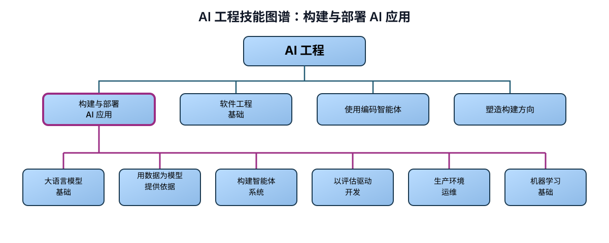

# AI 工程技能图谱：构建与部署 AI 应用

> 作者：Andrew Ng（[@AndrewYNg](https://x.com/AndrewYNg)）  
> 原文：[AI Engineering Skills Map: Building and Deploying AI Applications](https://x.com/AndrewYNg/status/2090840747738374568)  
> 翻译 Url：[https://github.com/samz406/local_wenzhang/blob/main/docs/AI工程技能图谱/01-构建与部署AI应用.md](https://github.com/samz406/local_wenzhang/blob/main/docs/AI工程技能图谱/01-构建与部署AI应用.md)

我此前[介绍过](https://x.com/AndrewYNg/status/2088302050706686198)我们的 AI 工程技能图谱。其中，最高层级的能力包括：（一）构建与部署 AI 应用；（二）软件工程基础；（三）使用编码智能体；（四）塑造构建方向。这篇文章将具体展开第一项。

要熟练构建和部署 AI 应用，需要掌握：

- 大语言模型基础
- 用数据为模型提供依据
- 构建智能体系统
- 以评估驱动开发
- 生产环境运维
- 机器学习基础

这份技能图谱来自对大量招聘信息、结构化专家访谈和问卷反馈的分析。

AI 应用与非 AI 软件最关键的区别，在于前者的输出更难预测。你无法预先知道大语言模型会生成什么，也不知道监督学习算法会做出怎样的预测。正因为存在这种不确定性，构建 AI 系统比构建传统软件更依赖迭代，也更难提前规划整个过程。优秀的 AI 工程师会反复构建一部分软件，检查结果，再决定下一步尝试什么；每一步都深受中间结果影响。能否娴熟地判断下一步该做什么，决定了你能不能用不可靠的 AI 组件搭出可靠的软件系统。为此，你需要掌握以下能力。

**大语言模型基础。** 理解大语言模型如何对输入进行分词、如何生成输出，能帮助你判断何时可以信赖它、何时它可能失效。你还需要理解什么时候该使用多模态模型，如何权衡上下文窗口中应当放入哪些内容，以及缓存命中、知识截止日期、推理强度、采样参数等因素；同时知道何时使用工具调用等特殊能力。掌握这些基础，能让你选择合适的模型或模型组合，并在必要时采用微调、自托管模型等专门技术。

**用数据为模型提供依据。** 大语言模型需要高质量的输入上下文，才能产出有用的结果。利用向量检索实现 RAG，是早期为大语言模型补充相关上下文的一种方式；如今，用数据为模型提供依据的技术已经丰富得多。比如，你需要决定哪些内容直接放进提示词，哪些内容交给大语言模型通过工具按需检索；还要判断哪种表示形式最适合现有数据和查询：向量索引、知识图谱，还是构建在结构化数据（如客户记录）之上的语义层。你还要把文档——包括文本、PDF、HTML 和图片——转化为大语言模型可用的输入，并设计数据管道，让数据始终保持干净和新鲜。越熟悉获取数据的各种手段，你就越能为大语言模型提供真正相关的上下文。

**构建智能体系统。** 智能体系统既可以是按预定顺序执行多次大语言模型调用的工作流，也可以建立在智能体运行框架之上，让大语言模型反复自行决定下一步行动。你需要选择系统架构：哪些步骤串行，哪些步骤并行；何时使用代码，何时使用大语言模型；并为工作流或运行框架设计好降级方案。在设计智能体循环时，你还要决定模型可以调用哪些工具（包括 MCP、CLI 和沙箱执行环境）、采用什么记忆架构、如何管理长会话中的上下文，以及一项任务何时需要多智能体编排，而不是单智能体架构。你还需要把有潜力的原型变成可靠、安全、能够投入生产的智能体。这意味着要理解护栏机制和对抗性输入，识别并规避数据外泄等关键风险，同时做好治理。

智能体工作流正在飞速演进。你还应了解与自己应用领域相关的前沿技术，例如语音智能体、计算机操作智能体和生成式界面。

**以评估驱动开发。** 依我的经验，真正擅长构建 AI 系统的人，最显著的特征是能够用一套严谨的评估与错误分析闭环来推动开发。这样，你才能一次次把精力投向更有希望的方向。我发现，这项能力并不容易掌握，因为正确做法会随项目而大幅变化，甚至同一项目处在不同阶段，方法也会不同。

设计高质量评估，本身就是一项很深的技术能力。你可能需要查看系统的运行轨迹和输出，开展探索性数据分析，再结合对产品和业务的理解，决定究竟测量什么。你还要熟悉各种评估方式：何时采用确定性的代码评估，何时让大语言模型充当裁判，何时引入人工判断；同时还要知道如何评估现有评估，并持续改进它们。这些评估会进入下一轮迭代，继续推动开发，让进步变得系统化，而不是靠随机试错。

**生产环境运维。** AI 软件具有不可预测性，同时还受成本和延迟影响，因此它的生产运维不同于传统软件。首先，你要懂得建立可观测机制，了解系统面对真实用户时的表现；你需要跟踪性能、发现漂移，并在模型故障或对抗性提示词注入等安全事件发生时迅速响应。建立回归测试和 CI/CD 时，需要采用比传统软件更多的统计性评估，而且测试投入应与出错风险相匹配。此外，还要懂得如何组合不同手段——例如优化模型选择、蒸馏与微调，以及简化智能体工作流——来降低成本和延迟，尤其是在应用拥有大量用户时。

**机器学习基础。** 现代大语言模型建立在监督学习、强化学习等机器学习技术之上。我认识的每一位善于使用大语言模型进行开发的工程师，都对机器学习和深度学习有一定深度的理解。此外，许多应用依然需要机器学习：可能使用别人训练的模型，也可能自己训练模型。这就要求你了解常用的机器学习与深度学习模型，理解准确率、训练速度、推理速度等方面的取舍，也懂得如何为模型训练和评估设计所需的数据。偏差与方差、错误分析和数据工程等机器学习概念，仍然是 AI 系统开发中做出各种决策的关键。这些概念本就是我们面对不确定输出系统时不可或缺的思维框架。

要真正擅长构建和部署 AI 系统，需要学习的东西很多，这是一个技术纵深极大的领域。但你每多学会一点，就会成为更好的 AI 工程师，也能构建出更令人兴奋的应用。软件工程能力与这些技能相辅相成，我会在后续文章中继续讨论。
