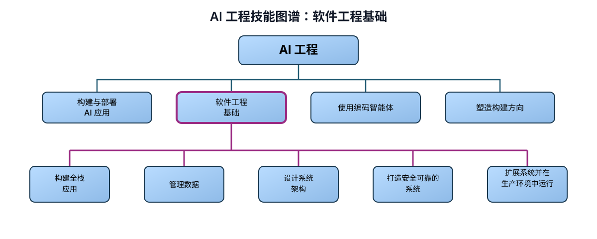

# AI 工程技能图谱：软件工程基础

> 作者：Andrew Ng（[@AndrewYNg](https://x.com/AndrewYNg)）  
> 原文：[AI Engineering Skills Map: Software Engineering Fundamentals](https://x.com/AndrewYNg/status/2093388974194872781)  
> 翻译 Url：[https://github.com/samz406/local_wenzhang/blob/main/docs/AI工程技能图谱/02-软件工程基础.md](https://github.com/samz406/local_wenzhang/blob/main/docs/AI工程技能图谱/02-软件工程基础.md)

智能体编程兴起之后，软件工程基础发生了怎样的变化？即便你把所有代码都交给编码智能体来写，理解软件基础仍然非常重要。只有这样，你才能引导智能体做出符合自己意图的取舍——甚至先意识到这里存在需要权衡的问题。此外，构建 AI 应用时，AI 核心往往要通过一个更完整的软件应用呈现出来，而你需要参与构建或塑造这个应用。

一个不懂软件基础、只凭感觉写代码（vibe coding）的新手，也能做出简单应用；但编码智能体往往会在延迟、可用性、一致性、可靠性、可维护性、简洁性和成本等方面做出糟糕的取舍。很多时候，开发者甚至不知道这些取舍存在，自然也就无法引导智能体结合应用场景做出正确决定。

根据我们的 AI 工程技能研究，软件工程中最重要的能力包括：

- 构建全栈应用
- 管理数据
- 设计系统架构
- 打造安全可靠的系统
- 扩展系统并在生产环境中运行

**构建全栈应用。** 智能体编程让许多过去专注于某一领域的开发者——例如前端开发者或移动端开发者——有能力承担更广泛的全栈角色。编码智能体可以协助你完成那些不太熟悉的开发环节，但你仍然需要理解整个技术栈究竟如何运作。优秀的开发者懂得前端和后端系统的关键组件与概念，包括 UI 组件、缓存、页面渲染、API 的选择与设计、身份认证、状态与会话管理、异步处理、数据持久化、测试、安全性和无障碍设计。

**管理数据。** 数据值得格外重视，因为它是软件赖以构建的基础，而且相对难以更改——即使智能体能够协助迁移也是如此。懂得管理数据，你就能梳理访问模式，据此决定保存哪些数据、保存多久；能够识别合适的数据模型，选择恰当的存储类型（如关系表、文档、键值或图）和基础设施，而这些选择又会影响速度、可扩展性、可用性、可靠性与成本。你会理解事务和并发，知道如何保证数据干净、一致且及时更新；必要时，也能妥善处理隐私、治理和合规问题。换句话说，你知道如何管理数据的完整生命周期。

随着应用演进，你也要懂得让数据架构随之演进。数据管理方式的选择，需要大量由人提供的背景信息。AI 系统会从数据源中获取自己的输入上下文；一旦数据架构选择不当，AI 连自己不知道什么都无从得知。因此，需要一个既掌握相关背景、又精通 AI 工程的人介入，把方向校正过来——这个人就是你。如何为智能体，而不只是为传统软件或人类，构建数据基础设施，同样是一个快速发展的领域。随着行业演进，你也需要不断调整最佳实践。

**设计系统架构。** 当你理解了软件全栈和数据体系中的主要组件，就更有能力判断应该如何把它们组合起来。优秀的系统设计，首先要理解软件的目标：有多少用户？延迟有多重要？成本有多重要？诸如此类。然后，你才能在应用平台、前后端边界、系统拆分、应用状态放置位置，以及架构粒度（单体还是微服务）等问题上做出选择。你还要选择技术栈，包括编程语言、运行时、组件框架、前端与后端框架、数据技术等；有时还需要先做实验比较不同方案，再最终定型。

而且，正确的架构并非固定不变，它会随项目阶段移动。为快速原型选择的简单架构，可能并不适合首个生产系统；随着应用规模扩大，生产架构也可能再次改变。要做好这些决策，既需要深入理解软件组件，也要充分了解应用场景，才能设计并持续演进架构，做出更好的权衡。

**打造安全可靠的系统。** 要构建可靠系统，你需要懂得制定测试策略来验证系统正确性：单元测试与集成测试如何搭配，使用哪些框架，覆盖率应该达到什么程度。你还要围绕潜在故障进行设计：如何处理 API 触发限流之类的失败，如何实现优雅降级，以及如何缩小故障的爆炸半径。与此同时，软件安全不应等到代码写完后才补做。“安全左移”正在把安全工作提前到整个生命周期的更早阶段，也就是传统项目时间线的左侧。正如所有开发者都在走向全栈，今天许多开发者也在部分承担安全工程师的职责。你可以利用 AI 工具扫描代码漏洞、检查依赖项中是否存在供应链注入，并审查云配置暴露出的攻击面；但要把这些工作做好，仍然需要掌握一定的安全知识。

**扩展系统并在生产环境中运行。** 要服务真实用户，你必须知道如何把软件部署到生产环境。你需要掌握软件开发生命周期（SDLC）的执行方式：除了构建与测试，还包括配置部署环境、确定发布策略、使用部署自动化（CI/CD），以及理解基础设施即服务（IaaS）。

生产运维还要求你部署可观测工具、设置告警并管理事故。要扩展应用，则需要理解真实负载，知道如何扩容服务器、进行负载均衡、调整数据基础设施（通过分片、索引和复制），或者改变系统架构，使其能够承受规模增长。最后，理解版本控制、代码审查、依赖维护和技术债管理等编码最佳实践，能帮助你持续演进系统。

编码智能体已经改变了我们构建软件的方式，包括那些完全不含 AI 组件的软件。某些编程知识——比如死记硬背语法——正逐渐过时。但真正理解软件运行原理的开发者，表现会远胜于那些不懂原理、只凭感觉写代码的人。

除了理解 AI，掌握软件基础也能帮助你判断软件能做什么、不能做什么。因此，这些知识是你使用编码智能体、塑造构建方向时不可缺少的背景。我会在后续文章中继续讨论这两点。
