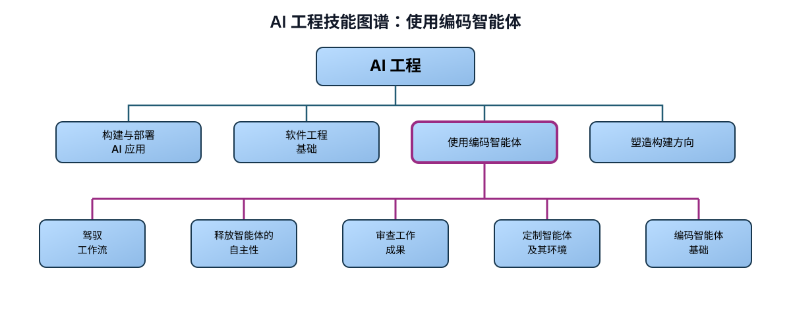

# AI 工程技能图谱：使用编码智能体

> 作者：Andrew Ng（[@AndrewYNg](https://x.com/AndrewYNg)）  
> 原文：[AI Engineering Skills Map: Using Coding Agents](https://x.com/AndrewYNg/status/2095890279865721217)  
> 翻译 Url：[https://github.com/samz406/local_wenzhang/blob/main/docs/AI工程技能图谱/03-使用编码智能体.md](https://github.com/samz406/local_wenzhang/blob/main/docs/AI工程技能图谱/03-使用编码智能体.md)

使用编码智能体，是 AI 工程中的一项关键能力。你不仅要善于引导它们写代码，也要能让它们完成数据分析、系统运维等非编码任务。掌握这项能力，你能完成的工作会多得多。

编码智能体演进极快，因此这项技能本身也在飞速变化，甚至快于其他顶层 AI 工程能力。Claude Code、Codex、Cursor 等闭源智能体，以及 OpenCode、Pi 等开源智能体，都在随着运行框架和模型的改进而大步向前。因此，想跟上编码智能体的使用方式，就必须持续实验、构建和学习。

在访谈数十位顶尖 AI 工程师，并回顾我们团队使用编码智能体的实践后，我们发现，用它们构建软件时，大家遵循着一套较为一致的高层工作流。关键步骤包括：

- **规划。** 其中包括：（一）头脑风暴，可能涉及调研、实验，以及理解现有代码库（如果有）；（二）编写规格说明，明确需求、技术设计和架构，再生成执行计划。你还可以审查计划，追问关键假设，并检查安全、过度设计及其他缺口。
- **执行。** 在自主性与人工监督之间取得恰当平衡，完成构建、测试和验证。这包括：（一）让智能体构建软件，同时为它设定与任务相称的自主程度；（二）通过自动化检查和／或人工检查验证产出。
- **部署与监控。** 其中包括：（一）部署系统，必要时由 CI/CD 流水线或额外的人工关卡把控；（二）让智能体监看日志、发现问题，并提出和执行改进方案。

这套高层工作流与编码智能体出现之前的典型软件开发流程颇为相似。不同的是，如今我们对代码本身的关注少了很多，重心转向决定构建什么、设计架构、编写规格说明，以及验证产出。

不同项目在每一步上花费的时间可能相差很大，有些步骤也可以省略。例如，一个从零开始的新项目原型，其规格说明或许只需在一条匆匆写就的提示词中粗略描述；而一个已经存在、拥有大量用户的项目，编写和验证规格说明可能需要投入多得多的精力。此外，这套流程高度迭代。优秀的开发者知道，什么时候后续步骤的反馈意味着应该回到前面的步骤：比如验证失败时，如何引导智能体重新构建并修复错误；监控发现问题时，如何让智能体更新系统并重新部署。

要在这套工作流中有效使用编码智能体，需要掌握以下关键能力：

- 驾驭工作流
- 释放智能体的自主性
- 审查工作成果
- 定制智能体及其环境
- 编码智能体基础

**驾驭工作流。** 你知道如何推进上述工作流的每一步，能够决定每一步应投入多少人工、多少智能体工作，以及何时退回前面的步骤继续迭代。这要求你深刻理解速度、成本、技术风险与人工投入之间的取舍，才能判断前期应该做多少研究和规划、哪些关键工作仍需由人掌控、如何选择架构、规格说明等规划材料应该写到多细，以及怎样把工作拆成可以验证的步骤。

**释放智能体的自主性。** 把编码智能体用于工作流中的各个步骤时，你需要选择自主程度：是全程盯着它，保持交互式来回协作；还是把一大块工作直接委托给它？又该在什么时候给出明确目标，让它循环尝试，直到成功？你还必须谨慎管理智能体的上下文。随着构建进入不同阶段，你需要判断何时把关键经验、用户反馈和各项假设记录下来，供智能体在后续环节使用——其中也包括那些构建中途已经改变的假设。此外，你还要决定什么时候把任务拆开，让多个智能体并行执行；这些智能体可以由人编排，也可以由更高层智能体协调。与此同时，你还要管理人在多个并行智能体会话之间的注意力。你也知道如何安全地运行智能体：合理设置权限和操作关卡，在让开发快速推进的同时，限制信息泄露、数据丢失或其他损害的风险。

**审查工作成果。** 编码智能体的输出存在不确定性。我们无法预先知道它会想出哪些好点子，又会写进哪些缺陷。审查和验证产出，是确保结果符合预期、并在偏离时重新引导智能体的关键一步。你需要根据任务设计相匹配的测试和验证方案，并按需结合行为验证与功能验证。你还可以测试用户流程，例如要求智能体提交截图，作为成功或失败的证据。对于定性或行为评估，则可以使用评估集，也可以让大语言模型充当裁判。

你还需要决定，这些测试应该自动化到什么程度。有些工作流会把测试和验证完全自动化，让智能体能够自查，并自行判断任务是否已经完成。你必须评估这些测试是否真正对应你的目标；如果不对应，就继续改进。除此之外，你还可以用智能体进行代码审查，并开展 AI 辅助的安全与架构审计。当 AI 审查还不够可靠时，需要审慎地加入人工审查——重点审查代码行为，偶尔也直接审查代码——同时继续探索怎样把更多审查自动化。最后，你还要验证部署结果，并利用智能体把监控和事故管理流程化。

**定制智能体及其环境。** 同时调整智能体和它所处的工作环境，能让智能体高效获取所需上下文、访问工具，并以正确而高效的方式完成构建。你知道如何接入智能体技能、插件和 MCP 服务器，也会在它们不再需要时适时清理——例如新模型已经让某项旧技能变得多余。你可以用钩子把开发中可重复的环节自动化，例如触发自动代码审查或 CI/CD 流水线。你还会维护智能体的工作环境：在 AGENTS.md、CLAUDE.md 等长期上下文文件中，持续更新代码库信息、关键架构假设、代码风格和数据访问模式。你知道如何跨多个会话、多个并行智能体保存状态并积累经验，例如在每次运行结束后复盘，记录哪些做法有效、哪些无效。你也懂得建立一致的约定和结构，让智能体容易在代码库中找到方向，并定期清理智能体制造的技术债。团队协作时，你还会考虑怎样协调不同开发者的智能体上下文。

**编码智能体基础。** 最后，要在整个过程中做出正确决定，你需要充分理解编码智能体如何工作：它们怎样搜索和检索代码库，怎样管理上下文窗口，增加工具调用、MCP 服务器等操作会怎样影响上下文，智能体与子智能体如何互动，以及运行框架如何包裹大语言模型，最终构成一个智能体。有了这些认识，智能体就不再是黑箱，你也更容易识别它的失效模式，比如把简单方案过度设计、因为缺少明确验证流程而失去严谨性、没达到目标就提前停止，或执行可能破坏文件和生产数据的操作。理解这些基础，还能帮助你判断智能体当前处于什么状态，并通过给出合适的指示或上下文来引导它。在监控运行过程时，你也能更快发现它何时偏离轨道、需要人工介入。

我发现，社交媒体经常把编码智能体的使用方式说得过于简单。例如，有时确实可以让智能体自主运行数小时，消耗数百万乃至数千万 token；但就目前而言，超长周期任务的实际价值——尤其是相对于它们的成本——被夸大了。真正高效地使用编码智能体，通常是一个复杂且高度迭代的过程；能在关键时刻凭借高水平判断介入，往往会带来好得多的结果。

熟练使用编码智能体，会让你成为高效的构建者，也让你有能力进一步引领整个构建过程。下一篇文章，我会展开讨论这一点。
