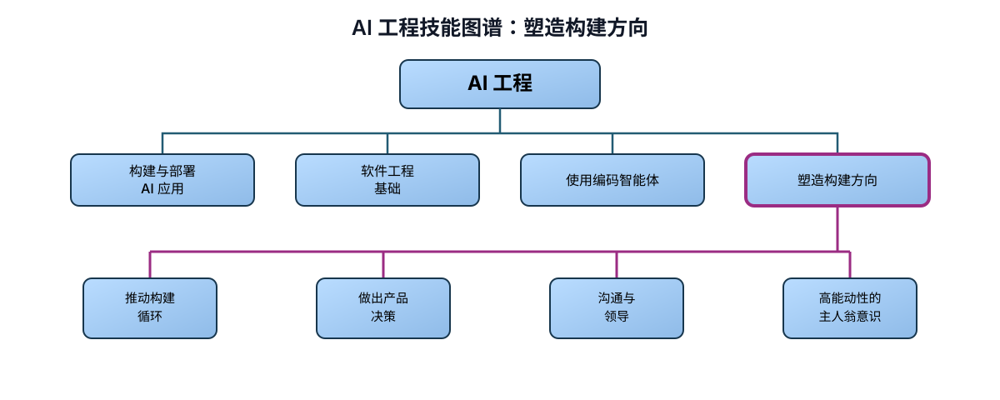

# AI 工程技能图谱：塑造构建方向

> 作者：Andrew Ng（[@AndrewYNg](https://x.com/AndrewYNg)）  
> 原文：[AI Engineering Skills Map: Shaping the Build](https://x.com/AndrewYNg/status/2098459474608672916)  
> 翻译 Url：[https://github.com/samz406/local_wenzhang/blob/main/docs/AI工程技能图谱/04-塑造构建方向.md](https://github.com/samz406/local_wenzhang/blob/main/docs/AI工程技能图谱/04-塑造构建方向.md)

当你熟练掌握 AI 工程，最出色的工作绝不会只是照着别人写好的规格说明实现一个产品。相反，你会主动塑造构建方向。

在现代 AI 工具加速并拓展单个开发者的能力之前，科技公司形成了一套惯例：由产品经理和设计师规定应该构建什么，再由开发者负责实现，有时还会由项目经理推动进度。如今，这些角色之间的界线正在模糊。精通 AI 工程的开发者不仅构建软件，也会参与其他角色的工作。（同样，产品经理和设计师也在掌握 AI 工程技能，亲自参与软件构建。）

这场变化正在大幅加快软件开发。当你懂得如何塑造构建方向，就不必等着产品经理想清楚下一步做什么，也能快速前进。

塑造构建方向需要以下关键能力：

- 推动构建循环
- 做出产品决策
- 沟通与领导
- 高能动性的主人翁意识

**推动构建循环。** 大多数软件都通过一个循环构建：先写一些代码，再获得反馈，然后决定下一步做什么。作为优秀的 AI 工程师，你会在推动这个循环的过程中发挥关键作用，不断决定下一步行动，让项目持续向前。你倾向于立即行动，并以 AI 所带来的高速度推动整个循环。

例如，你可能决定快速做一个原型，验证某个技术概念或用户功能；也可能构建一个最小可行产品（MVP），交给用户试用并证明价值；还可能增加功能，或投入建设企业级系统。为了保持速度，你会频繁地小批量发布。你知道什么时候该向用户或其他利益相关者收集反馈，什么时候该运行技术实验（例如训练一个模型），用新信息来决定下一步。做出这些判断时，你会综合考虑产品愿景、项目阶段、技术可行性、关键风险、工作量和预算。面对更成熟的项目，你还知道如何定义关键指标，并通过项目管理推动这些指标持续改善。

**做出产品决策。** 开发者不必变成产品经理，但你一定会遇到产品规格没有覆盖的决策。如果有人要求你在没有规格说明的情况下开始构建，你也知道如何自己写出一份。

你具备产品判断力，不必等待产品经理做出每一个决定，也能选择真正满足用户需求的产品方向。你至少拥有基本的设计审美，做出来的东西不只可以运行，也令人乐于使用。你还具备一定的商业常识，能够思考市场进入策略、市场规模、单位经济效益和损益等问题，做出符合经济逻辑的取舍。这种产品决策能力扎根于你对用户的同理心。你还会持续通过各种方法磨炼这种同理心：可能是快速、非正式地访谈两三位用户，向数百名用户发放问卷，开展大规模 A/B 测试，也可能分析数千乃至数百万用户的行为。你会利用这些输入，不断加深对用户的理解。

**沟通与领导。** AI 工程技能让你能够参与比传统软件开发更广的工作范围。我此前写过，专门领域的开发者——例如前端开发者——如今很可能承担更广泛的全栈职责。AI 工程技能还会进一步打开边界：你可能参与影响项目的其他职能，例如市场、财务、法务等等。这让你与这些职能沟通的能力变得比过去更重要。通过协调各方利益相关者并推动大家达成一致，你可以成为项目向前发展的关键力量。（沟通能力也是与用户交流、磨炼用户同理心的重要基础。）

与此同时，AI 技术正在迅速演进，许多工程部门之外的人都在努力理解这项技术、它对自己工作的影响，以及它带来的新实践和新产品。AI 工程方面的技术能力让你走在前面，也让你能在塑造这些认知时发挥独特作用。例如，你可以解释为什么某些设想在技术上可行，另一些则不可行。凭借这项能力，你能够帮助更广泛的组织继续向前。

**高能动性的主人翁意识。** AI 工程技能给了你巨大的机会去创造改变。然而，许多人——包括一些高管——还不了解 AI 能做什么，也就不知道哪些项目方向真正值得投入。这给拥有技术能力的人留下了弥合鸿沟的空间：你可以发现问题、提出方案并付诸执行；你会尊重组织的优先级与约束，但不会坐等自上而下的精确指令。这要求你具有很强的能动性：主动识别机会、判断什么最重要，并立即行动。你还要能够端到端地负责一项计划，对出现的问题承担责任，在模糊不清的局面下依然采取行动，在挫折中坚持，并且不只用“任务是否完成”来衡量工作，而是看自己究竟创造了多少价值。

最后，你会持续投入，提高自己的能力。你追踪技术前沿，学习新工具，调整工作流，并始终保持学习，让自己随着时间推移越来越强。

能够不只参与构建，还能塑造构建方向，这让 AI 工程比传统软件开发更加令人兴奋。你拥有更大的自主权、更广的职责范围，也会做出更多决定。但要把这一切做好，需要一套更丰富的能力。DeepLearning.AI 的目标，正是帮助愿意走上这条路的你熟练掌握 AI 工程。

我很期待前方的路！
