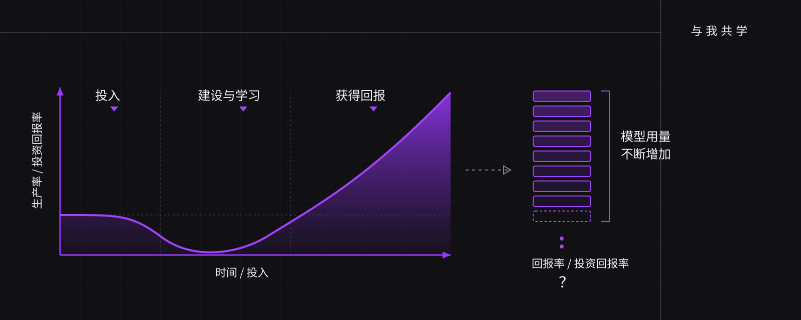
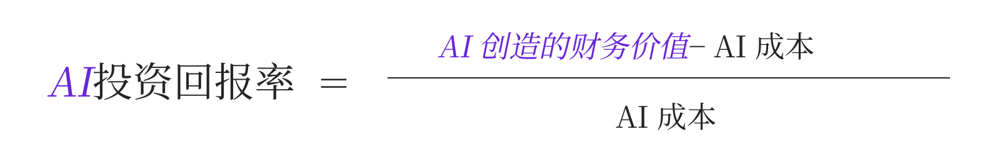
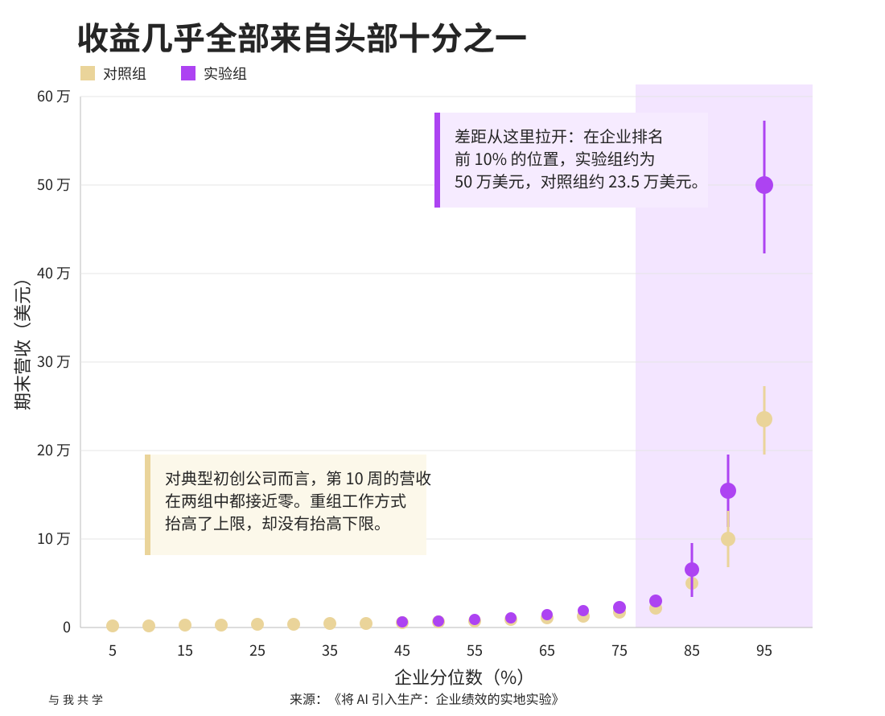
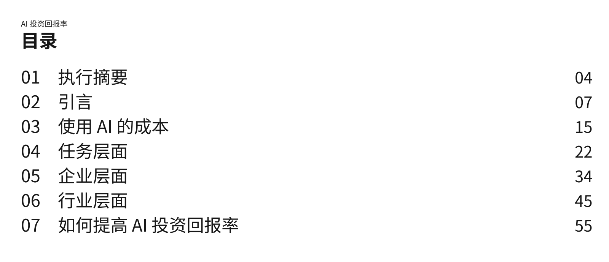

# AI 繁荣了，为什么生产力没有增长

> 作者：Chamath Palihapitiya（[@chamath](https://x.com/chamath)）  
> 原文：[Why AI is booming, but productivity isn't](https://x.com/chamath/status/2103546630192685350)  
> 翻译 Url：[https://github.com/samz406/local_wenzhang/blob/main/docs/AI繁荣为何没有带来生产力增长/AI繁荣了，为什么生产力没有增长.md](https://github.com/samz406/local_wenzhang/blob/main/docs/AI繁荣为何没有带来生产力增长/AI繁荣了，为什么生产力没有增长.md)  
> 发布日期：2026 年 9 月 25 日

今年 6 月，我曾写道，“凭感觉写代码”的时代已经结束；以投资回报率为依据来评估 AI，也将从一道加分题变成必答题。

下面就来谈谈，什么是 AI 投资回报率，以及为什么直到现在，我们仍很难在 GDP 数据中看到它：

最简单地说，我们需要看懂两个指标：成本和价值。

先看成本。Ramp 的 AI 指数追踪了 7 万多家美国企业的 AI 支出。处于中位数的公司，每名员工每月只花 12.50 美元购买 AI 服务；而一名员工的平均月成本约为 8,500 美元。换句话说，AI 只要让这个人的生产率提高约 0.15%，就足以收回成本——相当于每周多创造大约 3 分钟的有效工作时间。

因此，对大多数公司来说，模型推理产生的账单几乎只是四舍五入时的零头。真正难以量化的，是变革管理、重新培训，以及企业这部庞大机器随之运转起来的其他成本。

价值更难准确衡量，所以不妨先用生产率增长来代替。在宝洁，一名员工借助 AI 做出的产品方案，与两人团队不用 AI 做出的方案一样好。麻省理工学院的经济学家还发现，只有把多个 AI 步骤串在一起、让人最后统一检查一次，而不是每一步都停下来审核，自动化才真正划算。

也就是说，AI 加速的主要是实际产出成果的过程。可企业员工一周里的大部分时间，其实都花在协调、开会、统一意见和流程审批上，而不是产出本身。（至少到现在，我还没见过 Claude 能把会议速度提高 10 倍！）

这就带来一个问题：如果阻碍 AI 产生回报的瓶颈其实是人呢？AI 可以替你省出那 3 分钟，却无法决定这 3 分钟会被用来做什么。如果它们最后又流进另一场会议，或者耗在等待法务审批的一周里，那么回报就是零。

这或许也解释了，为什么各家公司的收益如此悬殊。AI 带来的效果也许不是给产出做加法，而是做乘法。如果真是这样，最优秀的公司就会把其他公司甩得越来越远。

2026 年，一项涉及 515 家初创公司的实验，让我们得以窥见这种差距。每家公司都获得了同样的 AI 工具、培训和支持；研究人员再随机选出一半公司，让它们了解其他企业如何围绕 AI 重组工作方式。对一家典型的初创公司来说，两组的营收都几乎没有变化。但几乎所有增益都来自表现最好的 10% 企业，而且额外学习了这些重组方法的实验组领先得最远——它们把整个实验组的总体营收推到了对照组的 1.9 倍。

大家用的工具完全一样。领先者真正不同的地方，在于它们围绕这些工具重新设计了工作方式。这又把我们带回到流程本身。

AI 可以降低做事的成本，却无法判断这件事一开始到底值不值得做。

1995 年，比尔·盖茨说过同样的道理：把自动化应用于高效的业务，会放大效率；把它应用于低效的业务，则会放大低效。

埃隆·马斯克有一套五步流程：

1. 质疑每一道流程和每一项要求。
2. 删掉一切能删的东西。
3. 简化剩下的部分。
4. 提高它的速度。
5. 最后才谈自动化。

埃隆曾说，他在特斯拉犯过的最大错误之一，就是把这套顺序完全倒了过来：先把流程自动化，后来才发现那些流程根本没有存在的必要。如今，许多口口声声说自己在“利用 AI”的公司，也在犯同样的错误。

这或许也是为什么，围绕 AI 投资回报率的争论总是各说各话。人们期待生产率数据以 AI 发展的速度变化，可现实中，它只能以大型企业采用 AI 的速度变化。这并不是第一次。

1987 年，罗伯特·索洛说：“计算机时代无处不在，唯独不在生产率统计中。”从 1973 年到 1995 年，生产率年均增长约 1.5%；等到企业围绕计算机重组工作方式后，1995 年到 2003 年的年均增速才提高到约 3.3%。

那么，真正从 AI 身上获得回报的公司，与其他公司究竟有什么不同？从员工个人到企业损益表之间，生产率增益消失在了哪里？问题又有多少源于工作本身的设计方式？

我们的深度报告逐一讨论了这些问题，并给出一套提高 AI 投资回报率的实用指南：什么该删、什么该自动化；哪些 AI 步骤应该串联起来；哪些地方仍然需要人工审核；以及在什么情况下，更便宜的模型就已经够用。

完整深度报告可在这里[阅读或收听](https://research.socialcapital.com/p/ai-roi)。

祝各位玩家好运！
