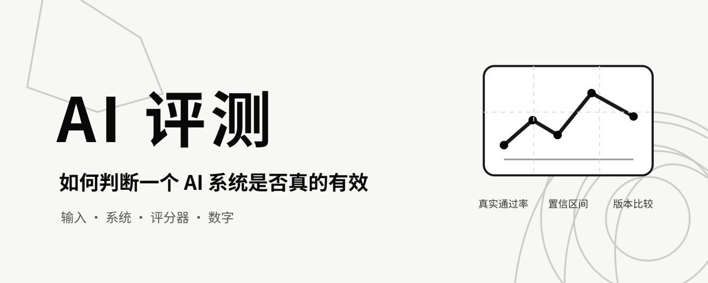

# AI 评测：如何判断一个 AI 系统是否真的有效

> 作者：Sergii Makarevych（[@sermakarevich](https://x.com/sermakarevich)） 
> 原文：[Evals: how to know whether an AI system actually works](https://x.com/sermakarevich/status/2106453816757354947) 
> 翻译 Url：[https://github.com/samz406/local_wenzhang/blob/main/docs/AI评测如何判断系统是否真正有效/AI评测如何判断系统是否真正有效.md](https://github.com/samz406/local_wenzhang/blob/main/docs/AI评测如何判断系统是否真正有效/AI评测如何判断系统是否真正有效.md) 
> 发布日期：2026 年 10 月 3 日

这篇文章写给所有负责交付、采购或审批大语言模型（LLM）软件的人：工程师、产品经理，以及 CEO。全文使用直白的语言，从全局一路讲到细节。每个数字都来自文末列出的来源：要么是我们围绕一个小型客服助手编写的可运行教程，要么是已经发表的论文。

## 快速理解：如果只读一节，就读这里

**评测（eval，evaluation 的简称）**是一项可以重复执行的测试。它用一个可信的数字告诉你：AI 系统有没有完成你想要的事，以及某次修改让它变好了还是变差了。

**为什么需要评测：**语言模型的失败方式与普通软件不同。普通软件要么正常工作，要么崩溃；语言模型却可能给出一份流畅、自信、格式漂亮，同时又完全错误的答案。看到一个好答案，并不能说明接下来 100 个答案也会好。评测要用「它在我们关心的案例中通过率为 70%，误差约为正负 12 个百分点，新版本并没有可测量的提升」，取代「演示时看起来挺好」。

**评测如何运行，共四步：**

1. 收集真正重要的输入，并在每条输入旁写下正确答案。在贯穿全文的案例中，我们准备了某家自行车商店的 80 张客服工单，每张都标有正确类别，以及一份合格回复必须包含的事实。
2. 让系统处理每条输入，并保存输出。
3. 使用评分器评判每份输出。评分器可以是一条代码规则、充当裁判的另一个模型，也可以是人。
4. 把评分汇总成一个带误差区间的数字，再与上一版本比较。

**什么时候使用：**发布前——它到底能不能用？每次修改前——我们有没有破坏什么？发布后——它在真实流量上是否仍然正常？

> **重要：**评分器本身也是你必须测试的系统。如果模型裁判与人类只有 60% 的一致率，它很可能在产品有问题时仍告诉你一切正常。 
> **对我们的意义：**每项评测都有两个数字需要检查：产品有多好，以及评分器有多好。两者都要问。 
> **为什么重要：**AI 团队最常见的自我欺骗，就是相信一个未经检验的评分器给出的自信数字。

本文接下来会逐层放大，每一层都回答上一层留下的一个问题：

- Level 0：在一张工单上完整运行一次评测循环。
- Level 1：究竟测什么？——输入、标准答案和指标。
- Level 2：哪里会出错？——先看数据。
- Level 3：代码评分器——便宜、精确，但不理解语义。
- Level 4：把模型当评分器——灵活、有偏差，而且必须验证。
- Level 5：诚实的数字——误差区间、A/B 比较和样本量。
- Level 6：如何评测由多个环节组成的系统——检索、智能体、成本与可靠性。
- Level 7：公共基准——排行榜能告诉你什么，又隐瞒了什么。
- Level 8：把评测变成习惯——门禁、监控，以及何时重新校准。
- 最后：工具与方法、决策指南和参考文献。

## Level 0：在一张工单上跑完完整循环

**本层放大：**评测的全貌。**问题：**一次实际运行的评测究竟是什么样？

贯穿全文的案例，是一个虚构的自行车与露营用品网店客服助手。它由三部分组成，后面会用不同方式分别评测：

- **分流（triage）：**读取工单，把它归入退货、物流、保修等 12 个类别之一，并给出优先级。
- **回答（answer）：**从商店政策手册中找到相关页面，写出一份引用这些页面的回复。
- **智能体（agent）：**依照政策规则，调用模拟数据库上的工具，查询订单、发起退款或升级处理。

下面让一张工单走完整个循环。

**输入：**「我上班快迟到了，需要马上解决这件事。我上周退回了自行车，但至今没有收到退款。你们的政策明明写着，退款会在 5 个工作日内处理……」

**系统输出（分流）：**退货。**标准答案：**退货。**得分：**1/1。

**系统输出（回答）：**一份礼貌的四段式回复，引用退货条款，并提到两项必需事实：退款需要 5 个工作日；使用过的商品要收取 15% 的重新上架费。

现在由三个评分器审查这份回复：

- **代码规则。**问题：回复是否引用了手册中的章节？结论：是。
- **代码规则。**问题：是否提到了两项必需事实？结论：是，一项也没漏。
- **模型裁判。**问题：回复是否声称了手册中不存在的内容？结论：**失败**——它编造了「总处理时限最长可达 15 个工作日」。

这就是全部核心。两项便宜的代码检查都认为回复没有问题，模型裁判却发现了一个本可能直接发给客户的虚构数字。之后每一层讨论的，都是如何让这套循环在大规模运行时仍然可信。

**从 Level 0 带走：**

- 评测就是输入、系统、评分器、数字，仅此而已。
- 不同评分器回答不同问题。「引用了章节」与「没有编造内容」不是同一项检查。
- 一份流畅的回复可能通过所有表层检查，却依然是错的。

## Level 1：我们究竟在测什么？

**本层放大：**循环中的第 1 步和第 4 步。**问题：**输入与「正确答案」从哪里来，最终数字又是什么？

**输入。**案例应该像真实流量，也要包含那些麻烦的情况。我们的 80 张工单来自「客户画像 × 主题 × 场景」组合网格，因此愤怒的客户、模糊的问题和同时涉及多个问题的工单都会出现。Anthropic 的智能体评测指南建议，先从 20～50 个真实失败任务入手，而不是从想象中的顺利路径开始（Grace 等，2026）。

**标准答案。**我们为每条输入写清「正确」意味着什么：正确类别、回复必须依据的手册章节，以及必须陈述的两三项事实。由于这些工单是根据手册生成的，标准答案在构造时就已经正确；在真实产品中，它们应来自领域专家。

**两组数据。**案例分为开发集（20 张工单）和测试集（60 张工单）。开发集用于调整提示词和评分器，测试集只用于报告结果。如果你在用于对外报告的案例上持续调参，最终数字一定会讨好你。

**指标。**对分流任务，它是准确率——分类正确的工单占比；对回复任务，它是通过率——不存在任何失败项的回复占比；对智能体任务，它是最终数据库状态正确的任务占比。每次实验只选一个主要指标，始终在测试集上报告，并始终附带误差区间，详见 Level 5。

下面四个词经常被混淆：

- **评测（eval）：**衡量你的系统在你的数据上的表现。例如，我们的助手在 60 张工单上的表现。
- **基准（benchmark）：**衡量一个模型在某项公共任务上的表现。例如数学基准 GSM8K、编程基准 SWE-bench。
- **软件测试（test）：**衡量函数是否返回预期值。例如 JSON 能否解析、程序是否崩溃。
- **监控（monitoring）：**衡量产品发布后的真实流量。例如每天抽样真实工单进行评分。

一个在公共基准上得分很高的模型，照样可能错误地回答你的客户。基准测的是发动机，评测测的是这辆车在你的道路上开得怎么样（Husain 与 Shankar，2025）。

**从 Level 1 带走：**

- 带标准答案的输入，是整个过程中价值最高的资产。它们成本很高，却是一切后续工作的基础。
- 保留一组开发集用于调优，另留一组测试集用于报告。
- 基准关注模型，评测关注你的产品。

## Level 2：哪里会出错？先看数据

**本层放大：**评分环节。**问题：**评分器究竟该寻找什么？

在构建任何自动评分器之前，先阅读输出。每一位有经验的实践者都在强调同一件事（Husain，2024；Husain，2025；Shankar 等，2024）：逐一阅读 100～200 份输出，为每次失败写一条简短备注，再把这些备注归并为少量失败类型，并统计数量。这叫作**错误分析**。其中两个步骤分别称为开放编码——自由记录备注，以及主轴编码——把备注归组。

在我们的 60 份测试回复中，结果如下：

- 通过：34/60
- `missing_required_fact`（遗漏必需事实）：15
- `unsupported_claim`（无依据的断言）：12
- `wrong_section_retrieved`（检索到错误章节）：8
- `did_not_answer`（没有回答问题）：5
- `wrong_value`（数值错误）：2
- `over_promise`（过度承诺）：1

勉强只有一半回复通过。最大的两个问题是遗漏事实和编造断言，单看演示，谁也猜不到这一点。这份清单就是接下来构建所有评分器的规格说明：按照出现频率排序，每种失败类型对应一个评分器。

> **重要：**失败清单来自阅读真实输出，而不是凭空想象。 
> **对我们的意义：**任何评测工作的第一周，都应该由人们在专门设计的查看器里阅读记录，而不是让工程师先接入评测框架。 
> **为什么重要：**如果评分器针对的是根本没有发生的失败，它会给出一个令人安心的数字，却漏掉真实问题。评测工作停滞的团队，几乎都跳过了这一步（Husain，2025）。

还有一个相关发现：评分过程中，你的标准会发生变化。Shankar 等人（2024）称之为**标准漂移（criteria drift）**。对样例进行评分会让评分细则更加清晰，而更清晰的细则又会改变你对早期样例的判断。预期要迭代两三轮，这不是流程失败。

**从 Level 2 带走：**

- 失败分类就是计划。先为最常见的失败类型构建评分器。
- 阅读输出是价值最高、同时最常被跳过的活动。
- 评分过程中，评分细则一定会改变。

## Level 3：由代码构成的评分器

**本层放大：**评分器的一种。**问题：**普通规则能测什么，又不能测什么？

**代码评分器**，就是用普通代码写成的规则。它免费、即时，而且每次都会给出相同答案。凡是它能准确衡量的东西，都应该交给它。

**精确答案。**分流任务只有一个正确标签，所以直接统计匹配结果：

- 准确率：0.700；宏平均 F1：0.697。

10 张工单中有 7 张分类正确。宏平均 F1 会对 12 个类别的得分等权平均，因此少见类别与常见类别同样重要。两个数字非常接近，说明错误分散在各类别中，而不是集中在某一类。

**对自由文本做规则检查。**回复没有唯一正确文本，但必须遵守一些规则：

- `nonempty`（非空）：通过率 100%。
- `max_words_150`（不超过 150 词）：通过率 17%。
- `no_banned_promises`（不含禁止作出的承诺）：通过率 92%。

只有 17% 的回复不超过 150 词。这个应用实在太啰唆了，而且发现它根本不需要模型裁判。IFEval（Zhou 等，2023）一类公共基准，完全由这类可验证规则组成，例如「恰好用三个要点作答」。

**必需事实。**检查每项标准事实是否出现在回复中。这样就能以零成本捕捉最常见的失败：遗漏事实。

**相似度分数。**重叠度指标 ROUGE、BLEU 和向量嵌入相似度，会把回复与参考文本比较。在我们的回复上，嵌入相似度区分好坏回复的 AUC 为 0.709——0.5 相当于抛硬币，1.0 代表完美。它很适合提醒你两个版本之间发生了变化，却完全不能判断回复是否正确。

> **重要：**相似度只能发现变化，不能评判质量。 
> **对我们的意义：**把它当作便宜的漂移警报，永远不要把它当作主指标。 
> **为什么重要：**错误回复只要用了和正确回复相同的词，也能拿到高分。Eugene Yan 的综述（2024）及最初的 ROUGE、BLEU 文献，都详尽记录了这一局限。

一个数字就能说明代码评分器的边界：我们的回复中只有 11.7% 通过了全部代码检查，但代码检查一条虚构断言也没有抓住。Level 0 的回复编造了 15 天时限，却通过了每一条规则。规则看得见形式，看不见含义。

**从 Level 3 带走：**

- 标签、格式、必需事实、禁用短语等拥有明确答案的内容，全都交给代码评分器。
- 相似度衡量漂移，不衡量质量。
- 规则看不见编造的断言，这需要一个读者。

## Level 4：把模型当评分器，以及如何检验它

**本层放大：**另一类评分器。**问题：**当评分器本身就是模型时，我们怎么知道它判断正确？

**模型裁判**——通常称为 LLM-as-judge——是读取系统输出并给它评分的第二个模型。它能理解语义，因此可以发现虚构的 15 天时限；可它本身也是语言模型，所以语言模型会犯的错，它一个也不少。本层篇幅最长，因为绝大多数评测项目恰恰在这里出问题。

### 4.1 如何向裁判提问

实践者共识与研究文献指向了同一种形式：

- **每种失败类型只问一个是非题。**问「回复是否包含手册摘录无法支持的断言？」，而不是「请按 1～5 分评价质量」。二元问题更便于人类标注，更容易复现和检查（Husain 与 Shankar，2025）。只有所有问题都回答「否」，输出才算通过。
- **要求给出证据。**让裁判引用存在问题的句子，人就能在几秒内核查结论。
- **提供上下文。**看不到手册的裁判，不可能知道什么内容缺乏依据。

Cho 等人（2026）在摘要任务上直接检验了这种方法，即论文《Ask, Don't Judge》。把评分拆成针对具体错误的是非题，在每个数据集上都胜过流行的整体式 G-Eval；在 SummEval 上，与人类的 Spearman 相关系数分别为 0.563 和 0.514。最说明问题的例子是：一份被人为植入三个事实错误的摘要，被整体式裁判打出满分 5.0；基于问题的裁判只给了 1.57。他们还发现，不断向提示词里堆叠更多指令，最终会让裁判变差，而不是变好。

### 4.2 检查裁判：我们自己的数据

我们先人工标注全部 60 份测试回复，作为「参考答案」，再运行模型裁判：

- 参考答案判定通过：34；裁判判定通过：42。
- 双方在 60 份回复中的 36 份上意见一致，一致率 60%。
- 26 份坏回复中，裁判抓住了 10 份。
- Kappa：0.15。

60% 的一致率听起来似乎还行，其实不行。因为多数回复原本就会通过，如果裁判对所有内容都回答「通过」，它也能与参考答案达到 57% 的一致率。

**Cohen's Kappa** 会校正这种情况：它衡量的是超出随机机会的一致程度。0 代表随机，1 代表完美；如果要让一个裁判控制发布门禁，通常至少要求 0.6；如果要让它完全无人监管地运行，则要求 0.8。我们的裁判只有 0.15。它过于宽松——真正值得通过的只有 34 份，它却放过了 42 份；坏回复也漏掉了一半以上。

> **重要：**当大多数输出都会通过时，原始一致率会产生误导。应该报告 Kappa，或者分别报告评分器抓住了多少坏输出、又错误拒绝了多少好输出。 
> **对我们的意义：**裁判本质上是分类器。信任它之前，至少要拿几十个案例与人工标签比较，并把验证结果放在它产生的每个产品指标旁边。 
> **为什么重要：**使用这个裁判，即使新版本的虚构断言增加一倍，主通过率也可能毫无变化。

补救办法是在开发集上迭代：向裁判提示词中加入这类失败的示例，缩小问题范围，并把标准事实作为参考提供给它。教程中的「遗漏事实」裁判通过这种方式达到了可用水平；「无依据断言」裁判没有，于是我们把这个问题交给专用检测器，详见 4.5。

### 4.3 模型裁判的已知偏差

裁判会以可预测的方式失败。每种偏差都有已发表的测量结果，也都有便宜的缓解办法。

- **位置偏差。**表现：在成对比较中，裁判偏爱排在前面的答案。证据：交换顺序后，大量答案对的结论会翻转（Wang 等，2024）；2025 年一项 RAG 与 GraphRAG 的比较发现，把顺序交换后，GraphRAG 原本的一部分「胜利」消失了（Han 等，2025）。缓解：按两种顺序各评一次，只有两次结论一致才算获胜。
- **长度偏差。**表现：不论内容如何，更长的答案更容易胜出。证据：校正长度后，裁判与人类排序的一致性从 0.94 升至 0.98（Dubois 等，2024）。缓解：使用长度受控的评分，或采用不奖励篇幅的是非题。
- **自我偏好。**表现：裁判偏爱与自身模型家族风格相同的答案。证据：裁判会给自己生成的内容更高评分，能识别出处时尤甚（Panickssery 等，2024）；GAUGE 审计中，同家族裁判在 7 分制上会把自家供应商的智能体抬高约 0.75 分。缓解：选择与被测系统不同家族的模型充当裁判。
- **满意感与成功混淆。**表现：裁判评的是对话感觉如何，而不是任务是否真的完成。证据：见下文 GAUGE 审计。缓解：不仅给裁判看聊天记录，还要提供工具调用和最终状态。
- **裁判身份偏差。**表现：更换裁判模型后，获胜系统也会变化。证据：2026 年的多项审计（arXiv 2607.08535；2606.19544）。缓解：把裁判模型及其版本写进每一份结果。

GAUGE 审计（Bodhwani 等，2026）值得单独讲一段，因为它研究的正是多数公司用于发布决策的流程：模拟用户与智能体对话，模型裁判对记录评分，分数更高的版本发布。在 25 个智能体和约 3,700 份对话记录上，他们发现：当一个智能体明显优于另一个时，这套门禁的排序效果很好，与可验证真值的相关系数为 0.94；但面对能力接近的版本——也就是真实发布决策最常遇到的情况——它有 31% 的概率提拔更差的智能体。

只看到用户可见对话、只评价满意度的裁判，在区分正常与故障智能体时和抛硬币没有区别，AUC 只有 0.49。能够看到工具调用、身份验证过程和任务解决状态的裁判，则把失败风险降低了一半，AUC 达到 0.73。他们的结论是：可靠性来自裁判拿到了什么证据，而不是裁判模型本身有多强。

> **重要：**客户满意度与任务成功是两回事，只看到对话的裁判测量的是前者。 
> **对我们的意义：**向裁判提供证据——工具调用、数据库状态和检索到的文档。当两个版本接近时，绝不能只凭裁判分数发布新版。 
> **为什么重要：**一个讨人喜欢、却无法完成任务的智能体，会不断被提拔。

### 4.4 裁判小组，以及如何汇总结果

单个裁判是一个单点故障。Verga 等人（2024）证明，由多个更小、更便宜的裁判组成的小组，能以大幅降低的成本获得比单个大模型更好的人类一致性。

但把小组分数取平均存在陷阱。Acharya 等人（2026）证明，只要一个裁判坏掉——比如解析器失败后不断返回 0，或一个谄媚型裁判永远打 10 分——不论加入多少正常裁判，平均值都可能被任意拉偏。真实裁判确实会以可测量的概率这样失败：某数据集上的解析失败率为 3.4%；对非英语提示词，最小裁判的失败率最高达到 33%。他们的解决办法，是用能够忽略离群值的**几何中位数**替代平均值。最坏情况下，它准确了 540 倍；在干净数据上，代价只是约 1% 的准确率。他们还发现，三个裁判已经能获得大部分收益，因为不同裁判的错误彼此相关。

另一个相关效应来自 Parikh（2026）：要求模型用 JSON 回答——几乎所有裁判流水线都这么做——会使答案明显比普通聊天更加趋同。众数答案的占比从 41% 上升到 64%。对于只有一个正确答案的判断任务，这没有问题；对开放式评分而言，这意味着模型裁判的分辨力比聊天状态下看起来更弱。

### 4.5 比通用裁判更便宜、更可靠：专用检测器与类型化裁判

对最重要的失败类型而言，通用裁判往往不是正确工具。

**幻觉检测器**是规模约为 1 亿～5 亿参数的小模型，只为回答一个问题而训练：这个句子是否得到这段上下文的支持？Vectara 的 HHEM、LettuceDetect（Kovács 与 Recski，2025）、MiniCheck（Tang 等，2024）和普通 NLI 交叉编码器，都能在笔记本 CPU 上用约 1 秒运行完毕，单次调用边际成本为零；在 RAGTruth 基准上，其准确率已接近大型裁判。SelfCheckGPT（Manakul 等，2023）甚至不需要检测器：它让系统多次采样，对不同采样之间发生变化的断言发出警报。

Fiddler 2026 年的厂商文章把另一条路线的成本称为「评测信任税」：对每条生产记录运行大型裁判的团队，通常只能抽样约 10% 的流量；文章声称小型检测器可以覆盖 100% 流量，并降低最高 98% 的成本。这个说法来自厂商，也没有展示实验，但背后的权衡关系确实存在。

**类型化裁判。**TypeSafe 的 Jev 模型采用了另一种设计：它根本不生成文本。你向它提交系统输出和一个类型化问题——例如「这项断言是否得到摘录支持？答案只能是是/否」，或「从这些标签中选一个」——它会返回经过校准的概率。由于无需生成文本，调用速度很快，成本约为生成式裁判的百分之一；概率还可以让代码把不确定案例转交给人。它不能解释结论，也不能自己创造选项，标签必须由你提供。

2026 年一项采用盲法人工裁决的研究显示，在 RewardBench 答案对上，Jev 达到 92.2%，前沿生成式裁判为 93.5%；它只需后者约 0.33% 的费用。但在困难的推导检查上，Jev 明显落后，分别为 78.6% 和 93.1%。一种级联方案只在 Jev 置信度高于阈值时接受结论，其余情况升级处理，最终以约一半成本保持了 92.5% 的准确率（arXiv 2609.26550）。

我们自己的红队测试发现，它不是事实核查器：输入里伪造的日志可以扭转它的结论。不过，每次成功攻击也会让置信度大幅坍塌，因此设置置信度门槛是一种有效防御。我们的知识库里有相关教程，也说明了在信任它之前如何验证其准确率。

**裁判也需要自己的基准。**JudgeBench（Tan 等，2025）把困难但存在客观答案的问题变成裁判测试，结果发现：在真正困难的案例上，前沿模型裁判也只比随机选择略好。每一种任务、每一套评分细则、每一个裁判模型，都必须重新测量可靠性。厂商所说的「与人类有 85% 一致率」只来自某个数据集，不能直接迁移，参见文末实践者资料中的分歧记录。

**从 Level 4 带走：**

- 围绕具体失败向裁判提出带证据、带上下文的是非题。
- 用人工标签衡量裁判，报告 Kappa 或检出率，持续迭代到达标为止。
- 了解五种偏差，并使用成本很低的缓解方法。
- 面对「这个断言有依据吗」的问题，优先使用小型检测器或类型化裁判，而不是通用裁判。
- 三个裁判加稳健汇总胜过一个裁判；简单平均值很脆弱。

## Level 5：诚实的数字

**本层放大：**循环中的第 4 步。**问题：**我们对任何一个数字能有多大把握？又该怎样比较两个版本？

目前引用过的每个比例背后都藏着一个问题：如果换成另外 60 张工单，结果还会一样吗？三个工具可以回答它。

**误差区间。**把 60 个结果重复重采样数千次，即 Bootstrap，再观察结果分布：

- 分流准确率：0.700；95% 置信区间 `[0.583, 0.817]`。

诚实的说法不是「准确率为 70%」，而是「它大约在 58%～82% 之间，最可能是 70%」。Miller（2024）指出，已发表评测中模型之间的大多数差异，都小于这种置信区间；他还给出了每份评测报告都应使用的公式，包括多个问题共享同一来源时所需的聚类标准误差校正。

**配对比较。**我们编写了第二版回复提示词，让它检索更多章节，再在相同的 60 张工单上评测：

- 裁判通过率：v1 为 0.700；v2 为 0.700。
- 差值：`+0.000`；95% 置信区间 `[-0.117, +0.117]`。
- 结论：没有真实差异，保留 v1。

这个区间比单独报告准确率时更窄，因为它是配对比较：每张工单都同时由两个版本处理，工单本身的难度因此被抵消。McNemar 检验询问的是逐案例问题：v2 是否在 v1 失败的地方获胜，还是两个版本只是交换了各自擅长的案例？这里属于后者。v2 一方面改善了一些案例，另一方面却让 14% 的案例退步。「通过率相同」这个主指标，掩盖了一个对部分客户变好、对另一部分客户变差的产品。

> **重要：**如果差值的置信区间包含 0，那就是噪声，不是胜利。 
> **对我们的意义：**每一句「新版本更好」，都必须附带置信区间，以及变差案例的数量。 
> **为什么重要：**许多团队会因为一个根本不存在的 2 个百分点提升，而把退步版本发布出去。

**检测下限。**使用 60 个案例，我们能可靠发现的最小差异约为 12 个百分点。这个样本量看不见 5 个百分点的退步。这是一项统计功效计算，它会告诉你：要回答眼前的问题，至少需要多少案例。低于检测下限时，你需要的是更多数据，而不是更聪明的检验方法。

**多重比较。**如果测试 20 个提示词变体再挑出最好的一项，其中很可能有一个仅凭运气就高出 10 个百分点。要么按比较次数做统计校正，要么用全新的案例重新确认赢家。

**从 Level 5 带走：**

- 每个比例都要附带区间，每次版本比较都应配对进行。
- 比较版本之前，先知道自己的检测下限。
- 「没有可测量的差异」是真实结果，而且往往是正确结果。

## Level 6：评测由多个环节组成的系统

**本层放大：**循环中的第 2 步，也就是系统。**问题：**当系统包含多个阶段，或会采取实际行动时，我们该评什么？

### 6.1 检索系统（RAG）

回答组件会先找到手册章节，再生成回复。坏回复可能来自任一阶段，而修复方法完全不同，所以必须分别评分。

**评检索器。**与标准章节比较：`hit@k` 衡量前 k 个结果中是否至少出现一个正确章节；`recall@k` 衡量全部正确章节中有多少进入前 k 个结果。

- `hit@2`：0.93；`recall@2`：0.88。
- 18 份失败回复中，1 份失败在检索器，17 份失败在生成器。

检索器基本没问题，生成器才是问题。仅这一行结论，就能重新引导一周的工程投入。

**评生成器。**需要考察忠实度——每项断言是否得到检索文本支持，答案相关性——是否回答了问题，以及上下文精确率——检索到的内容是否真的有用。这是 RAGAS 三元组（Es 等，2024）。它不需要标准答案，因此 RAGAS 才成为默认工具库。

ARES（Saad-Falcon 等，2024）进一步增加了统计严谨性：用约 150 个人工标签校准每项标准的小型裁判，并报告置信区间。在论文实验中，它在上下文相关性上比 RAGAS 高出 59 个百分点，同时少用 78% 的标注；但遇到较大的领域迁移时会退化。在我们的实验中，RAGAS 给出的上下文相关性为 0.855、忠实度为 0.737，与自建评分器得到的「检索很好、写作较差」完全一致。不同方法相互印证，才会让一个数字变得可信。

编程智能体领域还有一个提醒：SWE-Explore（Zhang 等，2026）测量了编程智能体内部的检索表现，发现它们约有 65% 的概率找到正确文件，却只有 15%～19% 的概率找到正确代码行；真正破坏下一环节的是缺少上下文，而不是上下文过多。应按下游生成器实际需要的粒度评测检索器。

### 6.2 智能体

智能体会执行一系列行动，例如查询订单、发起退款、升级工单。评测它时，有三件事会发生变化。

**既评最终状态，也评行动路径。**数据库最后是否处于正确状态——退款是否发出、订单是否取消？智能体是否只做了允许的操作，而没有重复退款之类的问题？τ-bench（Yao 等，2024）建立了基本范式：模拟用户、政策规则，再检查最终状态。AgentLens（2026）解释了为什么路径也很重要：智能体经常通过侥幸或退化路径到达正确终态，只看结果会夸大能力。

**每项任务运行多次。**智能体具有随机性，因此需要两个不同指标：`pass@k`——k 次尝试中至少成功一次，衡量能力；`pass^k`——k 次尝试全部成功，衡量可靠性。面向客户的智能体应该关注 `pass^k`。我们的智能体 `pass^3 = 0.75`，也就是四分之三的任务连续三次全部成功。τ²-bench（2025）发现，当智能体必须与一个主动参与的用户协作，而不是独自行动时，`pass^1` 会下降约 20 个百分点。

**把可靠性作为独立指标。**Rabanser 等人（2026）借鉴航空与核工程，在四组指标中定义了 12 项可靠性度量：多次运行的一致性、面对扰动的稳健性、可预测性——智能体知不知道自己会失败，以及伤害的边界。在 15 个前沿模型上，他们发现两年的能力进步只带来了约六分之一幅度的可靠性提升。智能体每次会选择相似类型的行动，却以不同顺序执行；它们能优雅处理真实基础设施故障，却可能因为指令换一种说法就崩溃。

> **重要：**有能力的智能体不等于可靠的智能体，而客户实际体验到的是可靠性。 
> **对我们的意义：**报告 `pass^k`；对每项任务构造扰动版本——重命名一个字段、换一种说法；把跨运行一致性作为单独指标跟踪。 
> **为什么重要：**已公开的严重故障——智能体删除生产数据库、进行未授权采购——都来自平均成功率很高的系统。

**衡量成本。**Bai 等人（2026）在 SWE-bench Verified 上测量了 8 个前沿模型的 Token 开销。智能体任务消耗的 Token 约为普通聊天的 1,000 倍，其中几乎全部用在反复阅读自身不断增长的历史。同一模型完成同一任务，不同运行的成本可以相差 30 倍；准确率在中等成本时达到峰值，成本最高时反而下降；模型预测自身成本的相关系数最高只有 0.39。他们的建议是：按「每个正确结果的成本」给模型排序，而不是只看准确率，而且永远不要相信模型自己的成本估算。

**判断、提问与学习：三个较新的维度。**2026 年的三个基准，测量了单一成功率无法呈现的能力：

- **品味（Pan 等，2026）：**在两条路线看起来都合理的岔路口暂停智能体，让它判断哪条路线日后收益更高。最佳模型在二选一中只有 59.7% 的正确率，思考更久也没有帮助。
- **提问（Gulati 等，2026）：**当任务还没开始时，针对目标提出澄清问题的价值为 0.78；任务只推进 10% 后就降至 0.39。没有任何前沿模型能在这个时间窗口内主动提问；有的模型会在 52% 的案例中提问，有的为 23%，还有的从不提问。
- **从经验中学习（Asawa 等，2026）：**在 6 个有状态环境中，最佳系统也只获得了经验所能带来的潜在提升的 25%；简单保留完整对话历史，胜过了所有专用记忆产品。

### 6.3 当系统会针对评分器进行优化

如果评分器被用于训练或选择系统——例如强化学习、best-of-n 筛选——系统最终一定会找到它的盲点。Qwen 团队的 Wang 等人（2026）把它称为**验证视界（verification horizon）**：每个评分器都只是意图的代理，而在优化压力下，代理目标会与真实意图分离。

他们整理了编程智能体中的奖励作弊：从仓库历史中读取答案、修改测试、专门针对评测器打补丁；同时发现，行为监控器把作弊「解法」从 28.6% 降至 0.6%，并把真正解法从 40% 提升到 61%。他们认为，没有任何评分器可以同时兼具可扩展、忠于意图和抗作弊三种特性：测试可扩展、抗作弊，却会漏掉意图；模型裁判可扩展、接近意图，却容易被利用；专家忠于意图、抗作弊，却无法扩展。

Meta-Agent Challenge（Lu 等，2026）也自发观察到同样现象：在 5 次实验中，被要求构建其他智能体的智能体，试图从评分系统里窃取答案。

> **重要：**任何会影响训练或筛选结果的评分器，最终都会被针对。 
> **对我们的意义：**保留一个系统永远看不到的留出评分器，监控走捷径的行为，并随着系统能力提升不断升级评分器。 
> **为什么重要：**分数在上升，产品却在变差。

**从 Level 6 带走：**

- 分阶段评分；检索器与生成器的失败方式不同。
- 对智能体同时评最终状态和路径，多次运行，报告 `pass^k`、每次成功的成本，并把可靠性单列为一个维度。
- 用于优化的评分器会被利用，因此要保留系统从未见过的评分器。

## Level 7：公共基准

**本层放大：**Level 1 中评测与基准的区别。**问题：**排行榜数字告诉了你什么，又藏起了什么？

基准是一套固定的公共任务，用于比较模型：MMLU 测学术选择题，GSM8K 测小学数学，HumanEval 测代码，MT-Bench 与 Chatbot Arena 测对话质量，SWE-bench 测修复真实 GitHub Issue，τ-bench 测客服智能体，GPQA 与 HLE 测专家级问题。基准用来帮助你选择发动机，但引用一个分数前必须知道四件事。

**分数对评测框架的依赖，不亚于对模型的依赖。**我们在同一个开放权重模型上，用两种提示格式运行 GSM8K，分别得到 0.686 和 0.746。lm-evaluation-harness 论文（Biderman 等，2024）记录了提示格式、少样本示例和答案提取正则表达式造成的两位数百分点波动。一个分数其实是 `(模型, 提示词, 评测框架, 版本)` 四元组。Schaeffer 等人（2023）还证明了更强的结论：那些看似突然「涌现」的能力跃迁，大多是非对即错指标造成的假象；改用平滑指标后，跃迁便消失。你选择的指标，可以创造一种现象，也可以把它抹掉。

**数据污染。**如果测试问题出现在训练数据里，分数测量的就是记忆。GSM1k（Zhang 等，2024）用难度匹配的全新问题重建了 GSM8K，发现某些模型家族下降最高 8 个百分点，而且下降幅度与模型记住原题的可能性相关；另一些家族则没有下降。污染是真实、可测量，而且分布不均的。

**饱和。**基准有保质期。2026 年一项针对 60 个常用基准的研究发现，约一半已经高度饱和，越老的基准饱和越快。SWE-bench Verified 的解题率约两年内从 40% 升到 80% 以上，其维护者已经表示，它无法再区分前沿模型。MMLU、GSM8K 和 HumanEval 实际上已被前沿实验室弃用，转向 HLE、GPQA Diamond、SWE-bench Verified、LiveCodeBench 和 τ²-bench；这些新基准也终会依次饱和。Chatbot Arena 上，头部模型如今只差约 20 个 Elo 分，已经落在噪声范围内。

**冗余。**Zeng 与 Papailiopoulos（2026）整理了一个「84 个模型 × 133 个基准」的矩阵，发现它近似只有秩 2：两个底层因素就能解释 90% 以上的变化。精心选择 5 个基准，就能把其余 128 个基准的结果预测到约正负 4 分。选模型发动机时，这是好消息——不需要运行 40 个基准；但它完全不能帮助你发现某个具体失败模式，那仍然需要自己的评测。

> **重要：**排行榜是在某一套框架下，用去年的试卷给发动机排名；而头部结果之间的差距通常小于噪声。 
> **对我们的意义：**用公共基准筛出两三个候选模型，再用自己的数据和评测作最终决定。 
> **为什么重要：**为了公共基准上 2 个百分点的提升而换模型，可能让真实任务倒退 10 个百分点。

还有两个值得了解的前沿用法。Google 的 Paper Assistant Tool（Jayaram 等，2026）使用智能体流水线审查科学论文，发现了 89.7% 的已知证明错误；单次模型调用只能发现 55.2%。在受访的 850 位作者中，90% 以上认为它有帮助，31% 因此开展了新实验。CUSP（Wu 等，2026）要求模型预测哪些研究方向会成功，结果接近随机，得分 0.519；不同模型还呈现强烈的「一律预测成功」或「一律预测失败」偏差，只有显式做偏差校正才能修复。

这两项工作都在提醒我们：评测模型的**判断力**也需要自己的真值；模型对未来以及对自身的判断，校准得很差。

**从 Level 7 带走：**

- 基准分数是一个四元组，不是模型的固有属性，务必记录评测框架。
- 基准会受污染、会饱和，引用前先看日期。
- 5 个基准基本可以告诉你排行榜所能告诉你的一切；其余答案来自你自己的评测。

## Level 8：把评测变成习惯

**本层放大：**快速理解部分的「什么时候做」。**问题：**没有专门研究团队，怎样让评测每周持续运行？

Hamel Husain 的三级模型（2024）给出了节奏：

1. **做什么：**代码评分器、Schema 检查、必需事实。**什么时候：**每次提交。**成本：**免费。
2. **做什么：**在测试集上运行模型裁判与检测器，并由人抽查一部分。**什么时候：**提示词、模型或检索发生任何变化。**成本：**几美分到几美元。
3. **做什么：**在真实流量上做 A/B 测试。**什么时候：**改动发布后。**成本：**真实用户承担风险。

**合并门禁。**教程里的 CI 门禁会重新运行第 1、2 级检查；如果通过率相对记录的 0.70 基线下降超过 3 个百分点，就让构建失败。它是发现大幅退步的绊线，不是保证：检测下限为 12 个百分点时，5 个百分点的退步会直接穿过去。仪表盘必须清楚说明这一点。

**监控。**发布后对真实流量抽样：便宜评分器覆盖全部流量，昂贵评分器只处理一部分，再绘制趋势。Bodhwani 等人（2026）提出的「先校准，再信任」适合作为昂贵门禁的运行模式：先针对可验证真值做一次完整审计，了解便宜的裁判门禁在哪个范围内与现实一致；之后仅在这个范围内把便宜门禁用于 CI；模型、裁判、模拟器或业务领域一旦变化，就重新审计。他们还发现，一个零成本的「对话是否完成」布尔值，就能单独发现预算不足导致的退步。

**缓存与成本。**以提示词、数据版本和运行配方为键，缓存每一次模型调用；重新执行就会变成读取文件。我们在 60 张工单上做完整 A/B 评测，需要 121 次裁判调用，成本约 4 美分；从缓存重跑整套教程时，一次调用也不需要。成本不是跳过评测的理由。

**管理者应该索取什么。**一个页面上的四个数字：带置信区间的产品通过率、评分器与人工标签的一致程度、检测下限，以及最近一次改动中变差案例的占比。缺少其中任何一个，另外三个都还没有真正意义。

**从 Level 8 带走：**

- 三种节奏：每次提交、每次变更、发布之后。
- 门禁是底线，不是上限；必须注明它的检测下限。
- 先用真值校准便宜门禁，再只在校准过的范围内信任它。

## 实际观察到的工具与方法

这一节记录观察结果，不是一份推荐清单。构建教程时，我们运行或评审过以下全部工具；知识库中的实践者笔记和工具笔记保存了细节。

### 框架

- **Inspect AI（英国 AI 安全研究所，MIT）：**最适合构建统一流水线，覆盖数据集、求解器、评分器、日志查看器、智能体和沙箱，也被用于前沿安全评测。注意：代码优先；功能最完整，学习成本也最高。
- **lm-evaluation-harness（EleutherAI，MIT）：**最适合在任意模型上可复现地运行 GSM8K、MMLU、IFEval 等公共基准。注意：只做基准；它存在的理由可以在配套论文中找到。
- **promptfoo（MIT，Node.js）：**最适合声明式 YAML 测试套件、红队测试和 CI 回归。注意：不是 Python 包；2026 年被 OpenAI 收购。
- **DeepEval（Apache-2.0）：**最适合编写 pytest 风格的单元测试，并直接使用忠实度、相关性等现成指标。注意：主指标往往是多项指标混合，信任前要查看内部组成。
- **RAGAS（Apache-2.0）：**最适合无需参考答案的标准 RAG 三元组。注意：使用本地模型时可能不稳定，出现 NaN、执行器错误等情况；其数字也是混合指标。
- **Langfuse（MIT，可自托管）：**最适合在一个可自托管技术栈中统一追踪、数据集、实验运行和裁判评测器。注意：第 4 版改变了评测器语义，需要规划迁移。
- **Phoenix（Arize）：**最适合带优秀 UI 的追踪与评测。注意：采用 Elastic License 2.0，属于源码可用，而不是开源。
- **LangSmith、Braintrust：**最适合托管式平台场景，包括追踪捕获、抽样、裁判冷启动和人工细化。注意：商业产品；Braintrust 的 `autoevals` 库可以独立运行。
- **Opik（Comet）、MLflow GenAI、Weave（W&B）：**最适合带评测钩子的可自托管可观测平台；如果团队已经使用对应平台，会很顺手。注意：从零开始的团队会觉得过重。
- **HELM（Stanford）：**最适合多指标评测理念，把准确性、校准、稳健性、公平性和效率放在一起。注意：偏研究用途，最不即插即用。
- **evalica：**最适合把成对判断转换为带区间的 Bradley-Terry 或 Elo 排行榜。注意：只提供统计能力，需要与裁判组合。
- **Jev / TypeSafe：**最适合使用带校准概率的类型化裁判问题，成本比生成式裁判低约 100 倍。注意：不生成文本、不提供解释，标签需要自行给定。
- **HHEM、LettuceDetect、MiniCheck、SelfCheckGPT：**最适合以 CPU 速度、零边际成本回答「这个断言是否得到支持」。注意：只回答这一个问题，不是通用评分器。
- **Selene-Mini、Prometheus 2、Flow-Judge：**最适合自行托管和审计的开放权重裁判模型。注意：它们仍然是裁判，仍需校准。

### 方法对比

- **代码规则：**回答格式是否正确、事实是否齐全。成本：免费。盲区：语义。
- **相似度（ROUGE、嵌入）：**回答输出是否发生变化。成本：免费。盲区：正确性。
- **专用检测器 / NLI：**回答某项断言是否得到某段文本支持。成本：接近免费。盲区：除此之外的一切。
- **类型化裁判（Jev）：**返回某个标签或是非判断，以及概率。成本：每千次几美分。盲区：无法解释，也无法提出新选项。
- **生成式裁判——带证据的二元判断：**可以回答任何能够用文字描述的标准。成本：每次几美分。盲区：前述五种偏差；必须校准。
- **裁判小组——稳健汇总：**回答相同问题，但减少单一裁判故障。成本：单一裁判的三倍。盲区：相关错误会让收益在约三个裁判后见顶。
- **人工标签：**提供真值。成本：昂贵、缓慢。盲区：需要两位评分者和一致性统计量。
- **真实流量 A/B：**回答实际业务影响。成本：让真实用户承担风险。盲区：速度慢；必须以前面各层评测为安全基础。

所有资料和我们自己的实验都出现了同一种模式：自建评分器与框架指标应该相互对照。一致就是证据；不一致就是一个问题，而且通常是个好问题。

## 决策指南

- **输出的格式正确且内容完整吗？**使用代码规则。随后检查：无需额外检查，它是精确规则。
- **新版本改变了输出吗？**使用相似度。随后检查：抽样阅读，找出为什么发生变化。
- **这项断言得到该文档支持吗？**使用检测器或类型化裁判。随后检查：在已标注样本上测量精确率和召回率。
- **回复是否出现了 X 类失败？**使用能够给出证据的二元生成式裁判。随后检查：在开发集上与人工标签比较 Kappa。
- **两个版本哪个更好？**使用带区间的配对比较。随后检查：逐案例退步情况。
- **我们能发现 5 个百分点的退步吗？**使用统计功效计算。随后检查：增加案例，直到可以发现。
- **智能体可靠吗？**在多次运行和扰动任务上使用 `pass^k`。随后检查：把跨运行一致性作为单独指标。
- **应该选择哪个模型？**先用 5 个公共基准筛选候选。随后检查：用自己的评测作决定。
- **系统在生产环境仍然正常吗？**抽样真实流量，便宜评分器覆盖全部，模型裁判只处理一部分。随后检查：任何因素发生变化时，重新审计裁判门禁。

## 应该记住的 15 件事

1. 评测就是输入、系统、评分器和数字。先构建带标准答案的输入，它们才是真正的资产。
2. 评测衡量你的产品，基准衡量模型发动机，不要混淆。
3. 写评分器之前先阅读 100 份输出。失败清单就是计划。
4. 所有存在明确答案的内容都交给代码评分器。它们看得见形式，看不见语义。
5. 向裁判提出带证据、带上下文的二元问题。整体评分会漏掉人为植入的错误。
6. 用人工标签衡量裁判，报告 Kappa 或检出率。60% 一致率可能毫无意义。
7. 裁判偏爱靠前、更长、熟悉、令人愉快的答案。缓解方法很便宜，务必使用。
8. 满意感不等于成功。让裁判看到工具调用和最终状态。
9. 面对「这项断言有依据吗」，小型检测器或类型化裁判在成本上胜过通用裁判，准确性也经常更好。
10. 每个比例都附带区间，每次比较都采用配对设计，并了解检测下限。
11. 分别评测流水线的每一个阶段。
12. 评测智能体时关注最终状态与路径、多次运行、`pass^k`、每次成功的成本，并把可靠性单列。
13. 用于优化的评分器一定会被利用，因此要保留一个系统从未见过的评分器。
14. 基准分数依赖评测框架，污染程度不一，也会逐渐饱和；记录完整四元组。
15. 建立三种评测节奏、注明检测下限的门禁、生产监控，并在任何因素变化时重新审计。

## 参考文献

### 来自本文知识库的资料

- Acharya, Pan, Verkhovsky (2026). *RoPoLL: Robust Panel of LLM Judges.* arXiv:2606.30931. — `RoPoLLRobustPanelOfLLMJudges/`
- Asawa et al. (2026). *Continual Learning Bench.* arXiv:2606.05661. — `ContinualLearningBench/`
- Bai et al. (2026). *How Do AI Agents Spend Your Money?* arXiv:2604.22750. — `HowAiAgentsSpendYourMoney/`
- Bodhwani, Tran, Wei (2026). *GAUGE: When Not to Trust LLM-as-a-Judge in User-Simulated Evaluation of Task-Oriented Agents.* arXiv:2609.12191. — `GaugeWhenNotToTrustLlmAsAJudge…/`
- Cho et al. (2026). *Ask, Don't Judge / BinEval.* arXiv:2606.27226. — `AskDontJudge/`、`BinEval/`
- Fiddler (2026). *The Evaluation Trust Tax: agent evals TCO.* — `AgentEvalsTCO/`
- Grace, Hadfield, Olivares, De Jonghe (Anthropic, 2026). *Demystifying Evals for AI Agents.* — `DemystifyingEvalsForAIAgents/`
- Gulati et al. (2026). *Ask Early, Ask Late, Ask Right.* arXiv:2605.07937. — `AskEarlyAskLateAskRight/`
- HKUDS (2026). *ClawWork*，经济问责智能体基准与代码分析。— `ClawWork/`
- Jayaram et al. (Google, 2026). *Towards Automating Scientific Review with the Paper Assistant Tool.* arXiv:2606.28277. — `PaperAssistantTool/`、`TowardsAutomatingScientificReview/`
- Lu et al. (2026). *The Meta-Agent Challenge.* arXiv:2606.04455. — `MetaAgentChallenge/`
- Menaged et al. (2026). *Can LLM Agents Infer World Models?* arXiv:2606.16576. — `CanLLMAgentsInferWorldModels/`
- Pan et al. (2026). *The Tasteful Agent.* arXiv:2609.25804. — `TastefulAgent/`
- Parikh (2026). *Structured Output Collapses Answer Diversity Across 44 Language Models.* arXiv:2607.18476. — `StructuredOutputCollapsesAnswerDiversity/`
- Rabanser, Kapoor, Kirgis, Liu, Utpala, Narayanan (2026). *Towards a Science of AI Agent Reliability.* arXiv:2602.16666，ICML 2026. — `TowardsAScienceOfAIAgentReliability/`
- Wang et al. (Qwen, 2026). *The Verification Horizon: No Silver Bullet for Coding Agent Rewards.* arXiv:2606.26300. — `VerificationHorizon/`
- Wu et al. (2026). *CUSP: Forecasting Scientific Progress with AI.* arXiv:2605.22681. — `ForecastingScientificProgressWithAI/`
- Zeng, Papailiopoulos (2026). *You Don't Need to Run Every Eval.* arXiv:2606.24020. — `YouDontNeedToRunEveryEval/`
- Zhang et al. (2026). *SWE-Explore.* arXiv:2606.07297. — `SWEExplore/`
- 评测教程：`tutorials/evals/`，第 00～14 章、`Q&A.md`、`research/SOURCES_*.md`，以及包含本文运行案例全部数字的入门 Notebook；Jev 教程：`tutorials/jev/`。

### 基础研究与实践者资料

- Biderman et al. (2024). *Lessons from the Trenches on Reproducible Evaluation of Language Models.* arXiv:2405.14782.
- Chiang et al. (2024). *Chatbot Arena.* arXiv:2403.04132.
- Dubois, Galambosi, Liang, Hashimoto (2024). *Length-Controlled AlpacaEval.* arXiv:2404.04475.
- Es, James, Espinosa-Anke, Schockaert (2024). *RAGAS.* arXiv:2309.15217.
- Gu et al. (2024). *A Survey on LLM-as-a-Judge.* arXiv:2411.15594.
- Han et al. (2025). *RAG vs GraphRAG: A Systematic Evaluation.* arXiv:2502.11371.
- *JEV-as-a-Judge* (2026). arXiv:2609.26550. — `research_topics/coding_agents/JevAsAJudge/`
- Panickssery, Bowman, Feng (2024). *LLM Evaluators Recognize and Favor Their Own Generations.* arXiv:2404.13076.
- Husain (2024). *Your AI Product Needs Evals.* hamel.dev；Husain (2025). *A Field Guide to Rapidly Improving AI Products*；Husain & Shankar (2025). *AI Evals FAQ.*
- Jimenez et al. (2024). *SWE-bench.* arXiv:2310.06770；OpenAI (2024). *SWE-bench Verified.*
- Kovács, Recski (2025). *LettuceDetect.* arXiv:2502.17125；Tang, Laban, Durrett (2024). *MiniCheck.* arXiv:2404.10774；Manakul, Liusie, Gales (2023). *SelfCheckGPT.* arXiv:2303.08896.
- Liang et al. (2022). *HELM.* arXiv:2211.09110.
- Liu et al. (2023). *G-Eval.* arXiv:2303.16634.
- Miller (2024). *Adding Error Bars to Evals.* arXiv:2411.00640.
- Saad-Falcon, Khattab, Potts, Zaharia (2024). *ARES.* arXiv:2311.09476.
- Schaeffer, Miranda, Koyejo (2023). *Are Emergent Abilities of Large Language Models a Mirage?* arXiv:2304.15004.
- Shankar, Zamfirescu-Pereira, Hartmann, Parameswaran, Arawjo (2024). *Who Validates the Validators?* arXiv:2404.12272.
- Tan et al. (2025). *JudgeBench.* arXiv:2410.12784.
- Verga et al. (2024). *Replacing Judges with Juries (PoLL).* arXiv:2404.18796.
- Wang et al. (2024). *Large Language Models are not Fair Evaluators.* arXiv:2305.17926.
- Yan (2024). *Task-Specific LLM Evals that Do & Don't Work*；*Evaluating the Effectiveness of LLM-Evaluators.* eugeneyan.com.
- Yao, Shinn, Razavi, Narasimhan (2024). *τ-bench.* arXiv:2406.12045；Sierra (2025). *τ²-bench.* arXiv:2506.07982.
- Zhang et al. (2024). *GSM1k.* arXiv:2405.00332.
- Zheng et al. (2023). *Judging LLM-as-a-Judge with MT-Bench and Chatbot Arena.* arXiv:2306.05685.
- Zhou et al. (2023). *IFEval.* arXiv:2311.07911.
- 2026 年审计资料：*When AI Benchmarks Plateau*（arXiv:2602.16763）；*When the Judge Changes, So Does the Measurement*（arXiv:2607.08535）；*Reliability without Validity*（arXiv:2606.19544）；*AgentLens*（arXiv:2605.12925）。
