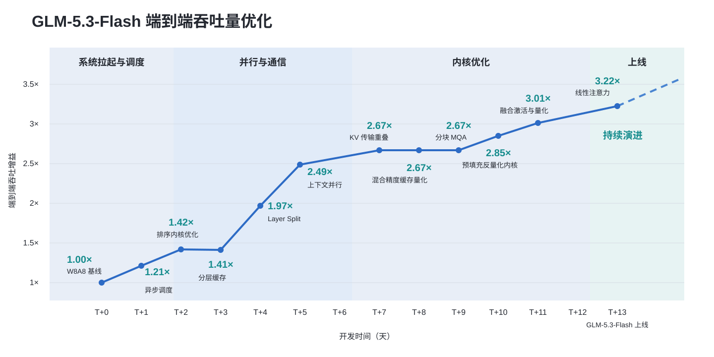
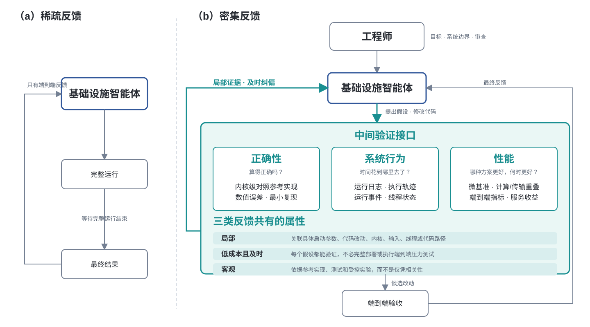
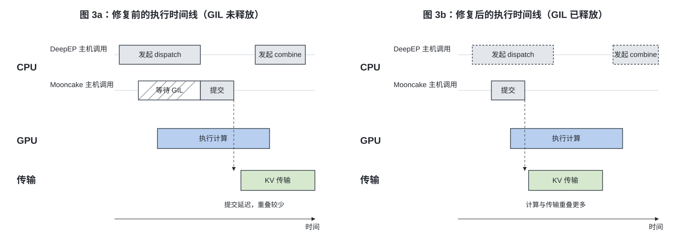
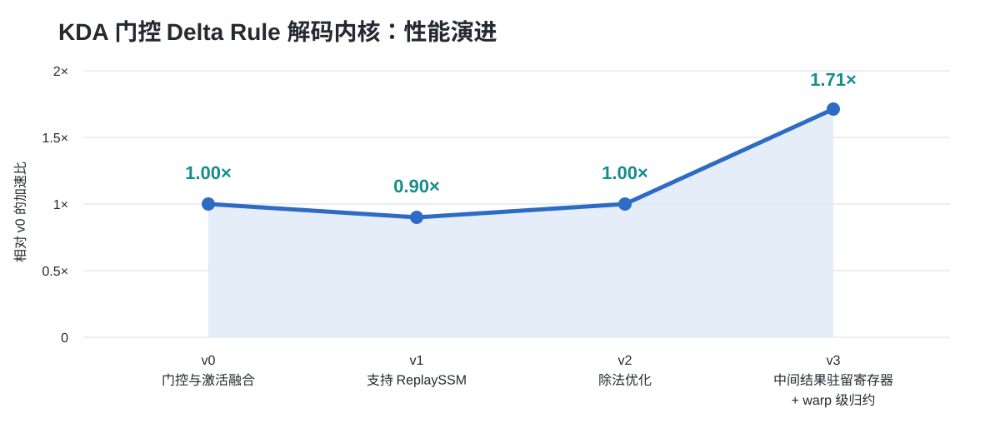

# 迈向递归式自我改进：GLM 如何构建自己的推理基础设施

> 发布：Z.ai  
> 日期：2026 年 9 月 17 日  
> 原文：[Toward Recursive Self-Improvement: How GLM Built Its Own Inference Infrastructure](https://z.ai/blog/glm-built-its-inference-infrastructure)  
> 翻译 Url：[https://github.com/samz406/local_wenzhang/blob/main/docs/GLM推理基础设施/迈向递归式自我改进-GLM如何构建自己的推理基础设施.md](https://github.com/samz406/local_wenzhang/blob/main/docs/GLM推理基础设施/迈向递归式自我改进-GLM如何构建自己的推理基础设施.md)


在开发 GLM 的过程中，模型有时会展现出一些让我们惊讶，甚至隐隐不安的能力。

2025 年 10 月，我们开始研究如何增强 GLM 的网络安全能力。当时的想法很直接：网络安全本就是编程能力的自然延伸，一个能理解复杂代码的模型，也应该能够理解代码中的漏洞。但我们没有预料到之后发生的事。不到一年，我们的安全合作伙伴就利用 GLM 在真实代码库中发现了数千个漏洞。模型开始重塑网络安全，同时也带来了过去从未存在过的风险。为了让这项能力得到负责任的使用，我们不得不设计一套可信访问计划。

最近一次真正震动我们的，是一个更根本的变化：GLM 正在越来越多地参与构建 AI 本身。我们亲眼看到模型完成了一项基础设施任务——过去，这项工作需要一支经验丰富的基础设施工程团队花上数周时间。当我们意识到，这些工作会直接改变下一代模型的训练方式时，一个判断也变得愈发清晰：我们的继任者，正是我们亲手创造的 AI 系统。

坦率地说，在 GLM-4.7 之前，我们在内部用 GLM 编程，多少带着一点“自家产品总得支持一下”的意味。毕竟，这是我们自己做出来的模型。那时，编码场景的产品市场契合点还没有真正到来。如今，GLM-5.3 已经成为团队每个人日常工作中不可或缺的编程伙伴，并且正稳步走向取代我们。如果这个趋势持续下去，只要算力和时间足够，它最终可能演化成一个能够完全自主设计并训练其继任者的系统。这就是所谓的递归式自我改进（Recursive Self-Improvement，RSI）。

我们距离那一步还很远，但它的早期形态已经开始出现。本文记录的，正是其中一个早期案例。

让一个模型在新硬件上第一次成功运行，只是起点；要把它变成一套能够稳定承接生产流量的高性能推理服务，则是一项大型系统工程。GLM-5.3-Flash 的上线也经历了同样的过程。我们在一个由超过 10 万张国产 AI 加速卡组成的集群上，从零构建了一整套生产级推理服务。现在，GLM-5.3-Flash 的全部生产推理流量都运行在这套系统上。

这件事并不容易。此前从未有人以这样的规模部署国产加速卡集群。芯片的显存容量和带宽相对有限，而我们还必须支持全新的模型架构、100 万 token 的上下文窗口以及多模态请求。整个生态尚不成熟，内核支持并不完整，许多本应写进文档的东西，只能靠我们自己摸索和推断。最终，我们还是完成了这项工作。但它并非仅由一支基础设施工程团队完成，其中相当大一部分工作，来自由 GLM-5.3 驱动的基础设施智能体（Infra Agent）。

接下来发生的事，大家已经比较熟悉了。GLM-5.3-Flash 曾以匿名模型 Ox-Alpha 的身份，在 OpenCode 和 OpenRouter 上接受真实用户流量的检验。上线不到一周，它就成为两个平台上使用量最高的模型，6 天内处理了超过 62 万亿 token。

我们实施了一系列激进的内存优化，包括以计算换带宽、以通信换显存的定制方案。最终形成的技术栈组合了多项关键技术：面向线性注意力与 LM Head 的节点内张量并行、ReplaySSM、W8A8 量化、采用 INT8/FP8/BF16 的混合精度缓存量化，以及 Layer Split。在此之上，我们又引入了编码—预填充—解码分离架构（Encode-Prefill-Decode，EPD）。这些优化共同将端到端服务性能提升了约 3 倍，硬件利用效率和单 token 成本也达到了与主流 NVIDIA GPU 相当的水平。

在整个优化过程中，基础设施智能体的反馈闭环始终持续运转。GLM-5.3-Flash 从最初完成模型适配到具备生产上线条件，用时不到两周；最终端到端吞吐量达到初始基线的 3 倍。图 1 展示了它从第一次成功运行到正式上线的性能演进过程。



**图 1：GLM-5.3-Flash 端到端吞吐量的演进。** 横轴为开发天数，纵轴为相对初始基线的端到端吞吐增益。优化过程依次经历系统拉起与调度、并行与通信、内核优化和上线四个阶段；通过异步调度、分层缓存、Layer Split、上下文并行、KV 传输重叠、混合精度缓存量化、分块 MQA、预填充反量化内核、融合激活与量化以及线性注意力等优化，吞吐量从 1.00 倍提升至上线时的 3.22 倍，并仍在继续演进。

在这个过程中，我们逐渐意识到：基础设施智能体的工程成效，不仅取决于模型生成代码和推理的能力，更取决于系统能否持续提供有用、且能够追溯到具体原因的反馈。代码库只能提供静态上下文，而推理系统中的数值偏差、性能退化和优化目标落空，通常来自多个层次之间的动态相互作用，包括内核实现、并行策略、通信行为、内存管理和服务编排。

即使智能体能够理解整个代码库，当它修改代码后只得到“数值精度测试失败”“首 token 延迟（TTFT）上升 30%”或“输出吞吐量下降 20%”这样的反馈，仍然很难判断究竟是哪一层出了问题、当前假设为什么不成立，以及下一步应该验证什么。端到端指标只能告诉智能体结果变差了，却无法解释为什么会变差。

因此，在提升智能体编写和修改代码能力的同时，我们还必须解决一个更底层的系统问题：**怎样把稀疏的端到端结果，转化为细粒度、可归因，并且能直接指导下一步行动的工程反馈？** 这也是为基础设施智能体建立有效反馈闭环的关键。

## 从端到端指标走向可归因反馈

传统的推理系统优化并不缺测试、日志、性能分析工具或微基准测试，问题是它们通常散落在不同工具和工程阶段之中。经验丰富的工程师会根据压力测试结果判断接下来该观察什么，再逐步检查内核输出、执行时间线、通信事件或线程状态，并把不同工具提供的信息串联起来。

对智能体而言，如果这些观察和验证方法没有被组织成可直接访问、可重复执行的工作流，它实际能够利用的反馈依然十分稀疏。它也许知道吞吐量没有达到目标，却仍无法判断：

- 是某个内核运行得太慢，还是计算设备正在空转？
- 是 KV Transfer 本身太慢，还是上层调度没有及时推进传输？
- 某项优化对哪些输入形状有效，又会在什么条件下发生性能退化？

单一的端到端指标无法回答这些问题。因此，我们把正确性测试、运行时日志、执行轨迹、运行时事件、微基准测试和端到端指标全部纳入智能体的迭代工作流，将整个系统优化过程拆成能够在局部观察和验证的步骤。内核级对比用于验证数值正确性；微基准测试用于衡量特定输入条件下的局部性能；执行轨迹与运行时事件则揭示计算、等待和通信之间的时序关系。智能体可以根据当前假设选择合适的验证方法，而不必在每次修改后都等待完整服务部署和端到端压力测试。

我们把这种方法称为“密集反馈”（dense feedback）。这里的“密集”，并不是尽可能多地向智能体倾倒日志和指标，而是强调以下三个特征。

**第一，反馈必须足够局部。** 在可能的情况下，反馈应当关联到具体的引擎启动参数、代码改动、内核、输入条件、线程、执行区间或代码路径，帮助智能体缩小问题范围。例如，与其笼统地报告“融合优化后模型精度下降”，不如指出某个具体请求在修改前后的输出差异。后者能为智能体构造最小复现并分析原因提供更可靠的依据。

**第二，获取反馈的成本必须足够低，而且要足够及时。** 每当智能体提出假设、完成修改或设计一组对照实验时，都应该有合适的方法进行验证。能够通过内核测试或局部微基准回答的问题，不应该每次都要求重新部署完整服务并进行端到端压力测试。验证周期越短，智能体就越能及时纠正方向，减少在无效假设上浪费的精力。

**第三，反馈必须支持客观验证。** 一项改动是否正确、性能是否真的提高，应由参考实现、测试结果和可比较的实验指标来判断。运行时信号可以帮助智能体发现可能的原因，但观察结果之间仅仅存在相关性，并不能证明根因。要确认某条具体路径上的修改是否产生了预期效果，仍然需要受控实验。

这三个特征共同决定了一条反馈是否真正可执行。正确性反馈回答“算得对不对”；系统行为反馈回答“时间花到哪里去了”；性能反馈回答“哪种方案更好，以及它在什么条件下更好”。验证方法不必遵循固定顺序，而应与当前假设相匹配，让每一次实验都回答一个明确的问题。

局部验证和端到端测试在这个过程中承担着不同角色。前者负责尽早淘汰错误或无效的改动，并筛选出值得继续推进的候选方案；后者则确认局部收益能否转化为真实的服务收益，以及某项改动会不会在实际负载下引入新的性能退化。

基于这些原则，GLM-5.3-Flash 的上线过程形成了一个由工程师、基础设施智能体和实验环境共同参与的优化闭环。工程师定义目标和系统边界，智能体负责分析、提出假设并修改代码，实验环境则提供分层、及时且可验证的反馈。三者共同把过去依靠工程师经验串联起来的诊断过程，转化成一套智能体能够持续执行的工程工作流。



**图 2：围绕密集反馈构建的基础设施智能体优化闭环。** 左侧的“稀疏反馈”模式只有智能体、完整运行和最终结果，必须等完整流程结束后才能获得端到端反馈。右侧的“密集反馈”模式中，工程师负责目标、系统边界和审查；智能体提出假设并修改代码；中间验证接口分别提供正确性、系统行为和性能反馈。三类反馈都应具备局部、低成本且及时、客观可验证三个共同属性；候选改动最终仍须通过端到端验收。

整个演进过程中，既有直接提高吞吐量的性能优化，也有无法立刻带来吞吐收益、却是系统正确可靠上线所必需的缺陷修复。接下来的三个案例将说明，密集反馈如何帮助智能体确保系统“算得正确”、解释“为什么跑得不够快”，并探索“怎样才能跑得更快”。

## 正确性反馈：帮助智能体判断模型是否算得正确

推理性能优化必须建立在数值正确的基础上。对智能体而言，验证的第一步，是准确弄清推理引擎究竟执行了哪些计算。上层并行策略会改变内核输入的切分方式、实际执行路径以及结果合并方式。只在未切分条件下测试内核输出，并不足以覆盖它在真实部署中的行为。

为此，我们建立了推理引擎并行策略到内核实现之间的映射，把系统级部署配置转化为智能体能够逐项验证的内核级任务。这套映射可以帮助智能体识别某种并行配置会涉及哪些内核、输入会如何切分，以及哪些计算路径需要与未切分实现进行对比。

在此基础上，我们让智能体对比不同切分与未切分执行路径的数值精度。面对相同输入，它先对齐计算语义和输出位置，再检查不同执行方式的结果是否处于允许的数值误差范围内。这样一来，并行配置、内核路径和观测到的误差便被关联起来。一旦测试暴露出差异，智能体就能沿着对应的切分方案和计算路径继续排查，而不必重新从整个模型层面开始诊断。

正是在这轮内核验证中，我们发现 KDA 内核的上下文并行（Context Parallelism，CP）路径存在数值精度问题。CP 与非 CP 结果之间的差异，把调查方向指向了并行执行引入的状态传播和合并计算。

CP 切分需要合并来自不同上下文分片的状态，其核心计算可简化为：

```python
M = tl.dot(M_chunk, M)     # 合并不同分片之间的状态变换
S_next = tl.dot(M, S) + H  # 更新下一个分片的初始状态
```

在原始实现中，即使输入是 FP32，`tl.dot` 为了获得更高性能，默认仍会采用 TF32 计算。较低的计算精度使误差在变换合并和状态更新的过程中不断累积，并且会随着上下文变长而变得更加明显。

修复方法是为两处运算显式设置 `input_precision="tf32x3"`。这种方式组合三次 TF32 Tensor Core 运算来得到精度更高的结果，在尽量保留 Tensor Core 性能优势的同时，减少累积误差。

在这个案例中，反馈环境甚至在问题暴露之前就已经开始发挥作用：并行策略到内核的映射定义了需要测试的对象；切分路径与未切分路径之间的对比暴露出数值差异；对计算精度的分析解释了差异的来源；回归测试则为后续持续验证改动提供了依据。对智能体来说，这套工作流把系统级并行设计变成了一组可执行、可追踪的正确性任务。完成局部验证之后，候选实现仍然要回到目标部署环境中，接受模型级精度和服务性能的最终验收。

这次数值精度修复已经合并到 Flash Linear Attention 上游项目，详情参见 [PR #1180](https://github.com/fla-org/flash-linear-attention/pull/1180)。

## 系统行为反馈：定位 KV Transfer 并发瓶颈

对于系统级性能问题，定义清楚的测试场景和性能约束，可以给智能体提供识别异常、选择分析方向的起点。

我们的推理优化工程师为智能体定义了多种测试场景，包括单独运行 Prefill、Prefill + KV Transfer 以及单独运行 Decode，以此隔离不同执行阶段及其组合对性能的影响。工程师还为每个场景设定了验收标准。例如，在相同负载下，Prefill + KV Transfer 与仅运行 Prefill 的基线之间，性能差距不应超过 5%。

然而，智能体发现在某些场景中，这一性能差距超过了 20%。这条反馈把调查范围缩小到了 KV Transfer 引入的额外开销及其并发交互。随后，智能体详细检查 KV Transfer 的执行时间线，发现了一个异常：在这些场景中，Python 侧的 KV Transfer 执行始终无法与 DeepEP 的 dispatch/combine 调用区间重叠。

这项观察促使智能体沿着调用链追踪到 Python/C++ 边界，调查 DeepEP 与 Mooncake Transfer 之间的并发关系。在我们使用的 DeepEP v1.2.1 中，`intranode_dispatch` 和 `intranode_combine` 都没有显式释放 Python GIL；此外，当 dispatch 需要获取接收到的 token 数量时，还会在 CPU 端等待 GPU 返回信息。

关键在于：进入 C++ 并不意味着 GIL 会自动释放。当这些调用一直持有锁时，同一进程中负责 Mooncake Transfer 的 Python 线程就无法及时获取 GIL，传输任务的调度和提交因而被延迟，KV Transfer 与后续计算发生重叠的机会也随之减少。即使底层传输机制支持异步执行，上层的提交环节一旦被阻塞，预期中的并行仍然无法充分实现。

源代码里恰好还有一个可以直接对照的实现：同一版本中的 `internode_dispatch` 已经显式释放了 GIL，并通过注释说明，这么做是为了避免 CPU 等待期间阻塞其他线程中的 KV Transfer。这进一步佐证了智能体对节点内路径的判断。

修复的关键，是在相关 C++ 执行区间释放 GIL，让 Mooncake Transfer 的 Python 线程能够及时推进任务。修复后，既要通过时间线验证，也要重新检查最初的性能约束：前者用于判断调度和传输是否获得了与计算重叠的机会，后者则用于确定这项修改是否真正提高了服务性能。在相同测试条件下，修复后的 Prefill + KV Transfer 与仅 Prefill 之间，性能差距从超过 20% 降到了 1% 以下。



**图 3：KV Transfer 并发瓶颈的发现与修复。** 左侧为修复前：DeepEP 调用持有 GIL，Mooncake 线程先等待 GIL，导致任务提交延迟，KV 传输与 GPU 计算只有较少重叠。右侧为修复后：DeepEP 调用释放 GIL，Mooncake 得以及时提交任务，KV 传输与计算产生更多重叠。

在这个案例中，性能约束首先把“运行结果不符合预期”转化为明确的测试差异；执行时间线随后将调查范围缩小到两个组件之间的并发；最终，代码分析定位了 GIL 的持有区间。密集反馈把端到端性能、跨层运行时行为和具体实现细节连接起来，为智能体分析过程的每一步都提供了证据。

## 性能反馈：继承已有内核优化经验，并把它转化为系统级收益

内核优化必须回答两个问题：怎样判断一项优化是否有效，以及应该去哪里寻找有希望的优化方向。

首先，内核性能必须放到推理引擎的真实执行环境中评估。例如，为计算内核分配更多资源，也许会缩短它自身的执行时间，却会挤占 KV Transfer 内核的资源，最终拖慢整条流水线。因此，智能体不能只盯着单个内核的延迟，而必须结合目标负载、资源约束、任务重叠关系和端到端收益，建立正确的优化目标。

其次，大量优化经验都隐含在 SGLang、Flash Linear Attention、DeepGEMM 等项目的手写内核中。智能体需要从这些代码里提取优化技巧及其适用条件，针对当前内核和目标硬件形成候选方案，再通过实验验证实际效果。已有代码提供优化方向，系统反馈则决定这些优化在实践中是否站得住脚。

我们让由 GLM-5.3 驱动的基础设施智能体，从不同代码库、编程语言和硬件平台的已有内核中学习优化技巧。通过渐进式实验和消融实验，它把这些技巧提炼成一套套“优化骨架”，其中包含适用条件、变换方法、资源约束和验证证据。面对一个新内核，智能体会先从这些骨架出发，再通过性能分析和分层测试，重新评估分块、内存访问与资源分配策略。经过验证的改动及其适用条件，会反过来沉淀进优化骨架库。工程师主要负责定义目标和约束，并审查涉及数值语义、并发行为和生产风险的关键改动。



**图 4：一个典型 KDA Decode 内核从基线实现到生产版本的性能演进。** v0 为门控与激活融合基线，性能为 1.00 倍；v1 加入 ReplaySSM 支持后因以计算换内存，性能暂时降至 0.90 倍；v2 经过除法优化恢复至 1.00 倍；v3 将共享中间结果保留在寄存器中，并采用 warp 级归约，最终达到相对 v0 的 1.71 倍加速。

图 4 展示了一个典型 KDA Decode 内核的性能演进。为以计算换内存而引入 ReplaySSM 后，内核执行时间第一次出现上升，也就是从 v0 到 v1 的变化。随后，智能体通过除法优化把 v1 的执行时间缩短了 9.6%。接着，在得到“计算是主要瓶颈”这一反馈后，基础设施智能体发现，原始实现沿 V 维度分块，导致相同的 FP32 归一化与门控计算被重复执行了四次。它把这些分块合并到同一个线程块中，将共享的中间结果保留在寄存器里，并用一次 warp 级归约取代逐分块的重复计算。它以牺牲一部分并行度为代价，从源头上消除了冗余计算，最终相对 v2 获得了 1.71 倍加速。

在这个案例中，由 GLM-5.3 驱动的基础设施智能体从既有实现中提取优化经验，再把它应用到运行自身推理的内核上。它从优化骨架出发调优各个组件，通过分层验证决定保留哪些改动，并以端到端性能判断这些改动的实际价值。验证过的经验随后又回流到优化骨架库。模型由此参与优化自己的推理系统，而每次部署积累下来的经验，也会降低下一轮优化所需的工程投入。

## 让反馈驱动行动，让实验检验假设

这三个案例共同说明：反馈的价值不在于数量，而在于它能否帮助智能体回答眼前的问题。大量缺少结构的日志可能会掩盖关键信号；覆盖不完整的性能分析可能导致错误归因；在微基准测试中有效的优化，也未必能转化成端到端收益。因此，构建反馈环境不能只是提供测试、日志和性能数据，还必须明确每一种观察能够支持什么判断、它的边界在哪里，以及哪些结论必须通过进一步实验才能确认。

工程师在这个过程中承担三项关键职责：定义优化目标和系统约束；构建智能体可以直接使用的反馈环境；审查涉及系统架构、异步并发和生产风险的关键改动。在这一框架下，智能体负责提出假设、实现修改并运行实验，再根据反馈决定保留、调整还是放弃当前方案。正确性、稳定性和端到端性能共同构成最终验收标准。

回看 GLM-5.3-Flash 的上线过程，内核数值精度缺陷、跨越 Python/C++ 边界的并发问题，以及关键内核的性能优化，分别代表了不同层面的工程挑战。通过局部测试、跨层观察和分层基准测试，最初含混不清的异常被逐步转化成可以验证的工程假设，复杂的系统问题也被拆成一系列可观察、可通过实验检验且结果可归因的迭代。正是在这样的反馈闭环中，智能体的编程与推理能力才真正转化成了可验证的工程进展。

由 GLM-5.3 驱动的基础设施智能体参与构建了推理基础设施；而由工程师与智能体共同优化的系统，又反过来让 GLM-5.3-Flash 能够稳定地服务用户。**模型优化系统，系统运行模型。** 这项工作证明，要缩短系统工程周期，仅仅提升模型能力还不够，还需要建立一套智能体工程闭环，让模型能够持续获得反馈、检验自己的判断，并修正接下来的行动。

当然，我们还没有真正实现递归式自我改进。选择目标、划定边界和评估风险，仍然是人类的责任。我们相信，在未来很长一段时间里，人类都应该守住这条边界。但那些数字——不到两周、3 倍吞吐量、10 万张加速卡——也在提醒我们：这条边界上的进步，不会因为我们希望它慢下来，就真的放慢脚步。
