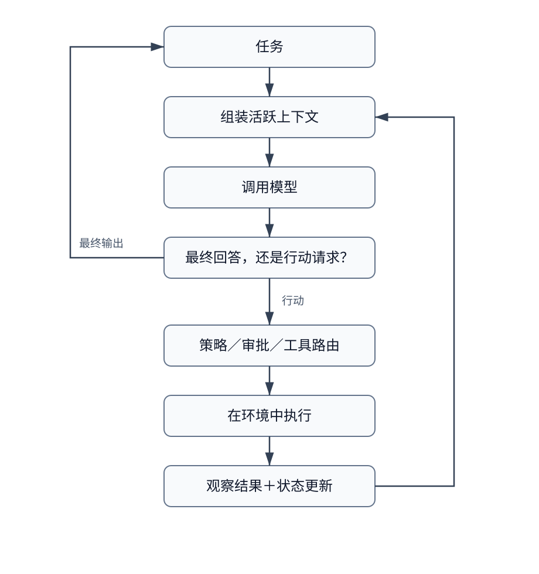
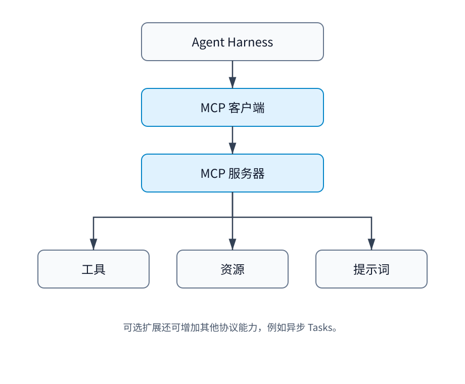
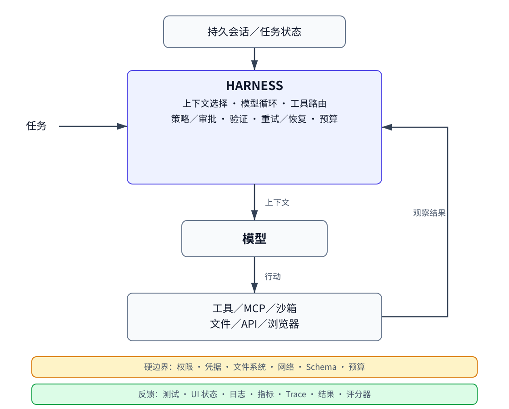

# 理解 Harness 工程

## 从 Agent 循环、工具接口，到上下文、沙箱、验证与长程任务

> 作者：@techNmak  
> 系列：Understanding AI Series · Special Topic  
> 原文：[Understanding Harness Engineering](https://drive.google.com/file/d/1PT-P2PVoiZpfYoe5eWks1_DGt2aSvbDh/view)  
> 翻译 Url：[https://github.com/samz406/local_wenzhang/blob/main/docs/Harness工程/理解Harness工程.md](https://github.com/samz406/local_wenzhang/blob/main/docs/Harness工程/理解Harness工程.md)

一本写给 AI 工程师、开发者和认真学习者的技术短手册。

## 导读

### 这本手册会讲清什么

一个能力强大的语言模型，本身并不是一个能工作的 Agent。

必须有一套外围机制来决定模型能看到什么，向它开放哪些行动，执行这些行动，把观察结果送回去，保存有用的状态，执行权限规则，在失败后恢复，判断是否还需要下一步，并最终确认任务是否真的成功。

这套外围机制，正越来越多地被称为 **Agent Harness**。

这个术语还很年轻。微软目前用 *agent harness* 指代一种运行时支架：它通过协调模型调用、工具调用、上下文、状态、审批与多步执行，把语言模型变成 Agent [15]。Anthropic 使用的含义与此相近：它把持久会话、负责运行模型—工具循环的 Harness，以及执行代码的沙箱区分开来 [12]。OpenAI 对 *harness engineering* 的用法则更宽泛，涵盖环境、反馈回路、代码仓库结构、约束、可观测性，以及让 Agent 可靠工作所需的其他支架 [10]。

在本手册中，我们采用如下工作性区分：

- **Agent Harness**：紧贴模型外围的运行时与控制机制，使模型能够跨越多个步骤采取行动。
- **Harness 工程**：一门更广泛的工程学科，负责设计接口、上下文策略、状态、执行环境、控制措施、反馈系统、恢复行为和验证机制，从而让 Agent 的工作变得可靠。

这是本手册为了行文而采用的分类，并非行业标准定义。

读完后，你应当能够解释：

- 为什么一次模型调用还不算 Agent；
- 最小 Agent 循环如何工作；
- 模型、Harness、会话、工具与沙箱有何不同；
- 为什么工具设计会改变 Agent 的行为；
- 为什么 MCP 很有用，却没有规定一套完整的 Agent 架构；
- 为什么活跃上下文不同于持久状态；
- 为什么上下文压缩必然有损；
- 权限、隔离、凭据与审批分别解决什么问题；
- 为什么工具失败需要模型能够利用的错误语义；
- 为什么面对非幂等副作用时，重试会变得危险；
- 为什么验证必须与 Agent 自称完成区分开来；
- 长程 Agent 如何继承传统系统中的持久性与一致性问题；
- 子 Agent 何时有帮助，协调成本又会在何时占据上风；
- 为什么评测测到的是模型与 Harness 的共同表现；
- 为什么随着模型进步，Harness 中的假设也应重新检验。

**前置知识：** 只需对语言模型推理、函数／工具调用、上下文窗口和普通软件系统有基本了解。

**范围：** 本手册讨论的是 Agent 模型执行周围的系统层。它不是一部完整的 MCP 手册，不是 Agent 安全或分布式系统教科书，也不是 Agent 框架大全。

## 1｜一次模型调用并不是 Agent

一次语言模型调用可以抽象写成：

$$
y \sim p_\theta(\cdot \mid c)
$$

其中，$c$ 是交给模型的上下文，$y$ 是生成的输出。

这个表达式本身并不意味着 Shell 命令会被执行、浏览器会打开、文件会改变、API 调用会在失败后重试、失败尝试会被观察到，或者工作会在第一次回复后继续。

Agent 系统在模型推理之外增加了一个外部控制过程。一个实用的概念分解是：

> Agent 系统 ≈ 模型 + Harness + 环境

这不是严格恒等式，而是一种心智模型。

模型提供学习到的能力；Harness 决定如何把推理连接到行动，以及如何让这个过程随时间反复发生；环境则包含行动所检查或修改的外部状态。

Anthropic 把普通工作流与 Agent 区分开：普通工作流的执行路径大体由应用代码规定，而 Agent 会由模型动态选择行动与策略 [4]。微软也区分了普通 Agent、工作流，以及为较长的多步任务组装出来的 Harness Agent [15]。

所以，真正重要的边界并不是营销话术里的“聊天机器人还是 Agent”，而是模型输出是否参与了一个受控的、会与外部状态交互的循环。

## 2｜最小 Agent 循环

可以用四个不断演化的对象描述 Harness。设：

- $s_t$：步骤 $t$ 开始前的持久状态或工作状态；
- $c_t = G(s_t)$：为下一次模型调用选择的上下文；
- $a_t = M(c_t)$：模型输出，其中可能包含行动请求；
- $o_t = E(a_t)$：若执行了行动，由环境产生的观察结果。

随后，Harness 更新状态：

$$
s_{t+1} = U(s_t, a_t, o_t)
$$

这是本手册采用的形式化表达，并非标准 API。



现代运行器通常都会以某种形式执行这个循环：调用模型、检查响应；如果响应是最终结果就返回；如果模型请求了工具，就执行工具并追加结果，然后再次调用模型 [14]。

ReAct 是这一思路的重要研究先驱。它研究了把推理与任务行动交错排列的语言模型轨迹，使外部观察能够影响后续决策 [1]。现代 Harness 无须公开或持久保存模型的私有推理轨迹，也依然可以保留这一持久的系统思想：**行动、观察、更新、继续。**

## 3｜Harness 实际控制什么

只要列出那些不属于模型权重的职责，“Harness”这个词就会变得非常具体。Harness 可能决定：

- 下一次上下文中包含哪些指令与状态；
- 哪些工具对模型可见；
- 如何表示工具 Schema；
- 是否允许某次工具调用；
- 是否需要人工审批；
- 工具如何执行；
- 工具结果如何转换后再返回模型；
- 历史如何持久化；
- 上下文如何压缩；
- 何时创建子 Agent；
- 如何返回错误；
- 如何处理重试；
- 哪些预算会终止运行；
- 接受“任务完成”之前需要哪些证据；
- 如何记录 Trace 和指标；
- 中断后如何恢复执行。

并非每个 Harness 都拥有上述全部职责。有些系统会把状态、执行、策略或恢复交给其他组件。

所以，最好把 Harness 理解为一种**控制平面概念**，而不是某个库或某个进程的同义词。以 OpenAI 当前的 Agents API 为例，它负责会话、编排、上下文压缩和恢复，同时允许应用自行选择工具与执行环境 [14]。微软的 Harness 则组合了聊天客户端、上下文提供器、持久化、压缩、审批、可观测性和有界循环 [15]。

这些只是当下的实现快照，不是永恒定义。本手册发布时，OpenAI Agents API 仍处于公开 Beta；微软已经发布打包后的 Harness 工厂，但后台 Agent、文件访问和循环仍标记为实验性功能，Shell 工具也仍是预发布状态。

## 4｜模型、Harness、会话、工具与沙箱

这些术语描述的是不同的系统对象。

| 术语 | 实用含义 |
| --- | --- |
| 模型 | 经过学习得到的推理系统 |
| Agent | 在行动循环中朝某项任务工作的模型 |
| Harness | 驱动这一循环的运行时／控制机制 |
| 会话 | 承载持续工作逻辑历史与状态的容器；是否持久取决于实现 |
| 上下文 | 交给某一次模型调用的信息 |
| 工具 | 暴露给模型的可调用能力 |
| 沙箱 | 受控的执行环境 |
| 工作流 | 主要由代码规定的执行结构 |
| 评测 Harness | 运行评测并为结果打分的基础设施 |

Anthropic 的 Managed Agents 架构明确区分了会话、Harness 与沙箱：会话是只追加的日志，Harness 调用模型并路由工具调用，沙箱则运行代码、编辑文件 [12]。

OpenAI 的沙箱架构也做了类似区分：Harness 是模型调用周围的控制平面，负责路由、审批、追踪、恢复和运行状态；沙箱是执行平面，负责读写文件、执行命令、安装依赖和制作快照 [14]。

这些边界可以有不同的实现方式，但概念上的分离始终有用，因为各组件的故障方式与信任假设并不相同。

## 5｜Agent—计算机接口

模型从来不是抽象地与“计算机”交互，而是与某种接口交互。

一种编码 Harness 可能提供：

```text
read_file(path, start_line, end_line)
search_code(query)
apply_patch(path, patch)
run_tests(target)
```

另一种 Harness 也许只提供：

```text
shell(command)
```

两者最终可能都能操作同一个代码仓库，但它们呈给模型的并不是同一个问题。

SWE-agent 将这个想法形式化为 **Agent—计算机接口**（Agent-Computer Interface，ACI）。它没有假定为人类开发者打造的接口天然就适合语言模型，而是把接口设计本身视为实验变量。研究者围绕 Agent 行为设计仓库导航、编辑、测试与反馈机制，再测量这些选择如何影响表现 [2]。

原始论文报告称，在其所评测的 SWE-agent 配置下，SWE-bench 的 pass@1 为 12.5%，HumanEvalFix 为 87.7% [2]。这些是特定论文、模型、Harness、任务与评测流程下的历史结果，并非对 ACI 设计的普遍结论。

真正经得起时间考验的，是这个工程问题：

> 能力只是“存在”，还是以模型能够可靠使用的形式暴露出来？

## 6｜能力、契约、观察与反馈

可以从四个属性分析任何面向 Agent 的工具：

- **能力（Affordance）**：工具能执行什么操作？
- **契约（Contract）**：模型如何请求这项操作？
- **观察（Observation）**：操作后会返回什么信息？
- **反馈（Feedback）**：返回结果是否让下一步正确行动变得更容易？

以文件编辑为例。原始 Shell 拥有极强的能力，但它也要求模型选择命令、正确引用路径、理解工具输出，并从格式错误中恢复。结构化补丁工具缩小了行动空间，却可能更容易表达意图，也更容易验证结果。

两种接口没有谁永远更好。正确设计取决于模型、任务、环境与评测。关键在于：接口结构本身，会成为任务实际难度的一部分 [2,5]。

## 7｜工具也是模型输入的一部分

工具不只是可执行代码。它的名称、描述、参数和结果表示通常都会被放进模型上下文。这意味着，甚至在工具真正被调用之前，工具设计就已经开始影响推理。

Anthropic 把工具设计视为传统软件与概率性 Agent 行为之间的接口问题。其工程实践强调：目的清晰、参数无歧义、合理使用命名空间、返回有用内容，并控制结果的 Token 消耗 [5]。

可以把两类成本分开来看：

$$
C_{tool} = C_{selection} + C_{observation}
$$

这是一个概念分解。$C_{selection}$ 是选择正确工具与参数的难度；$C_{observation}$ 是返回结果给上下文与推理带来的负担。

一个后端 API 即便设计得很优雅，如果描述与其他工具重叠，或把大量无关数据倾倒进上下文窗口，对 Agent 来说仍可能是个糟糕工具。

## 8｜工具越多，决策可能越难

假设系统提供六个几乎重叠的操作：

```text
search()
find()
lookup()
query()
grep()
retrieve()
```

从传统能力视角看，这似乎很丰富。但从模型视角看，每增加一个工具，行动空间里就多一个选项。

Anthropic 报告过一种常见故障：工具集膨胀或工具含义重叠，会制造模糊的决策点。其工具设计指南建议，在可能的情况下选择数量更少、边界更清楚的操作；用命名空间分隔相关能力；并实际评测命名方案，而不是假设存在一种放之四海皆准的惯例 [5]。

由此可以得出一条实用的生产规则：

> 工具数量并不是 Agent 能力的单调指标。

增加工具可能扩大可实现的行为范围，同时也让工具选择变得更困难。这个权衡应当在代表性任务上测量，而不是凭审美拍板。

## 9｜工具结果应返回高信噪比上下文

假设 Agent 请求一条客户记录。底层 API 可能返回数百个字段、内部标识符、分页元数据、多个图片版本、审计记录和存储键。

人写的程序可以廉价地忽略字段；语言模型却必须通过上下文预算消费这些文本。

Anthropic 建议返回高信号信息；对可能很大的结果使用过滤和分页；必要时同时提供精简与详细模式 [5,6]。最佳格式会随任务和模型而变化。

所以，评判工具结果时不能只看“是否正确”，还要问：

- 它是否返回了下一步决策所需的信息？
- 是否省略了无关负载？
- 是否保留了后续行动所需的标识符？
- 如果结果被截断，是否说明了如何获取更多内容？
- 结果格式是否容易理解？

工具输出本身就是上下文工程的一部分。

## 10｜工具错误也是观察结果

工具失败后，系统可以终止运行、自动重试，也可以把模型可见的错误返回去，让模型自行恢复。这三种语义并不相同。

假设：

```text
deploy_service(environment="prod")
```

因为请求的分支不存在而失败。像下面这样模糊的结果：

```text
Error.
```

只会迫使模型猜测。更有用的结果可能是：

```yaml
status: failed
reason: branch_not_found
requested_branch: release/2.4
available_branches: [...]
side_effects: none
retryable: true
```

具体 Schema 取决于应用，但一般原则不变。

OpenAI 当前的 Agents SDK 区分两种情况：把 `toolNotFoundBehavior` 设为 `return_error_to_model`，可以把无法解析的函数工具调用转换成模型可见的错误，使运行继续；而 `toolErrorFormatter` 则用来定制返回给模型的工具错误消息 [14]。Anthropic 也建议提供可采取行动的校验错误，而不是不透明的错误码或原始堆栈 [5]。

一个可恢复的失败，应当给模型足够的信息，让它选择更好的下一步，同时又不能假装失败的操作已经成功。

## 11｜MCP 是互操作层，不是完整的 Agent 循环

模型上下文协议（Model Context Protocol，MCP）为 AI 应用与外部能力之间的接口制定了标准。

有明确日期版本的 MCP 核心服务器规范，聚焦于提示词、资源和工具等服务器原语。Tasks 是一个单独的、可选加入的 MCP 扩展，不属于核心协议。手册发布时，MCP 第一方页面对它的成熟度表述并不一致：扩展概览把 MCP Tasks 列为官方扩展仓库之一；`ext-tasks` 仓库的 README 却把该仓库标为实验性且非官方；已发布的 Tasks 规范页面又标记为 Draft。由于这些第一方标签相互冲突，本手册把 Tasks 视为仍在演进的可选扩展，而不强行赋予它单一的成熟度标签 [13]。

当前已发布的 Tasks 草案允许服务器为一次 `tools/call` 返回异步任务句柄，并定义了 `tasks/get`、`tasks/update` 与 `tasks/cancel`。它建议客户端把任务 ID 持久保存，使进程崩溃或重启后仍可恢复轮询。任务支持需要显式协商，不同 Host 的支持情况也可能不同 [13]。

这让 MCP 具备了越来越多的能力，但一条重要边界仍然存在。MCP 本身并不决定：

- 如何调度模型循环；
- 如何选择活跃上下文；
- 如何判定任务完成；
- 哪些行动需要审批；
- 如何重试带副作用的操作；
- 如何配置沙箱；
- 如何协调多个 Agent；
- 如何评测整个 Agent。

Harness 可以大量使用 MCP，同时仍在其他位置掌管这些策略。



安全的心智模型是：**MCP 是可互操作的能力接口，而不是完整的 Agent 架构。**

当前 Tasks 草案也说明了为什么不能把协议状态与工具结果混为一谈：一个 `isError: true` 的工具结果，在协议层面仍会让任务进入完成状态；JSON-RPC 执行错误才会让任务进入失败状态 [13]。设计模型可见的错误处理与恢复机制时，这一区分非常有用。

## 12｜活跃上下文由 Harness 决定

每次模型调用能看到的上下文都是有限的。Harness 决定什么能进入其中，潜在材料包括：

- 系统与开发者指令；
- 当前用户任务；
- 最近的消息历史；
- 工具 Schema；
- 工具结果；
- 检索到的文档；
- 计划与待办状态；
- 早期工作的摘要；
- 文件或代码仓库状态；
- 记忆记录；
- 子 Agent 输出。

一种天真的策略是：把所有以后可能有用的东西全部放进去。但它终将因为两个原因失败。

第一，上下文容量有限。第二，即便容量很大，相关性依然重要。无关材料会与有用证据争夺模型注意力，让决策问题变得更难。

因此，Anthropic 的上下文工程指南把上下文视为受约束资源，并强调即时检索、Token 高效工具、压缩、结构化记忆和子 Agent [6]。

## 13｜渐进披露，而不是巨型指令

OpenAI 的 Codex-first 工程实验遇到过一个实际的文档问题：一个大型仓库指令文件不断积累指南，最终消耗了太多上下文，难以维护，也很难机械验证。

团队后来改用更短的入口文档，再由它把 Agent 引向结构化、位于仓库本地的事实来源 [10]。

一般模式就是**渐进披露**：

1. 先提供足够的信息，让 Agent 找到方向；
2. 让更深入的信息可以被发现；
3. 只在任务需要时加载详细指南。

这也正是工具接口需要搜索、过滤和精简结果模式的原因。信息“可以获取”与“当前相关”是两种不同属性。上下文窗口很大，并不意味着把所有信息混成一堆就是好架构。

Agent Skills 是渐进披露的另一种现代实践。Anthropic 与微软把 Skill 描述成可复用的指令包，可带有脚本和资源；它们可以在相关时被发现和加载，而不必把所有指南塞进每一次提示词 [25,26]。工具的主要接口是可调用行动；Skill 则主要打包可复用指南与辅助资源，供模型决定如何工作时取用。微软把它与显式工作流区分开：工作流的执行路径由应用定义；当检查点、可预测顺序或非幂等副作用使灵活 Skill 的回放变得不安全时，微软当前更建议使用工作流 [26]。

一篇 2026 年的预印本分析了 SkillsBench 与 SWE-Skills-Bench 中 307 个确认由 Skill 引发的失败，包括 125 个功能失败和 182 个效率退化 [24]。该研究把选定的配对失败或成本退化归因于加载的 Skill；它并没有估计 Skill 在任意部署中的一般失败率。因此，Skill 应当经过评测，而不能默认有益。因为 Skill 可能包含指令、资源和可执行脚本，其来源也是安全问题；第 22 节会回到这条边界。

## 14｜持久历史与活跃上下文是两个状态表面

一项长程任务的历史，可能远多于任何一次推理调用应该看到的内容。因此，持久会话状态与活跃模型上下文之间的区别至关重要。

Anthropic 的 Managed Agents 设计把只追加的会话日志存放在活跃上下文窗口之外。Harness 可以检索其中的片段，经过转换后，再把选中的信息交还模型 [12]。

OpenAI 的 Agents API 同样把持久会话，与受管 Harness 执行的上下文管理行为区分开来 [14]。

两个状态表面有所重叠，但通常谁也不完全包含谁。持久历史可以留在下一次模型调用之外；活跃上下文也可能包含从未写入持久会话的临时材料，例如当前用户消息、实时工具 Schema 或临时运行时元数据。

具体存储模型因产品而异，但原则更为普遍：

> 持久可用，不等于每次推理都会自动纳入；一次推理中出现，也不等于已经持久保存。

## 15｜压缩是有损的

当对话长得装不下时，一种常见策略是用较短的摘要替换早期细节。这会降低活跃上下文成本，也会丢失信息。

设 $H$ 是一段历史，$C(H)$ 是压缩后的表示。一般而言：

$$
C(H) \ne H
$$

不能假设这种转换保留了未来步骤可能需要的每个细节。

Anthropic 明确警告，上下文保留决策可能导致失败，因为后续轮次也许需要此前看似不重要的信息。因此，其 Managed Agents 架构把持久会话历史与模型看到的压缩上下文分开保存 [6,12]。

应把压缩理解为**上下文转换**，而不是等同于删除持久历史。真正的工程问题是：

> 哪些信息可以概括，哪些应当保持可直接找回，以及 Agent 以后如何重新取得被省略的细节？

## 16｜案例：Harness 改动会改变 Agent 质量

Anthropic 在 2026 年 4 月发布的 Claude Code 事后分析，提供了一个很有用的现实案例 [19]。

Anthropic 报告称，其 API 与推理层未受影响，但产品层的三项改动改变了用户在 Claude Code 及相关产品中感受到的质量：

- 某些模型的默认推理强度被调低，收到用户反馈后又恢复；
- 一项会话优化原本计划在空闲一段时间后清除较早推理，但其中的 Bug 会在后续轮次反复执行清除，让 Claude 看起来健忘且重复；
- 一条旨在减少冗长输出的系统提示词，使 Opus 4.6 和 Opus 4.7 在某项更广泛评测上都下降了 3%，随后被撤销 [19]。

重点不在于这三种机制永远重要，而在于它揭示的架构事实：

> 即便底层 API 与推理层毫无变化，产品／Harness 配置的变化仍可能改变用户观察到的 Agent 质量。

因此，提示词构造、推理设置、上下文保留、工具接口和其他运行时决策，都是已部署 Agent 系统行为的一部分。

## 17｜结构化工作状态

自然语言历史并不是保存进度的唯一方式。长任务往往适合使用明确的制品，例如：

- 待办清单；
- Issue 跟踪器；
- 功能状态文件；
- 进度笔记；
- 测试结果；
- Git 提交；
- 检查清单；
- 生成的计划；
- 输出清单。

Anthropic 的长程 Agent 实验先用一个初始化会话准备结构化制品，后续编码会话再增量推进，并给下一次会话留下清晰状态 [7]。其示例使用了功能列表、Git 历史、进度笔记和初始化脚本。

这些制品不是隐藏的模型记忆，而是任务状态的外部表示。因此，后续会话或人类都可以检查、编辑、版本化和恢复它们。

## 18｜执行环境

有些 Agent 只读取数据；另一些会运行代码、修改文件、浏览 Web 应用、编译软件、调用内部系统，或创建持久制品。

一旦 Agent 能造成副作用，执行环境就成为架构的一部分。沙箱可能提供：

- 文件系统访问；
- Shell 执行；
- 已安装的软件包；
- 挂载数据；
- 网络访问；
- 浏览器或计算机控制；
- 端口；
- 快照；
- 资源限制。

OpenAI 的沙箱文档明确把这一执行平面与 Harness 控制平面区分开 [14]。

环境既决定能力，也决定故障模式。计划完全正确，也可能因为缺少软件包而失败；约束不足的环境也可能成功完成任务，同时制造不可接受的安全风险。因此，Harness 工程不能止步于提示词设计。

## 19｜沙箱是隔离边界，不是编排器

沙箱回答的问题包括：

- 这个进程能访问哪些文件？
- 它能运行哪些命令？
- 是否允许出站网络连接？
- 哪些凭据或挂载对它可见？
- 容器中的哪些状态能够保留？

Harness 回答的是另一组问题：

- 模型下一步应当看到什么？
- 哪个工具调用应被执行？
- 这次调用是否需要审批？
- 应返回什么结果？
- 循环是否应该继续？
- 失败后该怎么办？

在原型中，两者可以部署在一起，但概念上仍应分开。把控制平面放在不受信任的执行环境之外，可以保护会话状态、审计日志、凭据与策略，避免它们暴露给沙箱内运行的模型生成代码 [12,14]。

## 20｜审批与隔离解决的是不同问题

当一项行动的后果应继续由人明确掌控时，人工审批很有价值。例如删除生产数据、发送外部通信、转账、提升权限或发布改动。

但审批不是完整的安全架构。

Anthropic 报告称，在其隔离文章讨论的遥测数据中，用户批准了大约 93% 的 Claude Code 权限提示 [3]。这是 Anthropic 特定产品的遥测数据，不是普遍审批率。他们的论点是：频繁提示会导致审批疲劳。

同一篇文章给出了一个更极端的内部红队案例：在 2026 年 2 月的一次受控演练中，经由用户送达的恶意提示词，在 25 次重试中有 24 次成功窃取凭据 [3]。Anthropic 对该场景的结论是：当模型层意图检查无法区分恶意指令与普通用户请求时，真正守住防线的是环境层的文件系统与网络出口边界。这是厂商报告的红队结果，不是一般失败率。

隔离所回答的是另一个问题：

> 即便所有更高层的行为保护都失效，Agent 最终还能触达什么？

文件系统边界、网络出口规则、虚拟机、容器和凭据隔离都属于这一类。人工审查控制决策，隔离措施控制可触达的能力。

## 21｜别把凭据放进不受信任的执行环境

假设模型生成的代码运行在一个同时保存长期凭据的沙箱里，那么提示注入、恶意依赖或错误命令都可能读取这些秘密。

Anthropic 在 Managed Agents 中描述了另一种结构性方案：凭据留在执行沙箱之外，通过受控代理或限定资源的机制使用，而不是直接暴露给生成代码 [12]。

其隔离工作阐明了一条普遍的安全原则 [3]：

> 从未进入沙箱的资源，无法从沙箱内部被直接读取。

这条边界比“告诉模型不要访问秘密”更强。前者是一项指令，后者则真正改变了系统可触达的状态空间。

## 22｜观察结果也有来源

Agent 的输入不只来自用户。Harness 可能把以下内容放入上下文：

- 网页；
- 邮件；
- Issue 描述；
- 文档；
- 文件；
- 数据库记录；
- MCP 资源；
- 已加载的 Skill 指令与资源；
- 工具结果；
- 子 Agent 报告；
- 已存储记忆。

这些观察结果可能带有敌意或误导性指令。一个有用的概念表达是：

$$
o_i = (content, source, trust, time, permissions)
$$

这是我们的心智模型，不是标准传输格式。重点在于：所有字符串即便最终都会变成 Token，也并不因此具有同等地位。系统指令与从任意网站抓取的文字都可能进入模型上下文，但它们的来源与权威性截然不同。

Anthropic 的隔离研究明确把工具、文件和网络访问列为外部攻击向量，也讨论了持久状态如何成为把受污染信息带入未来的新攻击面 [3]。文章还报告了一次具体失败：一个已批准的网络域名，让攻击者得以通过合法 API 窃取数据，促使 Anthropic 把网络出口白名单视为一种能力授予，而不只是简单的目的地址过滤。文章同样警告，如果父 Agent 把子 Agent 输出天然视为比原始工具输出更安全，就会发生信任升级。

独立研究也从另一方向触及同一条安全边界。AgentDojo 评测 Agent 面对不受信任工具数据时的提示注入；其最初的 NeurIPS 2024 版本包含 97 个现实任务和 629 个安全测试用例，覆盖邮件、银行、旅行与消息等环境 [21]。之所以需要这种基准，正是因为工具返回的数据可能携带对抗性指令，影响 Agent 后续行动。

Skill 也会形成类似的信任边界。Anthropic 警告，Skill 可以包含指令与代码，只应使用可信来源，或经过仔细审计；恶意 Skill 可能引导工具使用或代码执行，做出与其声称目的不符的行为 [25]。微软同样建议把 Skill 当成第三方代码 [26]。在微软的 Agent Skills Provider 中，`load_skill`、`read_skill_resource` 与 `run_skill_script` 默认需要审批，除非应用针对可信来源主动改变这一策略。

## 23｜停止条件也是 Harness 的一部分

自治循环需要一条决定何时停止的规则。可能的停止条件包括：

- 模型返回最终输出；
- 可验证的任务谓词已经满足；
- 需要人工输入；
- Guardrail 阻止进一步行动；
- 工具进入终止性失败；
- 资源预算耗尽；
- 收到取消请求。

生产级 Harness 应当区分“完成”与“终止”。例如：

$$
\text{任务完成} \ne \text{轮次预算耗尽}
$$

OpenAI 当前的 Agents SDK 支持显式设置最大轮数。达到上限会停止循环，但不能证明任务成功 [14]。微软的 Harness 也提供有界循环行为和可配置的迭代上限 [15]。

因此，一次停止可能意味着成功、策略阻断、超时、预算耗尽、失败或转交人工。不能把这些状态压成一个笼统的“完成”。

## 24｜预算限制自治程度

Harness 可以执行多种彼此独立的预算：

$$
B = (B_{turns}, B_{tokens}, B_{time}, B_{cost}, B_{tools}, B_{concurrency})
$$

这是概念记号，并非每个平台都会直接暴露其中每一种预算。

设计重点在于：自治不仅受权限限制，也受资源限制。一次运行可以获准调用数据库，但最多只能调用 20 次工具；系统可以允许使用子 Agent，同时限制并发工作进程数；浏览器 Agent 可以获准操作十分钟，却不能无限运行。

预算把“继续尝试”从无界行为变成运行策略 [14,15]，也让故障更容易分类。任务超时，与任务达到已验证成功条件，是两回事。

## 25｜验证不同于 Agent 自称完成

Agent 可以说：

> Bug 已经修好了。

这只是声明，不是证据。

对软件任务而言，更强的证据可能包括：

- 原始复现步骤不再失败；
- 回归测试通过；
- 应用经过端到端运行；
- 受影响的状态按预期改变。

Anthropic 在长程 Agent 工作中发现，编码 Agent 可能在没有充分端到端测试的情况下把功能标记为完成。其 Harness 通过要求使用浏览器自动化和结构化功能状态进行显式验证，改善了这一行为 [7]。

独立评测工作也把这一区分具体化。在 $\tau$-bench 中，成功与否通过把最终数据库状态与标注的目标状态比较来评判，而不是相信 Agent 在对话里声称什么。该基准还引入了 $pass^k$，衡量 Agent 能否在重复试验中稳定成功 [22]。$\tau$-bench 中与 Agent 对话的用户本身由语言模型模拟，因此交互轨迹不是确定的，但最终环境状态仍会与标注目标进行比较。

一般原则是：

> 只要现实可行，完成条件就应绑定到模型自我声明之外的可观察状态。

对确定性属性，应优先使用确定性验证；对主观属性，独立评估者或人类仍然有价值。

## 26｜确定性执行与模型判断

有些决定确实需要理解与判断：

- 这条搜索结果相关吗？
- 下一步该检查哪个文件？
- 这段解释满足用户意图吗？

另一些约束往往可以机械检查：

- JSON 是否有效？
- 金额是否超过允许阈值？
- 路径是否越过挂载目录？
- 这条依赖边是否被禁止？
- 运行是否超过工具调用预算？

一条实用的设计规则是：

> 属性能够机械判定时，使用确定性执行；真正需要解释时，再使用模型或人类判断。

这是指南，不是定理。OpenAI 当前的 Agents SDK 提供输入、输出和工具 Guardrail，可以验证或阻止执行 [14]。Anthropic 的隔离研究主张，在系统能够建立硬性可达边界时，应使用环境约束 [3]。OpenAI 的 Codex-first 仓库也把一些架构规则从文字搬进了 Linter 与结构测试 [10]。

如果系统可以廉价执行一条规则，就不该要求模型每次都完美记住它。

## 27｜生成者与评估者是不同角色

有些输出无法被确定性测试完全检查，例如文字、设计与研究质量，模糊的规划，以及某些策略解释。

Anthropic 在长程应用开发实验中把生成与评估分开，用不同角色生成工作、提出批评并反复改进 [11]。

真正有用的概念并不是“每项任务都需要多个 Agent”，而是：**产出答案与判断答案，是两种不同操作。**

评估者同样可能出错。因此，用模型打分时，应把评分模型当作另一个会失败的组件，其可靠性也需要评测。只要有确定性检查可用，它仍然更强。

## 28｜反馈回路给 Agent 外部证据

一次性模型只会提出输出，而 Agent 往往能做得更多：

1. 行动；
2. 观察后果；
3. 修正。

对编码与运维工作而言，有用的反馈包括：

- 编译器输出；
- 单元测试；
- 集成测试；
- 截图；
- 浏览器状态；
- 日志；
- 指标；
- Trace；
- 数据库内容；
- API 响应。

OpenAI 的 Harness 工程报告描述了如何让 Codex 直接取得应用状态、日志、指标与 Trace，使 Agent 能检查并验证自己的改动 [10]。

一个能够改变状态、却无法暴露结果状态的工具，只能形成很弱的反馈回路。因此，Harness 设计的一部分，就是让相关事实可以被查询。

## 29｜长程 Agent 继承了持久性问题

一次五秒钟的工具调用失败后，常常无需太多协调就能重试。持续数小时或数天的任务则完全不同。长程工作期间：

- Harness 可能崩溃；
- 工作进程可能消失；
- 沙箱可能被回收；
- 网络可能断开；
- 用户可能暂停任务；
- 审批可能数小时后才到达。

Google 的 Agent Executor 明确围绕这类运行问题设计，为 Agent、Harness、工具和沙箱提供事件日志、快照、恢复与分布式执行 [16]。本手册发布时，Google 的 `google/ax` 仓库仍警告，其核心概念、协议与规范正在完善，在稳定版本发布前可能发生重大变化。

Anthropic 的 Managed Agents 架构把持久会话放在 Harness 之外，使故障后的 Harness 能重新启动并从会话日志恢复 [12]。

随着 Agent 工作持续更久、分布更广，Harness 会继承那些我们早已熟悉的系统问题：持久性、恢复、一致性、重试与故障隔离。

## 30｜恢复既需要控制状态，也需要世界状态

假设 Harness 请求：

```text
create_ticket(...)
```

远端系统创建了工单，随后网络在 Harness 收到响应前断开。重启后，Harness 知道自己曾打算调用工具，却不知道外部副作用是否已经提交。盲目再次执行相同行动，可能创建重复工单。

这揭示了一个重要区别：

```text
请求行动
执行行动
观察结果
提交任务状态
```

这些状态转换未必能以原子方式一同失败。持久事件日志能帮助 Harness 记住自己请求过什么、观察到什么 [16]，却不会自动让每个外部副作用都变得可以安全重复 [18]。

## 31｜重试离不开幂等性

按通常的系统含义，如果重复执行同一预期操作，与只执行一次具有相同的预期效果，这项操作就是幂等的 [18]。抽象地说：

$$
f(f(s)) = f(s)
$$

例如：

```text
set_ticket_status(id, "closed")
```

通常可以设计为幂等操作。而：

```text
charge_card(...)
send_email(...)
create_order(...)
```

天然并不适合安全重复。

所以，可靠的 Agent 系统可能需要：

- 幂等键；
- 唯一操作 ID；
- 去重记录；
- 事务写入；
- 重试前读取检查；
- 工具特定的重试策略。

RFC 9110 在解释幂等 HTTP 请求语义时使用了同一个底层概念，也说明了为什么客户端丢失请求响应后，幂等性如此重要。

更广泛的教训很直接：

> 自动重试是一项工具特定策略，不是万能的恢复方案。

## 32｜并发会制造一致性问题

子 Agent 与分布式工作进程可以并发操作共享状态。于是会出现熟悉的问题：

- 更新按什么顺序提交？
- 两个工作进程会不会相互覆盖？
- 两者能否同时认领同一任务？
- 哪一条事件流才是权威来源？
- 如何发现互相冲突的副作用？

Google 的 Agent Executor 明确提出会话一致性，并通过架构约束降低分布式 Agent 工作流中的损坏风险 [16]。

具体方案取决于应用：有些系统串行化写入，有些按任务或资源分割状态。重要的是，多 Agent 并发不仅是提示词问题，也是状态一致性问题。

## 33｜使用子 Agent 是一种 Harness 选择

Harness 可以把整个任务交给一个模型实例，也可以把独立子任务分派给更多 Agent。

当工作可以干净拆分时，委派能够提升吞吐量；它也可能造成：

- 重复劳动；
- 假设不一致；
- 沟通开销；
- 更高的 Token 成本；
- 错误传播；
- 共享状态冲突。

Google Research 评估了 180 种 Agent 配置，发现架构效果强烈依赖任务结构。在其报告的实验配置中，中心化协调让 Finance-Agent 的表现相较单 Agent 基线提高了 80.9%；而在顺序性很强的 PlanCraft 任务上，测试的每种多 Agent 变体都让表现下降了 39%～70% [17]。

这些是该实验配置下的结果，不是普适的扩展定律。更持久的规则是：

> 是否委派，应由任务能否拆分来证明，而不是出于“Agent 越多越好”的信念。

## 34｜Agent 可读性

OpenAI 用 **Agent legibility**（Agent 可读性）来描述 Agent-first 工程环境的一项重要属性 [10]。其基本思想是：让 Agent 所需的信息能够从它可以检查的系统中被发现。

对代码仓库而言，这可能包括结构化文档、可预测的软件包边界、清晰的所有权、测试入口、可搜索日志、本地指标和可运行的应用状态。对数据系统而言，可能是可发现的 Schema 与元数据。对 UI 工作而言，可能是截图、DOM 状态，以及确定性的应用启动方式。

这不只是文档质量。一个系统可能很容易被最初的人类作者理解，因为他们掌握了 Agent 并不具备的部落知识。Harness 工程要把重要假设推到可检查的制品中。

## 35｜对可执行规则，机制比文字更强

假设有一条架构规则：

> 领域 A 不得导入领域 B 的内部实现代码。

一种选择是把规则写进指令文件；另一种选择是编写结构测试，拒绝被禁止的依赖。第二种做法改变了故障方式：Agent 不再需要每次都完美记住，非法状态会直接在验证中失败。

OpenAI 报告称，在 Codex-first 仓库中，他们使用自定义 Linter 与结构测试来执行架构规则 [10]。

指令仍然有用，因为并非每项属性都能形式化。但只要一条规则客观且可机械检查，把它编码进代码，就能降低系统对模型服从性的依赖。

## 36｜可观测性有两个受众

传统可观测性帮助工程师理解运行中的软件。Agent 系统又增加了第二个受众：Agent 自己。

对人类运维者有用的信号包括模型轮次、工具调用、工具失败、延迟、Token 使用量、成本、重试、审批事件和最终结果。

对 Agent 有用的信号则包括应用日志、Trace、截图、浏览器状态、测试结果和资源状态。

第一类信号帮助人调试 Harness；第二类信号给模型提供它正在操作的系统的证据。OpenAI 的 Codex-first 工程实践直接向编码 Agent 暴露日志、指标与 Trace，展示了这种做法 [10]。

## 37｜Agent Harness 与评测 Harness

Agent Harness 让模型得以行动；评测 Harness 衡量由此形成的系统表现如何。

Anthropic 把评测 Harness 描述为一种基础设施：端到端运行任务，配置稳定环境，记录试验，执行评分器，并汇总结果 [8]。

独立基准进一步说明了环境为何重要。$\tau$-bench 根据最终数据库状态与重复试验可靠性评测工具型 Agent [22]。ToolSandbox 则评测有状态工具使用：工具之间存在隐式依赖，对话按当前策略发生，并会在任意轨迹中检查中间与最终里程碑 [23]。两者共同提高了门槛，让 Agent 更难仅凭一段“看起来合理”的过程记录获得高分。

这一区分很重要，因为 Agent 评测通常测到的不只是模型。一个有用的概念分解是：

$$
\text{测得的 Agent 表现} = F(\text{模型}, \text{Harness}, \text{环境}, \text{任务}, \text{评分器})
$$

这不是统计模型，而是对依赖关系的提醒。模型权重不变，只改 Harness，结果也可能变化；只改环境，同样如此。

## 38｜环境会改变基准分数

静态问答基准主要给模型输出打分。Agent 编码基准却可能涉及安装软件包、编译、执行测试、生成进程、磁盘使用、CPU 与内存压力，以及反复的工具交互。

这让基础设施成为任务的一部分。

Anthropic 在 Terminal-Bench 2.0 上实验性改变计算资源，并报告说，在其资源最少与最多的配置之间，结果相差 6 个百分点（$p < 0.01$）。结果的形状也很重要：从 1 倍到约 3 倍资源余量，基础设施故障大幅下降，而成功分数仍处于统计噪声范围（$p = 0.40$）；超过约 3 倍后，额外资源开始允许新的策略，从而实质改变任务成功率。由此，Anthropic 建议：当榜单没有说明并匹配资源方法时，应谨慎看待小于 3 个百分点的差距 [9]。

正确结论并不是：

> 内存越大，模型越聪明。

而是：

> Agent 基准可能测量的是模型行为与运行时资源之间的相互作用。

因此，有意义的比较必须充分说明 Harness 与环境细节，使运行条件能够被复现。

## 39｜Harness 中的假设会过期

Harness 常常包含针对已知模型行为的变通方案。不能假设这些方案永远有用。

Anthropic 报告称，由于 Claude Sonnet 4.5 在接近上下文上限时可能过早收尾，他们曾加入上下文重置机制；同一 Harness 换用 Claude Opus 4.5 后，这套机制已没有必要。模型行为改变了，重置就成了累赘。

在同一组实验中，Anthropic 报告了一次特定的 RetroForge 对比：Opus 4.5 单 Agent 运行 20 分钟、成本 9 美元；更完整的 Harness 运行 6 小时、成本 200 美元。作者称，在该实验中，完整 Harness 的输出质量明显更好，但成本超过 20 倍。之后使用 Opus 4.6 的实验又移除了更多支架，包括 Sprint 拆分。规划器仍有价值，评估器的价值则更依赖任务：当任务接近模型能力边界时，它作用最大。这些都是特定任务实验，并非普适成本比例 [11]。

OpenAI 当前的 Agents API 同样把 Codex Harness 当作一个随模型能力共同演进的版本化系统 [20]。

由此可以提出一条更强的设计原则：

> Harness 的每个组件，都是针对模型当前局限提出的一项假设；面对所服务的模型与任务分布，它必须同时证明自己的质量收益与执行成本。

模型改变后，应重新检验这项假设。否则，Harness 会不断积累过时层次，增加延迟、Token 成本、复杂度和新的故障模式。

## 40｜常见故障模式

生产级 Harness 应让故障变得可观察、可分类。

### 工具选择失败

能力明明存在，模型却选择了错误工具。

### 工具契约失败

工具选对了，但参数无效。

### 观察失败

行动成功了，返回的信息却嘈杂、模糊或不完整。

### 上下文失败

重要信息被省略、过期、埋没，或在压缩中遭到破坏。

### 状态失败

系统丢失了进度、审批、计划或先前行动的踪迹。

### 环境失败

软件包、文件、浏览器状态、计算资源或权限与假设不同。

### 验证失败

模型在没有测试外部结果的情况下宣称成功。

### 授权失败

Agent 要么被挡住，无法完成正当工作；要么获得了超出所需的权限。

### 恢复失败

一次重试重复制造副作用，或重启后无法对齐控制状态与世界状态。

### 协调失败

子 Agent 重复劳动、假设分歧，或者花在协调上的资源超过了解题本身。

### 预算失败

运行在成功终止前耗尽允许的轮次、时间、Token、成本或并发额度。

### 来源／提示注入失败

不受信任的工具数据、检索内容、已存状态、Skill 或子 Agent 输出被当成权威指令，进而改变 Agent 的方向 [3,21]。

### Skill 诱发失败

加载的 Skill 虽然主题相关，却导致必要工作被错误实现或遗漏；也可能加入大量不必要流程，造成实质性的效率退化 [24]。

Harness 工程的大部分工作，就是把这些宽泛的故障类别转化成可观察、可测试的系统属性。

## 41｜常见误解

**“Harness 就是系统提示词。”** 不是。指令只是 Harness 的一部分；Harness 还可能负责状态、工具派发、审批、压缩、恢复、预算与验证。

**“Harness 就是沙箱。”** 不是。Harness 控制工作，沙箱只是工作执行的场所之一 [14]。

**“MCP 就是 Agent。”** 不是。MCP 规范化了可互操作的能力表面与扩展；Agent 循环及其策略仍需编排 [13]。

**“上下文窗口就是记忆。”** 不是。持久状态可以存在于当前模型上下文之外。

**“压缩保留完整对话。”** 不是。除非省略的信息仍能从别处恢复，否则摘要就是有损表示。

**“工具越多，能力越强。”** 不一定。重叠工具与嘈杂结果会让选择和后续推理更困难。

**“有人工审批，任意执行就安全了。”** 不是。审批与环境隔离解决的是不同问题。

**“工具失败就重试。”** 不能一概而论。带副作用的操作可能需要幂等或去重语义。

**“Agent 说完成了，任务就完成了。”** 自我报告远弱于可观察验证。

**“Agent 越多越好。”** 通常不是。对高度顺序化的工作，协调成本可能压倒收益 [17]。

**“模型更强以后，旧 Harness 的每项改进仍然有用。”** 不是。模型行为变化后，旧支架可能失去必要性 [11]。

**“Skill 只是无害的提示词模板。”** 不是。Skill 可以包含指令、资源与可执行脚本。第三方 Skill 应被视为带有来源信息的代码／配置，并依其暴露的能力接受审查、沙箱隔离与审批 [25,26]。

## 42｜一套面向生产的心智模型

评估 Agent 系统时，请问：

1. **模型实际收到了什么？** 指令、历史、工具 Schema、检索状态、摘要、制品。
2. **谁控制循环？** 应用代码、受管 Harness、工作流引擎，还是另一个 Agent？
3. **有哪些可用行动？** 函数工具、MCP 工具、Shell、浏览器、文件、API、子 Agent。
4. **行动在哪里执行？** 可信进程、本地计算机、容器、虚拟机或远程服务。
5. **下一轮或进程崩溃后，什么仍会保留？** 会话事件、文件、快照、外部副作用。
6. **哪些规则由机制强制执行？** Schema、挂载、网络边界、审批、测试、预算。
7. **错误如何表示？** 致命异常、重试、模型可见的观察结果，还是人工升级？
8. **哪些行动可以安全重试？** 幂等操作、有去重机制的操作，还是两者都不是？
9. **Agent 如何取得事实？** 测试、日志、浏览器状态、数据库状态、外部响应。
10. **什么能证明任务完成？** 模型声明、确定性验证器、外部状态、评估者，还是人类？
11. **如果永远无法成功，运行如何停止？** 轮次、时间、Token、工具、成本或策略预算。
12. **中断后会发生什么？** 恢复、重试、重新配置、回滚或重启？
13. **不受信任的观察结果能否携带指令？** 网页数据、工具输出、文件、记忆、已加载 Skill、子 Agent 报告。
14. **子 Agent 如何协调？** 任务边界、共享状态、合并策略、并发限制。
15. **Harness 如何评测？** 消融实验、代表性任务、稳定环境、结果指标。

一个系统即使无法回答这些问题，也可能在 Demo 中正常工作。但要在生产环境中推理其行为，就困难得多。

## 43｜完整心智模型

一张紧凑的生产架构图如下：



模型提供学习到的能力。

Harness 决定如何把能力连接到工作。

持久会话／状态层决定什么能够跨越轮次或重启继续存在。

上下文策略决定模型此刻能看到什么。

执行环境决定现实中真正能发生什么。

权限与隔离决定故障能够触达哪里。

反馈告诉系统某项行动是否有效。

验证判断“完成”是否有证据支持。

恢复决定工作能否在中断后继续。

评测判断 Harness 究竟带来了帮助，还是仅仅增加了更多机械装置。

这就是 Harness 工程的核心。

## 参考文献

正文中的编号引用指向以下来源。产品与规范的当前行为于 2026 年 10 月核对。

1. S. Yao 等，*ReAct: Synergizing Reasoning and Acting in Language Models*，ICLR 2023。https://arxiv.org/abs/2210.03629
2. J. Yang 等，*SWE-agent: Agent-Computer Interfaces Enable Automated Software Engineering*，NeurIPS 2024。https://arxiv.org/abs/2405.15793
3. Anthropic，*How we contain Claude across products*，2026。https://www.anthropic.com/engineering/how-we-contain-claude
4. Anthropic，*Building effective agents*。https://www.anthropic.com/engineering/building-effective-agents
5. Anthropic，*Writing effective tools for agents — with agents*，2025。https://www.anthropic.com/engineering/writing-tools-for-agents
6. Anthropic，*Effective context engineering for AI agents*。https://www.anthropic.com/engineering/effective-context-engineering-for-ai-agents
7. Anthropic，*Effective harnesses for long-running agents*，2025。https://www.anthropic.com/engineering/effective-harnesses-for-long-running-agents
8. Anthropic，*Demystifying evals for AI agents*，2026。https://www.anthropic.com/engineering/demystifying-evals-for-ai-agents
9. Anthropic，*Quantifying infrastructure noise in agentic coding evals*，2026。https://www.anthropic.com/engineering/infrastructure-noise
10. OpenAI，*Harness engineering: leveraging Codex in an agent-first world*，2026。https://openai.com/index/harness-engineering/
11. Anthropic，*Harness design for long-running application development*，2026。https://www.anthropic.com/engineering/harness-design-long-running-apps
12. Anthropic，*Scaling Managed Agents: Decoupling the brain from the hands*，2026。https://www.anthropic.com/engineering/managed-agents
13. Model Context Protocol，核心服务器规范、扩展概览与 Tasks 扩展；2026 年 10 月查阅当前文档。https://modelcontextprotocol.io/specification/2026-07-28/server · https://modelcontextprotocol.io/extensions/overview · https://github.com/modelcontextprotocol/ext-tasks · https://tasks.extensions.modelcontextprotocol.io/specification/draft/tasks
14. OpenAI，Agents API、Agents SDK 与 Sandbox Agents 文档；2026 年 10 月查阅当前文档。https://developers.openai.com/api/docs/guides/agents-api/overview · https://developers.openai.com/api/docs/guides/agents/sandboxes · https://openai.github.io/openai-agents-js/guides/running-agents/ · https://openai.github.io/openai-agents-js/guides/guardrails/
15. Microsoft，*Agent Framework: Agent Harness*；2026 年 10 月查阅当前文档。https://learn.microsoft.com/agent-framework/agents/harness
16. Google Cloud，*Introducing Agent Executor, Google’s distributed Agent Runtime*，2026。https://cloud.google.com/blog/products/ai-machine-learning/agent-executor-googles-distributed-agent-runtime/
17. Google Research，*Towards a science of scaling agent systems: When and why agent systems work*，2026。https://research.google/blog/towards-a-science-of-scaling-agent-systems-when-and-why-agent-systems-work/
18. IETF，*RFC 9110: HTTP Semantics, Section 9.2.2 Idempotent Methods*，2022。https://www.rfc-editor.org/rfc/rfc9110.html
19. Anthropic，*An update on recent Claude Code quality reports*，2026。https://www.anthropic.com/engineering/april-23-postmortem
20. OpenAI，*Introducing the Agents API*，2026。https://openai.com/index/introducing-the-agents-api/
21. E. Debenedetti 等，*AgentDojo: A Dynamic Environment to Evaluate Prompt Injection Attacks and Defenses for LLM Agents*，NeurIPS 2024，Datasets and Benchmarks Track。https://doi.org/10.52202/079017-2636
22. S. Yao、N. Shinn、P. Razavi、K. Narasimhan，*$\tau$-bench: A Benchmark for Tool-Agent-User Interaction in Real-World Domains*，ICLR 2025。https://arxiv.org/abs/2406.12045
23. J. Lu 等，*ToolSandbox: A Stateful, Conversational, Interactive Evaluation Benchmark for LLM Tool Use Capabilities*，Findings of NAACL 2025。https://aclanthology.org/2025.findings-naacl.65/
24. G. Dong 等，*Agent Skills Can Be Harmful: An Empirical Study of Skill-Induced Failures in LLM Agents*，arXiv:2608.11888，2026。https://arxiv.org/abs/2608.11888
25. Anthropic，*Agent Skills*，Claude Platform 文档；2026 年 10 月查阅当前文档。https://platform.claude.com/docs/en/agents-and-tools/agent-skills/overview
26. Microsoft，*Agent Skills*，Agent Framework 文档；2026 年 10 月查阅当前文档。https://learn.microsoft.com/agent-framework/agents/skills
