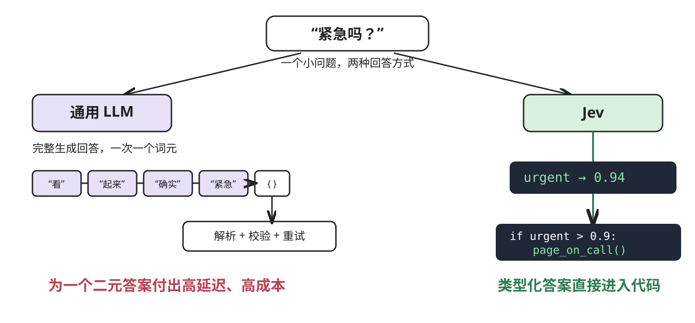
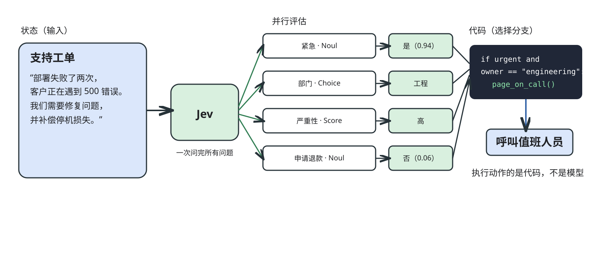
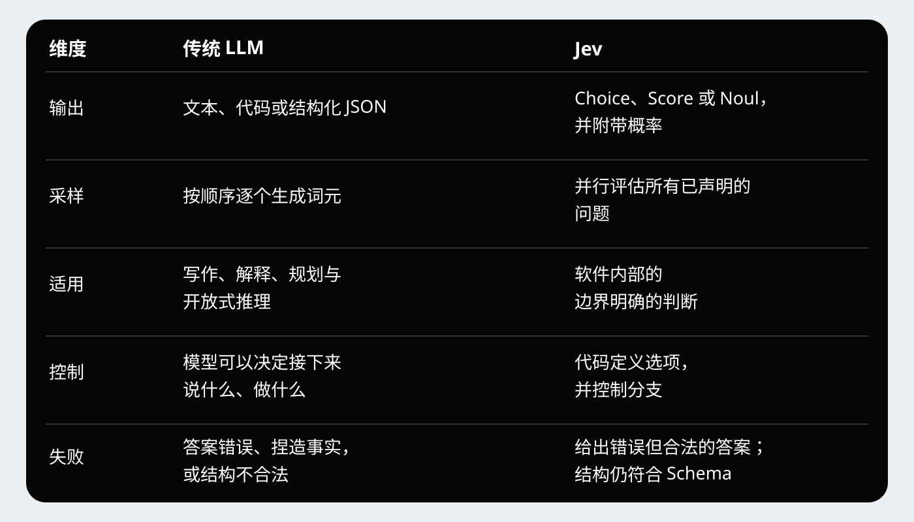
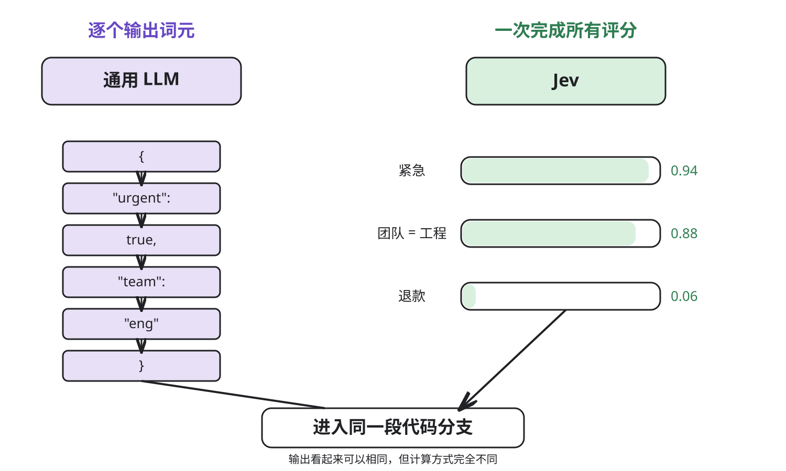
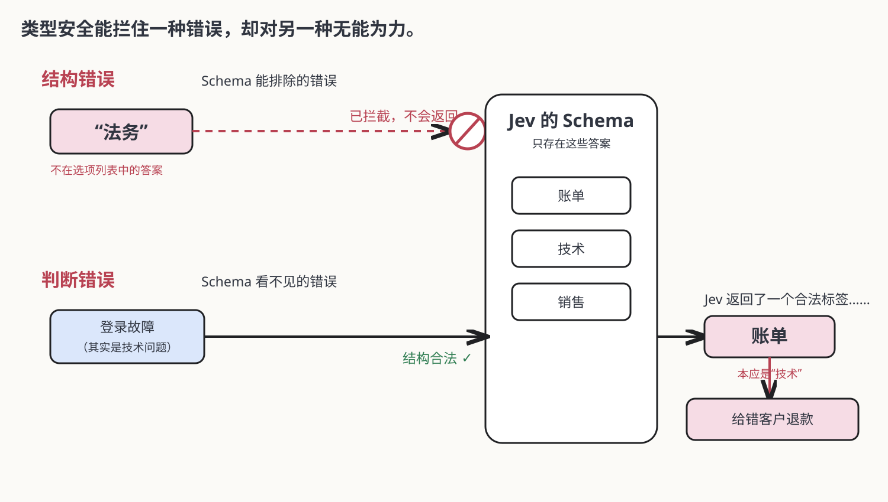
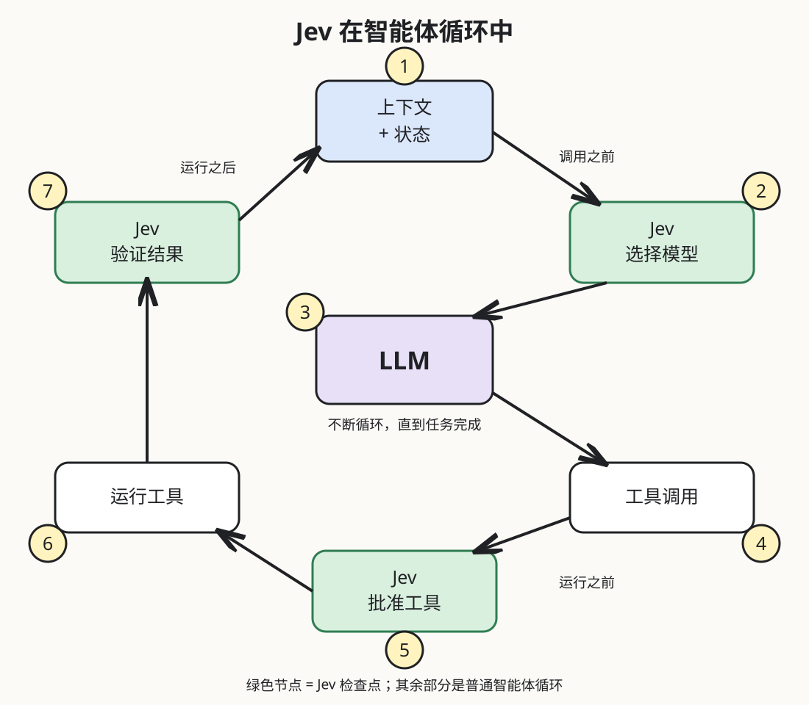
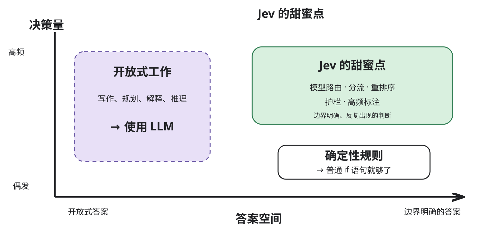
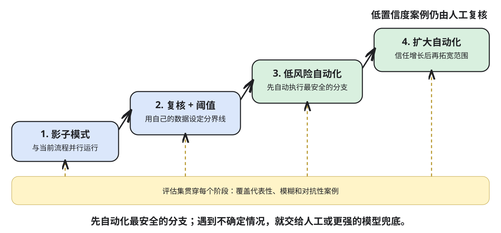

# Jev 详解

> 作者：Akshay 🚀（[@akshay_pachaar](https://x.com/akshay_pachaar)）  
> 原文：[Jev Clearly Explained](https://x.com/akshay_pachaar/status/2101037514945597645)  
> 翻译 Url：[Jev 详解](https://github.com/samz406/local_wenzhang/blob/main/docs/Jev%E8%AF%A6%E8%A7%A3/Jev%E8%AF%A6%E8%A7%A3.md)  
> 发布日期：2026 年 9 月 18 日


我们一直把 LLM 当锤子，恨不得所有 AI 问题都拿它来敲——哪怕只是做个简单判断。Jev 专门处理这类判断，只需几毫秒，成本也低得多。下面就来看看它如何工作，又适合放在哪里。

TypeSafe AI 于 2026 年 9 月 15 日发布 Jev。奇怪的是，这个既不能聊天、不能写代码，也写不出一段有用文字的模型，却激起了异常强烈的反响。

但问题就在这里——这种“做不到”，恰恰是它的卖点。

大多数软件根本不需要再塞进一个聊天机器人。它们真正需要的是做出成千上万个小判断，例如：这张工单紧急吗？该让哪个模型处理这个请求？这条 Shell 命令危险吗？检索出来的这段文字回答了问题吗？

团队往往把每一个判断都交给通用 LLM。模型一次生成一个词元，应用再解析答案、校验格式；一旦结构不对，还得重试。这样当然能用，可如果一道题总共只有五个可能答案，这套流程就显得又慢又贵。

Jev 正是为这些判断而生。TypeSafe 称它为“系统一模型”：输入非结构化状态，输出类型明确的答案与对应概率。

下面我们把这句话拆开讲清楚：Jev 适合什么，又有哪些宣传话术需要稍微冷静看待。



## Jev 首先要解决什么问题

有了工具调用和结构化输出，LLM 与软件系统的连接已经容易了许多。

工具调用让模型能够用可预测的格式请求某个函数；结构化输出则让模型返回符合 Schema 的 JSON。两者都消灭了大量脆弱的文本解析逻辑。

但底层模型依然是生成式的。哪怕答案只有一个词——“账单”——它仍要按顺序一个个生成词元。你要为输入付费，等它完成生成，通常还要为输出再付一笔钱。

再把这一过程放进智能体循环：

```python
while not done:
    action = llm(context)
    result = run_tool(action)
    context += result
```

模型可能要被反复调用：选择工具、判断结果、识别风险、确认任务是否完成、决定下一步该用哪个模型。一次智能体运行里，可能包含许多只需要“判断”、完全不需要生成文字的调用。

Jev 瞄准的就是这些调用。

> 它的核心判断很简单：当代码已经知道所有可能答案时，语言生成就是错误的接口。

## Jev 到底是什么

最简短又准确的说法是：它是一台语义决策引擎。

你需要给 Jev 两样东西：

- **状态（State）**：描述当前情况的文本或 JSON。
- **问题（Questions）**：你希望它针对该状态做出的判断。

每个问题都要事先声明答案的形态。Jev 支持三种基本类型：

- **Choice**：从你给定的选项中选出一个，并返回每个选项的概率。
- **Score**：把输入放到你定义的有序等级上，例如低、中、高。
- **Noul**：回答是非题，返回命题为真的概率。

Noul 是 TypeSafe 为布尔型判断起的名字。名字怪不怪并不重要，重要的是它会输出一个 0 到 1 之间、代码可以直接使用的数字。

```json
{
  "model": "jev-latest",
  "state": "部署失败了两次，客户正在遇到 500 错误。",
  "questions": {
    "urgent": {
      "type": "noul",
      "instructions": "这件事是否需要立刻处理？"
    },
    "owner": {
      "type": "choice",
      "instructions": "应该由哪个团队处理？",
      "criteria": {
        "engineering": "产品故障与服务中断",
        "billing": "收费、账单与退款",
        "sales": "定价与新账户"
      }
    }
  }
}
```

响应里会包含紧急程度的概率，以及三个团队各自的概率分布。没有需要你揣摩的长篇文字，模型也不可能凭空编出第四个团队。

控制权仍握在程序手里：

```python
if urgent > 0.9 and owner == "engineering":
    page_on_call()
elif confidence < 0.6:
    send_to_human_review()
else:
    add_to_queue(owner)
```

这就是为什么人们总说 Jev 像一条“聪明的 switch 语句”。听起来像在贬低它，却恰好抓住了这个设计最有价值的地方：普通代码负责分支，模型只提供普通代码无法可靠计算的模糊判断。



## 它与 LLM 真正重要的区别

传统 LLM 和 Jev 都能给支持工单分类，但它们抵达答案的方式不同，在系统中适合承担的位置也不同。



TypeSafe 称，Jev 会并行评估一次请求里的所有问题。这会改变工作流的设计方式。你不必问完一个问题、等待答案，再决定下一个问题问什么；只要这些问题彼此独立，就可以针对同一份状态一次全部提出，再让代码按需使用答案。

据该公司报告，Jev 的端到端延迟为 70～500 毫秒，每百万输入词元收费 0.042 美元，输出免费。宣传中的最高数字是：相比同类 LLM 工作流，速度快约 200 倍，成本低约 400 倍。

这些惊人的倍数来自 TypeSafe 自己的工作流评测，而且是对比中最有利的一端。更稳妥的做法，是把它们当作上限，而不是对所有应用的承诺。不过，背后的基础优势依然可信：Jev 的目标就是做边界明确的判断，因此不需要冗长的推理轨迹，也不必生成输出文字。



## 概率为什么重要

类型明确的答案只解决了一半问题。

假设 Jev 把一张工单分给了账单团队。被选中的标签告诉你谁赢了，而完整的概率分布则告诉你这场竞争有多接近。

```json
{
  "choice": "billing",
  "probabilities": {
    "billing": 0.52,
    "technical": 0.46,
    "sales": 0.02
  },
  "confidence": 0.18
}
```

如果直接自动转派这张工单，就太鲁莽了。账单虽然赢了，却只险胜。置信度低时，程序应当走另一条分支。

这给开发者带来了一套实用模式：

- **高置信度**：后果轻微时，自动执行。
- **中等置信度**：请求确认，或调用能力更强的模型。
- **低置信度**：转交人工，或先收集更多信息。

阈值应该写在代码里，方便审查和调整。给仪表盘打标签，可以容忍比较弱的预测；要执行删除数据的命令，门槛就必须高得多。

TypeSafe 使用“校准决策强化学习”（Reinforcement Learning for Calibrated Decisions，RLCD）训练 Jev，目标是让置信度与大批预测的实际准确率相符。模型若给一组答案打出 90% 的概率，那么其中大约 90% 就应该是正确的。

## “不会产生幻觉”这句话需要说清楚

TypeSafe 称 Jev 不会产生幻觉。只有采用一种很窄的定义时，这句话才成立。

Jev 无法返回 Schema 之外的选项。如果你只定义了账单、技术和销售，它就不可能凭空造出一个法务标签；你的代码期待标签时，它也不会吐出一段格式错误的文字。

但它完全可能自信地选中一个错误却合法的选项。

类型安全能防止结构无效，却不能保证判断正确。这个区别非常重要，因为一个符合 Schema 的错误，照样可能给错客户退款、把事故分错团队，或批准一条危险命令。

更准确的说法应该是：“Jev 不会破坏已经声明的输出 Schema，但它仍然可能判断错误。”



## Jev 在智能体里应该放在哪里

Jev 最适合与 LLM 配合，而不是把 LLM 换掉。

需要语言生成或深度推理的工作交给 LLM：规划、写作、解释和使用工具。Jev 则处理围绕这些工作的高频判断。

下面三个位置尤其值得考虑。

### 模型路由

一次简单查询，不需要使用和架构评审同等级的模型。Jev 可以给请求评分，然后选择最便宜、同时又最有希望完成任务的模型。

```python
route = jev.choice(
    state=user_request,
    options={
        "fast": "查询、提取和小型局部修改",
        "powerful": "架构、歧义与高风险工作",
    },
)
model = fast_model if route == "fast" else powerful_model
```

路由器并不回答请求，它只决定该由哪个模型来回答。

### 工具风险把关

智能体执行 Shell 命令之前，Jev 可以先把它分类为只读、可逆或破坏性操作。还可以另设几个问题，分别检查它是否会删除文件、改写 Git 历史、触及生产环境，或访问仓库之外的地方。

置信度高的只读操作可以继续；破坏性操作或不确定操作则暂停，等待人工批准。LangChain 的 Jev 集成正是通过中间件采用了这种模式：工具调用执行之前，先过一道检查。

### 验证与监督

测试明明还在失败，智能体却可能声称任务已经完成。Jev 可以查看当前状态，回答一些边界清楚的问题：测试通过了吗？智能体是否在重复同一个动作？输出是否符合政策？这个结果是否应该人工复核？

如果存在确定性测试，它不能取而代之。但当规则依赖语义时，它可以再加一道检查。



## Jev 今天能解决哪些问题

最理想的用例通常具备三个共同点：可能的答案可以事先列出；细心的人可以很快判断输入；这类决策足够频繁，延迟和成本真的会产生影响。

### 支持与运维

- 判断意图、紧急程度、所属部门、垃圾信息和客户挫败感。
- 用几个小检查，为退款和政策例外选择处理路径。
- 在人工查看之前，先按语义严重程度给日志和事故排序。

同一张工单的这些问题，可以放在一次请求里全部提出。然后由代码把答案组合进公司真正的路由政策。

### 搜索与检索

- 按照是否真正回答查询，对检索片段重新排序。
- 检查引文是否支持某项主张。
- 在把上下文发给昂贵的 LLM 之前，过滤无关文本块。

嵌入模型很擅长找到语义相关的文本；Jev 可以进一步做出更窄、更具体的判断：某一段内容对当前问题到底有没有用。

### 质量与安全

- 筛查提示词中的越狱或提示注入。
- 按政策或评分标准检查生成内容。
- 在高风险代码修改或工具调用执行之前发出警报。

这些检查应与确定性控制配合使用。语义分类器适合处理模糊风险；权限、沙箱和测试，则用来执行软件能够精确验证的规则。

### 大规模分类

- 给文档、论文、商品条目或客户消息打标签。
- 把自由文本转成传统机器学习模型可以使用的特征。
- 用同一套标准给大型语料库里的每一项打分。

到了这种规模，低单次调用成本就不再只是跑分表上的数字。过去贵到无法逐行执行的判断，如今可以进入常规数据流水线。

### 实时界面

- 从页面上已知的元素中选择下一步浏览器操作。
- 在用户写作时实时评估语气或清晰度。
- 从结构化的游戏或模拟器状态中选择动作。

目前 Jev 只接受文本，所以这类系统要先把环境转换成文本或 JSON。它不会直接看屏幕，也不能根据像素玩游戏。



## 哪些地方不该用 Jev

只要答案空间不再是已知、封闭的，Jev 的价值就会迅速下降。

- 它不能撰写回复、总结文档、生成代码，也不能解释自己的推理过程。
- 它不擅长算术、计数、日期比较或精确字符串处理。这些操作应该继续留在代码里。
- 如果一个判断需要多步隐性推理，它就容易失手。应把判断拆成更小的问题，或改用推理模型。
- 它不能直接提取未知值。先找出候选值，再让 Jev 从中选择。
- 无关上下文会降低准确率。只发送完成判断所必需的状态。
- 闭源权重、早期访问、仅支持文本，以及独立校准数据有限，都意味着现在还不能盲目信任它。

还有一条更简单的原则：如果确定性代码已经能正确解决问题，就继续用代码。普通 `if` 语句比任何模型都更快、更便宜，也更容易测试。

## 如何使用 Jev，又不引入新的故障模式

模型即使便宜，一旦错误带来重试、人工复核或生产事故，最终仍可能非常昂贵。衡量的是完整工作流，而不只是词元价格。

比较稳妥的上线方式如下：

- 选择一个边界明确、风险较低，而且可能答案清楚的判断。
- 调用模型前就写好评分标准，明确每个选项分别包含什么。
- 收集有代表性的样本及预期答案，其中要包括模糊和对抗性案例。
- 先让 Jev 以影子模式与现有流程并行运行，不允许它改变实际行为。
- 绘制准确率与置信度的关系，并根据自己的数据设定阈值。
- 先自动化最安全的分支；不确定的案例继续交给人工或更强的模型。
- 固定或记录模型版本、问题、标准与阈值，确保每次变更都能在同一套评估集上重放。

问题本身就是程序的一部分。像对待代码一样对待它们：纳入版本管理、接受审查，并在模型或评分标准变化时重新测试。



### 真正的转变

Jev 的有趣之处，不在于它比 LLM 更会写，而在于它拒绝写。

它带来的是一种长得像软件的模型接口：固定的答案类型、明确的不确定性、并行的问题，以及由代码控制的分支。

因此，它适合成为生成式模型的搭档。LLM 负责产出计划、解释或代码；Jev 负责路由请求、拦截危险操作、检查结果，并在不确定性足够高时决定升级处理。

即使未来 Jev 被别的模型取代，这个更大的想法依然重要。多年来，我们一直要求生成式模型通过文本完成各种形式的智能工作。但许多生产系统需要的并不是更多文字，而是一个小而快、普通软件可以安全使用的判断。

Jev 想建立的，正是这样一个类别。

### 从哪里开始

不要一上来就围绕 Jev 重建整个智能体。先找出一个目前依赖缓慢 LLM 调用，或总被正则表达式搞砸的判断。

给 Jev 最少的必要状态，定义所有可能答案，再把它的概率与当前结果一起写进日志。先让它证明自己配得上接管一条分支，再考虑把整套工作流交给它。

最有用的心智模型，仍然是最简单的那一个：普通 `if` 语句看得懂值，却看不懂含义；Jev 就在这里补上一份判断力。

### 资料与延伸阅读

- [TypeSafe AI：系统一模型与 Jev 介绍](https://typesafe.ai/blog/introducing-system-one-models-and-jev)
- [LangChain：用 Jev 构建防护框架](https://www.langchain.com/blog/building-a-harness-with-jev)
- [Flavio Copes：深入理解 Jev](https://flaviocopes.com/jev/)

希望你读得开心。

下一篇见。

祝好！:)
