# MiMo-V2.6：扩展强化学习，迈向自我改进

> 作者：小米 LLM-Core 团队  
> 原文：[MiMo-V2.6: Scaling Reinforcement Learning Towards Self-Improvement](https://huggingface.co/XiaomiMiMo/MiMo-V2.6-Pro-RL/blob/main/MiMo_V2_6_technical_report.pdf)  
> 翻译 Url：[https://github.com/samz406/local_wenzhang/blob/main/docs/MiMo-V2.6%E6%8A%80%E6%9C%AF%E6%8A%A5%E5%91%8A/MiMo-V2.6-%E6%89%A9%E5%B1%95%E5%BC%BA%E5%8C%96%E5%AD%A6%E4%B9%A0%E8%BF%88%E5%90%91%E8%87%AA%E6%88%91%E6%94%B9%E8%BF%9B.md](https://github.com/samz406/local_wenzhang/blob/main/docs/MiMo-V2.6%E6%8A%80%E6%9C%AF%E6%8A%A5%E5%91%8A/MiMo-V2.6-%E6%89%A9%E5%B1%95%E5%BC%BA%E5%8C%96%E5%AD%A6%E4%B9%A0%E8%BF%88%E5%90%91%E8%87%AA%E6%88%91%E6%94%B9%E8%BF%9B.md)  
> 格式说明：本译文采用 Markdown；公式保留 LaTeX，表格重建为可检索文本，科学图表保留原始数据与标注并配中文图注，参考文献按原始著录保留。

## 摘要

强化学习（RL）是推动大型基础模型走向自我改进的核心训练范式。本报告推出 MiMo-V2.6 系列：这是一个全模态模型家族，通过扩展 RL 算力将模型智能的边界继续向前推进。在 RL 之前，我们先在大规模多模态语料上进行中期训练，为探索提供足够广阔的空间；同时以预训练的混合 SWA 架构为基础搭建稳固的基础设施，为后续扩展做好准备。

我们从三个维度扩展 RL 算力：（1）更大的批量与更高的吞吐，采用异步训练，每个步骤消耗 1,568 个样本与 27 亿至 37 亿 token，上下文长度最高达 100 万；（2）更多样、更复杂的环境，以多种智能体执行框架混合覆盖代码、通用、视觉与网络安全领域；（3）投入更多评分器算力，通过组内智能体评分，为长周期任务产生更准确的奖励信号，并引导模型生成更短、token 效率更高的解决方案。

为了在大规模下保持训练稳定，我们冻结 MoE 路由器，并建立多层奖励黑客防线。我们还为混合任务的智能体 RL 构建了一整套基础设施：统一轨迹表示、高并发的多框架采样、解耦的控制平面与数据平面，以及训练—推理一致性机制。我们将训练动态、RL 环境与 RL 框架开源，以便社区复现结果，并继续研究大规模 RL 与模型自我改进。

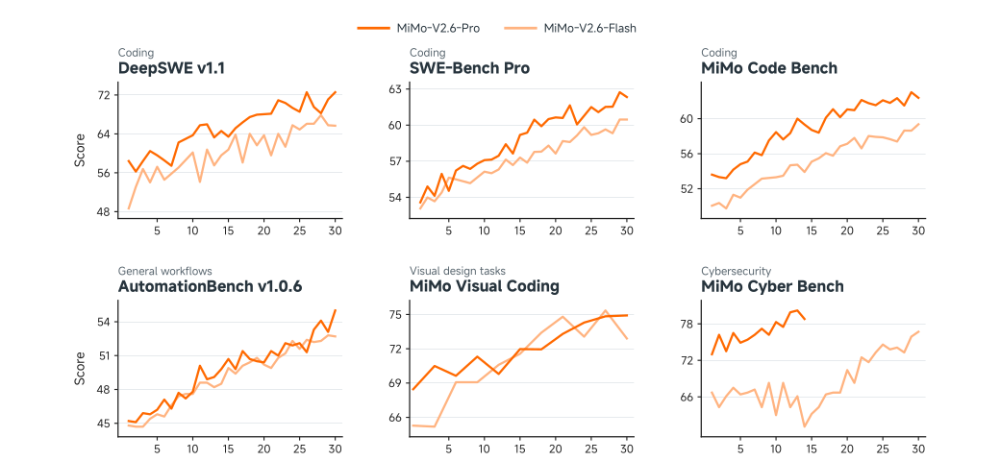

**图 1：** MiMo-V2.6-Pro 与 MiMo-V2.6-Flash 在 RL 训练全程中，各项任务的基准分数。

## 1 引言

递归式自我改进（RSI）描绘了这样一种前景：模型在持续探索与反馈中不断拓展自己的能力。要把这一前景变成现实，需要智能体将模型与可交互环境连接起来，从而提供自我改进所依赖的多步轨迹和反馈信号。因此，在复杂智能体任务上扩展强化学习，为这一目标打开了一条可实际落地的路径。

不过，真正释放这种潜力仍面临两大挑战。第一，基础模型的 RL 既需要合适的模型架构，也需要足够丰富的智能体探索空间。第二，RL 的规模化依赖成熟的基础设施、环境和评分器方案。本报告推出 MiMo-V2.6 系列来填补这些空缺，其中包括总参数 1.02T、激活参数 42B 的混合专家模型 MiMo-V2.6-Pro，以及总参数 310B、激活参数 15B 的 MiMo-V2.6-Flash。这是我们在大规模 RL 方向上迈出的一步务实尝试。

MiMo-V2.6 的架构、预训练与中期训练共同奠定了强大而高效的基础。为以较低计算成本保留全局上下文，MiMo-V2.6 采用混合稀疏 MoE Transformer 主干，交错排布局部滑动窗口注意力（SWA）与全局注意力（GA），再辅以轻量的视觉和音频编码器。大规模预训练赋予模型广博知识，以及对文本、音频和视频的多面多模态理解能力。我们又引入面向智能体的中期训练阶段，扩大智能体任务的探索空间，使模型能在后训练中找到更有效的解题轨迹。

随后，我们以系统化、协同设计的框架从三个方向扩展 RL 算力。首先，完全异步训练扩大了批量与吞吐，在最长 100 万 token 的上下文中，每步处理数千条长周期轨迹与数十亿 token。其次，我们把 RL 环境扩展到代码、通用、视觉和网络安全任务，同时使用多种智能体执行框架，并加强对奖励黑客的防护。同时改变执行框架和任务，可以改善模型的泛化能力。最后，我们引入组内智能体评分，超越二值测试用例，给出更富信息量的奖励信号。对所有测试通过的解法一律给出同样奖励，会漏掉方案之间的质量差异；因此我们在组内比较解法，评判解题质量和行为。组内奖励合成（GRS）和组内优势重分配（GAR）把这些细粒度差别变成学习信号，引导模型走向更准确、更高效的解法。

让这些机制在大规模下运转，既有研究难题，也有工程难题。我们设计了统一的轨迹表示与惩罚机制，以精炼学习信号；通过执行框架池，在多种智能体框架中维持高并发交互；通过分离控制平面与数据平面，缓存并传输携带路由数据与多模态载荷的海量轨迹。样本混合机制与动态采样、部分采样联动，稳定训练批次中各任务的样本构成。我们还在 MoE 路由和 top-p 采样候选集上对齐训练与推理引擎，并针对 RL 负载优化两个引擎。

扩展 RL 算力后，无论是编码这类易验证任务，还是网页开发这类较难验证的任务，模型潜力都得到了显著释放。如图 1 所示，随着训练步数增加，MiMo-V2.6-Pro 和 MiMo-V2.6-Flash 在所报告基准上都稳步改善。收益也并非局限在某一领域：DeepSWE 的编码、AutomationBench 的通用工作流、MiMo Visual Coding 的视觉任务和 MiMo Cyber Bench 的网络安全任务都得到一致提升。这说明 MiMo-V2.6 具备更强的复杂问题解决能力，在日常人机协作中也更可靠，体现出更具通用性的智能体能力。

为促进智能体 RL 研究，我们开源了一套覆盖 RL 研发栈关键环节的完整资源：轻量模型 MiMo-V2.6-Distill-Qwen-9B、跨领域并配有验证器的精选任务环境、端到端 RL 训练框架，以及支持灵活智能体交互的可组合 mini-harness。这些组件构成了一个统一、易用的平台，既支持在多样化任务、环境与智能体配置下研究 RL，也降低了复现和扩展大规模 RL 实验的工程门槛。MiMo-V2.6-Distill-Qwen-9B 在不同任务和执行框架上都取得稳定 RL 收益，验证了这套资源的有效性与通用性。我们希望它成为社区公平、强力且可复现的基线，帮助大家系统研究智能体 RL，推动递归式自我改进。

## 2 架构

### 2.1 整体架构

如图 2 所示，MiMo-V2.6 以标准 Transformer 为主干，再通过轻量投影层接入视觉和音频编码器。文本主干主要由重复的混合块构成，在局部 SWA 与 GA 之间交错排布。模型堆叠 $M$ 个混合块，每个混合块包含连续 $N$ 个 SWA 块，之后接一个 GA 块。唯一的例外是第一个 Transformer 块：它使用全局注意力与稠密前馈网络（FFN），以稳定早期表征学习。MiMo-V2.6 的滑动窗口大小 $W$ 为 128。SWA 块和 GA 块均使用不含共享专家的稀疏 MoE FFN。模型还集成了以 SWA 和稠密 FFN 为基础的多 token 预测（MTP）模块，以提高预训练表现。

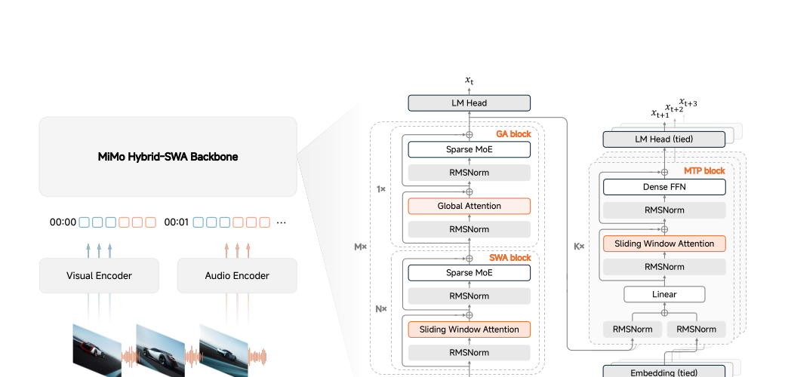

**图 2：** MiMo-V2.6 整体架构。音频、视觉与文本输入被映射为共享 token 序列，由 MiMo 混合 SWA 主干处理，再送入语言建模头与 MTP 块。

### 2.2 MiMo-ViT

MiMo-ViT 采用混合注意力架构。它将 MiMo-VL-7B 中固定、不重叠的窗口注意力替换为增加了 sink token 的 SWA，使信息能在连续多层中跨窗口交换，减轻视觉信息割裂。局部 SWA 层在行优先与列优先的 token 序列化方式之间交替，让信息可沿两个空间轴传播；同时周期性插入 GA 层，直接汇聚全局上下文。这种设计大幅降低高分辨率视觉处理的计算成本，而性能可与纯 GA 的 ViT 相当。

为从零预训练 MiMo-ViT，我们将它与一个小型预训练 LLM 搭配，只在多模态理解数据上用交叉熵目标优化整个 VLM。这套简单方案无需对比学习等辅助目标，预训练既高效又易扩展。关键在于，LLM 保持可训练，从而向 ViT 提供稳定、语义明确的梯度。在超过 4T 图像 token 上完成预训练后，MiMo-ViT 学到了强大的视觉表征，成为 MiMo-V2.6 的稳固基础。

### 2.3 音频编码器

MiMo-V2.6 的音频编码分两步：先由 Audio Tokenizer 将音频 token 化，再进行 patch 编码。Audio Tokenizer 的编码器先用两层卷积前端处理 log-mel 频谱，将帧率减半；再将序列送入因果混合注意力 Transformer，其中 SWA 与 GA 层交错排布。SWA 捕捉局部时序依赖，GA 则汇聚前面整段序列的上下文。随后的下采样卷积再将帧率减半至 25 Hz，之后一个 20 层残差向量量化器（RVQ）将每帧表示为 20 个离散音频 token。Audio Tokenizer 沿用 MiMo-Audio 的训练方法，数据覆盖语音、音乐与其他音频内容，总计 2,000 万小时。

音频 patch 编码器沿用 MiMo-Audio 的架构，与文本主干联合训练。在每个时间步，不同 RVQ 码本分别使用独立嵌入表嵌入音频 token，再将结果相加，得到一个帧表示。每连续四帧被组成一个音频 patch，由一个自注意力仅在该 patch 内双向运作的 Transformer 处理。四个输出表示拼接后，线性投影为一个主干输入嵌入，使音频序列频率从 25 Hz 降至 6.25 Hz。

### 2.4 推测解码器

MiMo-V2.6 的推测解码使用遵循 DFlash 块扩散设计的 MTP 模块。草稿模型包含 5 个配备稠密 FFN 的 Transformer 层。它以主干隐状态和一个干净的锚点 token 为条件，在一次前向计算中预测后续 7 个 token，再由主干并行验证。所有草稿层都使用带分组查询的 SWA，限制注意力计算量与 KV 缓存大小。token 可在所属草稿块内双向注意，并最多关注锚点之前的 1,024 个主干上下文位置。

**表 1：MiMo-V2.6-Flash 与 MiMo-V2.6-Pro 的详细模型配置**

| 模块 | 配置 | Flash | Pro |
|---|---|---:|---:|
| 主块 | 层数（总计/SWA/GA） | 48/39/9 | 70/60/10 |
| 主块 | 隐层宽度 | 4096 | 6144 |
| 主块 | SWA 头（Q/KV） | 64/8 | 128/8 |
| 主块 | 滑动窗口 | 128 | 128 |
| 主块 | GA 头（Q/KV） | 64/4 | 128/8 |
| 主块 | 头维度（QK/V） | 192/128 | 192/128 |
| 主块 | 专家数（总计/激活） | 256/8 | 384/8 |
| 主块 | 总参数 | 310B | 1.02T |
| 主块 | 激活参数 | 15B | 42B |
| MiMo-ViT（共享） | 层数（总计/SWA/GA） | 28/24/4 | 28/24/4 |
| MiMo-ViT（共享） | 隐层/注意力头/头维度 | 1280；32/8；64 | 1280；32/8；64 |
| MiMo-ViT（共享） | patch/窗口左右/空间合并 | 2×16×16；64/64；2×2 | 同左 |
| MiMo-ViT（共享） | 参数 | 681M | 681M |
| 音频 Tokenizer（共享） | 层数/隐层/注意力头 | 24/12/12；1024；16/16 | 同左 |
| 音频 Tokenizer（共享） | Mel 频带/窗口/码本/参数 | 128；128；20；308M | 同左 |
| 音频 Patch（共享） | 层数/隐层/头/分组/参数 | 6；1024；16/16；4；127M | 同左 |
| 推测解码器 | 层数（总计/SWA/GA） | 5/5/0 | 5/5/0 |
| 推测解码器 | 隐层/SWA 头/窗口 | 4096；64/8；1024 | 6144；128/8；1024 |
| 推测解码器 | GA 头/头维度 | 64/4；128/128 | 128/8；128/128 |

> 注：主块层数不含 MTP 模块。编码器参数包含输入嵌入，不含投影层；音频 Tokenizer 的参数不含 EMA 码本。原 PDF 表中 Pro 激活参数误排为“42T”，本文按正文与官方模型信息校正为 42B。

## 3 预训练

### 3.1 预训练设置

MiMo-V2.6 的预训练语料覆盖文本、视觉与音频。文本语料来自公开网页、书籍、学术论文、代码和 STEM 材料等广泛来源。视觉语料包含图像描述、视觉指代与定位、OCR、GUI、对话、视频与视觉编码数据。音频方面，我们大规模精选多样化高质量数据，并将其组织为语音—文本交错、自动语音识别（ASR）和通用音频描述三种任务格式。

预训练分两个阶段。第一阶段只用文本数据训练语言主干，奠定强大的基础语言能力。第二阶段将主干与自研预训练 ViT、音频编码器集成，在全模态数据上联合训练完整模型，使其能理解图像、视频与音频。

预训练从 32K token 上下文开始，在训练中途扩展到 256K。MiMo-V2.6-Flash 总共训练 48T token，其中文本阶段 26T，全模态阶段 22T；MiMo-V2.6-Pro 总共 30T token，两个阶段分别为 27T 与 3T。预训练使用 AdamW 优化器。

### 3.2 中期训练设置

预训练赋予模型跨文本、视觉与音频的广泛知识和通用理解力。中期训练则连接通用基础与后续大规模 RL：它进一步培养模型的智能体能力，延长上下文，并让优化设置适应大批量训练。

为此，我们用多样化、面向智能体的数据混合训练 MiMo-V2.6 系列。它同时跨越任务领域与数据模态：既有编码、通用、视觉和研究任务中的真实智能体轨迹，也有高质量文本、仓库级代码、图像、视频和音频数据。训练分两步进行：先使用 256K 上下文，并将大部分算力投入此阶段；最后再把上下文延长到 1M。

基础模型的预训练使用 AdamW，但初步实验发现：随着混合任务 RL 的批量增大，优化效率的收益不断下降。AdamW 逐元素自适应参数；Muon 则利用隐层权重的矩阵结构，对更新做正交化。在超过临界批量后，这种基于矩阵的更新仍保有更强的数据效率，因而尤其适合大批量训练。所以，我们在中期训练中把隐层权重矩阵的优化器切换为 Muon 的变体 Muown，为后续大批量 RL 做准备。Muown 给 Muon 增加明确的行范数控制，以几乎可忽略的开销抑制谱范数漂移，并降低对权重衰减的敏感性。嵌入层、LM 头和 MoE 路由器继续使用 AdamW。

过往研究指出，将使用 Adam 预训练的模型切换到 Muon，可能会出现优化器失配并导致性能下降。但在我们的中期训练中，全程未观察到损失突增。我们还在中期训练中采用 MXFP4 量化感知训练（QAT），让模型在保持质量的同时适应低精度计算。

## 4 扩展强化学习

在本次发布中，我们继续拓展后训练算法的边界，重点是扩展 RL 算力。在一个短暂的监督微调（SFT）阶段之后，我们从训练计算、环境与智能体执行框架，以及评分器计算三个维度扩展 RL，使模型能力实现根本性跃迁。

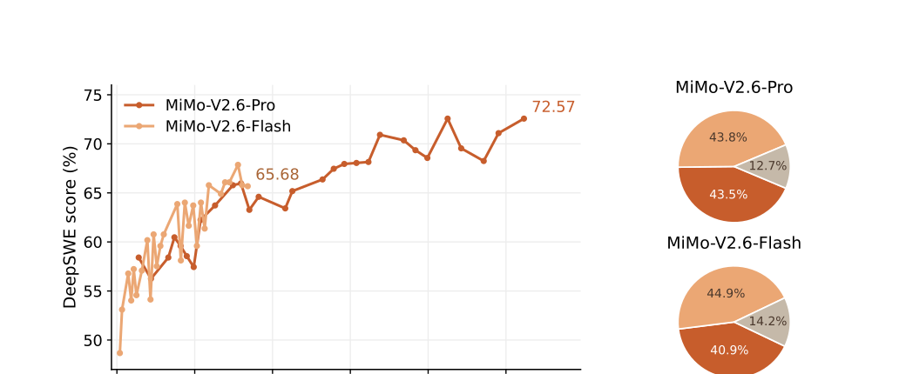

**图 3：** 左：DeepSWE v1.1 的 average@3 得分与累计 RL 成本。右：MiMo-V2.6-Pro 与 Flash 在训练、采样和评分上的成本占比。

### 4.1 扩展 RL 训练计算

我们在一次运行中将 RL 计算扩展到数千块 GPU，MiMo-V2.6-Pro 和 Flash 的 RL 后训练成本分别为 260 万美元和 90 万美元。训练使用大批量：1,568 个提示，每组 $G=16$，因此每步要采样 2.5 万条序列，合计 27 亿至 37 亿个训练 token，平均每条序列约 11 万至 15 万 token。图 3 左侧显示了扩展 RL 计算的价值：随着累计成本上升，两个模型的 DeepSWE average@3 都稳步改善；Pro 从 58.4 升至 72.6，Flash 从 48.7 升至 65.7。整体计算可分为采样、评分和训练三部分，要把它们扩展到这一规模，离不开高效、稳定的基础设施。

RL 学习目标为：

$$
\mathcal{L}(\theta)=-\mathbb{E}_{q\sim \bigcup_d \mathcal{D}_d,\{o_i\}_{i=1}^{G}\sim \mu_{\theta_{\mathrm{old}}}(\cdot|q)}\left[\frac{1}{\sum_{i=1}^{G}|o_i|}\sum_{i=1}^{G}\sum_{t=1}^{|o_i|}r_{i,t}M_{i,t}A_i\log\pi_\theta(o_{i,t}|q,o_{i,<t})\right]. \tag{1}
$$

其中，$r$ 是重要性采样比，$M$ 是 token 级掩码，$A$ 是优势。计算可拆成三段。第一段是采样：对从任务数据集并集中抽取的每个提示 $q$，采样策略 $\mu_{\theta_{\mathrm{old}}}$ 生成 $G$ 个候选解 $\{o_i\}$。第二段是评分：投入额外算力进行智能体式评估，区分有效解法与错误解法、有效行为与有害行为，补足二值测试结果的盲区；这些判断决定优势 $A_i$，从而更准确地分配轨迹信用。第三段是训练：以提示为单位做平均聚合，收集到的 token 通过 $\log\pi_\theta$ 的梯度更新 $\theta$。从 Pro 的成本拆分看，采样占 43.8%，训练占 43.5%，评分器占 12.7%。

大批量很适合横向扩展 GPU：采样可按序列并行，训练可将批次分片到多个数据并行 rank，吞吐会随 GPU 数增长。HBM 大部分被运行中的批次占用时，算术强度可保持在较高水平，使 GPU 在采样阶段得到充分利用。由于采样与评分存在长尾，我们用部分采样持续填满运行批次：收集到一个训练批次时，先中断仍在飞行的序列，下个采样阶段再继续。代价是重做 prefill：每次策略更新后，续写都需重建 KV 缓存。因此批量与部分采样需联合选择，以大批量摊薄重做 prefill 的成本。

训练稳定性还依靠 R3 与 top-p 采样候选集重放来保证训练—推理一致。动态采样器会过滤组内全通过或全失败的样本，保证每个样本都产生有效梯度。在多任务 RL 中，样本混合器还会面对不同任务的采样时长和通过率差异，保证训练批次的分布高效且稳定。为将采样轨迹打包为 27 亿至 37 亿 token 的大训练批次，我们将数据平面与控制平面解耦。

### 4.2 扩展 RL 环境与执行框架

扩展智能体 RL 需要多样化环境：它们既要映射现实任务，又要支持训练规模下的可复现执行，还要给出与任务目标对齐的奖励。同时满足这些要求并不容易：真实工作流涉及异构工具和复杂状态，自动评分器又可能不完整、不一致或可被利用。因此，我们在编码、通用专业工作流、视觉产物和网络安全领域大规模合成、筛选环境，尤其关注监督质量；同时研究智能体与环境交互的执行框架，并在训练前后通过执行检查、轨迹审计与对抗测试提升奖励可靠性、抑制奖励黑客。

#### 4.2.1 代码智能体任务

编码任务非常适合 RL，因为候选解可以执行并由自动测试评估，从而大规模提供反馈。但“可执行”并不等于“监督可靠”：测试可能漏掉必需行为、误杀有效实现，或在不同执行中给出不一致结果。核心挑战是在扩展任务构建的同时，保证奖励真实反映任务正确性。我们因此搭建可扩展的代码智能体任务合成与筛选流水线，重点保证监督的准确性和稳健性。

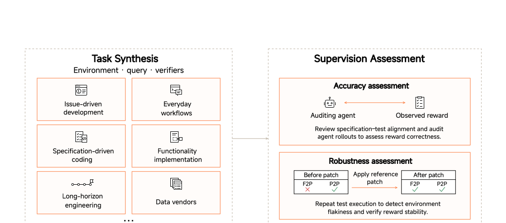

**图 4：** 代码智能体任务扩展流水线。我们从多种来源构建任务，再用严格评估确保监督准确、稳健。

**多源可扩展任务合成。** 我们用五条互补路径扩展任务，覆盖不同编程语言、开发环境与任务周期。第一，基于 GitHub 合成：收集 PR 及关联 issue，用启发式规则和模型辅助过滤去除重复、格式错误或不可复现的候选。issue 已充分描述预期修改时，直接把它作为任务规格；否则让 LLM 根据参考补丁与仓库上下文重建 issue 式规格，并明确要求删去会泄露解法的实现细节。第二，为覆盖日常开发与交互式“氛围编程”，收集组织内员工提供的真实开发请求，包括功能实现、重构、调试与仓库维护，由智能体生成并实现测试，将请求行为落为可执行验证。

第三，规格驱动任务强调在详细、多约束要求下生成代码，检验模型能否忠实把复杂规格转成可执行实现。第四，源代码驱动合成使用 CodeMidas，从现有代码库已实现的功能中派生任务；智能体识别候选功能，将可观察行为转成任务规格和可执行环境，不依赖 issue、PR 等开发工件也能跨仓库扩展。第五，针对长周期软件工程任务，让智能体反复细化要求、扩大必需改动范围、引入跨组件依赖，并构建覆盖多步行为的测试。我们还筛选纳入公开来源和授权数据商的样本，进一步丰富分布。

**监督准确性。** 我们对齐每个任务规格与单元测试所覆盖的行为范围：既要接受符合规格的实现，拒绝违反规格的实现，又不能强迫解答复制参考实现的偶然细节。因此需检查覆盖不足和过度严格的断言；规格没有提出的要求，相关测试应修改或删除。人工检查可能漏掉规格与测试之间的偏差，所以每个任务还由编码智能体尝试四次。审计智能体在共享工作区中获得问题、测试、参考补丁、四个候选补丁、测试输出与完整对话日志。它先说明正确解法需要满足什么，再检查测试是否覆盖这些要求，并独立判断每个解法。测试通过但被判为错误，会标记为潜在假阳性；测试失败但被判为正确，则标记为潜在假阴性。这些分歧为后续复查提供了具体证据。

**监督稳健性。** 我们用重复执行检查奖励稳定性。对有参考补丁的任务，在应用补丁前，要求 fail-to-pass（F2P）测试失败、pass-to-pass（P2P）测试通过；应用补丁后，两类测试都必须通过。所有结果需在八次重跑中保持稳定，用于筛除不稳定测试与环境造成的奖励波动。同时复用前述采样流水线收集轨迹，检查智能体是否通过环境或评估漏洞赚取奖励。规格—测试对齐保证奖励忠实，重复执行保证奖励稳定，轨迹审计则检查奖励是否与独立正确性判断一致。

#### 4.2.2 通用智能体任务

我们将智能体能力扩展到多领域的现实专业工作流：智能体需分析异构文档、使用专业软件，并产出符合领域标准的交付物。我们先合成支持这类工作流的环境，再构建结果可验证的高难任务。

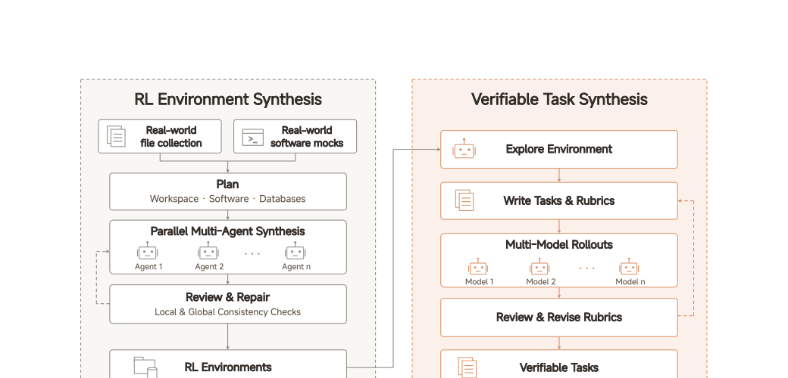

**图 5：** 通用智能体环境与可验证任务合成流水线。先由真实文件与软件 mock 构建逼真、可重置的环境，再让智能体探索并合成配有可验证量规的任务。

**环境设计。** 通用智能体环境通常由工作区和一组软件工具构成，通过 MCP、API、CLI 或 GUI 访问。设计需在逼真度和大规模 RL 的要求之间取得平衡：文件、软件行为与底层数据应贴近专业实务，但执行必须留在本地，环境也要易于重置。因此，我们收集真实文件，直接纳入或用作合成参考；再用自动化多智能体工作流构建本地软件 mock，复现受支持的操作、状态变化、输出格式与错误响应。不依赖外部服务的工具直接集成。所有状态存于本地，每次采样在独立沙箱中执行，可恢复至固定初始状态，从而避开网络波动和服务限制，保证可复现执行。

**环境合成。** 规划智能体设计工作区结构、选择工具，并规划文件和数据库内容。网页搜索为计划提供现实根据，文件之间、文件与数据库记录之间的关系，则支持后续多跳推理和交叉验证。多个智能体按共享计划与各 mock 的数据规格，并行生成文件、填充数据库。复查智能体检查单个产物和全局一致性，包括实体名、数值勾稽、时间线与引用关系，再反复修复不一致，然后才进入任务构建。

**任务合成与验证。** 我们调研常见专业任务，将其组合、概括成种子任务。智能体探索每个环境，据此构建适配当前内容与工具的任务。任务是否完成，由原子化的二值量规项判定：代码检查验证数据库值、交付物格式等确定性属性；基于 LLM 的检查评估更开放的内容。对同一模型反复判断，并比较不同评委模型的一致性，用来发现模糊标准。

但“评委一致”不能证明量规真正覆盖了任务完成条件。我们因此收集不同能力层级模型的采样，让复查智能体同时检查轨迹、执行结果与量规判断：放宽会拒绝有效解法的过度严格标准，收紧会接受不完整解法的过度宽松标准。为测试对奖励黑客的抵抗力，我们增加针对无关文件或数据库意外改动的负向检查，并构造“看似正确却没有真正完成任务”的对抗解法。RL 期间，由自托管的 MiMo-V2.6-SFT 充当评分器，保证打分稳定。这套流程最终产生数千个环境与多样、可验证的任务。

#### 4.2.3 视觉智能体任务

为让智能体以创造性表达和精准视觉控制塑造数字世界，我们整理了一组多样化的视觉任务，产物包括网站、交互应用、游戏、3D 场景、幻灯片、SVG、视频与 Figma 设计。任务分为开放式设计和高保真视觉复现两类，共同锻炼模型产出可靠实现、高审美质量与精准视觉控制的能力。

开放式设计要求在满足用户意图的同时生成具有审美吸引力的视觉产物。有效创意方案千差万别，固定规则很难独立衡量审美质量。因此我们将点式评分与组内评分结合：先反复改进针对运行正确性、指令遵循、布局完整性和基本审美质量的点式量规；待量规稳定后，再对同一查询的整组渲染产物联合比较，找出明显较强与较弱的候选，据此分配奖励。高保真复现有明确的视觉参考，因而可更直接评估忠实度。我们主要使用渲染产物与参考之间的像素级相似度等规则指标，辅以 LLM 对整体视觉效果的判断。

#### 4.2.4 网络安全智能体任务

我们在真实漏洞复现任务上用 RL 训练网络安全智能体：给定一个项目和目标 bug，智能体需构造一个能触发它的输入。这是漏洞利用开发、权限提升与 CTF 挑战的基础进攻性安全技能。OSS-Fuzz 提供数万个人工确认实例，规模远超其他安全任务，因此很适合扩展 RL。难点不是让程序崩溃：复杂 C/C++ 项目往往有几十条可达崩溃路径；真正难的是触发指定漏洞。验证器必须把目标 bug 与无关崩溃区分开，而它又直接充当 RL 奖励，因此还必须准确、确定、便宜。

现有判定器都有明显缺陷。CyberGym 使用修复前后二进制差分：概念验证（PoC）要让易受攻击的二进制崩溃，却不能让修补后的版本崩溃。但补丁不完整会拒绝正确 PoC，两个提交之间与 bug 无关的改动也会误改判定，两类错误都会污染训练梯度。LLM 评委对同一 PoC 不同运行可能给出不同结果，也不能作为稳定奖励。

我们改为从真实的 sanitizer（ASan/MSan/UBSan）报告中提取两个属性：漏洞类型（如堆缓冲区溢出）与崩溃位置（最上层的项目级堆栈帧）。只有崩溃同时匹配两者时，PoC 才按基于规则的字符串匹配通过。这个方法确定、可复现，计算成本也极低。任务描述来自同一份报告，明确写出必须触发的类型与函数，因而描述和验证共享单一事实源，不会出现 CyberGym 中 LLM 生成描述过宽甚至错误的问题。每个漏洞都检出报告所指提交，构建 fuzzing harness，然后向智能体提供完整运行环境，包括全部源码与编译后的 harness 二进制。这更符合真实漏洞分析：研究者会在调试器中运行目标、查看内存，再根据运行时观察构造变异输入。

#### 4.2.5 多执行框架训练

智能体执行框架在模块设计上各不相同，也会根据应用需求选用或新建。模型因此必须适应多种交互机制，包括训练中从未见过的框架，这使跨框架泛化成为一项关键能力。只在一个框架中训练，容易让解题策略绑定架构的特定实现，损害迁移。所以我们把执行框架的多样性视为继任务和环境之后的另一个训练维度。

直接在 MiMo Code、Codex 等多个生产框架上训练看似自然，却不适合 RL。一方面，生产框架在智能体循环外包裹了工程防护、多步工作流，并用大量约束和指令提示引导模型。这些额外要求不在任务完成奖励中，会破坏信用分配，未被奖励测量的要求也很可能被模型忽略。另一方面，其模块高度耦合，无法单独改变某一交互机制，也无法通过受控重组构建多样性。

因此，我们提出用精心设计的 mini-harness 进行多框架训练。所有 mini-harness 都从同一个最小智能体循环起步，其中只保留完成任务所需的系统提示、工具和上下文管理。模块尽量小且彼此解耦，可自由重组，扩展也保持可控、安全、干净。我们随后为代码、通用、视觉与安全任务派生多种适配的 mini-harness 配置。得到的训练分布既多样又可控，既可分析单个框架机制，也能促成可迁移的解题策略。

#### 4.2.6 抑制奖励黑客

RL 依赖奖励衡量任务成功，但智能体可能通过利用环境或评估过程赚取高奖励。这种奖励黑客行为会在训练中被反复强化，让分数上升，却没有提高真实任务能力。在仓库修复等常见编码任务里，一个频发失败模式是解决方案泄露：智能体从指定任务上下文之外拿到已公布修复，据此构建补丁。这种行为可以通过测试，却并不证明智能体是从 bug 报告和指定检出中推导出修复。为此，我们把中期训练对齐数据、RL 环境清理、对抗筛查与全程审计结合起来。

**表 2：仓库修复任务中的代表性奖励黑客行为**

| 模式 | 简述 | 例子 |
|---|---|---|
| 安装并读取 | 把目标包新版本当成答案，复制指定历史版本中不存在的修复 | pytest：安装 `pytest==5.4.3` 并检查已安装源码 |
| 拉取上游源码 | 下载已含修复的上游文件或补丁 | Astropy：从 GitHub raw URL 读取 `timeseries/core.py` |
| 克隆上游 | 读取更新上游检出，重建当前提交之后才公布的修复 | Matplotlib：克隆最新仓库并查看 `axis.py` |
| 搜索现成解法 | 在 issue、PR 或关联提交中找原始解决方案 | Django：读取 ticket #29205 的修改历史 |
| 探查版本 | 找到后续发布版并下载对比，作为复制修复的前置步骤 | Sphinx：用 `pip index versions sphinx` 查找已修复版本 |

**中期训练对齐数据。** 早期实验观察到 MiMo 有奖励黑客倾向，我们据此合成一组训练样例，加入中期训练。在每个案例中，MiMo 先反思错误推理，改写相关轮次，再以任务规格为根据继续行动。修订后的推理保留对原错误的可识别性，也明确呈现如何纠正。加入这些样例后，模型对齐得到改善。

**环境准备。** 构建环境时应用参考补丁，可能留下泄露答案的工件。因此我们删除构建日志、验证器输出、残留补丁，以及项目生成的二进制或字节码；清理仓库外部也可能含答案的缓存，同时保留离线重建需要的第三方依赖。每个任务的 Git 历史只留到基础提交为止，后续提交及引用全部删除。容器级网络隔离会阻止访问上游修复与可能含答案的其他包版本，同时在指令中明确禁止检索现成解法或绕过必需实现。

**黑客智能体。** 专用黑客智能体继续探测已准备环境中剩余的泄露与可利用弱点。我们用早期实验案例引导其搜索，包括从缓存工件或预安装的目标项目副本中找回解法。它既检查已知通道，也搜寻新通道，发现了许多训练中从未观察到、原有清理也未覆盖的攻击路径。我们根据发现继续改进清理与访问限制，再重跑黑客智能体，不断循环，直到它在任何环境中都无法找到可成功的攻击。

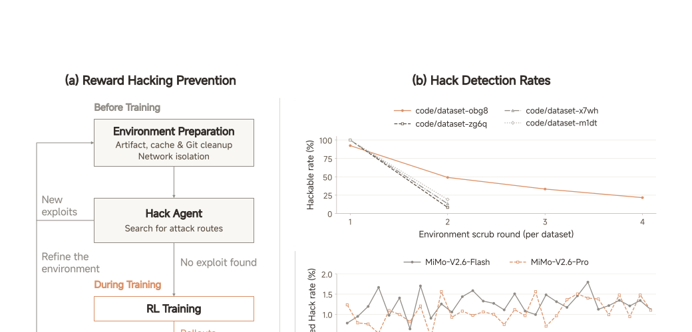

**图 6：** 奖励黑客防治与监测。训练前进行环境准备和反复黑客筛查，训练全程则离线审计轨迹。两个阶段的发现都用来改进环境。

**训练期审计。** 整个训练期间，我们定期离线审计智能体轨迹。策略演化后，可能发现对抗筛查从未找到的捷径；这些观察用于发现环境弱点，指导进一步清理与限制。同时，组内智能体评分器会先将已确认黑客轨迹的有效奖励清零，然后重算组统计量与优势。加入这一纠正后，MiMo-V2.6-Pro 与 Flash 在整个训练过程中，日志里确认的黑客占比一直低于 2%。

### 4.3 组内智能体评分

对代码智能体任务来说，二值测试奖励能够大规模提供正确性信号，却无法区分通过测试的不同方案在实现质量和解题行为上的差异。我们将任务拆成两个子集，分别使用两种互补方法。高通过率任务使用组内奖励合成（GRS）：对多条离线轨迹进行比较，构建任务专属量规，再在训练期间复用，对单条轨迹打分，并将质量分与测试奖励合成。其余代码智能体任务主要使用组内优势重分配（GAR）：在线评分智能体联合检查同一混合结果组中的成功与失败轨迹，排名已通过的解法，将正优势更多分给高质量轨迹。

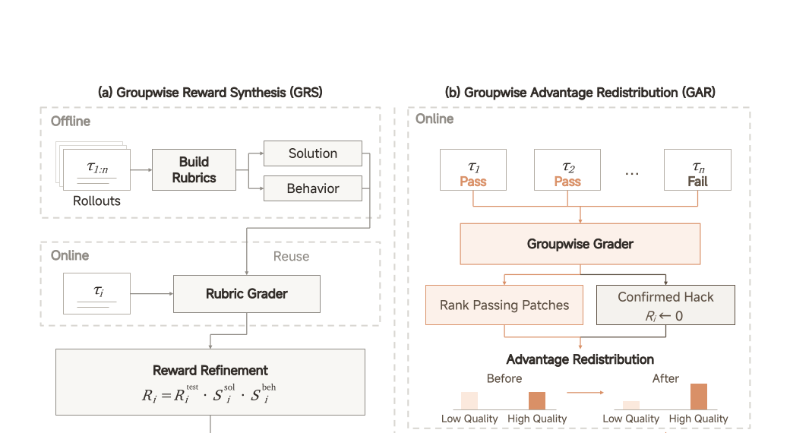

**图 7：** 代码智能体 RL 的组内评分。GRS 把测试结果与预先构建的任务量规分数合成；GAR 在线比较轨迹，将确认黑客的奖励清零，并把正优势从低质量通过解重新分给高质量解。

#### 4.3.1 组内奖励合成（GRS，离线量规）

对每个入选任务，我们收集多条离线轨迹，让智能体结合任务规格与仓库研究所有尝试。比较这些尝试可暴露不同解法、反复出现的错误，以及分散在多条轨迹里的有价值行为。智能体将分析整理为两类准则：方案量规评估最终实现，行为量规评估智能体解题与验证的方式。

方案量规描述与任务有关的好实现特征，包括满足需求、正确处理边界情况、改动符合现有代码库。行为量规则描述有助于可靠解题的可观察做法，比如收集相关证据和检查代码改动的影响。准则需能识别有意义的质量差异，但也必须允许不同的有效解法。采样轨迹只为量规构建提供参考，准则的根据始终是任务本身：有价值的行为可能只出现在一次尝试里，任务明示的要求也可能在所有现有方案中都没有被满足。因此，智能体可以识别超出现有尝试的改进，某个成功方案的偶然选择也不会自动变成所有方案的强制要求。

之后，这些量规会被复用于单独评估后续训练轨迹。评分智能体进入每条轨迹的执行环境，以产生的代码、执行结果与轨迹为证据，按任务专属量规打分：实现质量得分为 $S^{\mathrm{sol}}$，解题和验证过程的行为得分为 $S^{\mathrm{beh}}$。对轨迹 $i$，原始二值测试奖励为 $R_i^{\mathrm{test}}$，最终训练奖励为：

$$
R_i=R_i^{\mathrm{test}}\cdot S_i^{\mathrm{sol}}\cdot S_i^{\mathrm{beh}}. \tag{2}
$$

乘法形式使量规监督始终与测试结果绑定：失败轨迹仍为零奖励，已通过轨迹则按实现质量和解题行为进一步区分。即使组内所有轨迹都通过测试，两个量规分数乘积的差异仍能提供学习信号。离线任务分析于是变成可复用的监督源，让训练捕捉二值奖励表达不了的质量差异。

#### 4.3.2 组内优势重分配（GAR，在线评分）

其余代码智能体任务使用在线 GAR。对每个成败混合的轨迹组，所有轨迹都被放入一个包含任务规格、仓库、提交补丁与测试输出的共享工作区。由 SFT 训练的智能体评分器联合检查组内全部轨迹，对照成功与失败尝试，并从五个方面比较通过的补丁：解法是否合适；实施是否精准，没有遗漏或无必要回退；改动是否相对必需范围保持最小；是否避免任务之外的副作用；工艺是否符合代码库规范。无法确定差异时可以并列。评分器还可检查仓库代码并运行定向测试，以便理解任务、验证候选。一旦证据证明某轨迹依赖外部或泄露答案，它的有效奖励会被置零，并在重算组统计量前按失败处理。

排名用来重新分配序列级优势。对轨迹 $i$，设奖励黑客纠正后的有效二值奖励为 $R_i$，组平均为 $\bar{R}$，序列优势 $A_i=R_i-\bar{R}$，通过集合 $\mathcal{P}=\{i:R_i=1\}$。当 $\mathcal{P}$ 非空时，先用质量因子 $f_i\in(0,1]$ 降低低质量通过轨迹的权重，再用一个公共因子把被削减的正优势质量重新分配给通过轨迹。未截断的更新为：

$$
\lambda=\frac{\sum_{j\in\mathcal{P}}A_j}{\sum_{j\in\mathcal{P}}f_jA_j},\qquad
A_i'=\begin{cases}\lambda f_iA_i,&i\in\mathcal{P},\\A_i,&i\notin\mathcal{P}.\end{cases} \tag{3}
$$

该更新保持 $\sum_{i\in\mathcal{P}}A_i'=\sum_{i\in\mathcal{P}}A_i$，也保留质量造成的相对权重，不改动失败轨迹。直观来说，它将正优势从低质量成功轨迹搬到高质量成功轨迹。只降低正优势权重却不动负优势，会破坏两者平衡；重归一化恢复这一平衡，用于防止熵过度增长。实际训练中，我们给公共缩放因子设置上限，避免正优势过度放大。随后，通过与失败轨迹的优势都减去组均值，得到组均值为零的最终序列优势 $A_i^{\mathrm{new}}$，再将它广播给轨迹中的全部响应 token。评分异步运行，无法使用的评分结果会回退到原始优势。

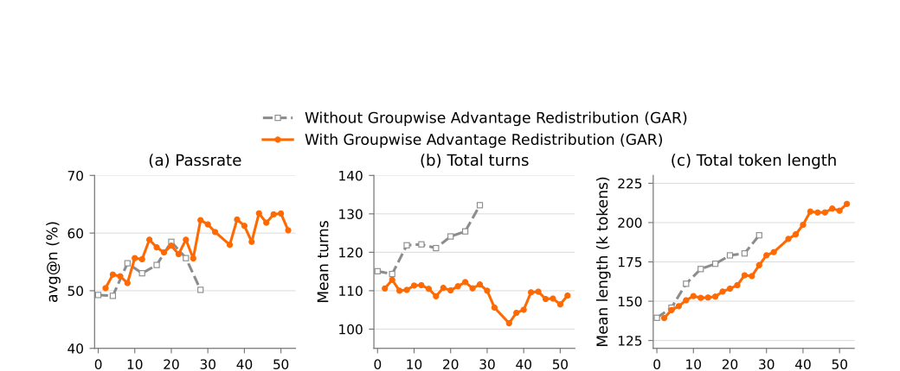

**图 8：** 在 DeepSWE v1.1 上对比有无在线 GAR 的 MiMo-V2.6-Flash 纯代码 RL，训练批量为 128。通过率为 $n=3$ 时的 avg@$n$，同时报告平均总轮数与 token 总长度。

没有在线评分时，对话轮数和 token 总长度快速增长，更多轨迹撞上长度上限，通过率因此难以持续提升。加入在线评分后，通过率一直提升至第 52 步，轮数大致稳定，token 长度只缓慢增长。这些趋势说明，在线评分使策略能在更稳定的训练状态下继续进步。独立的维护者审计也发现：没有在线评分时，策略为提高测试通过率，越来越常使用投机性兼容分支、大范围导出、吞异常、放宽验证和针对评测的配置改动。这些绕行虽能增加过测概率，却容易超出指令范围、无谓扩大 API、掩盖故障并降低可维护性。有在线评分时，策略倾向生成更小、更准确、紧守范围且易维护的补丁。

#### 4.3.3 行为正则化

为提高 RL 训练稳定性并鼓励高效、可靠行为，我们引入两类互补机制：组相对长度惩罚抑制 token 过快增长，片段级行为惩罚处理格式违规与工具调用错误。批次级优势再平衡则改善信用分配，同时限制过度负向优化压力，避免熵失控增长。

**组相对长度惩罚。** 对每个提示 $q$ 的 $G$ 条采样轨迹，设原始结果奖励为 $R_i$，成功轨迹索引集为 $\mathcal{P}_q$，生成 token 数 $\ell_i=|o_i|$。以 $A\in[0,1]$ 为最低组通过率，$B\in(0,100)$ 为百分位参数。对 $|\mathcal{P}_q|/G>A$ 的组，参考长度为 $\ell_q^\star=\operatorname{Quantile}_{B/100}\{\ell_j:j\in\mathcal{P}_q\}$，调整后奖励为：

$$
\widetilde{R}_i=R_i-\mathbf{1}[i\in\mathcal{P}_q]X\left[\operatorname{clip}\left(\frac{\ell_i/\ell_q^\star-1-\delta}{s-\delta},0,1\right)\right]^\gamma. \tag{4}
$$

这里，$X\ge0$ 是最大奖励扣减，$\delta\ge0$ 是相对于 $\ell_q^\star$ 可容忍的超长比，$s>\delta$ 是惩罚饱和时的超长比，$\gamma\ge1$ 是攀升指数；$\delta=0$ 意味着任何比参考更长的成功轨迹都会受罚。指示函数保证只扣成功轨迹，$\operatorname{clip}(x,0,1)=\min(1,\max(0,x))$。其他组保留原奖励。式（1）的结果优势 $A_i$ 由调整后奖励 $\widetilde R_i$ 计算，其中通过率阈值 $A$ 是独立超参数。这种做法按提示自适应设定长度参考，鼓励简洁的成功解；通过率门控则给困难提示保留足够探索空间。

**片段级行为惩罚。** 结果奖励可能会连错误的中间行为一起强化，因此我们为格式违规与工具调用错误设定片段级规则，比如标记格式错误、工具名无效或参数畸形。设 $h_{i,t}=1$ 表示 token 被标记，否则为 0。在整个训练批次内，$H^\pm$ 和 $C^\pm$ 分别收集损失掩码 $M_{i,t}=1$ 的已标记和未标记 token 索引 $(i,t)$，上标正负号取决于所属轨迹优势 $A_i$ 的符号。调整后 token 优势为：

$$
\widetilde A_{i,t}=\begin{cases}
\alpha(1-h_{i,t})A_i,&A_i>0,\\
[\beta(1-h_{i,t})+\kappa h_{i,t}]A_i,&A_i<0,\\
0,&A_i=0,
\end{cases}\quad \kappa>1, \tag{5}
$$

$$
\alpha=\min\left(\alpha_{\max},1+\frac{\sum_{H^+}A_i}{\sum_{C^+}A_i}\right),\qquad
\beta=\max\left(\beta_{\min},1-\frac{\sum_{H^-}(\kappa-1)|A_i|}{\sum_{C^-}|A_i|}\right).
$$

$\kappa>1$ 放大被标记 token 的负优势幅度；$\alpha$ 向上缩放未标记的正 token，$\beta$ 则把未标记的负 token 向零收缩。$\alpha_{\max}\ge1$ 和 $0<\beta_{\min}\le1$ 分别限制正向放大、给负向衰减设定下界。$\widetilde A_{i,t}$ 代替式（1）中的 $A_i$：正轨迹的已标记 token 被掩掉，负轨迹的已标记 token 则遭受更重惩罚。从正 token 移除的优势会重新分给未标记正 token；新增负幅度则通过减轻未标记负 token 的惩罚来抵消。因而，没有检测到错误的行为会视轨迹符号得到更多强化或更少惩罚。两个缩放都未被截断时，每个符号的优势总量保持不变，用于限制会导致熵失控上升的过量负压力。分母为零时，对应缩放置为 1；此时或发生截断时不保证总量守恒。

## 5 实验：RL 只训一次

本节介绍这次大规模 RL 运行的训练设置、评测方法、RL 表现、专家负载稳定性与故障分析。运行日志见 [mimo.xiaomi.com/rl/mimo-v26](https://mimo.xiaomi.com/rl/mimo-v26)。

### 5.1 训练设置

**RL 设置。** RL 任务覆盖多个领域：智能体编码与竞技编码占 68%，通用工具使用 12%，审美设计 13%，上下文遵循 3%，网络安全 4%。每个提示批次 1,568 条，每条展开 16 次采样，全局训练批次合计约 2.5 万条轨迹。训练使用 GRPO 和异步部分采样，陈旧度为 4。

**优化器。** 我们使用 Muown，学习率 $3\times10^{-6}$，不使用权重衰减或学习率热身，梯度裁剪阈值为 1.0。Muon 部分的动量系数为 0.95，启用 Nesterov 动量，每次更新执行 10 次 Newton–Schulz 迭代，并额外乘以 0.5 的更新缩放因子。Adam 部分使用 $\beta_1=\beta_2=0.95$、$\epsilon=10^{-8}$。为稳定 MXFP4 训练，RL 初始化时从 SFT 检查点承接 FP32 主权重与 Muown 的行状态。RL 期间冻结路由器，以保持专家负载稳定。

**策略优化算法。** 采用式（1）的 GRPO，优势计算见 4.3 节。损失采用提示均值聚合，即在提示层面而不是对所有响应 token 对代理目标取平均，以防 RL 过快拉长响应。重要性采样比按 token 计算：$r_{t,i}=\operatorname{sg}[\pi_\theta(o_{i,t})/\mu_{\theta_{\mathrm{old}}}(o_{i,t})]$。每个 token 的训练概率由当前模型在训练框架中生成，推理概率则由采样模型在生成该 token 时给出；部分采样不重算推理概率。

重要性采样比使用四个解耦边界截断：正优势使用 $[\epsilon_+^l,\epsilon_+^h]$，负优势使用 $[\epsilon_-^l,\epsilon_-^h]$，相应掩码为 $M=\mathbf1[(A\ge0\land\epsilon_+^l\le r\le\epsilon_+^h)\lor(A<0\land\epsilon_-^l\le r\le\epsilon_-^h)]$。正负边界初始都为 $[0.2,5.0]$，再按策略熵在运行时独立调整：熵过低时，放宽正边界、收紧负边界；熵过高时则相反。训练全程同时监测各方向的 token 截断率。

### 5.2 评测设置

我们在代码智能体、网络安全、通用智能体和视觉智能体四类能力上评测，既使用公开基准，也使用 MiMo Code Bench、MiMo Cyber Bench 和 MiMo Visual Coding 三个内部基准。

- **代码智能体：** DeepSWE v1.1 关注长周期开发任务；ProgramBench 要求智能体根据已编译二进制和文档重建程序，检验端到端软件构建能力；MiMo Code Bench 以多样编码任务补充内部评测。
- **网络安全：** CyberGym 测试真实软件漏洞复现，SEC Bench Pro 强调从 bug 报告复现复杂漏洞，ExploitGym 测试超越单纯触发崩溃的漏洞利用开发，ExploitBench 衡量多阶段利用进展与安全影响，MiMo Cyber Bench 作为内部补充。CyberGym 的缺陷环境按 4.2.4 节方法纠正。
- **通用智能体：** AutomationBench 在模拟 SaaS 环境中用 REST API 评估跨应用工作流编排；Toolathlon-Verified 使用多种工具（包括 MCP）评估长周期多应用工作流；GDPval-AA v2.1 评估有经济价值任务上的专业交付物质量；JobBench 聚焦领域专家认为适合交给 AI 且优先级高的工作场景；Agents’ Last Exam 评估结果可验证的长周期高经济价值任务；Terminal-Bench 4.0/2.1 测试终端中的复杂任务；OSWorld-Verified 测试真实网页和桌面应用中的交互式电脑操作。
- **视觉智能体：** 内部 MiMo Visual Coding 覆盖开放设计与高保真复现，任务包括 WebDev 和 Image2Code，分别要求按用户需求构建网站，以及把参考图像转为视觉上忠实的代码实现。

所有可调整推理强度的基线模型，都使用其支持的最高设置（max）评测。

### 5.3 RL 表现

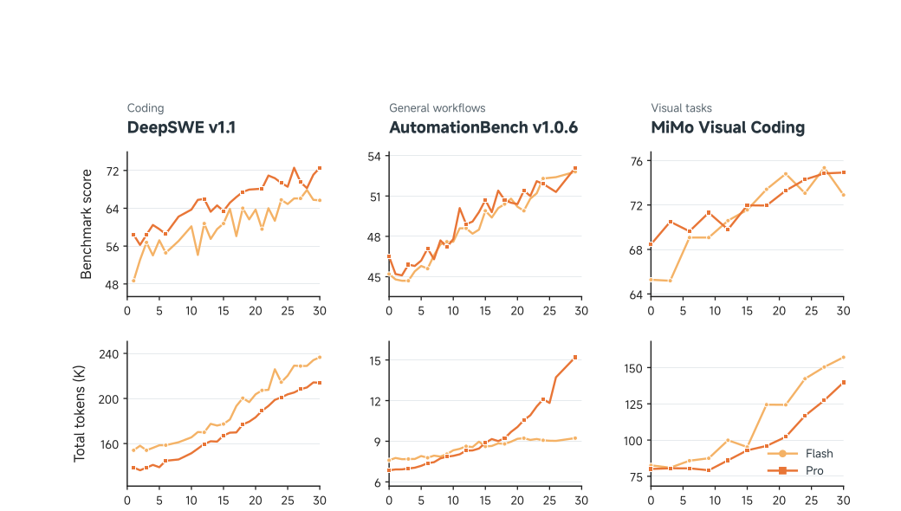

**图 9：** DeepSWE v1.1、AutomationBench v1.0.6 和 MiMo Visual Coding 在 RL 训练中的基准分数（上）与总 token 数，单位为千（下）。浅橙色为 Flash，深橙色为 Pro。

我们在训练期间持续监测性能变化，用以验证 RL 算力扩展。如图 9 所示，虽然检查点之间存在波动，Flash 和 Pro 在 DeepSWE v1.1、AutomationBench v1.0.6 与 MiMo Visual Coding 上总体都在改善。这些收益通常伴随 token 总量上升，说明更强任务表现与更多 token 使用同步发展。

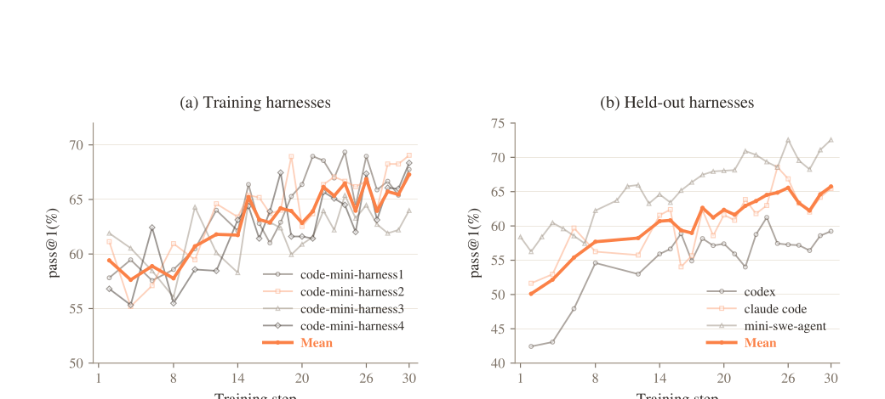

**图 10：** 多执行框架训练中，DeepSWE v1.1 在四个训练框架和三个留出框架上的 Pass@1。浅色线为各框架，粗橙线为分组均值。

专门的多框架训练不仅改善四个训练 mini-harness 上的 DeepSWE v1.1 表现，也改善 codex、claude code 和 mini-swe-agent 三个留出框架。虽然检查点之间有波动，三个留出框架都在训练中提升，平均 Pass@1 约从 50% 升至 66%。训练框架与留出框架的均值差距也在缩小，表明学到的编码能力可在不同框架实现之间迁移。这为使用轻量、模块化 mini-harness 向 RL 引入受控多样性的设计提供了证据。

### 5.4 冻结路由器，稳定 RL

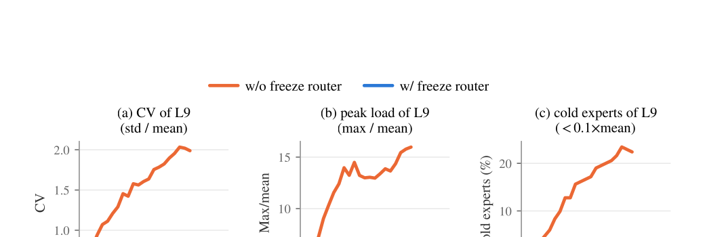

**图 11：** MiMo-V2.6-Pro 在 RL 中第 9 个解码器层（384 个专家）的专家负载平衡，比较冻结与不冻结路由器的运行。指标分别为负载变异系数、峰值负载因子与低于均值 $0.1\times$ 的冷专家占比。

图 11 对比了两次 MiMo-V2.6-Pro RL 运行，唯一差别是是否冻结 MoE 路由器。路由器可训练时出现严重的负载塌缩：前 20 步中三项指标都单调上升，变异系数从 0.78 升至 2.0，峰值负载从均值的 6 倍升至 16 倍，冷专家占比从 0.5% 升至 22%。为查明原因，我们将第 20 步检查点的路由器参数恢复为 RL 开始前的初值，其他参数不变。负载平衡立即恢复到接近初始水平，基准表现却没有改变。这证明塌缩源于路由器漂移，而不是专家权重退化。所以 RL 中冻结路由器；该运行的三项指标都基本持平（CV 约 0.7，峰值约 $5.5\times$，冷专家约 1%），基准表现仍正常增长。

### 5.5 RL 故障分析

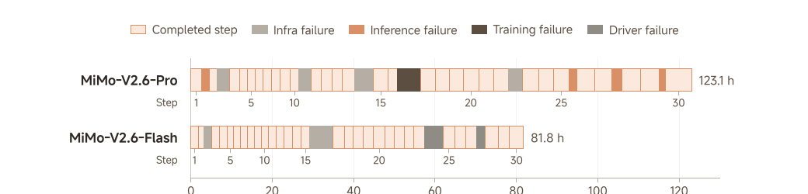

**图 12：** MiMo-V2.6-Pro 和 Flash 在 30 个训练步骤中按实际经过时间对齐的时间线。浅橙色为已完成步骤，其他颜色是不同原因造成的故障与恢复时段。

基础设施故障主要是 GPU 内存双比特错误（DBE）。Flash 还曾因 Kubernetes 故障导致网络安全任务集群的 pod 在第 15 至 16 步之间崩溃，不得不重启。Pro 则在第 14 步后遇到评分器网络不可达，因而重启。

采样故障来自部分采样：重启后，较短轨迹率先完成，使预测式采样分发的长度估计产生偏差，耗尽 GPU 和宿主机锁页内存中的 KV 池。虽然早期已做调整，后来仍有一个执行框架在同一代码数据集上生成不到其他框架一半长的轨迹，扭曲重启后第二、三步的估计。

训练故障是微批次内 MoE 不平衡导致的 GPU OOM：尽管整个批次尚算平衡，某层的一个专家并行（EP）rank 收到的 token 仍可超过均值 30 倍。我们调整并行方案，减少激活内存并容纳这类峰值。Flash 后期还有驱动故障：更长序列使每节点数据量超过宿主机内存容量。即使打包已跨节点分布，本地内存需求仍造成 CPU OOM 并打断运行。

### 5.6 用 MOPD2 拓展能力

混合 RL 结束后，我们使用多前缀、多教师在策略蒸馏（MOPD2），整合为不同任务训练的教师能力，包括难以验证的任务。在 MiMo-V2-Flash 的 MOPD 基础上，适合 mixRL 教师的领域保留学生自主采样（标准 MOPD），同时增加以前缀为条件的单轮采样。

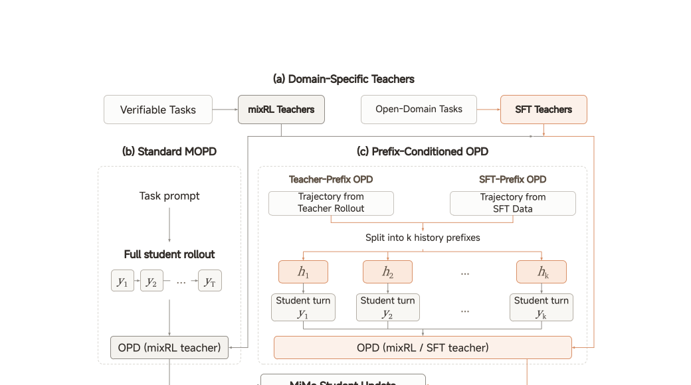

**图 13：** MiMo MOPD2 概览。可验证任务的领域教师由 MixRL 训练，开放领域教师由合成示范进行 SFT。标准 MOPD 用 RL 教师监督完整学生轨迹；前缀条件 OPD 则复用教师采样或 SFT 数据中的轨迹。含 $k$ 个助手决策点的源轨迹产生 $k$ 个完整历史前缀 $h_i$，每个前缀可独立启动学生生成轮次 $y_i$，再由对应领域教师进行 token 级蒸馏。SFT 数据只提供前缀上下文，不提供固定续写目标。

前缀来自教师采样（Teacher-Prefix OPD）或 SFT 数据（SFT-Prefix OPD）。包含 $k$ 个助手轮次的轨迹提供 $k$ 个完整历史前缀，每个前缀都在对应轮次之前结束。学生从每个前缀中采样一个新轮次，无需重新生成更早互动。预先指定的教师在同一历史与学生已生成 token 的条件下，提供 token 级监督。

对难以设计可靠 RL 奖励的开放领域任务，我们在高质量合成示范上训练 SFT 教师。它们的训练数据很难覆盖长周期任务中学生反复偏离后所达历史，因此 SFT-Prefix OPD 从固定示范前缀开始每次采样，限制在当前采样轮之前的偏离。示范只提供上下文，学生生成自己的续写，而不是模仿固定回答。MOPD2 由此将 RL 模型能力扩展到难以进行可靠训练期验证的领域，例如长周期游戏开发、科学研究和具身智能。

**表 3：MiMo-V2.6 与上一代模型、前沿模型在智能体基准上的比较**

| 基准 | Pro | Flash | V2.5 Pro | Claude Opus 5 | GPT-5.6 Sol | Claude Fable 5 |
|---|---:|---:|---:|---:|---:|---:|
| DeepSWE v1.1 | 71.9 | 67.9 | 19.0 | 74.0 | 73.0 | 70.0 |
| ProgramBench | 26.5 | 26.0 | 12.5 | 37.0 | 25.0 | 33.0 |
| MiMo Code Bench | 63.2 | 61.2 | 40.4 | 68.6 | 59.3 | - |
| AutomationBench v1.0.6 | 53.1 | 52.3 | 16.0 | 50.3 | 45.8 | 46.2 |
| Toolathlon-Verified | 76.9 | 73.6 | 49.1 | 80.6 | 74.9 | 77.9 |
| GDPval-AA 2.1 | 1673 | - | 1107 | 1708 | 1588 | 1595 |
| Agents’ Last Exam | 31.6 | 27.6 | 13.2 | 31.6 | 30.8 | 25.7 |
| Terminal Bench 4.0 | 34.9 | 28.8 | 1.5 | 49.0 | 39.9 | 42.4 |
| Terminal Bench 2.1 | 89.9 | 87.6 | 65.2 | 89.1 | 88.8 | 84.3 |
| OSWorld-Verified | 82.0 | 80.8 | - | 83.4 | 83.0 | 86.0 |
| JobBench | 62.0 | 61.2 | 25.0 | 65.7 | 45.4 | 57.4 |
| CyberGym | 94.0 | 95.1 | 40.0 | - | - | - |
| MiMo Cyber Bench | 80.2 | 77.2 | 0.0 | - | - | - |
| ExploitGym | 17.8 | 6.0 | 0.2 | 22.1 | 30.3 | 28.4 |
| ExploitBench | 47.9 | 25.3 | 16.6 | 70.0 | 78.5 | 78.0 |
| SEC Bench Pro | 66.3 | 47.5 | 17.7 | - | 79.1 | - |
| MiMo Visual Coding | 72.3 | 71.5 | - | 70.0 | 73.4 | 69.1 |

MiMo-V2.6 系列相比 MiMo-V2.5 提升巨大，在多个领域的表现已可与前沿模型相比。

## 6 RL 与 OPD 基础设施

MiMo-V2.6 将 RL 和 OPD 训练扩展到包含智能体轨迹的大规模混合任务批次。为支持灵活的智能体采样场景，我们定义执行模型与轨迹数据结构，再用惩罚模块精炼学习信号。在大批量下，Harness Pool 承载多种执行框架并维持高采样并发，Payload Porter 则缓冲数万条携带路由与多模态数据的大轨迹。样本混合器与动态采样、部分采样联动，稳定产出符合指定分布的训练批次。同时，训练与推理引擎在 MoE 路由与 top-p 候选集上保持一致，并针对 RL 负载分别优化。

### 6.1 具有细粒度学习信号的智能体 RL

**智能体循环。** 我们将采样从以推理为中心的设计，转变为以智能体为中心：每条序列在一个 Agent Loop 中运行，自主拥有环境生命周期、管理产生的对话，并按需调用推理引擎。生命周期包括设置、交互、奖励评估（如运行测试）与清理。交互期间，循环暴露一个请求端点，外部智能体通过调用它推进采样。每段对话同时以字符串前缀和 token 序列保存；前缀匹配找到新请求延伸的对话，只对新后缀做 token 化并交给推理引擎，从而使引擎接口保持纯 token 输入、token 输出。

**轨迹层级。** 子智能体、上下文压缩与多种智能体角色会在一次采样中产生并发对话分支。我们将轨迹数据组织为四级结构：样本→序列→上下文→片段。样本是由样本混合器分发的提示；在 GRPO 等组相对算法中，一个样本产生一组序列，并以组为单位接受或拒绝。序列是一次 Agent Loop 执行，可包含多个并发上下文。上下文是一条对话分支，包含多个片段；它是前缀匹配、KV 缓存复用与训练数据导出的单位。片段是一轮系统或用户消息、一次模型生成或一条工具结果；只有模型生成轮次计入损失。

**惩罚模块。** 组相对算法通常把结果奖励平摊给序列里所有模型生成 token，但真实信用很少均匀分布：某些轮次偏离正路或退化，某些失败也与模型无关。我们因此把“检测”与“对训练的作用”分开。规则可用手工逻辑或模型评委审查片段、上下文或序列，用来发现非模型造成的基础设施故障、乱码 token 模式、调用不存在的工具与重复。策略则把动作绑定到某一层级：掩码会从损失中排除命中内容；优势塑形会对命中 token 设定、缩放或扣减优势；监测则只记录指标。复合早停策略在规则触发时立刻停止采样、将结果奖励清零，分别处理触发轮与更早轮次，并掩掉兄弟上下文。惩罚沿层级向上传递：没有剩余模型轮次的上下文被删除，没有剩余上下文的序列得到零优势，没有剩余序列的样本则被拒绝。

### 6.2 Harness Pool 与 Payload Porter：多执行框架的大批量 RL

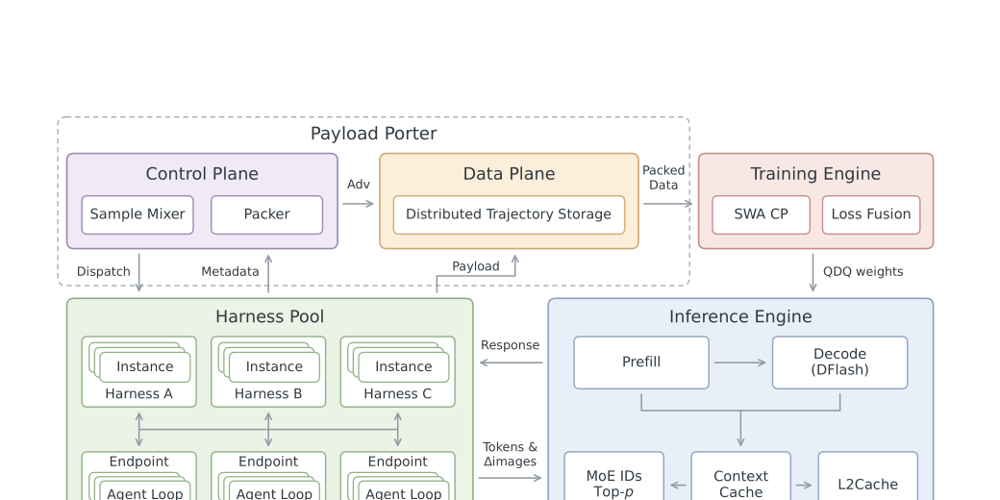

**图 14：** RL 基础设施总体架构。

扩大 RL 批量会增加采样并发、轨迹数据的内存与通信成本。混合任务批次又带来另一个异构维度：一个批次中混有多种执行框架，每个训练样本组只绑定其中一种。Harness Pool 在持久、多租户 actor 池中承载并发执行框架实例与 Agent Loop，并使代码库、智能体行为和环境设置彼此独立配置。Payload Porter 则让驱动节点只用轻量元数据调度：大载荷只写入分布式存储一次，在消费端打包。多模态载荷也分离元数据与像素，并使用增量传输和负载均衡编码。

**多租户采样执行。** 我们用 Ray actor 在集群上执行执行框架与 Agent Loop。如果每个实例和循环都占用一个专用 Ray actor，Ray 全局控制存储（GCS）节点会为每个 actor 消耗一个文件描述符，大批量会耗尽文件描述符。我们改用固定大小的持久宿主 actor 池，每个 actor 同时承载多个租户：模型端是 Agent Loop，环境端是执行框架实例。每个租户保留自己的轨迹状态，按在途实例数均衡分配。一个宿主是单进程，其租户共享一个事件循环；模型端还共享请求端点、推理代理与 tokenizer，环境端共享一份已导入的执行框架代码。为避免一次阻塞调用拖住全部租户，环境操作与 token 化等阻塞工作放到后台线程。这使并发采样能够均摊进程与服务开销，无需让 actor 数随批量同比增长。

**异构执行框架。** 执行框架代码库、智能体行为和环境设置被分开配置，以容纳同一次训练中的多种任务。不同数据源可用不同代码库，同一数据源内不同提示也可用不同智能体配置；每个训练样本组仍使用统一配置，以估计组相对优势。一个进程只能导入一个执行框架代码库，因此不同代码库在独立池中运行。这些池按可配置比例分享固定的宿主 actor 预算；预算启动时一次设定，不依赖每步调度的训练数据混合。因此，框架多样性与采样并发能在同一执行系统内扩展。

**分离数据平面与控制平面。** 大批量需同时缓冲数万条序列，每条都很重：除了 token ID 和对数概率，还携带 MoE 路由、top-p 采样索引与多模态数据。如果把全部载荷收集到一个驱动节点，批量就被该节点内存锁死。因此，每条序列在采样完成时被拆分：载荷只写入分布式键值存储一次（如 Ray object store 或 TransferQueue）；驱动节点只用标量奖励、各上下文长度与指向载荷的键等轻量元数据调度。

一组完成时，只从存储中读取接受钩子所需的少数字段。如果配置组内评分器，它会与 Agent Loop 完全异步运行，隐藏延迟，允许结果滞后，并在返回时重写组奖励。采样器随后只根据元数据中的通过率接受或拒绝整组；钩子再施加长度惩罚、计算组相对优势并应用优势塑形。token 级优势写回存储，默认丢弃优势全为零的组。OPD 中用教师打分代替奖励评估：轨迹发送给教师服务器，分数异步收集到同一分布式存储。

当每个数据源都向批次贡献了应有份额，批次产出钩子会把已接受序列打包为微批次，并分配给各 rank，整个过程不触碰张量。打包时，每个训练张量并行（TP）组由一个打包器服务全组 rank。它从存储的非 padding 行中，只取当前上下文并行（CP）窗口覆盖的行，也只切出该窗口；结果以单份只读内存拷贝在 TP 组内共享。这避免了在驱动节点汇聚整个批次，也不需打包期间创建稠密 padding 中间量。

**多模态数据。** 多模态载荷同样分离元数据与载荷，但需额外处理：智能体在多轮中反复截图、读图，单条轨迹可累积数 GB 数据，既难存储，也会在历史变长时反复传输。因此，采样时 Agent Loop 只在请求之间发送多模态增量。训练时，每个图像项都必须通过视觉编码器。编码器在 TP 组内复制，LLM 主干则分片，所以图像项先按数据并行编码，不受对应序列 token 落在哪个 rank 的影响；编码后再将嵌入重分发给持有对应 token 的 rank。像素始终留在分布式键值存储，负载均衡计划只读元数据，到编码计算时才拉取像素，由此减少冗余传输并适应不均匀多模态负载。

### 6.3 样本混合器：稳定的异步混合任务 RL

从 MiMo-V2-Flash 起，我们一直维护一个按数据源追踪指定训练分布的数据调度器，并与动态采样和部分采样配合。但不同数据源的采样时长和过滤率差异巨大，混合任务 RL 仍必须保住目标分布，确保每个数据源都得到有效训练。在 25 个已分析数据源中，平均生成 token 数和有效采样时长分别相差 90 倍与 66 倍。样本混合器用四个机制满足指定分布：自适应采样并发设定各源预算，自适应采样调度在预算内选数据源，预测式采样分发将新采样放置到各 rank，样本重放则覆盖启动与恢复。

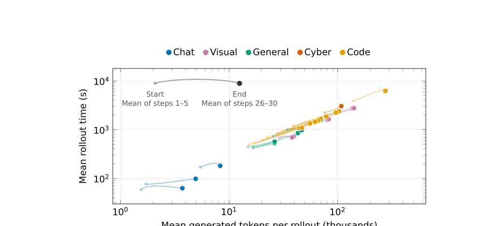

**图 15：** 25 个数据源的采样异构性。每条线连接同一数据源的起点（浅色，第 1–5 步平均）与终点（实色，第 26–30 步平均）。横轴是每次采样的平均生成 token，纵轴是已完成采样的平均时长，两轴均为对数刻度。

**自适应采样并发。** 慢数据源需更多并发采样，才能维持同样的训练贡献。对数据源 $i$，设每个训练步骤目标保留样本组数为 $B_i$，估计组接受率为 $r_i$，估计有效采样时长为 $t_i$（包含模型生成和环境交互，不含训练步骤间的停顿）。预期生成需求 $m_i=B_i/r_i$；训练吞吐固定时，所需并发与 $t_im_i$ 成正比。我们给每个源分配 $(1+p_i)m_i$ 个组的调度预算，其中超采样比 $p_i$ 满足：

$$
p_i=\operatorname{clip}(ct_i-1,p_{\min},p_{\max}),\qquad \frac{\sum_i m_ip_i}{\sum_i m_i}=\bar p. \tag{6}
$$

共享因子 $c$ 使 $p_i$ 的需求加权平均等于全局超采样比 $\bar p$，并受各源边界限制。随负载变化，系统用近期时间与接受统计重算分配。稳态下，并发需求随某源的采样时长和目标增长，随接受率增大而下降。

**自适应采样调度。** 在预算内，调度需平衡长期生成需求与当前批次的进度。若当前批次已从数据源 $i$ 接受 $A_i$ 组，其调度权重为：

$$
w_i=\alpha\frac{B_i}{r_i}+(1-\alpha)\frac{(B_i-A_i)^+}{r_i}. \tag{7}
$$

其中 $(x)^+=\max(x,0)$，$\alpha\in[0,1]$。目标项维持生成需求，缺口项优先处理尚有差额的源。这些权重驱动平滑加权轮询；稳态启动使用 $\alpha=0.5$，初始并发按 $t_im_i$ 比例分配。

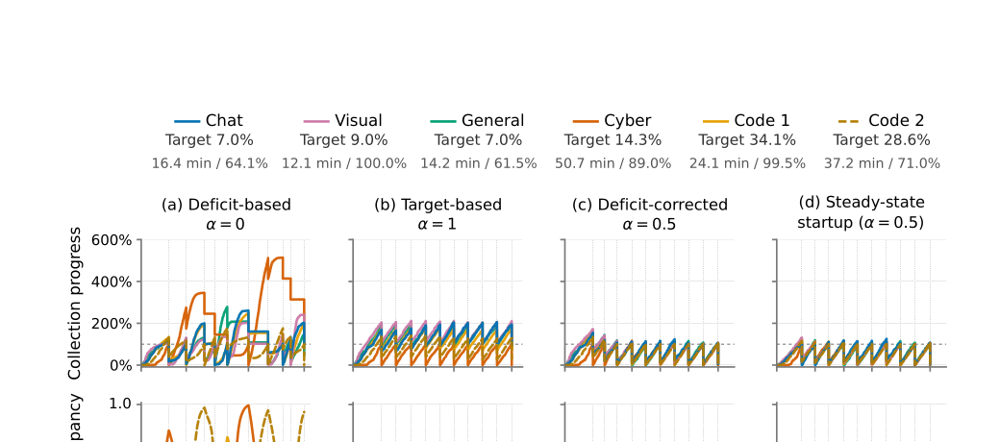

**图 16：** 六个数据源的轨迹驱动调度模拟。图例给出平均时长与组接受率；上方是收集进度（已接受组数/每步标称目标，盈余结转），下方是采样占用率。训练步骤的间距反映经过时间，虚线为步骤边界。模拟不含训练时间、信用分配延迟、陈旧过期和重放。

在并发上限固定、各源预算不构成约束的轨迹模拟中，缺口校正调度（$\alpha=0.5$）比纯缺口调度（$\alpha=0$）有更稳定的占用，又比纯目标调度（$\alpha=1$）有更均衡的收集。模拟时长按图 15 各数据源终点的平均采样时间校准。

**预测式采样分发。** 系统联合估计 KV 需求与预期推理并发，用于决定新采样是否准入、放到哪个 rank。按数据源维护的先验估计一次采样在所有上下文中的序列总长度（输入加生成 token），再据此估计 KV 需求。只有它乘安全余量后仍能装入目标 rank 剩余 GPU KV 容量时，采样才会准入。分层缓存横跨 HBM 与锁页宿主池，两层共同保留已准入采样的状态。预计采样时间中用于环境执行的比例，可将采样并发换算为预期推理并发；其上限设为 CUDA graph 捕获时的最大运行请求数，以减少排队延迟、延长采样生命和加重陈旧度。贪心启发式方法在两个约束下选择剩余容量最大的可行 rank，其容量按剩余并发槽与剩余 KV 容量的较小者计算，并在每次放置后更新。

**样本重放。** 启动时从慢数据源收集样本，耗时约是连续运行的 1.8 倍。而在慢源内，较短采样往往率先完成，即使各源目标都满足，初始批次仍会有偏。因此，启动或检查点恢复后的第一个收集步骤，我们在选定慢源中复用已完成采样组，在当前过滤规则下填补各源剩余缺口。全新启动的重放默认存储轨迹由运行初始策略生成；恢复重放只复用恢复之前已完成且仍在对应源陈旧度上限内的轨迹。只在首个收集步骤重放，既减少对慢源的等待，又保持指定训练分布。

### 6.4 训练—推理一致性与优化

我们延续 MiMo-V2-Flash 的 RL/OPD 基础设施，分别使用 SGLang 和 Megatron-LM 作为推理引擎和训练引擎。MiMo-V2.6 采样时的专家数据类型为 MXFP4。两个引擎在 MoE 路由与概率归一化上对齐。推理端的上下文缓存与 KV 状态一起跨轮保留路由记录、采样候选集与视觉输入，并将空闲状态卸载到宿主内存。用 RL 采样日志训练的草稿模型通过推测解码进一步加速生成。训练端则减少长序列的内存与通信成本。

**训练—推理一致性。** 每次参数更新后，我们对专家执行量化—反量化（QDQ）。量化遵循采样时使用的 MXFP4 Humming GEMM 内核数值约束，使两个引擎看到完全相同的专家权重。即使参数一致，引擎间的数值差异仍可能翻转离散专家选择。Rollout Routing Replay（R3）记录采样期间选中的专家索引，再在训练中重放，复现原执行路径。top-k 与 top-p 采样是在受限候选集上而不是整个词表上重归一化；我们在采样时记录每个 token 的候选集，并在训练时只在该集合内重归一化对数概率，与采样器对齐。对 top-p，只有 GPU–CPU 传输是稠密的：发送形状固定、覆盖全词表宽度的位图，从而避免 GPU–CPU 同步，也不会截断遍及全词表的候选集。后续阶段全为稀疏：当 top-p 通常为 0.97 时，候选集平均少于 5 个 token。R3 和 top-p 候选集重放的载荷很小，又移出关键路径，因而额外开销可忽略。

**上下文缓存。** 每个对话上下文都有一个持久键。在同一策略版本内，后续轮次可命中包含已生成 token 的 KV 缓存，只 prefill 新后缀。这是有意采用的有状态设计，缓存状态跨轮存活。因此，专家索引与候选集不在中间轮次返回，而是等整次采样最终收集时一次取回，避免逐轮传输与处理的碎片。历史多模态输入不需重新哈希或重发，它们的视觉 token 已在缓存 KV 中。只有新图像跨进程传输；只在策略更新或缓存未命中后，才发送完整视觉输入。

多轮环境交互将轨迹墙钟时间分成 GPU 生成时间和等待环境的工具时间。分层缓存把这种时间分工投射为空间分工：GPU 工作时状态驻留 HBM，工具工作时则驻留锁页宿主池。卸载与恢复在侧路 CUDA stream 上执行，不会阻塞生成。HBM 因此尽量留给运行中请求；解码批次越大，算术强度与计算利用率越高。

**草稿模型加速。** RL 采样默认使用 block-6 DFlash 做推测解码，取代从 SFT 沿用的 MTP-3。DFlash 先在 SFT 策略上训练，再用重采样以匹配 RL 训练分布的早期 RL 采样日志微调。在默认配置下，平均接受长度比 MTP 配置高 31.3%。大 RL 批量下，我们按端到端吞吐而不是单纯接受率选草稿块大小。较小块会减少验证工作：在混合任务 RL 评测中，block-6 比 block-8 全局平均吞吐高约 6%，平均接受长度几乎不变。草稿计算还使用 FP8 降低开销。在长上下文负载上，针对 RL 适配的 FP8 DFlash 比基线每节点吞吐高约 10.3%。

**训练优化。** RL 的上下文长度为 100 万 token。MiMo-V2.6 交错使用 128 token 滑动窗口层与全注意力层。在上下文并行下，滑动窗口层只交换查询可触及的 KV，最多一段窗口长度，因此单层通信受窗口而非序列长度约束。长序列会膨胀内存，MoE 专家不平衡又会推高峰值。因此优化器状态常驻 CPU 内存，只在参数更新时拷回。所有损失计算融合在一个内核中：策略梯度损失（可含 top-p 重归一化）与 OPD 损失，并可选计算熵、标签 logit 和 top-p 质量等指标。融合既节省内存，又减少步骤时间。

## 7 智能体 RL 的开放基础

MiMo-V2.6 系列展示了强化学习大幅提升智能体能力的潜力。要在此基础上继续前进，需要强力模型，也需要将有意义任务与可靠验证器结合的高质量 RL 环境。同时分享这些资源与可复现基线，才能支持开源社区持续研究和创新。因此，我们开源从 MiMo 蒸馏的小型模型 [MiMo-V2.6-Distill-Qwen-9B](https://huggingface.co/XiaomiMiMo/MiMo-V2.6-Distill-Qwen-9B)，作为社区进一步进行 RL 训练的共享起点；同时发布高质量 RL 环境和端到端开源 RL 框架。本节使用这些资源，建立各领域的 GRPO 基线，并以编码为案例单独进行多执行框架训练实验。多领域的显著收益证明了这些资源的价值。

### 7.1 从 MiMo-V2.6 蒸馏

扩展 RL 计算，并扩大环境与执行框架的覆盖，会创造更多探索和学习机会。在这些场景中，有效探索取决于能否协调行动、响应环境反馈。要真正发挥智能体 RL 的潜力，首先需要稳固的任务解决能力基础。

为给开源社区提供这样的基础，我们将 MiMo 的智能体经验转移到小型模型，得到 MiMo-V2.6-Distill-Qwen-9B。具体做法是：在 MiMo 生成的编码、通用、视觉与网络安全数据上对 Qwen3.5-9B 做监督微调。数据混合总共包含 774 亿 token，其中计入 SFT 目标的损失 token 为 272 亿。

**表 4：加权 SFT 数据构成**

| 数据源 | 总 token（十亿） | token 占比 | 损失 token（十亿） |
|---|---:|---:|---:|
| 代码 | 23.2 | 29.9% | 7.3 |
| 网络安全 | 11.0 | 14.2% | 4.8 |
| 通用 | 22.0 | 28.5% | 5.7 |
| 视觉 | 21.2 | 27.4% | 9.4 |
| 总计 | 77.4 | 100.0% | 27.2 |

> 注：数值保留一位小数；总数以未舍入前的汇总值计算。

得到的 MiMo-V2.6-Distill-Qwen-9B 在所报告评测上全面优于 Qwen3.5-9B。例如，SWE-bench Pro 从 32.0 升至 44.6，AutomationBench 从 5.0% 升至 30.3%。这些加强后的任务解决能力，是继续通过 RL 改善的有力起点；因此下文的分领域 GRPO 实验与多框架编码实验都以该检查点共同初始化。

### 7.2 在开放环境中做 RL

**环境概览。** 我们发布的 RL 环境覆盖编码、网络安全、通用和视觉任务。四个训练集合计约 7,000 个任务，其中通用集聚焦知识工作。训练资源还额外包含约 1,000 个音乐生成任务，用于下述 GRPO 实验。

**表 5：已发布 RL 环境概览**

| 领域 | 任务族 | 训练任务 | 验证器 |
|---|---|---:|---|
| 代码 | 软件工程 | 约 3,000 | 可执行测试 |
| 网络安全 | 漏洞复现 | 约 1,000 | 规则检查 |
| 通用 | 知识工作 | 约 1,000 | 基于量规的判定 |
| 视觉 | 网页开发 | 约 2,000 | 视觉评分 |

任务数是按各训练集的不同任务标识符粗略统计。

**RL 实验。** 我们从同一个 MiMo-V2.6-Distill-Qwen-9B SFT 检查点出发，分别在对应开放环境中对编码、网络安全、通用和视觉任务进行 GRPO 训练。除公开基准外，还使用四个内部小型集：软件工程的 MiMo Code Bench (mini)、漏洞复现的 MiMo Cyber Bench (mini)、知识工作的 MiMo General Bench (mini) 和网页开发的 MiMo Visual Coding (mini)。这些评测集与对应训练集使用相同任务分布。

**表 6：Qwen3.5-9B、MiMo-V2.6-Distill-Qwen-9B SFT 与各领域 GRPO 检查点的评测**

| 基准 | 指标 | Qwen3.5-9B | SFT | RL |
|---|---|---:|---:|---:|
| SWE-bench Verified | avg@3 | 60.0 | 61.1 | **66.2** |
| SWE-bench Pro | avg@3 | 32.0 | 44.6 | **47.6** |
| MiMo Code Bench (mini) | avg@3 | 19.5 | 51.6 | **59.9** |
| MiMo Cyber Bench (mini) | avg@3 | 5.7 | 31.3 | **47.0** |
| AutomationBench v1.0.6 | avg@1 | 5.0 | 30.3 | **33.1** |
| Terminal Bench 2.1 | avg@1 | 27.0 | 37.1 | **52.8** |
| Toolathlon-Verified | avg@1 | 25.9 | 35.2 | **38.0** |
| OfficeQA Pro | avg@1 | 9.0 | 19.5 | **24.8** |
| JobBench | avg@1 | 2.6 | 18.3 | **25.2** |
| MiMo General Bench (mini) | avg@1 | 28.5 | 62.2 | **70.6** |
| MiMo Visual Coding (mini) | avg@1 | 61.7 | 64.0 | **72.4** |

RL 在表中 11 项评测上全部优于 SFT 检查点，覆盖四个任务领域。例如，SWE-bench Verified 从 61.1 升至 66.2，Terminal Bench 2.1 从 37.1 升至 52.8，OfficeQA Pro 从 19.5 升至 24.8，Toolathlon-Verified 从 35.2 升至 38.0，MiMo Visual Coding (mini) 从 64.0 升至 72.4，MiMo Cyber Bench (mini) 从 31.3 升至 47.0。除表 6 的任务外，我们还探索音乐作曲等新兴艺术创作与设计任务：内部音乐基准从 SFT 后的 45.7 显著升至 RL 后的 52.5。这些结果彰显了高质量训练数据与强力 SFT 初始化对 RL 继续改善的价值。

**多执行框架训练。** 表 6 的编码结果使用单框架 RL。我们又从同一 SFT 检查点出发，单独进行多框架编码实验：在四个 mini-harness 上联合优化，再对这四个框架和另外三个留出框架评测。表 7 在三项编码评测与七个智能体框架上，对比 Qwen3.5-9B 以及多框架 RL 前后的 MiMo-V2.6-Distill-Qwen-9B。SFT 模型在 21 个“数据集—框架”组合上都超过 Qwen3.5-9B，多框架 RL 又进一步提升每一个组合。在 MiMo Code Bench (mini) 上，七个框架相比 SFT 额外提升 1.8 至 9.3 个百分点。

**表 7：不同智能体执行框架上的编码性能**

| 数据集/模型 | mini-1 | mini-2 | mini-3 | mini-4 | codex | claude code | mini-swe-agent | 均值 |
|---|---:|---:|---:|---:|---:|---:|---:|---:|
| SWE-bench Verified：Qwen3.5-9B | 58.4 | 36.4 | 54.8 | 57.8 | 48.6 | 54.8 | 60.6 | 53.1 |
| SWE-bench Verified：Distill SFT | 61.7 | 63.9 | 61.7 | 63.1 | 58.5 | 61.7 | 65.3 | 62.3 |
| SWE-bench Verified：+ 多框架 RL | **67.9** | **65.1** | **66.6** | **67.2** | **61.1** | **65.3** | **66.7** | **65.7** |
| SWE-bench Pro：Qwen3.5-9B | 33.5 | 15.2 | 31.1 | 31.1 | 23.1 | 26.9 | 31.6 | 27.5 |
| SWE-bench Pro：Distill SFT | 45.2 | 46.6 | 45.1 | 45.5 | 40.3 | 42.2 | 45.6 | 44.4 |
| SWE-bench Pro：+ 多框架 RL | **48.5** | **46.9** | **47.6** | **48.0** | **42.6** | **43.1** | **48.4** | **46.5** |
| MiMo Code Bench (mini)：Qwen3.5-9B | 19.0 | 7.5 | 16.5 | 22.5 | 10.5 | 13.5 | 17.5 | 15.3 |
| MiMo Code Bench (mini)：Distill SFT | 53.2 | 56.7 | 51.5 | 56.3 | 46.0 | 51.2 | 56.8 | 53.1 |
| MiMo Code Bench (mini)：+ 多框架 RL | **62.5** | **64.5** | **57.0** | **63.3** | **50.7** | **53.0** | **62.0** | **59.0** |

均值是七个框架分数的非加权平均，保留一位小数；粗体为各数据集每列的最优结果。

**案例研究。** 网页开发的视觉质量可直观观察，因此我们以它展示 SFT 与 RL 方案如何逐步提高模型能力。图 17 对比 Qwen3.5-9B、MiMo-V2.6-Distill-Qwen-9B (SFT) 与 MiMo-V2.6-Distill-Qwen-9B (RL) 生成的网站。Qwen3.5-9B 的网站在视觉设计上较为平淡，布局简单，图像用得很少；其中 HR 管理界面尤其有明显布局问题。蒸馏后的 SFT 模型生成更丰富的内容，配色更协调，图像资产也用得更有效，如埃塞俄比亚遗产页面里的摄影图像。RL 后的模型再进一步：字体排版更细致，首屏视觉更有冲击力，页面结构也更完整。比如 HR 仪表盘已有侧边导航、日历组件与详细统计卡。这些逐步的定性改善与表 6 中 $61.7\rightarrow64.0\rightarrow72.4$ 的定量轨迹一致，共同证明从 MiMo-V2.6 蒸馏后再做 RL，能在生成产物的审美质量和功能完整性上产生累积收益。

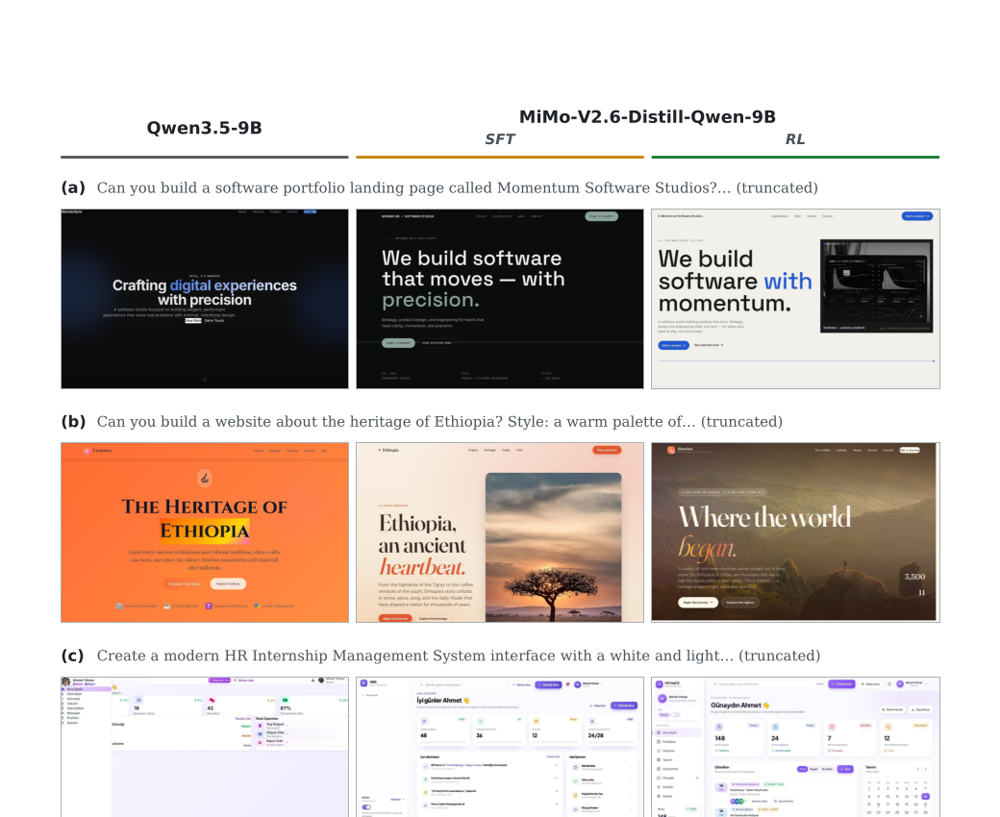

**图 17：** Qwen3.5-9B、MiMo-V2.6-Distill-Qwen-9B (SFT) 和 MiMo-V2.6-Distill-Qwen-9B (RL) 生成的网站首屏示例。每行为三个模型针对同一提示生成的结果：（a）Momentum Software Studios 软件作品集落地页；（b）埃塞俄比亚文化遗产网站；（c）现代 HR 实习管理系统界面。

## 8 结论

本报告介绍 MiMo-V2.6 系列，以及一套通过大规模智能体强化学习推动基础模型发展的实践方案。在全模态基础和面向智能体的中期训练之上，我们从三个维度扩展 RL：训练批量与吞吐、环境和智能体执行框架的多样性与复杂度，以及组内智能体评分所投入的算力。这些改进由异步训练、混合任务采样基础设施、训练—推理一致性机制，以及防止训练漂移和奖励黑客的防护共同支撑。结果是，模型能在长周期交互中持续优化，同时提高解法质量和 token 效率。公开与内部基准的结果验证了这一方案：MiMo-V2.6 在广泛的智能体任务上都能与前沿模型竞争。

为让研究社区更容易沿这一方向前进，我们与 MiMo-V2.6-Distill-Qwen-9B 一起发布了精选任务环境、验证器、端到端 RL 框架与可组合 mini-harness。它们在不同领域与执行框架上都带来一致 RL 收益，证明这些资源可以成为继续实验的共享基础。我们的工作是走向模型自我改进的一步务实尝试，其中广泛探索、有信息量的反馈与可扩展训练系统缺一不可。我们希望这些开放资源能支持可复现研究，也支持社区以可累积的方式，继续走向能力更强、用途更广的通用智能体。

## 参考文献

> 以下保留原文的作者、题名、年份与链接，便于按学术著录检索。

1. Artificial Analysis. *GDPval-AA v2.1 Leaderboard*, 2026. [URL](https://artificialanalysis.ai/evaluations/gdpval-aa).
2. I. Badertdinov, M. Nekrashevich, A. Shevtsov, and A. Golubev. *SWE-ReBench v2: Language-Agnostic SWE Task Collection at Scale*, 2026. [arXiv](https://arxiv.org/abs/2602.23866).
3. J. Chen, Y. Liang, and Z. Liu. *DFlash: Block Diffusion for Flash Speculative Decoding*, 2026. [arXiv](https://arxiv.org/abs/2602.06036).
4. Core Team et al. *MiMo-V2-Flash Technical Report*, 2026. [arXiv](https://arxiv.org/abs/2601.02780).
5. X. Deng et al. *SWE-bench Pro: Can AI Agents Solve Long-Horizon Software Engineering Tasks?*, 2025. [arXiv](https://arxiv.org/abs/2509.16941).
6. F. Gloeckle et al. *Better & Faster Large Language Models via Multi-token Prediction*, ICML 2024. [OpenReview](https://openreview.net/forum?id=pEWAcejiU2).
7. Z. Han et al. *AsyncFlow: An Asynchronous Streaming RL Framework for Efficient LLM Post-Training*, 2025. [arXiv](https://arxiv.org/abs/2507.01663).
8. C. He et al. *Semantic Head Specialization Guides Hybrid ViT Attention for Multimodal LLMs*, 2026. [arXiv](https://arxiv.org/abs/2608.28383).
9. HKUST NLP. *Introducing Toolathlon-Verified*, 2026. [URL](https://toolathlon.xyz/docs/blog/toolathlon-verified).
10. W. Huang and P. Jiang. *DeepSWE v1.1: A Cleaner, More Reproducible Benchmark for Frontier Coding Agents*, 2026. [GitHub](https://github.com/datacurve-ai/deep-swe).
11. W. Huang et al. *DeepSWE: Measuring Frontier Coding Agents on Original, Long-Horizon Engineering Tasks*, 2026. [arXiv](https://arxiv.org/abs/2607.07946).
12. C. E. Jimenez et al. *SWE-bench: Can Language Models Resolve Real-World GitHub Issues?*, ICLR 2024. [OpenReview](https://openreview.net/forum?id=VTF8yNQM66).
13. K. Jordan et al. *Muon: An Optimizer for Hidden Layers in Neural Networks*, 2024. [URL](https://kellerjordan.github.io/posts/muon/).
14. Kimi Team. *Kimi k1.5: Scaling Reinforcement Learning with LLMs*, 2025. [arXiv](https://arxiv.org/abs/2501.12599).
15. H. Lee et al. *SEC-Bench Pro: Can Language Models Solve Long-Horizon Software Security Tasks?*, 2026. [arXiv](https://arxiv.org/abs/2605.26548).
16. S. Lee and D. Brumley. *ExploitBench: A Capability Ladder Benchmark for LLM Cybersecurity Agents*, 2026. [arXiv](https://arxiv.org/abs/2605.14153).
17. J. Li et al. *The Tool Decathlon: Benchmarking Language Agents for Diverse, Realistic, and Long-Horizon Task Execution*, ICLR 2026. [arXiv](https://arxiv.org/abs/2510.25726).
18. Y. Li et al. *JobBench: Aligning Agent Work with Human Will*, 2026. [arXiv](https://arxiv.org/abs/2605.26329).
19. B. Liao et al. *Multi-Turn On-Policy Distillation with Prefix Replay*, 2026. [arXiv](https://arxiv.org/abs/2607.04763).
20. K. Lion et al. *Muown: Row-Norm Control for Muon Optimization*, 2026. [arXiv](https://arxiv.org/abs/2605.10797).
21. A. Liu et al. *DeepSeek-V3 Technical Report*, 2024. [arXiv](https://arxiv.org/abs/2412.19437).
22. A. Liu et al. *DeepSeek-V3.2: Pushing the Frontier of Open Large Language Models*, 2025. [arXiv](https://arxiv.org/abs/2512.02556).
23. J. Liu et al. *Muon is Scalable for LLM Training*, 2025. [arXiv](https://arxiv.org/abs/2502.16982).
24. W. Ma et al. *Stabilizing MoE Reinforcement Learning by Aligning Training and Inference Routers*, 2025. [arXiv](https://arxiv.org/abs/2510.11370).
25. W. Ma et al. *MOPD: Multi-Teacher On-Policy Distillation for Capability Integration in LLM Post-Training*, 2026. [arXiv](https://arxiv.org/abs/2606.30406).
26. R. Marten et al. *Terminal-Bench 4.0*, 2026. [GitHub](https://github.com/harbor-framework/terminal-bench/releases/tag/v4.0.0).
27. M. A. Merrill et al. *Terminal-Bench: Benchmarking Agents on Hard, Realistic Tasks in Command Line Interfaces*, 2026. [arXiv](https://arxiv.org/abs/2601.11868).
28. P. Moritz et al. *Ray: A Distributed Framework for Emerging AI Applications*, OSDI 2018.
29. K. Opsahl-Ong et al. *OfficeQA Pro: An Enterprise Benchmark for End-to-End Grounded Reasoning*, 2026. [arXiv](https://arxiv.org/abs/2603.08655).
30. T. Patwardhan et al. *GDPval: Evaluating AI Model Performance on Real-World Economically Valuable Tasks*, 2025. [arXiv](https://arxiv.org/abs/2510.04374).
31. PrimeIntellect. *SWE-RL: Software Engineering Tasks for RL*, 2026. [Hugging Face](https://huggingface.co/collections/PrimeIntellect/swe-rl).
32. X. Qu, P. Huang, and S. Horvath. *Can Muon Fine-Tune Adam-Pretrained Models?*, 2026. [arXiv](https://arxiv.org/abs/2605.10468).
33. Qwen Team. *Qwen3-Next: Towards Ultimate Training & Inference Efficiency*, 2025. [URL](https://qwen.ai/blog?id=4074cca80393150c248e508aa62983f9cb7d27cd&from=research.latest-advancements-list).
34. I. Shah et al. *Practical Efficiency of Muon for Pretraining*, 2025. [arXiv](https://arxiv.org/abs/2505.02222).
35. Z. Shao et al. *DeepSeekMath: Pushing the Limits of Mathematical Reasoning in Open Language Models*, 2024. [arXiv](https://arxiv.org/abs/2402.03300).
36. D. Shepard and R. Salimans. *AutomationBench*, 2026. [arXiv](https://arxiv.org/abs/2604.18934).
37. M. Shoeybi et al. *Megatron-LM: Training Multi-Billion Parameter Language Models Using Model Parallelism*, 2019. [arXiv](https://arxiv.org/abs/1909.08053).
38. Y. Sun et al. *Agents’ Last Exam*, 2026. [arXiv](https://arxiv.org/abs/2606.05405).
39. C. Tao et al. *SWE-Lego: Pushing the Limits of Supervised Fine-Tuning for Software Issue Resolving*, 2026. [arXiv](https://arxiv.org/abs/2601.01426).
40. The Microsoft AI Team. *MAI-Thinking-1: Building a Hill-Climbing Machine*, 2026. [PDF](https://microsoft.ai/pdf/mai-thinking-1.pdf).
41. A. Vaswani et al. *Attention Is All You Need*, NeurIPS 2017. [URL](https://proceedings.neurips.cc/paper/2017/hash/3f5ee243547dee91fbd053c1c4a845aa-Abstract.html).
42. vLLM Project. *Humming*, version 0.1.15, 2026. [GitHub](https://github.com/vllm-project/humming/releases/tag/v0.1.15).
43. Z. Wang et al. *CyberGym: Evaluating AI Agents’ Cybersecurity Capabilities with Real-World Vulnerabilities at Scale*, 2025. [arXiv](https://arxiv.org/abs/2506.02548).
44. Z. Wang et al. *ExploitGym: Can AI Agents Turn Security Vulnerabilities into Real Attacks?*, 2026. [arXiv](https://arxiv.org/abs/2605.11086).
45. B. Xia et al. *MiMo: Unlocking the Reasoning Potential of Language Model—from Pretraining to Posttraining*, 2025. [arXiv](https://arxiv.org/abs/2505.07608).
46. L. Xiaomi. *MiMo-Audio: Audio Language Models Are Few-Shot Learners*, 2025. [arXiv](https://arxiv.org/abs/2512.23808).
47. T. Xie et al. *OSWorld: Benchmarking Multimodal Agents for Open-Ended Tasks in Real Computer Environments*, NeurIPS 2024. [URL](http://papers.nips.cc/paper_files/paper/2024/hash/5d413e48f84dc61244b6be550f1cd8f5-Abstract-Datasets_and_Benchmarks_Track.html).
48. XLANG Lab. *Introducing OSWorld-Verified*, 2025. [URL](https://xlang.ai/blog/osworld-verified).
49. W. Xu et al. *Speculative Knowledge Distillation: Bridging the Teacher-Student Gap through Interleaved Sampling*, ICLR 2025. [OpenReview](https://openreview.net/forum?id=EgJhwYR2tB).
50. J. Yang et al. *ProgramBench: Can Language Models Rebuild Programs from Scratch?*, 2026. [arXiv](https://arxiv.org/abs/2605.03546).
51. S. Yang et al. *What Makes Interaction Trajectories Effective for Training Terminal Agents?*, 2026. [arXiv](https://arxiv.org/abs/2606.03461).
52. B. Ye et al. *CodeMidas: Scaling Agentic Coding RL Environments from Code Itself*, 2026. [arXiv](https://arxiv.org/abs/2609.22068).
53. Q. Yu et al. *DAPO: An Open-Source LLM Reinforcement Learning System at Scale*, NeurIPS 2025. [URL](http://papers.nips.cc/paper_files/paper/2025/hash/a4277440d50f1f15d2cb4c14f7e0c0d2-Abstract-Conference.html).
54. Z. Yue et al. *MiMo-VL Technical Report*, 2025. [arXiv](https://arxiv.org/abs/2506.03569).
55. D. Zan et al. *Multi-SWE-bench: A Multilingual Benchmark for Issue Resolving*, NeurIPS 2025. [URL](http://papers.nips.cc/paper_files/paper/2025/hash/5afa9cb1e917b898ad418216dc726fbd-Abstract-Datasets_and_Benchmarks_Track.html).
56. J. Zhao et al. *Immersion in the GitHub Universe: Scaling Coding Agents to Mastery*, 2026. [arXiv](https://arxiv.org/abs/2602.09892).
57. L. Zheng et al. *SGLang: Efficient Execution of Structured Language Model Programs*, NeurIPS 2024. [URL](http://papers.nips.cc/paper_files/paper/2024/hash/724be4472168f31ba1c9ac630f15dec8-Abstract-Conference.html).

## A 贡献与致谢

我们向所有贡献者表示衷心感谢，感谢他们不可或缺的支持与付出，包括小米数据平台、CloudML、NGK、MiChat、Mify、MiKS 与 LLM-Plus 团队，以及本文未一一列出的贡献者。在各角色中，作者按名字的逆字母顺序列出。

**核心贡献者：** Zongming Qiao, Ziyue Hua, Zirui Ou, Zihao Yue, Zihan Jiang, Zhuo Huang, Zhiyang Chen, Zhixian Zheng, Zhipeng Xu, Zhengrui Ma, Yuyang Hu, Yuhang Dong, Yuechen Zhang, Yudong Wang, Yuanxin Liu, Yixin Yang, Yishuo Cai, Yikai Zhao, Yihan Yan, Yifan Zhang, Yifan Song, Xiyu Wei, Xing Zhang, Xin Zhang, Xiaoqian Liu, Xiaodong Ji, Xiangwei Deng, Xueyu Guo, Wenhan Ma, Weimin Xiong, Weikun Wang, Weiji Zhuang, Shuo Liu, Shuhuai Ren, Shuhao Gu, Shimao Chen, Shijie Cao, Shihua Yu, Shicheng Li, Shengjie Zhou, Shaolei Zhang, Rang Li, Qiying Wang, Qingkai Fang, Qianli Chen, Minzheng Wang, Liwen Wang, Linli Yao, Linghao Zhang, Liangyu Cheng, Liang Zhao, Lei Li, Jinhao Dong, Jinyu Xiang, Jianyu Wei, Jiangshan Duo, Huaqiu Liu, Huanjie Fan, Hongyi Guan, Hongshen Xu, Hao Tian, Hanyu Li, Hailin Zhang, Gang Wang, Fuli Luo†, Feng Wei, Dong Zhang, Dawei Zhu, Chiheng Lou, Chenhong He, Chenhao He, Chenghua Liu, Bowen Ye, Bowen Shen, Boshen Xu, Bo Yang, Bingquan Xia, Bangjun Xiao, Baixuan Xu。

**贡献者：** Zhouxiang Mao, Zhiyang Zhang, Zhixiang Xu, Zhenru Lin, Zhengju Tang, Zhaojun Huang, Yuzhe Weng, Yuxing Xiang, Yuxiao Li, Yuheng Yang, Yuhang Wang, Yuchen Liu, Yuanyuan Tian, Yuanliang Dong, Yu Cheng, Yongzhe He, Yongshun Liang, Yong Wang, Yiyan Wang, Yitian Gong, Yijie Zhang, Yanshu Xin, Xun Zhang, Xingjian Zhao, Wenyu Yang, Wenshan Huang, Wenhao Li, Tingwei Huang, Tianyu Yu, Tianyang Lu, Taoyu Yang, Sinan Du, Shutong Tian, Shulin Du, Shengfan Wang, Shanchuan Fang, Qihao Zhang, Qibin Yang, Qian Yu, Qian Tu, Pengrong Xie, Peipei Wang, Peidian Li, Minkun Guo, Mingchen Shao, Luohan Gao, Lijie Wang, Liang Shi, Kaiqi Chen, Kaiming Liu, Kaifei Wang, Kai Yang, Jinlong Xue, Jiechen Zhang, Jiaxuan Liu, Hongxu An, Hao Peng, Hanglong Lü, Guonan Wang, Feiyu Yang, Fanyu Cao, Fangyue Liu, Fan Cui, Cong Wang, Chun Chen, Chenxu Bai, Chengxuan Zhu, Chenghua Wang, Boyi Zeng。

† 通讯作者。
