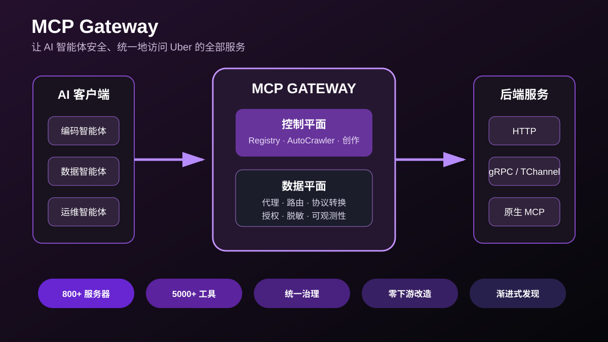
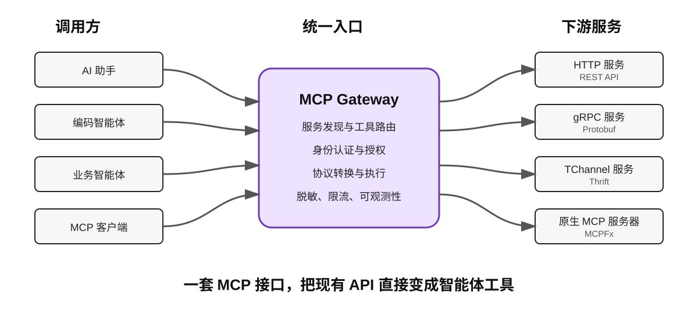
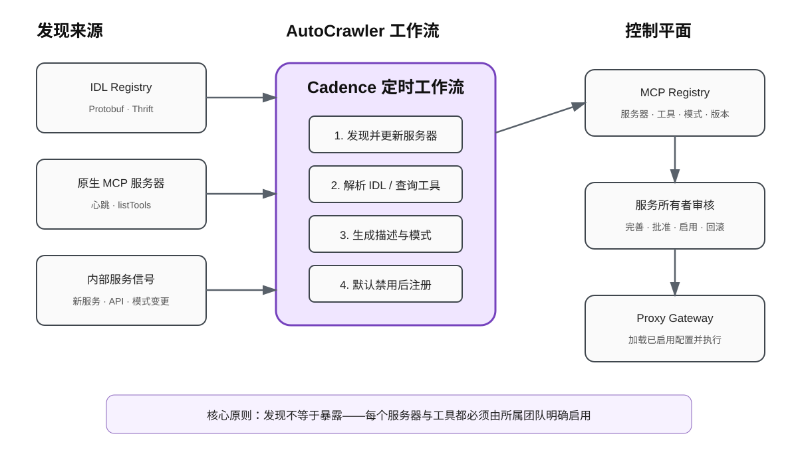
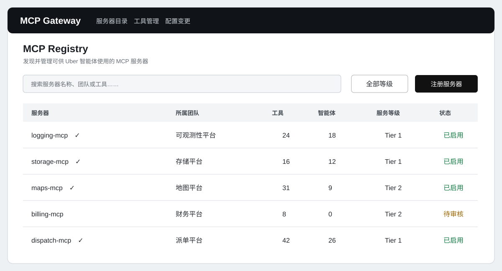
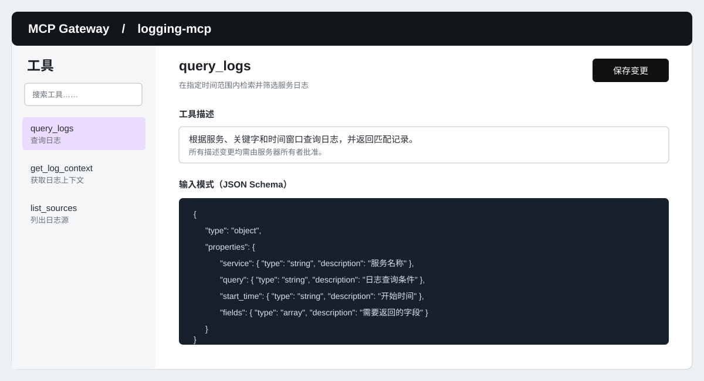
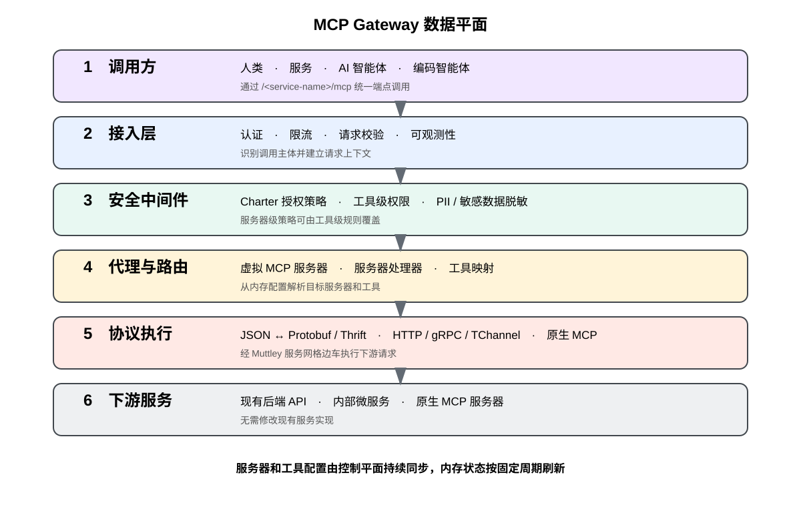
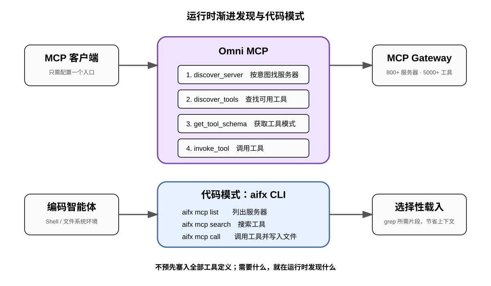

# 设计 MCP Gateway：Uber 的 MCP 管理平台

> 作者：Alok Srivastava、Deepanshu Mehndiratta、Gaurav Gill、Prashik Sahare、Vaibhav Tayal、Shiven Tripathi、Uday Kiran Medisetty、Abhishek Bhatia  
> 发布日期：2026 年 10 月 1 日  
> 原文：[Designing MCP Gateway: Uber's MCP Management Platform](https://www.uber.com/us/en/blog/designing-mcp-gateway/)  
> X 来源：[Uber Engineering](https://x.com/UberEng/status/2106071967619322330)  
> 翻译 Url：[https://github.com/samz406/local_wenzhang/blob/main/docs/UberMCPGateway/设计MCP-Gateway-Uber的MCP管理平台.md](https://github.com/samz406/local_wenzhang/blob/main/docs/UberMCPGateway/设计MCP-Gateway-Uber的MCP管理平台.md)

## 引言

Uber 对 AI 智能体的快速采用，彻底改变了团队与代码、数据和运维系统交互的方式。早期临时搭建的 MCP（模型上下文协议）集成很快展现出明确价值：当智能体能够访问实时业务上下文、查询内部服务，并代表用户执行真正有意义的操作时，它们的能力会大幅提升。这些早期成果证明，MCP 是在 Uber 内部构建智能体系统的一种强大抽象。

然而，随着采用速度加快，重大挑战也随之浮现。各团队各自独立构建集成，导致工具体系支离破碎、基础设施重复建设。MCP 工具很难发现，稳定运行也不容易，而且与特定服务或智能体实现高度耦合。小规模时，这些做法尚能奏效；可当数百个团队开始探索智能体工作流，它们便无法满足 Uber 的需求。

如果没有统一架构，扩大 MCP 的使用规模只会增加运维复杂度、安全风险和开发摩擦，最终限制它所能产生的影响。

要在 Uber 的规模下释放 MCP 的全部潜力，我们需要一套集中式、可扩展的解决方案：既规范 AI 智能体与现有后端系统的交互方式，也保留各团队所需的灵活性。它必须屏蔽 HTTP、gRPC™、TChannel 等协议差异，提供一致的安全与可观测性保障，并让公司上下都能轻松创建、发现和复用 MCP 工具。

为此，我们构建了 MCP Gateway。它是一项为 Uber 全部 MCP 交互提供支撑的基础微服务，是 AI 智能体与现有后端服务、原生 MCP 服务器之间的编排和路由层。通过把 MCP 逻辑集中到一个网关中，我们为“智能体到服务”的交互提供了统一执行模型，也让团队不必反复重造核心基础设施。

现有 API 可以无缝暴露为 MCP 工具，在同一处接受治理和运维，并由多个智能体以统一方式使用。MCP Gateway 为 Uber 内部构建 AI 智能体打通了一条可扩展、快速且一致的路径。目前，它承载着 800 多台 MCP 服务器和 5000 多个工具。

*图 1：MCP Gateway（API 即工具）。*

本文将介绍 MCP Gateway 的设计，包括代理层（把 MCP 转换为现有协议，并将响应转回 MCP）、发现层（MCP Registry 与 API 抓取），以及它的控制平面（创作与配置）。

### 网关

MCP Gateway 采用微服务架构，网关是 AI 系统与 Uber 后端服务之间的中央集成点。整个平台由两个主要组件组成：作为控制平面的 MCP Registry，以及构成数据平面的 Proxy Gateway。

MCP Registry 维护着一个目录，其中包含由内部服务支撑的数百台 MCP 服务器，以及数千个 MCP 工具。这些工具既有无需编码、直接将现有 API 暴露为 MCP 工具的定义，也有专门按照 MCP 规范构建的完整原生实现。Registry 是整个生态中服务发现、所有权和启用状态的唯一事实来源。

Proxy Gateway 负责在运行时执行 MCP 请求。它把 MCP 协议调用转换为 HTTP、gRPC 或 TChannel 请求，将请求转发至相应后端服务，再把响应转换成与 MCP 兼容的结果。借助这层转换，AI 智能体可以通过统一的 MCP 接口与现有系统交互，而底层服务无需做任何修改。

### 控制平面

Uber 采用微服务架构，运行着数千项内部服务，并通过 HTTP、gRPC 和 TChannel 暴露 API。这些 API 能为 AI 系统提供宝贵的上下文，但如果要求每支团队手工编写 MCP 服务器，过程会既缓慢又痛苦。为解决这个问题，我们构建了 AutoCrawler：它持续扫描 Uber 的 IDL Registry，发现 API 后完成转换并更新至 MCP Registry；同时也会查询原生 MCP 服务器，将其加入 Registry。

#### AutoCrawler：发现引擎

AutoCrawler 是一套由 [Cadence](https://cadenceworkflow.io/) 驱动的分布式工作流系统，订阅 Uber 的 IDL Registry 和内部服务信号。定时任务按固定周期触发 Cadence 工作流，扫描新加入的服务、API 和模式变更。

对于每个新发现的实体，AutoCrawler 负责：

- 创建或更新 MCP 服务器的表示；
- 生成或获取工具定义与模式；
- 以“默认禁用”状态把工具注册进 MCP Registry。

这套共享基础设施让 MCP 发现能力得以扩展到数千项服务，同时不让各服务团队成为关键路径上的瓶颈。

*图 2：AutoCrawler。*

#### 发现由 IDL 支撑的服务

对于通过 Protobuf 或 Thrift IDL 定义的传统后端服务，AutoCrawler 直接从 IDL Registry 推导出 MCP 服务器和工具。针对每个“服务：API”组合，AutoCrawler 会执行以下步骤：

- **更新或插入 MCP 服务器：**创建或更新与所发现服务相对应的虚拟 MCP 服务器。
- **解析 IDL 定义：**解析相关 Protobuf 或 Thrift 文件，提取方法名、请求与响应模式，以及文档注释。
- **生成工具描述：**根据提取出的模式和注释，使用 LLM 生成信息更丰富、对智能体更友好的 MCP 工具描述。
- **模式转换：**把 Protobuf 或 Thrift 模式转换成与 MCP 兼容的 JSON-RPC 2.0 模式。
- **更新或插入 MCP 工具：**把生成的 MCP 工具注册或更新到 MCP Registry 中，初始状态仍为默认禁用。

#### 发现原生服务器

除了由 IDL 支撑的服务，MCP Gateway 也支持原生 MCP 服务器——也就是直接实现 MCP 协议、暴露面向智能体优化工具的服务。

MCPFx 是 Uber 用于构建原生 MCP 服务器的框架。每台原生 MCP 服务器都会发出心跳指标，表明自身存在且已就绪。AutoCrawler 持续监测这些心跳信号，自动发现新的原生 MCP 服务器。发现后，它会走另一条发现路径：

1. 向原生 MCP 服务器发起 `listTools` 调用，获取其明确暴露的工具及相应模式。
2. 在 MCP Registry 中创建一台虚拟代理 MCP 服务器，纳入所有已发现工具及其模式，初始状态设为默认禁用。

### 第三方 MCP 服务器

MCP Gateway 是 Uber 全部 MCP 交互的集中编排层，也为 Jira、Google 等第三方集成提供无缝支持。

部署第三方 MCP 服务器需要两个关键组件协作：

1. **MCP Gateway：**把调用者的用户令牌向下游传递，同时执行网关的关键能力，包括授权、速率限制和敏感数据脱敏。
2. **第三方 MCP 服务：**先把内部用户令牌换取为对应的第三方认证令牌，再将请求发送给外部 MCP 服务器。

#### 创作与启用

我们或许可以在不让服务团队参与的情况下创建 MCP 服务器，但服务器的所有权和控制权必须归属于服务团队。MCP Gateway 的一条核心设计原则是：**被发现，不等于被暴露。**每台 MCP 服务器、每个工具最初都处于禁用状态，必须由所属团队明确审核并启用。服务所有者可以先审阅和完善自动生成的工具定义，再将其启用。

每次修改工具描述，都会触发一次配置变更差异，且必须由服务器所有者批准。所有者可以批准并部署该配置变更；如有需要，也可以回滚至此前已知可用的版本。

*图 3：MCP Registry 界面。*

*图 4：MCP 工具界面。*

### 数据平面

MCP Gateway 的数据平面是负责执行 MCP 请求的核心运行时服务。它持续从控制平面获取服务器与工具配置，并按固定周期刷新内存状态。这样一来，工具更新、启用状态变更等配置调整都能实时生效，无需重启或重新部署服务。

数据平面根据这些配置动态实例化虚拟 MCP 服务器。对于每台虚拟服务器，Gateway 都会暴露一个 `/<service-name>/mcp` 端点，作为 AI 智能体执行任务的入口。内置代理服务器会把进入的请求解析到相应的服务器处理器。

*图 5：MCP Gateway 数据平面。*

#### 协议转换与执行

MCP Gateway 中的协议转换由 Proxy Gateway 内的服务器处理器完成。每个服务器处理器既了解工具，也了解下游，因此可以在运行时正确路由并执行 MCP 请求。

#### 安全

MCP Gateway 为所有服务器提供内置授权与脱敏，粒度可细化至工具级别。Gateway 使用 Uber 内部的[访问控制系统](https://www.uber.com/us/en/blog/attribute-based-access-control-at-uber/)，根据识别出的调用主体（人、服务和智能体）应用不同的 Charter 策略。Charter 策略在服务器层级创建；如有需要，也可以针对单个工具覆盖。

MCP Gateway 还会开箱即用地对工具响应中的任何个人身份信息（PII）或敏感数据进行脱敏。

#### 由 IDL 支撑的下游服务

对于由现有后端服务支撑的工具，服务器处理器会维护一份内存映射，描述下游目的地，例如 HTTP 端点配置或 gRPC/TChannel 过程。

当 MCP 请求到达时，处理器会：

1. 把传入的 JSON 载荷转换成适当的传输格式；
2. 将请求序列化为 Protobuf 或 Thrift 字节；
3. 把请求转发给下游服务；
4. 将 Protobuf 或 Thrift 字节响应转回与 MCP 兼容的 JSON，并返回给调用智能体。

真正的下游请求由 Muttley 执行。Muttley 是 Uber 的服务网格边车，与所有后端服务并行运行。把请求执行交给 Muttley 后，MCP Gateway 便能自动复用既有的服务间路由能力。

#### 原生 MCP 服务器

原生 MCP 服务器同样会以虚拟服务器的形式注册进 MCP Registry，由它代理原始服务器。运行时，原生 MCP 请求会被透明地代理至下游服务器，响应也会被代理回调用方。

### Gateway 的优势

通过构建 MCP Gateway，Uber 形成了一套可扩展、统一的智能体系统建设方式，其中影响最大的收益包括：

- 轻松发现和安装；
- 无需编码即可利用现有 API；
- 内置可观测性与安全能力；
- 集中的所有权与治理。

## 扩展 Gateway

当 MCP Gateway 扩展到数百台服务器、数千个工具时，小规模环境中不存在的问题也随之出现：上下文膨胀，以及成本过高。

### 运行时发现

MCP 原生并不具备跨服务器搜索的概念。智能体必须事先知道该与哪台服务器通信，才能询问有哪些工具可用。要为智能体配置一台 MCP 服务器，必须明确接入服务器 URL、凭据和工具列表。面对数百台服务器，这种方式无法扩展，因为所有这些上下文都会吞噬模型的上下文窗口。我们通过以下方式解决了问题：

- **Omni MCP：**一台统一的代理服务器，让 MCP 客户端能够用渐进式发现模式访问 MCP Gateway 中的任意服务器。增量发现还进一步实现了上下文和令牌优化。Omni MCP 暴露以下工具：
  - `discover_server`：根据查询意图发现 MCP 服务器；
  - `discover_tools`：查找一台服务器上的工具；
  - `get_tool_schema`：获取工具的 JSON 模式；
  - `invoke_tool`：调用工具。

这些工具共同实现对全部 MCP 服务器的渐进式发现与访问，同时完整保留访问控制及网关的其他内置能力。

- **响应投影（Response Projection）：**MCP Gateway 还提供一种类似 GraphQL 的 MCP 工具调用模式。它会在工具请求模式中注入一个新字段，指示网关只请求需要的字段，而不是返回全部内容。LLM 读取需求后，注入一个仅含必要字段嵌套路径的数组；Gateway 再在运行时裁剪响应，只保留投影指定的字段。

这让我们能够把 MCP 的 API 模式兼容能力扩展到企业级规模。

- **代码模式（Code Mode）：**编码智能体经常在 Shell 环境中运行。此时，把工具输出直接写入文件，要比把完整响应塞进模型上下文更高效。代码模式通过 Uber 面向智能体操作的命令行工具 `aifx` 支持这种工作方式：它经由 Gateway 路由 MCP 调用，不要求安装任何 MCP 服务器。即使上下文中没有 MCP 定义，智能体也能借此发现适合当前任务的 MCP 工具。`aifx` 暴露三条命令：
  - `aifx mcp list`：列出可用的 MCP 服务器；
  - `aifx mcp search`：跨所有 MCP 服务器搜索工具；
  - `aifx mcp call`：通过 MCP Gateway 调用 MCP 工具。

智能体可以在一条命令中串联这些操作，并把输出写进文件。文件系统智能体随后使用 `grep` 有选择地读取，只把真正需要的部分载入上下文。如今，代码模式已成为 Uber 编码智能体使用 MCP 工具的默认方式。

## 结语

MCP Gateway 从根本上改变了 AI 智能体在 Uber 的运行方式。起初，这是一个碎片化问题：数十支团队各自连接 MCP 集成，工具不一致、缺乏共享安全保障，基础设施还被重复建设。如今，它已经变成一套统一、可扩展的平台，任何团队只需几分钟就能接入。

驱动这套设计的核心洞见其实很简单：**现有 API 是为智能体提供工具的最快路径。**MCP Gateway 没有要求团队为了智能体时代重写自己的服务，而是直接适配现状——通过 Muttley，把 HTTP、gRPC 和 TChannel 调用透明地转换为与 MCP 兼容的交互，下游服务无需任何改动。

如果你正在大规模构建智能体系统，最难的部分并不是 AI，而是搭好那层连接组织——服务发现、安全和可靠性。正是它们，才让智能体值得信赖，足以在生产环境中代表真实用户采取行动。MCP Gateway 是我们对这项挑战的回答，也希望本文记录的设计决策能为面临同样问题的人提供帮助。

## 致谢

封面图由 OpenAI 的 ChatGPT 生成；未使用任何外部图片、徽标或第三方素材。

gRPC 是 Linux Foundation 的商标。

如需及时了解 Uber Engineering 的最新动态，可在 [LinkedIn](https://www.linkedin.com/company/uber-com/) 关注我们的新文章与新见解。

## 作者

- **Alok Srivastava，首席工程师。**就职于 Uber Business Platform 团队，负责领导 Uber Edge Platform——这是 Uber 业务流量的入口与出口层，覆盖所有移动端和 Web 端的 API、内容及推送消息。
- **Deepanshu Mehndiratta，高级资深工程师。**就职于 Uber Business Platform 组织，负责可靠性与 AI 工程。他的 AI 工作涵盖 MCP Gateway 和 Uber 前沿深度智能体生态，把 Uber 的全部服务连接到 AI 智能体，并由数万名员工使用。
- **Gaurav Gill，高级软件工程师。**就职于 Uber Business Platform 下属 Edge Platform 团队，负责构建可扩展的智能体 AI 基础设施，参与了 MCP Gateway 与深度智能体生态的设计和开发。
- **Prashik Sahare，高级软件工程师。**就职于 Uber Business Platform 团队，从事 AI 基础设施和边缘流式处理工作。除 MCP Gateway 外，他还构建了 Skills Marketplace，让各团队能够在整个组织内创作、共享和复用智能体技能。
- **Vaibhav Tayal，软件工程师 II。**就职于 Uber Edge Gateway 团队，领导多个项目的前端开发。他设计并推出了 MCP Gateway Dashboard，还开发了 GraphQL 持久化操作管理系统。
- **Shiven Tripathi，软件工程师 II。**就职于 Uber Business Platform 团队，专注于 AI 基础设施和可靠性工程。他参与了 MCP Gateway 的构建与规模化，也在 Uber 的前沿深度智能体生态中工作。
- **Uday Kiran Medisetty，杰出工程师。**领导 Uber 的工程生产力项目，包括智能体编程、AI 调试、代码审查和大规模重构。他还共同领导全公司工程社区，参与塑造 Uber 的架构、文化和标准。
- **Abhishek Bhatia，Staff 软件工程师。**就职于 Uber Ads 团队，专注于面向 Uber Eats 商家的推荐系统。除产品工作外，他也参与 Uber 的 AI 开发者工具建设，其中包括代码模式——`aifx` 中默认的 MCP 发现与执行层。
