# 在 Uber 的规模下高效运转软件工厂

> 作者：Uday Kiran Medisetty（Uber 杰出工程师）  
> 发布日期：2026 年 8 月 27 日  
> 原文：[Running a Software Factory Efficiently at Uber Scale](https://www.uber.com/us/en/blog/efficient-software-factory/)  
> X 来源：[Uber Engineering](https://x.com/UberEng/status/2093444169037762840)  
> 翻译 Url：[https://github.com/samz406/local_wenzhang/blob/main/docs/Uber软件工厂/在Uber规模下高效运转软件工厂.md](https://github.com/samz406/local_wenzhang/blob/main/docs/Uber软件工厂/在Uber规模下高效运转软件工厂.md)

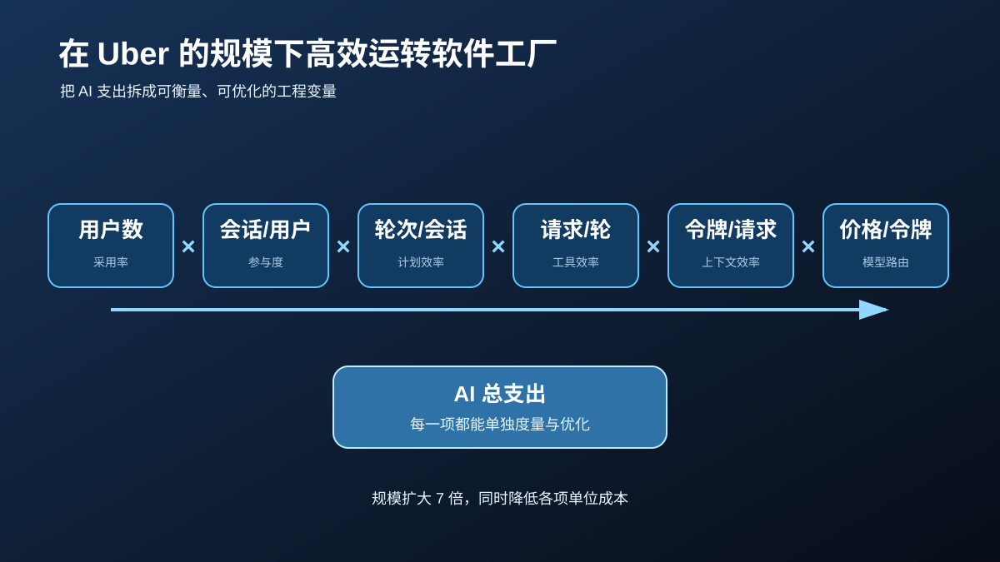

## 引言

AI 工具如今已经嵌入 Uber 软件开发的每一个阶段。超过 70% 的拉取请求（PR）归因于本地或云端智能体；工程师已经在整个软件开发生命周期中构建了 3600 多项智能体技能，每天执行的技能超过 3 万次。

在 AI Engineer 2026 大会上，我们分享了对[软件工厂的构想](https://www.youtube.com/watch?v=17-YSUHo6Lk)，以及我们正在为整个生命周期构建的基础模块和托管智能体。随着这一构想逐步落地，越来越多的会话不再由人类发起，而是由自动化托管智能体执行：代码审查、CI 故障自愈、完成带视觉验证的端到端 PR、分流值班告警、调试新报告的缺陷，以及在人工审查或升级介入下完成各类代码维护任务。

如图 1 所示，从 2026 年 2 月到 8 月，Uber 全体员工（包括工程师和非工程师）使用的所有智能体产品中，周活跃用户增长了 7 倍，每周智能体请求增长了 9.4 倍。与此同时，得益于全面优化，我们的 AI 总支出自 4 月以来基本趋于稳定。

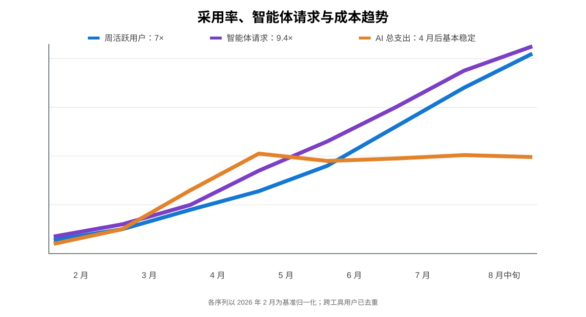

*图 1：2026 年 2 月至 8 月中旬的周活跃用户、智能体请求与成本；用户已跨工具去重。*

采用率、工作负载构成和模型版本都在持续变化。要单独识别我们自己的优化收益，就必须固定同一个模型，因为每次模型升级、每个模型家族的行为都会变化。我们在 2 月至 7 月这样做了：每 1000 次模型请求的成本较峰值下降近 34%，每次会话成本较 6 月峰值下降 52%。

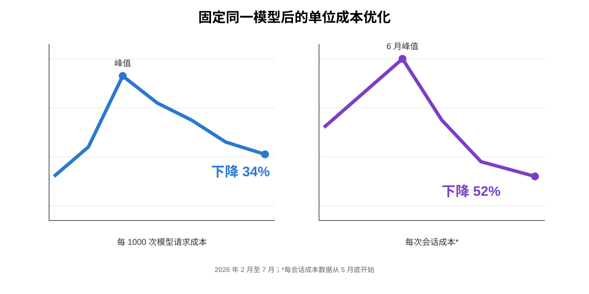

*图 2：固定模型后的成本优化效果。每会话成本数据从 5 月底开始统计。*

本文会介绍我们如何看待自己的软件工厂：智能体会话运行的四个层级、用于拆解支出的成本公式、每一项的衡量方式，以及如何在各层优化这些变量。

本文比较中的所有价格和厂商指标均来自公开信息；成本效率提升，则来自我们在标准分层定价下对 Uber 内部工作负载做出更智能的路由。我们测得的具体降本幅度只适用于自身环境，你的结果会因代码库、团队规模和智能体工作流而异；但用真实工作建立基准、同时优化准确性与成本的方法，可以普遍复用。

### 软件工厂及其成本公式

#### 智能体使用的四个层级

我们把 AI 使用方式划分为四层，从最专用到最通用。图 3 展示了这种结构：层级越高，我们对成本、质量和模型选择的控制力就越强。

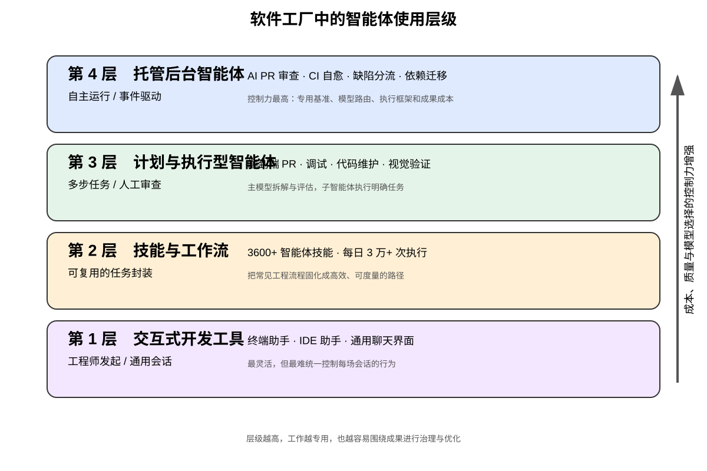

*图 3：智能体会话运行的四个层级。*

#### 成本公式

无论在哪一层，我们都可以把一次智能体会话的成本拆成以下变量，并分别衡量和优化。

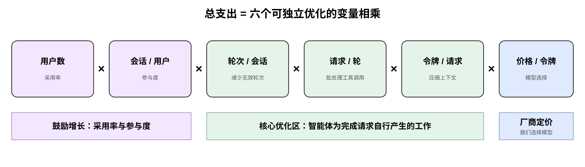

*图 4：把总支出拆成六个相乘项。*

前两项代表采用率和参与度——无论用户亲自交互，还是智能体代他们处理任务，我们都希望这两项在整体用户群中持续增长。中间三项则提供了优化空间：除了工程师实际提出的请求，智能体为完成任务还要自行开展多少工作。这里也是我们投入精力最多的地方，包括帮助智能体更快制订计划、减少无效轮次或错误、优化输入令牌等机制。

### 如何衡量

以下是我们按周、按月跟踪的完整指标集，用于规划短期和长期工作并进行预测。

| 层面 | 指标 | 回答的问题 |
|---|---|---|
| 产品组合 | 总归因成本；归因去重用户数；各工具/智能体的成本、用户数和支出占比 | 钱花在了哪里，哪款工具带来了变化？ |
| 各工具的单位经济性 | 每用户成本；每用户请求数；每 1000 次请求成本；每次请求的输入、输出及总令牌数；每 100 万令牌成本；每 1000 次会话成本；每活跃会话小时成本；提示词缓存命中率 | 工具是真的变便宜了，还是使用量只是在转移？ |
| 模型经济性 | 每个模型的成本与成本占比；请求量与请求占比；每 1000 次请求成本；每 100 万令牌成本 | 在令牌单价相同或不同时，哪些模型版本真正改变了账单？ |
| 驱动因素拆解 | 依次把成本变化拆为采用率（用户数）、参与度（每用户请求数）、输入工作量（每请求输入令牌数）和输出工作量（每请求输出令牌数） | 数字为何变化？精确说明原因，不留下无法解释的残差。 |
| 托管智能体成果 | 各托管智能体按成果计价的成本（每个合并 PR、每次审查、每条告警、每次清理）；质量信号（回滚率、F1、平均修复时间 MTTR）；产出量（落地的差异、发布的审查、分流的告警） | 每交付一个价值单位是否越来越便宜？模型迁移时质量是否保持稳定？ |

### 优化杠杆

下文会详细介绍我们用来优化成本公式各部分的主要杠杆。有些杠杆会同时影响公式中的一个或多个变量。

| 优化对象 | 主要杠杆 |
|---|---|
| 单令牌价格 | 基准驱动、符合帕累托最优的模型选择；模型默认值 |
| 每请求令牌数 | 默认 40 万上下文上限与中等推理强度；提示词缓存；工具搜索与通过 CLI 解析的 MCP 调用；用代码模式批量调用工具；经 Gateway 路由 SaaS MCP |
| 每轮请求数 | 由图谱提供依据的上下文；持续优化技能 |
| 可见性与教育 | 状态栏实时成本计数器；支出可见性与分层；会话分析仪表盘 |

### 优化单令牌价格

厂商决定令牌价格，我们决定让哪个模型执行哪种工作负载。在托管智能体的所有层级，我们都会为相应工作负载选择最符合帕累托效率的模型。对我们而言，帕累托效率要同时考虑完成任务的成本、输出质量和模型可靠性。

#### 由基准驱动的模型选择

所有托管智能体都遵循相同的四步模型选择流程：

- 用智能体的真实工作建立基准；
- 在统一执行框架上运行智能体，让前沿模型和开放权重模型都能通过同一接口提供服务；
- 切换到当下的帕累托最优方案，并持续切换，因为前沿边界每隔几周就会移动；
- 面向未来，汇总各托管智能体的洞察，持续测试和部署不同的模型路由策略，从而不断改善工作负载表现。

以 uReview 为例，它负责对全部拉取请求进行 AI 代码审查。我们用包含已知缺陷的真实 PR 构建了它的基准，并按简单、中等、困难分级。我们针对这些缺陷衡量精确率、召回率和 F1，同时统计每次审查成本、延迟、超时及噪声。如图 5 所示，切换模型后，我们在大幅降低每个 PR 成本的同时提高了 F1。图中的虚线就是帕累托前沿；位于它左下方的一切配置，都有另一个更便宜或更优秀的方案胜过它。

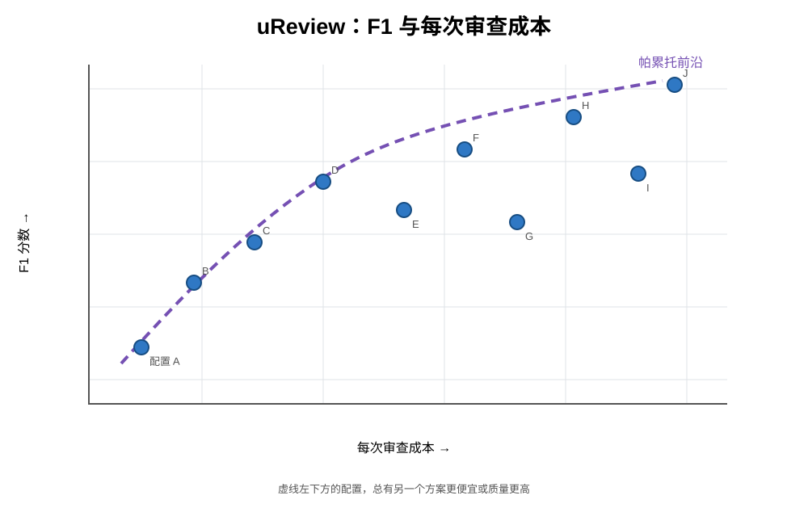

*图 5：我们为 uReview 测试的全部配置。*

我们还基于大型单体仓库中的数千个真实 PR，在内部建立了 Uber SWE Benchmark，让前沿模型和开放权重模型执行不同类型的任务。我们据此为软件开发生命周期中的所有托管智能体选择模型。

#### 默认模型选择

在交互界面中，令牌单价保持固定，但可以有策略地安排令牌在不同模型间的分布。两项默认设置主要决定这种分布：会话的初始模型，以及子智能体模型。

子智能体默认模型已经成为影响最大的杠杆，而且重要性还在继续上升。随着最新模型能力让多智能体编排变得更有效，启动子智能体的会话占比一直在增加。子智能体通常承担输入明确、边界清晰的任务，往往不需要前沿级推理。因此，我们默认让它们使用能力稍弱但成本更低的模型，同时允许手动覆盖。

主模型负责任务拆解和结果评估，子智能体负责执行工作。

### 优化每请求令牌数

每一轮都会重新发送完整对话历史、项目上下文和工具结果。因此，任何能够缩小单次请求载荷的办法，都会在整场会话中产生复利效应。

#### 默认设置

所有交互式执行框架都使用统一封装层，处理安装管理、配置、认证和成本可见性。两项标准默认配置会直接减少每次请求的令牌消耗：

- **即使模型拥有 100 万令牌的上下文窗口，也会在 40 万令牌时自动压缩。**这个阈值在模型表现、缓存突增和重复输入令牌成本之间取得平衡。我们的测量显示，它显著降低了整个机群的每请求输入令牌数。
- **默认使用中等推理强度。**在主模型上，输出令牌——包括内部推理令牌——的计费倍数高于输入令牌。调整这项策略，可以直接压低最昂贵的令牌类别支出。对大量任务而言，中等推理强度在成本和质量之间达成了不错的平衡。

#### 提示词缓存策略

我们的提示词缓存策略由服务商的缓存读写经济性决定。由于每轮都要重新传输完整对话历史，缓存此前上下文可以避免反复支付全价，让后续读取只需标准输入令牌费率的 0.1 倍。不过，写入溢价并不相同：5 分钟缓存条目按 1.25 倍计费，1 小时条目按 2 倍计费。因此，最佳生存时间（TTL）取决于相邻轮次之间会空闲多久。

可用的 TTL 包括 Anthropic® 提供的 5 分钟和 1 小时，以及 OpenAI® 提供的 30 分钟。

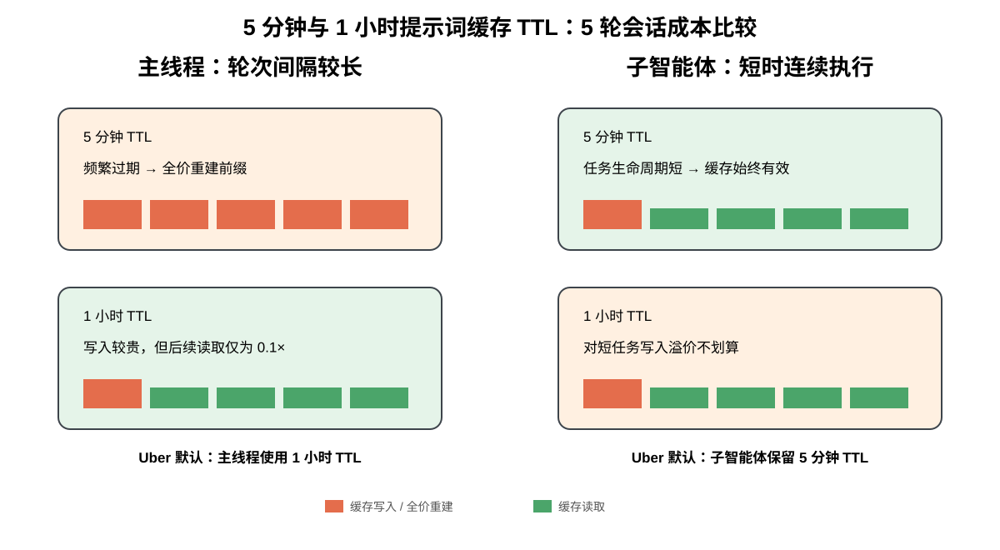

*图 6：分别采用两种 TTL 时，5 个轮次的成本比较。*

工程师经常让交互会话闲置超过 5 分钟，因此我们把默认 TTL 从 5 分钟改为 1 小时。此前，这些频繁的空闲间隔会让前缀缓存失效，被迫按全价重建上下文。相比之下，子智能体仍使用 5 分钟缓存 TTL，因为它们只专注于一项生命周期很短的任务。

#### 通过 Shell 执行 MCP 工具

在 Uber，所有 MCP（模型上下文协议）交互都经由统一网关路由。这个入口囊括了 1000 多台内部及第三方 SaaS MCP 服务器，可以集中执行认证和策略。

然而，标准 MCP 会把所有工具模式直接载入每场会话，不管工程师最终是否会调用。比如，安装 100 多个工具，会在初始提示词中额外加入约 5 万至 7 万个模式令牌；此后每个上下文轮次都要再次发送这些内容。

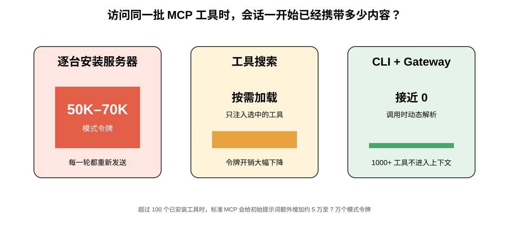

*图 7：使用三种方式访问同一批工具时，智能体在会话开始阶段已经携带的内容。*

为解决上下文膨胀，我们引入了两种互补的优化机制：

- **CLI 工具解析。**用模型执行 Shell 命令取代 MCP 直接集成。CLI 在调用时动态解析所需工具并经网关执行，因此 Uber MCP 的模式完全不会进入会话上下文。内部 MCP Gateway 的 1000 多个 MCP 工具，全部投射为 CLI 命令。
- **工具搜索。**让模型搜索工具目录，并只按需加载所需工具，从而扩展到数千个工具。这通常能减少工具定义的令牌用量，缓解上下文膨胀；即使可用工具库不断扩大，也能维持很高的选择准确率，避免大工具集导致能力退化。

#### 代码模式

当工具把函数直接作为 Shell 命令调用时，模型可以在一段脚本中批量执行多个操作。对于交互频繁的工具协议，这种批处理尤其有利。标准 MCP 工作流的每个动作都需要单独一轮模型交互：发出请求、把原始响应载入上下文窗口，再按顺序处理结果。以一次 SQL 查询为例，执行过程需要提交请求、轮询状态 2～5 次，然后获取输出。

代码模式把整套流程压缩进自动化 Python 循环，不让中间轮询进入模型的活跃上下文。如图 8 左侧所示，传统路径中模型参与轮询循环，每条响应都会进入上下文；右侧则由子进程执行循环，只把摘要返回给模型。

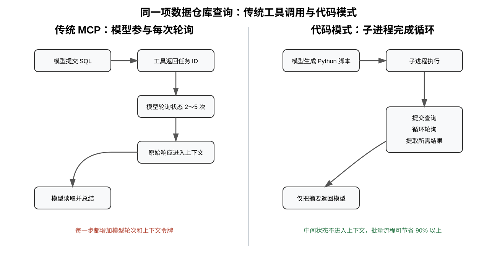

*图 8：用两种方式执行同一项数据仓库查询。*

我们在同一场会话中，分别通过两条路径执行了 5 项相同 SQL 查询，结果如下：

| 查询 | LLM 工具调用 | 代码模式 | 节省 |
|---|---:|---:|---:|
| `SELECT 1`（1 行） | 903 | 402 | 55% |
| `COUNT(*)`（1 行） | 954 | 403 | 58% |
| `GROUP BY LIMIT 20`（20 行） | 1,600 | 457 | 71% |
| `SHOW COLUMNS`（175 行） | 2,200 | 900 | 59% |
| `SELECT *` 宽表（50 行） | 1,431,594 | 900 | 约 100% |

以上为同一场 Claude Code 会话中测得的每次查询令牌数。

前三行揭示了最主要的发现：哪怕结果集极小，远低于响应大小上限，代码模式仍能把令牌用量降低 50% 以上。这种效率并不是通过绕开大型数据载荷实现的，而是来自消除模式初始化、多轮轮询和重复逐步推理等不必要开销。

批量工作流会进一步放大效果：原本需要 N 轮模型交互的循环，会变成一段脚本，节省幅度可以累积至 90% 以上。我们已经为访问最频繁的 MCP 服务器部署了 25 项以上预构建代码模式技能，确保标准工作流默认走成本效率最高的路径。

#### SaaS MCP

第三方软件比内部服务器难管理得多。厂商无法预知各客户会如何使用自己的产品，因此往往把 MCP 服务器设计成暴露完整产品能力。例如，一套办公空间产品会在一台服务器里打包 49 个工具，占用约 2.2 万个模式令牌；消息和项目跟踪厂商则分别提供 34 个和 46 个工具。

只需加载两三台厂商服务器，用户甚至还没输入提示词，智能体携带的模式开销就已经超过正在编辑的文件本身。

为解决这一问题，我们使用与内部 MCP 相同的机制，通过 MCP Gateway 路由 SaaS MCP 服务器；同时把这些 MCP 全部暴露为任意智能体界面都能调用的 CLI。除此之外，我们还在代码模式插件中为每台服务器编写专用技能，封装常用工作流。由此，我们为众多 SaaS 厂商打通了高效的智能体工作流。

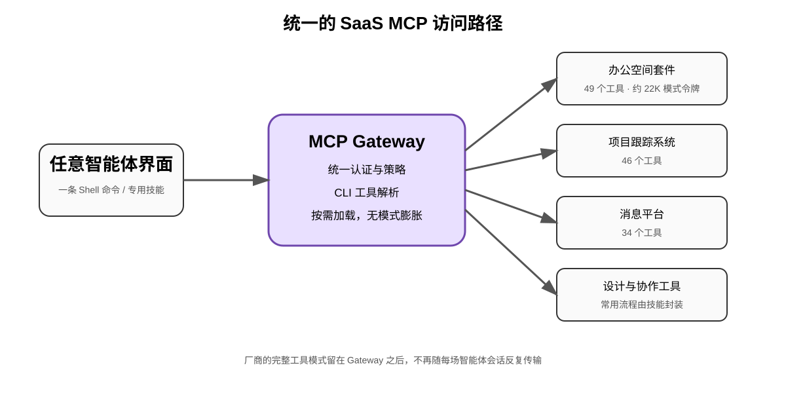

*图 9：所有 SaaS MCP 服务器都置于 MCP Gateway 之后，形成统一、高效的访问模式。*

### 优化每轮请求数

缺少可靠依据的智能体不会快速、低成本地失败，而是缓慢失败：它不断重发越来越大的上下文窗口，只为再搜索一个位置。预先提供更丰富的信息，依然是减少这种搜索开销最有力的单一杠杆。

#### 上下文工程

Uber 庞大的代码库与数据生态包含数亿行代码和数千张数据表，智能体的大多数轮次都花在寻找信息，而不是生成代码。为此，我们构建了 AI Context Graph：一张包含 2400 万个节点、8000 万条边的统一网络，覆盖 86 种节点类型和 117 种边类型。

它整合了 30 多个内部系统的数据，包括服务、工程团队、事故日志、拉取请求、架构设计文档、部署、数据集，以及数据表的历史使用查询；任何智能体都可以用自然语言查询这张图谱。

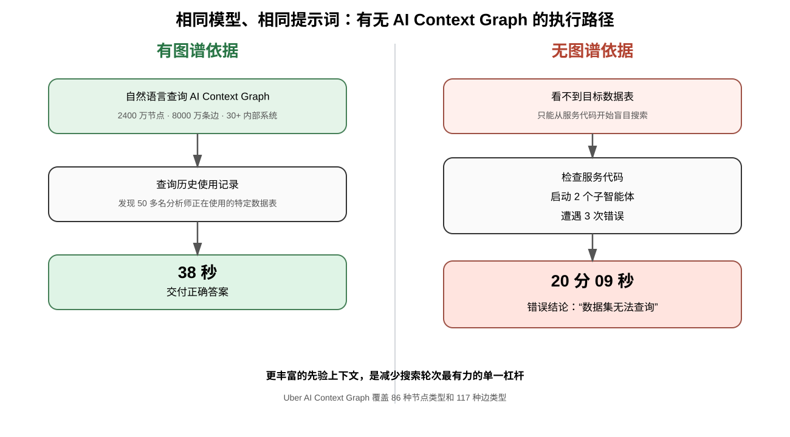

*图 10：对同一模型提交完全相同的提示词，比较有无图谱依据时的执行路径。*

获得图谱依据的智能体查询了历史使用情况，找到了 50 多名分析师实际使用的特定数据表，并在 38 秒内交付答案。没有图谱依据的智能体看不到这张表；它花了 20 分钟检查服务代码，启动 2 个子智能体，遭遇 3 次错误，最后错误地得出“该数据集无法查询”的结论。

### 可见性与教育

这一部分的杠杆是可见性与反馈循环，帮助工程师和智能体更快收敛。

#### 状态栏

我们在执行框架的状态栏中加入了实时成本计数器，持续显示每套框架的当前支出，以及每位用户跨全部框架的总支出。

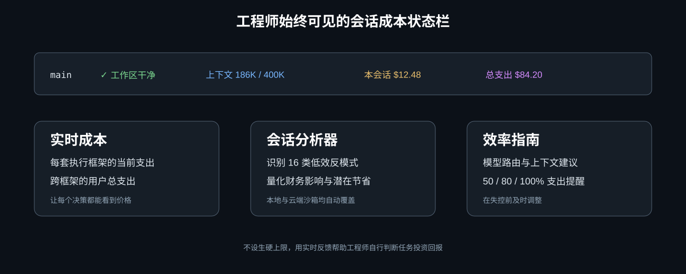

*图 11：状态栏，以及与它一同提供的会话分析器和效率指南。*

#### 可见性与支出分层

为了避免设置硬性上限，我们实施了实时支出跟踪和自动提醒：

- **状态栏实时计数器。**会话当前成本始终显示在终端中。
- **执行框架共享额度池。**所有交互式框架共用一个层级，而不是每个工具各有一套预算；托管智能体使用单独层级。
- **Slack 提醒。**支出达到预期的 50%、80% 和 100% 时发出提醒，让工程师有时间规划。
- **简便的审批流程。**由经理批准提升支出层级，并快速生效。
- **成本检查技能与提示。**仪表盘技能可按需拆解成本，实时状态栏则给出指导。

这些措施既让工程师可以自行评估任务的投资回报，也能减轻支出失控的问题。

#### 会话分析仪表盘

状态栏会显示一场会话的总支出，却无法解释成本驱动因素，也不会提供可执行的效率改进步骤。通用指南只能给出高层原则，无法评估每位开发者的具体工作流。会话分析仪表盘直接检查会话产物，填补了这项空白。

它直接内置于运行时，不需要任何设置或主动加入。执行成本仪表盘技能后，系统会分析该用户在本地及远程云端沙箱、所有执行框架中的全部会话轨迹。它不会只给一个汇总指标，而是会在会话中标出 16 类反模式，并为每一类给出财务影响和针对性补救措施，其中包括：

- **次优模型路由：**使用 Opus 执行 Sonnet 完全足以胜任的简单多轮会话。
- **上下文窗口膨胀：**大型 MCP 载荷（例如 40KB 响应）一直留在上下文中，在后续轮次被重复计费。
- **缓存过期低效：**长时间中断后继续会话，过期的提示词缓存迫使系统按全价重建前缀。
- **提示词初始化开销：**用户尚未输入任何内容，就预先加载 10 万个系统指令和工具定义令牌。

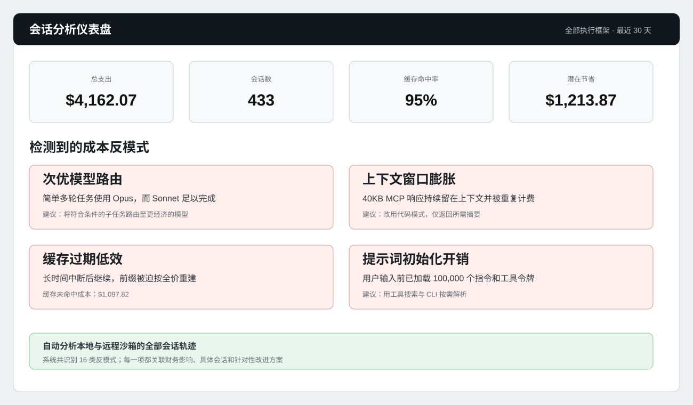

*图 12：会话级成本仪表盘识别浪费模式和潜在节省。*

### 下一步

目前正在推进的工作包括：

- **扩充托管智能体机群。**每增加一个新智能体，我们都遵循一致的路线图：确定目标成果指标、组装评测基准、找出帕累托最优模型。这套系统化方法旨在把软件开发生命周期的每个阶段推向软件工厂成熟度模型的更高层。
- **动态模型路由。**我们正在扩展基准覆盖范围，纳入更多编程语言、代码仓库和智能体形态。模型能力差异很大，因此有效的模型路由高度依赖全面评测。
- **深化上下文图谱集成。**让更多自主智能体具备图谱查询能力。
- **把会话分析升级为实时开发者指导。**从定期批量检测反模式转向持续监测轨迹，将个性化、实时的效率建议直接交付给工程师。
- **持续改进技能。**我们正在开发一种自动化方法：记录智能体技能执行中的细小摩擦点，并根据收集到的轨迹自动生成技能更新。

## 结语

管理并抑制不断上涨的 AI 编程支出，同样是一项可以解决的工程问题。我们没有只依赖更低的单位价格，也没有通过降级工具来节省成本，而是消除那些浪费、不能创造价值的令牌消耗。由此，我们在把使用规模扩大 7 倍的同时，降低了各项单位成本，并提高或维持了输出质量。

核心战略转变，是从交互式开发者工作流走向全托管智能体。把软件开发生命周期中的工作负载迁移到托管环境后，我们便能完全控制模型路由、执行框架和运维支出。优化一支由专用托管智能体组成的机群，让每个智能体分别配备专属评测基准和帕累托高效模型，天然比逐一优化数千名工程师的终端会话更节省成本，也更容易扩展。

### 致谢

这是许多工程师共同努力的成果。他们正在构建最有效率的基础模块，以便在 Uber 的规模下实现软件工厂，同时确保花掉的每一个令牌都能带来投资回报。

感谢参与软件工厂各项核心工作的团队成员：Abhishek Bhatia、Adam Huda、Aditya Patel、Alok Srivastava、Ameya Ketkar、Anil Purohit、Atakan Kandemir、Ben Chou、Brandon Barker、Danielle Yim、Deepanshu Mehndiratta、Gaurav Gill、Israel Marban、Jason Varbedian、Karen Xu、Lei Shi、Mager Mager、Meghana Somasundara、Peng Liu、Preet Inder、Qiushen Wang、Rush Tehrani、Shesh Patel、Shiven Tripathi、Shubham Gupta、Stas Khalup、Ting Chen、Tse-Shi Wang、Ty Smith、Vikram Hullukunte、Viv Keswani、Weiqiang Wang、Will Bond。

也感谢 Johannes Gehrke、Mattie Toia、Sumanth Sukumar 和 Praveen Neppalli Naga 的领导。

封面图片署名：Himer Romana。

Anthropic® 是 Anthropic PBC 的注册商标。Claude Code™ 和 Claude® 是 Anthropic, PBC 的商标。OpenAI® 及其徽标是 OpenAI® 的注册商标。

## 作者

**Uday Kiran Medisetty** 是 Uber 杰出工程师，负责领导工程生产力相关项目，包括智能体编程、AI 调试、代码审查和大规模重构。他还共同领导全公司工程社区，参与塑造 Uber 的架构、文化与标准。
