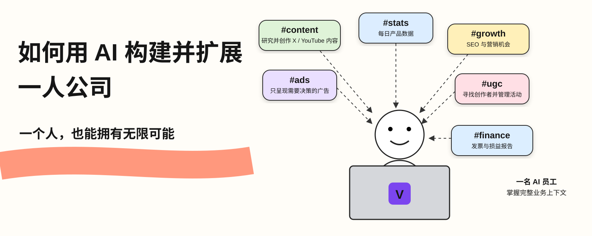
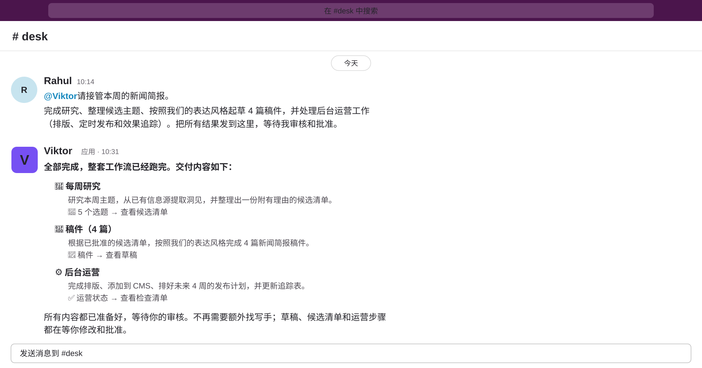
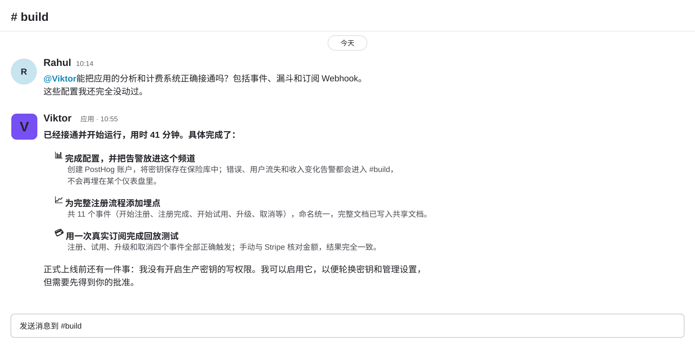
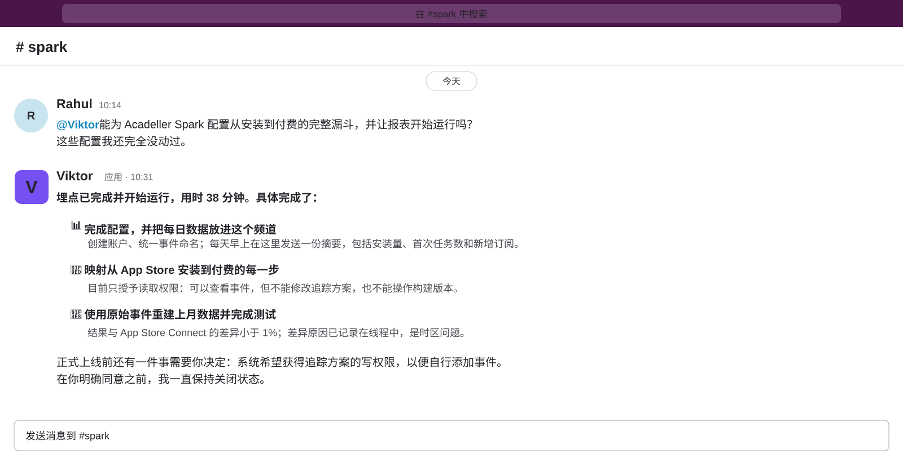

# 如何用 AI 构建并扩展一人公司

> 作者：Rahul（[@sairahul1](https://x.com/sairahul1)）  
> 原文：[How to Build & Scale One Person Business with AI](https://x.com/sairahul1/status/2101967454926930097)  
> 翻译 Url：[https://github.com/samz406/local_wenzhang/blob/main/docs/如何用AI构建并扩展一人公司/如何用AI构建并扩展一人公司.md](https://github.com/samz406/local_wenzhang/blob/main/docs/如何用AI构建并扩展一人公司/如何用AI构建并扩展一人公司.md)  
> 发布日期：2026 年 9 月 21 日



我开发产品、创作内容、投放广告、处理客户支持，还要撰写商业合作内容。

工作很多，做事的却只有一个人。

很长一段时间里，我每天有 60% 的时间，都耗在那些根本不需要动用我脑力的工作上。

查看数据、寻找内容选题、拉取广告报表、催收发票。

这些事情必须有人做，却不是非我不可。

一开始，我采用了最显而易见的委派方式：给 AI 安排一堆彼此独立的提示词和自动化任务。

结果，这反而给我增加了一份新工作。

我仍然要记住该做什么、逐一启动任务、补充上下文、检查输出，还要在不同工具之间来回搬运结果。

这不叫委派工作，只是换成了由我来管理一堆 AI 工具。

于是，我把这些事情全部交给了一名 AI 员工。

他叫 Viktor。

他住在 Slack 里，能够从头到尾接管一项工作，处理周期性任务，带着完成的结果回来，并且在任何内容对外发出之前，等待我的批准。

Viktor 负责重复性的执行工作，也负责处理临时需求。

而决策权仍然掌握在我手里。

做什么产品、发布什么内容、把钱花在哪里、哪些机会值得投入——这些才是我负责的事。

这套方式每天轻松为我节省两三个小时以上。

而且，因为所有工作都在 Slack 里完成，所以即使人在外面，我也可以直接用手机上的 Slack 和 Viktor 交流，让业务继续运转。

下面是我用来管理几乎整个公司的 6 个频道。整套结构大约 5 分钟就能搭起来。

把这篇文章存好，你会用得上。

---

## AI 工具与 AI 员工的区别

大多数 AI 工具，只能让你更快地完成某一项任务。

你仍然要打开工具、编写提示词、把输出粘贴到其他地方，然后再关掉页面。

AI 员工接手的是整份工作。

你只需要在工作原本所在的 Slack 频道里，用自然语言描述要做的事。

他会读取上下文、完成工作，再带着完整的交付物回来。

你可以批准，也可以让他返工。

没有你的明确同意，任何东西都不会对外发出。

真正改变你一周工作方式的，正是从“工具”到“员工”的这一步转变。

---

## 整套配置：6 个频道，覆盖整个公司

```text
#content → 为 X 和 YouTube 做研究与内容创作
#stats   → 每日产品数据、增长、客户和使用情况
#growth  → 营销创意、SEO 和竞品分析
#ads     → Facebook 与 Google 广告决策
#ugc     → 寻找创作者、撰写任务简报、管理活动
#finance → 发票和损益表
```

一个 AI 员工掌握完整的业务上下文，并在所有频道之间共享。

我可以在任何频道里问他任何问题，他已经知道整件事情的全貌。

这就是 Viktor：一名在 Slack 内工作的 AI 员工，可以连接 3,200 多种工具，并在整个工作区共享上下文。

下面看看每个频道实际是怎样运作的。

---

## 频道一：`#content`

*每天早上，在你打开电脑之前，完成 X 和 YouTube 的选题研究与内容创作准备。*



过去，我每天要花一个小时寻找内容选题。

浏览 X、新闻简报和 Google，检查哪些内容表现不错，看几段 YouTube 视频，再想办法把这些信息和自己真正关注的方向联系起来。

现在，这些工作在我开始上班之前就已经完成了。

Viktor 会扫描我关注的账号和主题，核对我已经发布过的内容，然后寻找我能够补充的新角度，而不是简单重复那些已经流行起来的观点。

每个工作日上午 8 点，下面这份内容包会自动出现在 `#content`：

```text
每个工作日上午 8:00，准备一份内容包。

使用我置顶的定位说明、表达风格规则、X 内容档案、
YouTube 内容档案和当前内容优先级。

1. 扫描已连接的 X、YouTube 和信息源
2. 找出符合我关注主题的内容想法
3. 寻找有证据表明受众感兴趣的 YouTube 选题
4. 检查每个想法是否已经被我写过
5. 说明我还可以补充什么独特角度
6. 使用一手来源核验重要主张

返回：
- 10 个 X 选题，每个附一句话切入角度
- 每个选题的来源，以及它为什么此刻值得关注
- 3 个有受众兴趣证据的 YouTube 选题
- 每条视频可能采用的标题和角度
- 仍然需要核实的主张

不要发布或安排任何内容。
```

上午 8:15，我打开 `#content` 时，一份经过研究的选题清单已经摆在那里。

我只要花 10 分钟决定接受、否决还是继续发展某个选题。

每天四处寻找选题的工作消失了。

有时，我只需要 @Viktor，让他去 Google 和各类新闻简报中寻找最新 AI 新闻，再按照我的风格创作内容。

仅仅是寻找合适的爆款内容和开头钩子，每天就能为我节省大约 30 分钟。

---

## 频道二：`#stats`

*每日汇总产品数据、增长、客户和使用情况，也可以随时追问任何问题。*



这是我每天早上第一个查看的频道。

不是因为我必须手动触发什么，而是因为结果早已在那里等着我。

Viktor 每天早上会从我连接的产品数据库、分析工具和支付工具中拉取数据，只返回真正重要的指标：

```text
每个工作日上午 7:30，准备每日业务简报。

使用已连接的分析工具、产品仪表盘和计费工具。

报告：
- 今日新增注册数，与昨日及过去 7 天平均值对比
- MRR：当前值、较昨日的变化、本周变化
- 活跃用户：DAU、WAU 及其变化
- 流失：过去 24 小时内是否有取消，能获取时附上原因
- 今日实收收入
- 相比过去 7 天出现的任何异常

标记：
- 相比过去 7 天平均值，上升或下降超过 15% 的项目
- 错误量激增或客服请求增加
- 今天需要作出决定的任何事项

返回一条清晰的 Slack 消息。
不要图表，只要数字和异常标记。
```

而真正改变工作方式的地方在于：

**我可以在这个频道里问他任何问题。**

```text
我：“过去 30 天，有多少用户来自 YouTube？”

我：“自然渠道用户和付费渠道用户的留存曲线分别是什么样？”

我：“哪个定价方案的流失率最低？”
```

他会读取我连接的数据，然后直接给出答案。

不需要写 SQL，不需要在仪表盘里到处翻，也不用等别人帮我拉报表。

我在 Slack 里提问，他就在 Slack 里回答。

在尝试 Viktor 之前，我从没认真想过 AI 还能怎样帮助我改善业务指标。它不只是报告数字，还会建议我应该改进哪里，以及具体可以怎样改。

---

## 频道三：`#growth`

*每周提供营销创意、SEO 机会和竞品分析。*

这个频道每周运行一次，给我一份按优先级排序、真正值得做的事情清单。

不是“这里有 50 个想法”，而是一份有证据支撑的短名单。

```text
每周一上午 9:00，准备每周增长简报。

使用已连接的分析工具、SEO 工具和网络研究。

1. SEO 机会
- 我排名第 4 至第 15 位的关键词，即能够快速取得进展的机会
- 竞争对手已有排名、而我尚未覆盖的关键词
- 具有流量潜力、但需要更新的页面
- 返回最值得做的 5 个机会，并附搜索量和难度

2. 增长实验
- 根据我的细分市场当前真正有效的方法提出实验
- 为每个实验提供一句话假设
- 说明需要衡量什么，以及如何判断实验有效
- 返回本周最值得开展的 3 个实验

3. 竞品动向
- 检查我置顶的竞品清单中，是否出现新内容、产品变化或定价调整
- 标记任何需要我们作出回应的变化

每个部分返回一份简报。
按照投入产出比排序。
未经批准，不得执行任何操作。
```

周一早上，我只花 15 分钟决定真正要采取哪些行动。

而他用整个周末完成了研究。

我会让他从中选出当天最好的想法，然后完成构建和部署。

这是一套非常简单的产品 SEO 工作流，但实际效果很好。而且我用手机上的 Slack 就能完成这一切。

---

## 频道四：`#ads`

*管理 Facebook 和 Google 广告，但只呈现那些真正需要你作决定的活动。*



我过去常犯的错误，是检查每一个广告活动。

你不需要看到所有活动，只需要看到那些发生了变化的活动。

Viktor 会按照我设定的目标检查所有广告活动，只把需要关注的项目返回给我：

```text
每个工作日上午 9:00，检查已连接的 Facebook 和 Google
广告账户中的全部活跃活动。

当我临时提出要求时，也执行同样的检查。

使用每个账户中置顶的目标、决策阈值、预算规则和归因说明。

针对每个广告活动：
1. 报告花费、转化数、CPA、ROAS、CTR、CPM 和频次
2. 与目标及此前 7 天的数据对比
3. 确认花费是否已经足以支持有效决策
4. 标记效果下降或素材疲劳
5. 提议：保持、暂停、放量，或测试新素材

返回：
- 每个账户一行摘要
- 只列出需要决策的广告活动
- 触发标记的指标和阈值
- 建议执行的具体改动
- 预期效果和主要风险

未经批准，不得暂停、启动活动或调整花费。
```

目标只需要设置一次。

他会持续监控账户、标记变化、提出行动建议，并在我批准之后执行。

我还可以在同一个对话里要求更多变体、调用 API 生成素材，并调整参数。

---

## 频道五：`#ugc`

*寻找创作者、撰写合作简报，并管理整场活动。*

过去，UGC 是我所有工作中最需要反复协调的一项。

寻找创作者、审核人选、撰写简报、持续跟进、审查内容、批准或驳回。

每一步都要手动完成。

现在，我只需要在 `#ugc` 里写下任务，Viktor 就会接管整条流水线：

```text
UGC 流程：在我提出要求时运行

寻找创作者：
搜索 [细分领域] 中符合下列条件的创作者：
- 在 [平台] 上拥有 [粉丝数量范围] 的粉丝
- 互动率高于 [X%]
- 最近发布过 [品类] 相关内容
- 没有明显的竞品合作

针对每位创作者返回：
- 账号名称和平台
- 粉丝数和互动率
- 最近 3 条内容及其播放量
- 为什么适合本次活动
- 一份邀约消息草稿

未经批准，不得联系任何人。

给创作者发送简报（在我批准名单之后）：
为 [活动] 撰写一份 UGC 简报：
- 必须抓住的开头钩子
- 核心信息与证明点
- 画面中需要展示什么
- 绝对不能说什么
- 交付格式和截止日期

审查内容（收到投稿之后）：
对照简报检查每份投稿。
返回：通过 / 需要修改 / 驳回。
需要修改时给出具体意见。

未经我审核，不得批准付款。
```

我告诉他需要什么活动，他负责寻找创作者；我批准名单，他发送简报；投稿回来后，他按照简报逐项审核，最后由我拍板。

整套流程由他运转，决策由我完成。

---

## 频道六：`#finance`

*每周五检查未结发票和损益表。*

一条消息，每周一次，包含我需要的全部数字。

```text
每周五 14:00，准备财务复盘。

使用已连接的发票与会计记录。

检查：
- 逾期发票：金额、逾期天数、联系人
- 未来 7 天内到期的发票
- 本月收入与上月对比
- 本月支出与上月对比
- 营业利润及其相对上月的变化
- 任何需要我审核的记录

返回：
- 每张未结发票，以及对应的跟进消息草稿
- 本月损益摘要
- 环比变化最大的项目
- 任何需要作出决定的事项

未经批准，不得发送跟进消息或修改任何记录。
```

我已经好几个月没有亲自催过发票了。

每周五下午 2 点，所有跟进消息都已经拟好，只等我点击确认。

发送邮件、设置提醒、修改任何系统中的数据或元数据，都只需要开口让他去做。

---

## 共享上下文如何把一切连接起来

6 个频道，1 名员工，共享一幅完整的业务全景图。

```text
共享上下文：置顶，并在所有频道中读取

→ 你的产品是什么、为谁服务
→ 你的定位和表达风格，并附真实示例
→ 你当前的目标，以及明确拒绝做什么
→ 已批准的品牌规则和已否决的内容角度
→ 活动目标、预算规则和归因设置
→ 广告与 UGC 的理想客户画像：谁会购买、他们尝试过什么
→ 决策日志：你批准或否决过什么，以及原因
```

只有当业务发生变化时才更新它，不必每周修改。

当 `#stats` 标记出流失率突然上升时，`#growth` 可以把它纳入判断，重新决定哪些实验最重要；当 `#ugc` 发现某个创作者角度表现不错时，`#content` 可以把它改编成 X 和 YouTube 内容。

他掌握整个公司的全貌，每个频道只是向你展示其中一部分。

---

## 审批规则：什么可以自动运行，什么必须等待

```text
自动运行：不需要批准

→ 每日数据简报
→ 内容研究与选题清单
→ SEO 机会扫描
→ 广告活动监控与异常标记
→ 创作者寻找与审核
→ 财务监控

始终需要你的批准：

→ 发布或安排任何内容
→ 修改任何广告活动的花费
→ 向任何创作者发送邀约
→ 发送任何发票跟进消息
→ 批准 UGC 投入使用或付款
→ 修改任何财务记录
```

研究、检查和起草可以自动完成。

发送、花钱和发布则必须等待批准。

正是这条边界，让整套系统拥有足够的可信度，可以真正运行起来。

---

## 如何开始

不要在第一天就把 6 个频道全部搭起来。

```text
第一周：只做一个频道

1. 把 Viktor 添加到你的 Slack
   → viktor.com（已有 50,000 多个工作区，支持 3,200 多种工具）
2. 为当前最耗费你时间的工作创建一个频道
3. 连接这个频道需要的工具
   → 大多数工具可以通过 OAuth 一键连接
4. 在频道中置顶你的上下文
5. 参考前面的模板写一份任务简报
6. 先手动运行，直到输出真正可用
7. 加入审批边界
8. 设置定时运行
9. 只有当这个频道能够可靠地独立运行时，才添加下一个频道
```

有效的搭建顺序是：

→ 从 `#stats` 或 `#content` 开始：频率高、容易检查，而且只涉及内部信息。

→ 当你开始信任输出后，再增加 `#growth` 和 `#ads`。

→ 最后增加 `#ugc` 和 `#finance`，因为它们涉及对外沟通和资金。

---

## 系统运转起来之后，会发生什么变化

```text
以前：

数据   → 每天早上由你手动检查仪表盘
内容   → 花 60 分钟四处寻找选题
广告   → 你想起来就检查，想不起来就不检查
UGC    → 整条流程都由你亲自协调
财务   → 什么时候想起来，什么时候催发票
增长   → 偶尔想到什么，就做什么

以后：

数据   → 7:30 自动送达，还能在频道里随时追问
内容   → 8:15 已经有 10 个研究过的选题等着你
广告   → 只标记那些真正需要决策的活动
UGC    → 流程自动运转，你在每个关口审批
财务   → 每周五都有拟好的跟进消息等待确认
增长   → 每周一收到有证据、有优先级的简报
```

从此，瓶颈不再是生产执行。

瓶颈会变成你的判断、你的决策，以及你与他人的关系。

当运营工作已经有人接管时，一人公司真正的样子就是这样。

---

如果这篇文章对你有帮助：

→ 转发给你认识的每一位开发者和独立创始人。

→ 关注 [@sairahul1](https://x.com/sairahul1)，获取更多类似系统。

→ 收藏这篇文章：这 6 份频道任务简报拿来就能使用。

我长期写 AI、产品构建，以及那些能在你睡觉时继续运转的系统。

可以在 [@viktor_com](https://x.com/viktor_com) 免费试用：赠送 100 美元额度，无须绑定银行卡。完整链接在原帖第一条回复中。

*（付费合作）*
