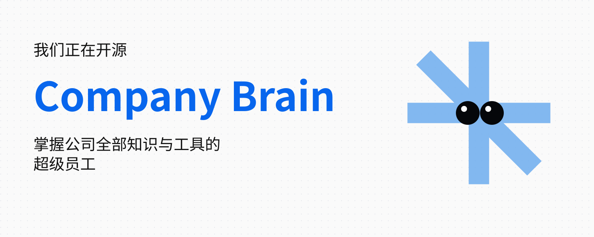
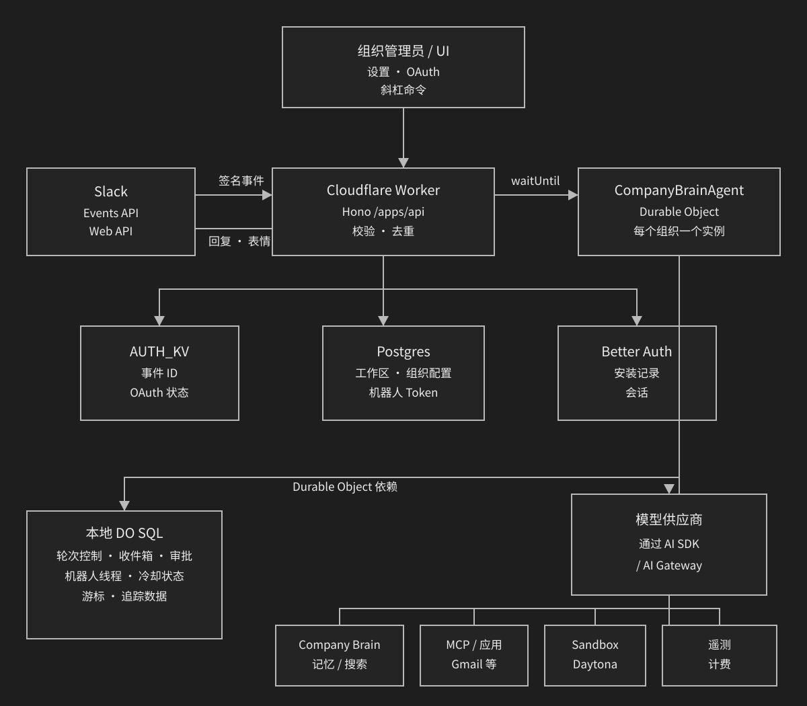
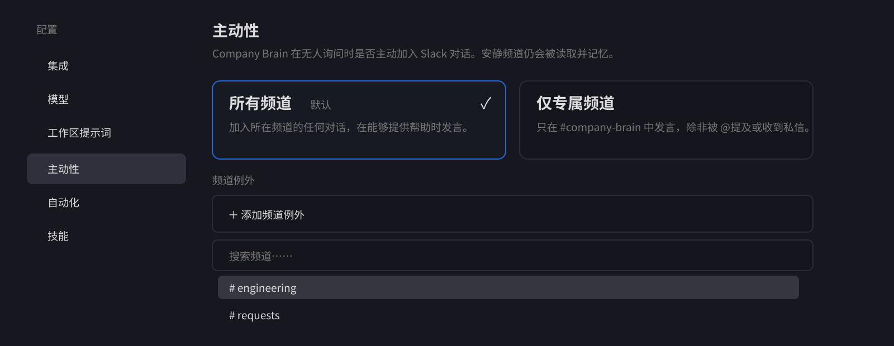
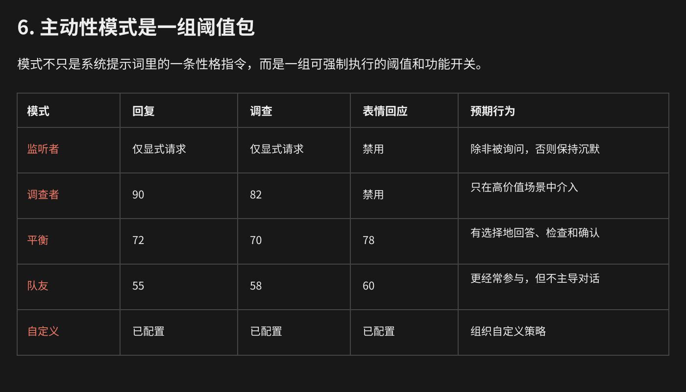
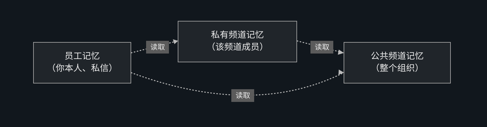

# 我们将“公司大脑”开源：多人协作框架是这样设计的

> 作者：Dhravya Shah（[@DhravyaShah](https://x.com/DhravyaShah)）  
> 原文：[We're open sourcing the company brain, Here's how we designed the multi-player harness](https://x.com/DhravyaShah/status/2103668051468300701)  
> 翻译 Url：[https://github.com/samz406/local_wenzhang/blob/main/docs/开源公司大脑/我们将公司大脑开源-多人协作框架的设计.md](https://github.com/samz406/local_wenzhang/blob/main/docs/开源公司大脑/我们将公司大脑开源-多人协作框架的设计.md)  
> 发布日期：2026 年 9 月 25 日



我们停止维护 Company Brain 框架才两周。当时不得不把大量用户迁移到其他产品，但许多客户以及其他人都建议我们，把 Company Brain 的成果开源出来。

所以，我们决定开源。你可以在这里使用它：

[https://github.com/supermemoryai/company-brain](https://github.com/supermemoryai/company-brain)

它支持一键部署到 Cloudflare，整个设置过程不到 5 分钟，而且所有数据都归你所有：[一键部署](https://deploy.workers.cloudflare.com/?url=https://github.com/supermemoryai/company-brain)。

这篇文章想讲清楚它的整体架构，以及我们——主要是传奇人物 [@maheshthedev](https://x.com/maheshthedev)——在这套框架上完成的一部分工作。说实话，这个工程做得非常棒：它构建在 Cloudflare Agents SDK 之上，在权限管理、主动介入等方面藏了许多有意思的小设计。也感谢 [@threepointone](https://x.com/threepointone) 带来的 Cloudflare Agents！

至于我们为什么停掉这个产品，可以看下面引用的文章。长话短说：我们希望打造世界上最好的记忆系统，并在这件事上做到全球第一。

> 我们将停止提供 Company Brain 和 Personal Brain 产品，所有受影响的用户都会获得退款。接下来，我们会把全部精力用于继续建设面向智能体的前沿记忆 API。  
> ——[《Supermemory 的一次更新》](https://x.com/DhravyaShah/status/2098212180831473840)

> 和 X 上其他一些博客不同，这篇不会是 AI 批量制造的垃圾内容。文章会有点长，因为我要把我们几个月的工作压缩成一系列简单的架构决策。这些内容都是我自己写的，欢迎在评论区留下任何反馈！这次我不打算用大段文字把你讲困，而是放了大量图示和 ASCII 流程图，应该会读得挺有意思。

## 设计一个队友，而不是一个机器人

说到 Slack 机器人或智能体，大多数人脑中只会浮现一种模式：“给它一个提示词，它执行任务，然后回复结果。”

我们围绕完全不同的前提打造了 Company Brain：它不只是给出答案，还会自行判断什么时候应该参与，收集正确的上下文，在恰当的隐私边界内行动；它能够执行耗时极长的任务，有时也只做一次最小却最有价值的介入。

Company Brain 框架是包围模型的一整套运行时、策略层、记忆边界、工具系统和对话协议。它把模型的原始能力转化为一名可靠队友的行为：有人提问时及时响应；有选择地主动介入；能够调查问题；该安静时保持沉默；基础设施故障后还能恢复。

### 整体体验

语言模型可以分类消息、调用工具，也可以写出流畅的回答，但它天生并不知道下面这些事。

这是一个多人协作智能体，所以我们必须处理一些多人场景特有的问题：

- 如何根据 Slack 事件主动行动，包括从语音讨论和笔记中学习。
- 机器人是否获准在当前频道发言。
- 某个记忆容器能否被安全检索。
- 应该采用怎样的审批与访问控制策略，例如发邮件之前要不要审批；审批过多同样糟糕。
- 新消息是否已经取代当前请求，包括转向控制及其周边逻辑。
- 模型生成的“正在处理”究竟是进度消息，还是最终回答。
- 如果运行时在工具调用进行到一半时消失，应该怎样恢复。
- 什么时候沉默才是正确结果——说白了，就是什么时候该闭嘴。

```text
┌──────────────────────────────────────────────────────────────┐
│                    COMPANY BRAIN 体验                         │
├──────────────────────────────────────────────────────────────┤
│ Slack 交互                                                    │
│ @提及 · 私信 · 线程 · 表情回应 · 进度更新 · 审批卡片          │
├──────────────────────────────────────────────────────────────┤
│ 框架层                                                        │
│ 路由 · 状态 · 策略 · 记忆范围 · 工具 · 并发                   │
│ 恢复 · 预算 · 副作用 · 遥测                                   │
├──────────────────────────────────────────────────────────────┤
│ 模型层                                                        │
│ 分诊 · 主推理 · 分类器 · 补救生成 · 实体解析                   │
├──────────────────────────────────────────────────────────────┤
│ 基础设施                                                      │
│ Cloudflare · Postgres · AI Gateway · 模型供应商 · 已连接应用  │
└──────────────────────────────────────────────────────────────┘
```

### 我们的架构

整套系统完全构建在 [Cloudflare](https://x.com/Cloudflare) 上。团队对它有经验；无论对我们还是对智能体，它都提供了最好的开发体验；扩展能力也非常强。使用 Agents SDK 后，我们还能直接获得大量开箱即用的能力。



`CompanyBrainAgent` 是系统核心：一个以组织 ID 为键的 Cloudflare Durable Object。它负责：

- 基于 Fiber 的执行轮次生命周期与恢复检查点。
- 使用持久化本地 SQL 保存活跃轮次、收件箱、审批、机器人线程、冷却状态、滚动游标和追踪数据。
- 解密机器人 Token 后执行 Slack API 操作。
- 消息分诊、主动性判定与动作评估。
- 主模型与工具的循环。
- 审批流程的挂起与恢复。
- 计费与遥测任务调度。

好，现在骨架有了。接下来看看一个事件从 Slack 进入后会发生什么。

事件可能属于以下几类：

- **显式事件：**`@提及`、私信、助手线程或名字唤醒。
- **被动事件：**某个允许主动介入的频道中出现的顶层消息。
- **仅作上下文：**应该保留，但不应该在 HTTP 路由层直接回复的对话。
- **忽略：**机器人或自身流量、不支持的子类型，以及不符合条件的事件。

系统会根据这些条件进行分类：

```text
Slack 消息
   │
   ├─ 机器人或自身消息？ ─────────────────────────────► 丢弃
   ├─ 不支持的子类型？ ───────────────────────────────► 丢弃
   ├─ 明确发给其他人？ ───────────────────────────────► 记作上下文 / 丢弃
   ├─ 成员资格或权益校验失败？ ───────────────────────► 通知 / 丢弃
   ├─ 只有表情的被动消息？ ───────────────────────────► 丢弃
   ├─ 安静频道且并非显式请求？ ───────────────────────► 丢弃
   ├─ 主动介入仍在冷却期？ ───────────────────────────► 丢弃
   └─ 已有活跃轮次运行？ ─────────────────────────────► 转向控制闸门
                                                               │
                                                               ▼
                                                        可进入消息分诊
```

### 只在必要时开口

我们非常在意机器人每次出现究竟能产生多大价值。我们试过的许多公开智能体都很“主动”，但说实话，它们根本不该那么主动——很快就会令人厌烦。

一个主动型智能体必须回答两个问题：

- **它能不能做一件有用的事？**
- **它现在是否应该打断这场对话？**

最初，我们用“是或否”来判断是否主动介入，但许多情况并不是非黑即白。这个方案逐渐演变成置信度模型：由一个小模型评估多个维度，再根据不同阈值作出决定。

```text
消息 + 上下文
      │
      ▼
┌────────────────────────────┐
│ 分诊模型：评估当前局面     │
│                            │
│ 有用性 · 置信度 · 紧迫性   │
│ 噪声 · 打断成本            │
│ 调查价值 · 表情回应适配度   │
└──────────────┬─────────────┘
               │ 各项得分 0–100
               ▼
┌────────────────────────────┐
│ 确定性评估器               │
│ 公式 + 模式策略            │
│ 显式消息规则               │
└──────────────┬─────────────┘
               │
       ┌───────┼──────────┬──────────┐
       ▼       ▼          ▼          ▼
     回答     调查       确认       跳过
   完整轮次  工具核查   表情回应     沉默
```

这样一来，评估器就能理解下面这些情况：

- 有用但置信度低 → 先调查，而不是直接回答。
- 在社交上合适，但没有信息量 → 用表情回应。
- 事情紧急，但介入会造成干扰 → 在更严格的模式下调查。
- 回答正确且有用，但别人已经答过 → 跳过。
- 请求明确且很简单 → 做简短确认，不启动完整轮次。

它最终输出“动作 + 表情回应”，就像 Slack 里的表情反馈。

```text
主要动作：ANSWER（回答）| INVESTIGATE（调查）| PASS（跳过）
表情回应：白名单内的 Emoji | 无
```

> 顺便说一下，我们为 Emoji 做了一个很酷的小工具：[emoji-resolve](https://github.com/supermemoryai/emoji-resolve)。智能体可以直接使用任何自己需要的 Emoji，由解析器负责找到对应表情。机器人一旦知道某个组织存在自定义 Emoji，也同样可以使用它们。

这就产生了四种自然行为：

- 回复，但不添加表情回应。
- 添加表情回应，但不回复。
- 添加表情回应，同时回复。
- 什么都不做。

**主动性配置**

即使如此，有些时候你就是不希望智能体主动出现。因此，我们让用户可以按频道控制这种行为。





显式的 `@提及` 几乎总会被设为必须回答。

```text
显式消息
   │
   ▼
分诊模型
   ├─ ACK ───────────────► 使用白名单内的表情回应
   ├─ ANSWER ────────────► 启动完整轮次
   ├─ INVESTIGATE ───────► 以调查模式启动完整轮次
   ├─ PASS ──────────────► 强制改为 ANSWER
   └─ 错误 / 解析失败 ───► 回退到 ANSWER
```

### 真正开始回答

当分诊模块选择 `ANSWER` 或 `INVESTIGATE`，系统就必须开始生成真正的回答。

这时，框架本身终于登场：一个具有阶段划分、时间感知等能力的状态机，使智能体能够按照人类的预期，在一定方式和边界内完成工作。

```text
┌──────────────────────────────────────────────────────────────┐
│ computeTurn                                                  │
├──────────────────────────────────────────────────────────────┤
│ A. 工具组装                                                  │
│    组装工具集 · 判断当前可用工具                             │
│                                                              │
│ B. 上下文加载                                                │
│    工作区提示词 · 公司上下文 · 记忆画像                      │
│    线程历史 · 行动人 · 组织目录 · 附件                       │
│                                                              │
│ C. 模型生成                                                  │
│    runModelLoop · 流式文本 · 工具调用 · 实时更新             │
│                                                              │
│ D. 进度检查                                                  │
│    这是最终回答，还是仅仅一句“正在处理”？                   │
│                                                              │
│ E. 补救生成                                                  │
│    如果只有进度文本，再执行一次禁止工具的生成                │
│                                                              │
│ F. 审批握手                                                  │
│    高影响动作？→ 保存检查点并挂起                            │
│                                                              │
│ G. 收尾                                                      │
│    收件箱为空？认领当前修订版本；否则继续                    │
│                                                              │
│ H. 完成                                                      │
│    发布 · 写入记忆 · 计费 · 遥测 · 反思                      │
└──────────────────────────────────────────────────────────────┘
```

模型会持续向人类更新进度，例如：“我找到了 XYZ。下一步会处理 ABC。”这样做只是为了避免人类误以为智能体卡住了。

我们使用 AI SDK 的流式输出，并通过 `onBeforeStep` 钩子注入一些控制节奏的提示。

```text
runModelLoop
   │
   ├─ streamText({
   │    model：主模型配置，
   │    system：策略 + 工作区上下文，
   │    messages：对话 + 当前轮次状态，
   │    tools：已组装的 ToolSet，
   │    activeTools：当前可见的工具名，
   │    stopWhen：达到步骤预算，
   │    abortSignal：轮次控制信号
   │  })
   │
   └─ 每一步
      ├─ onBeforeStep
      │  ├─ 清空实时线程收件箱
      │  └─ 必要时发送节奏或进度提示
      ├─ prepareStep
      │  ├─ 渲染最新轮次状态
      │  └─ 强制收尾时隐藏工具
      ├─ 模型输出：文本 / 工具调用 / 二者兼有
      ├─ 执行工具并追加结果
      ├─ 记录已生成步骤
      ├─ 距上限 3 步：提醒剩余预算
      └─ 距上限 1 步：移除工具并强制输出最终文本
```

步骤预算是一种主动控制机制。临近结束时，框架会告诉模型还剩多少步；到达最后边界时，它会撤掉工具访问权限，迫使模型只使用已有信息综合出答案。

这样可以避免一种常见失败：智能体把最后一步用来再发起一次搜索，最终却根本没有回答问题。

### 工具组装、渐进披露与 Codemode

模型可以访问多类工具，但没有必要一开始就让所有工具 Schema 同时可见。

```text
assembleTurnTools
          │
 ┌────────┼──────────┬──────────┬──────────┐
 ▼        ▼          ▼          ▼          ▼
记忆      发现       在线应用    Slack I/O   副作用工具
搜索      人员       Gmail       频道        保存
查看      实体       GitHub      搜索        连接
解析      组织树     Linear      进度        遗忘
                     Notion
                       │
                       ▼
                 延迟加载的工具族
                 Sandbox · 调度器
                 经 enable_tools
                 解锁后才显示
```

我们使用 Codemode 和 `activeTools` 选择器实现这一点。

`activeTools` 控制每一步可以使用哪些工具名。Sandbox 与调度器的 Schema 默认隐藏，直到模型明确解锁这些工具族。

这样做有三个好处：

- **降低上下文开销：**更少的 Schema 占用提示词空间。
- **改善工具选择：**无关工具不会争夺模型注意力。
- **策略控制：**部分能力只有在系统完成一次有意的状态转换后才会出现。

最后强制收尾时，框架还可以移除全部工具，而不必重新构建整个模型上下文。

### 多人环境中的记忆：控制过期信息、学习及其他问题

这一部分有点棘手。通常，许多做“公司大脑”的创业公司只是把所有东西都塞进向量数据库；我们认为，这种做法会增加过期信息，并让模型变得更加混乱。

我们希望在持久化的组织知识与实时的运营状态之间划出清晰边界。

```text
                         智能体执行轮次
                                │
                 ┌──────────────┴──────────────┐
                 ▼                             ▼
┌────────────────────────────┐   ┌────────────────────────────┐
│ Company Brain 记忆         │   │ 已连接应用                 │
│ 决策                       │   │ 当前问题状态               │
│ 负责人                     │   │ 最新邮件                   │
│ 项目上下文                 │   │ 实时部署                   │
│ 历史知识                   │   │ 最近的 Slack 消息          │
└────────────────────────────┘   └────────────────────────────┘
       持久 / 语义化                         实时 / 事务性
```

一次执行轮次可以先读取记忆，弄清“那次迁移”具体指什么，然后查询 Linear 或 GitHub，核实当前的最新状态。

如果把这些来源视为可以相互替换，要么记忆会变得过于易变，要么实时工具会因为上下文不足而失去价值。

至于记忆层级，我们没有把一切都设计成用户专属记忆，而是采用了以频道为中心的方法。



在 Supermemory 内部，`containerTags` 大致这样组织：

```text
公共频道                    sm_org_shared
私信                        user_{userId}
私有频道或多人私信          slack_channel_{channelId}
```

记忆这件事，交给 [@supermemory](https://x.com/supermemory) 就够了，当然！

### 回答之前，你得先把事情弄清楚

我们的设计还有一个有意思的地方：智能体不只是决定“回复”或“不回复”，它也可以选择 `INVESTIGATE`。

先调查，然后再决定要不要开口。

```text
INVESTIGATE（调查）
         │
         ▼
收集证据：记忆 · Slack · 追踪数据 · 已连接应用
         │
         ▼
是否存在可执行或有价值的内容？
         │
    ┌────┴────┐
    ▼         ▼
   有         没有
综合信息      silentConclusion（静默结束）
并回复        不发送 Slack 消息
              释放主动介入名额
```

这对环境式智能至关重要。如果每一次后台检查都必须生成一段文字，智能体就会不断向频道塞入“我检查了，但什么也没发现”之类的消息。

静默结束让系统优化的目标变成有用的结果，而不是看得见的忙碌。

### 高影响工具的审批流程

```text
模型请求执行高影响工具
          │
          ▼
       审批分类器
          │
    ┌─────┴─────┐
    ▼           ▼
无需审批       需要审批
    │           │
直接执行       保存 pending_approval
                │
                ▼
      为消息、工具状态和修订版本建立检查点
                │
                ▼
          发布“批准 / 拒绝”卡片
                │
          ┌─────┴─────┐
          ▼           ▼
        拒绝          批准
          │           │
        结束      resumeTurnAfterApproval
                      │
                      ▼
             使用保留上下文继续同一模型循环
```

审批不会转交给另一个智能体。当前执行轮次会连同可序列化的恢复状态一起挂起；获得批准后，同一套推理过程会继续执行，并把审批决定记录在上下文中。

这保留了因果关系：提出动作的智能体，也是看到审批结果并完成工作的那个智能体。

### 多人协作与并发

Slack 不是一张“一问一答”的表单。智能体工作期间，线程仍会继续：队友可能补充证据、纠正前提、替换原始请求，或者要求智能体停止。

进入活跃线程的新消息不会走普通分诊，而会通过“活跃轮次闸门”。

有新消息进来时，小模型会判断应该取代原请求、停止原任务、忽略新消息，还是把它追加为现有思维链的补充上下文。

```text
活跃线程中出现新消息
          │
          ▼
   活跃轮次闸门模型
          │
 ┌────────┼────────┬────────┐
 ▼        ▼        ▼        ▼
IGNORE   APPEND   REPLACE   STOP
忽略     追加      替换      停止
无关     补充      取代      取消
         上下文    原请求
          │         │
          ▼         ▼
      持久收件箱   中止信号
          │
          ▼
      下一步之前清空
          │
          ▼
注入 <live_thread_updates>
```

## 但、但是，一套框架搞这么复杂也太过头了吧！

我知道，大多数人都会觉得这套框架太复杂了。但它确实有必要，原因如下：

- 与 Pi、OpenCode、Codex 等框架不同，我们不能不管三七二十一，把所有东西一股脑塞进去。
- 我们需要确定性，因为这个智能体要在大型组织中工作：权限管理、工具使用以及大量其他细节都很重要。
- 我们也不想只做一个问答工具，那既简单又无聊。让它真正支持多人协作，才是挑战所在。
- 还有一些产品特有的问题。
- 我们必须确保用户不会害怕智能体做出任何伤害公司的事。因此，记忆工具的使用、访问控制和审批流程都必须在我们的掌控之中，并且可以根据客户需求调整。
- 我们优化的是一组不同的目标。
- 我们关注的不只是回答质量。对我们来说，更大的目标是它作为一名员工实际提供了多少价值。

```text
                  有用性 × 正确性 × 及时性
智能体价值 ＝ ─────────────────────────────
                  噪声 × 风险 × 打断成本
```

一个技术上正确的答案，如果出现在错误的频道、暴露了私密上下文、重复了人类刚刚说过的话、打断了一场敏感讨论，或者无视更新后的消息，依然是一次糟糕的介入。

这套框架让系统不只会问“我应该说什么”，还会问：

- 我真的需要说话吗？
- 我应该先检查一下吗？
- 一个表情回应是不是已经足够？
- 当前适用哪一层信息边界？
- 请求是否已经改变？
- 我是否需要获得许可？
- 我能否可靠地把任务完成？

这就是“把一个模型塞进 Slack”与“打造一名 AI 队友”之间的区别！！

### 已经讲得够多了。现在，去试试吧！

我提到的一切都已经开源。你可以试用、修改、随便折腾，也可以给我们反馈——怎么方便怎么来 :)

[https://github.com/supermemoryai/company-brain](https://github.com/supermemoryai/company-brain)

我也尽量把新手引导做得极其简单，所以真的只需要点一下就能部署——就是那个“部署到 Cloudflare”按钮！

感谢阅读，关注我，后面还有更多内容！
