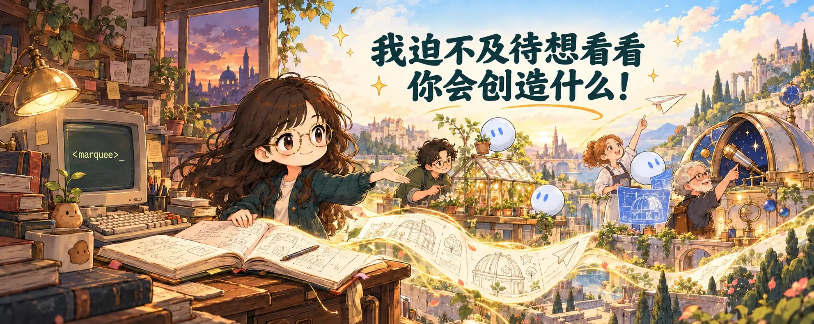

# 编程已死，编程万岁

> 作者：lauren（[@poteto](https://x.com/poteto)）  
> 原文：[Coding is dead, long live Coding](https://x.com/poteto/status/2103571281014861957)  
> 翻译 Url：[https://github.com/samz406/local_wenzhang/blob/main/docs/编程已死编程万岁/编程已死，编程万岁.md](https://github.com/samz406/local_wenzhang/blob/main/docs/编程已死编程万岁/编程已死，编程万岁.md)  
> 发布日期：2026 年 9 月 25 日

致那些正在哀悼失去自己最热爱之事的朋友：我懂你们的痛。我最初只是把编程当作爱好，高中时第一次接触它，并发现了 `<marquee>` 标签。从那次令人欣喜的发现开始，我便再也停不下来：做东西、反复折腾，期待着解决下一个问题时的兴奋。我会逐行钻研代码，苦苦琢磨怎样才能让程序更优雅、性能更高，甚至更美。

我觉得 [Thorsten Ball](https://x.com/thorstenball) 概括得最好：

> “编写代码这门手艺终将消失。没错，意大利手工鞋匠今天依然存在。但看看你脚上穿的鞋。”

作为 AI 的受益者，我们所拥有的一切都归功于前人：是他们发现、设计并创造了我们今天赖以生存、继续建设的知识与文明。看看周围吧，即使是日常生活中最普通的东西，也曾由某个满怀热情、执着解决问题的人变成现实。如今，这些人正在哀悼一种触感的消失——只凭自己的双手，以及巨人肩膀上积累起来的知识，亲自解开一个问题时的那种感觉。

编程已死，但编程依然活在我们今天使用的模型权重里，活在我们借助的框架里，也活在我们书写的编程语言里。我们不该嘲笑那些为此哀伤的人，因为我们所拥有的一切都源自他们。可在有人哀伤的同时，我们也可以为此欢欣。就我个人而言，作为一名自学成才的程序员，一想到会有更多人发现创造东西的快乐，我就无比兴奋。我们很容易把编程自动化看成一切的终结，但我认为，这其实是一个新的开始：新一代程序员将用自然语言表达自己的意图和目标，以更快的速度、更高的质量，创造出远超我们手工能力的作品。

眼下看起来，或许还不太像真的能够做到。但我相信，它一定会发生。借助 AI 的创造者，**一定会**做出过去的我们无法完成的东西。

> “你得把它看成一种古怪的电子游戏。理论上，总存在一串输入 Token，可以让模型输出你想要的代码，而且完全不需要再修改。这完全有可能。你只需要找出那串输入 Token。别放弃，也别退回手工改代码。你做得到。”
>
> ——[Alexander Riccio（@ariccio）](https://x.com/ariccio/status/2103324315219275780)

而这种丰裕将无比绚烂！恰恰相反，我比以往任何时候都更热爱编程。过去，我会受限于自己的能力；如今，只要找到正确的咒语——合适的提示词和上下文——驱动智能体朝着脑海中那个无比清晰的愿景前进，我就能让它成为现实。

所以，尽管有些人说“很期待看到你做出的东西”时未必真心，我还是愿意相信，我们当中的许多人确实发自内心地期待：那些从未体验过创造之乐的人，究竟能够做出什么。

我已经迫不及待想看看你会创造什么了！
