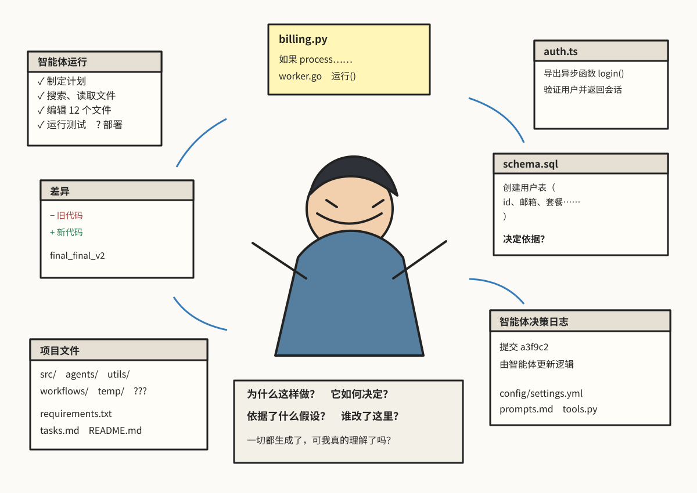
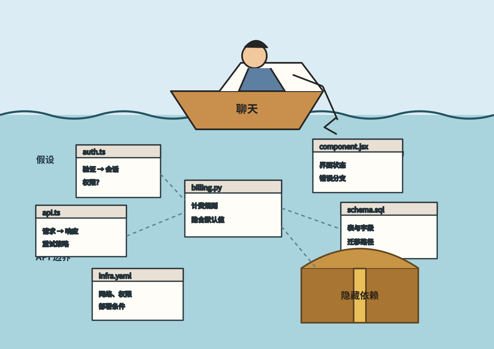
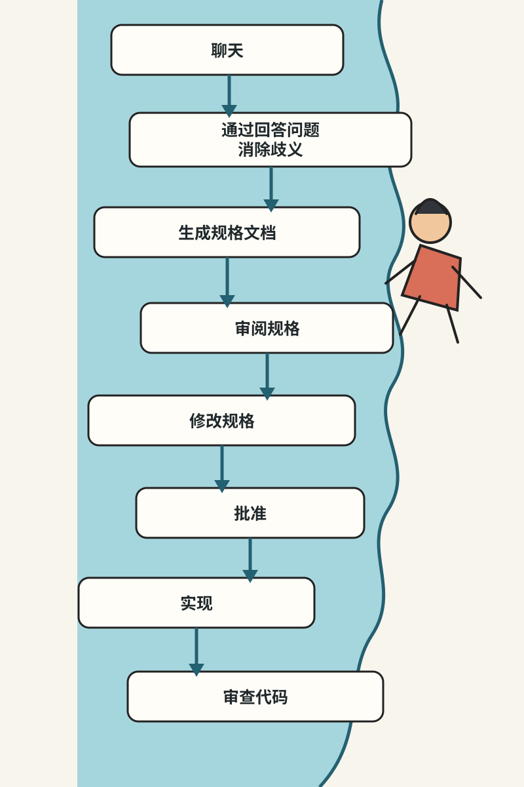
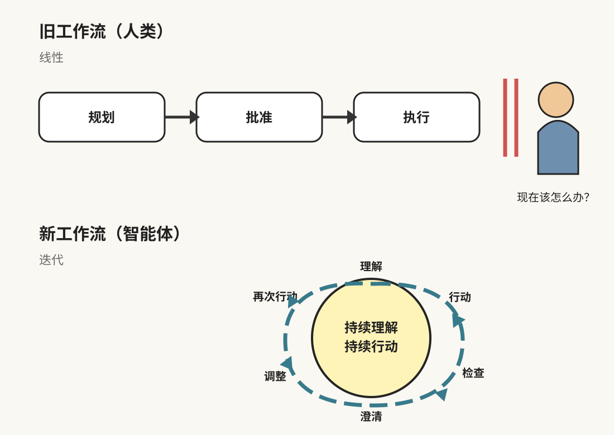
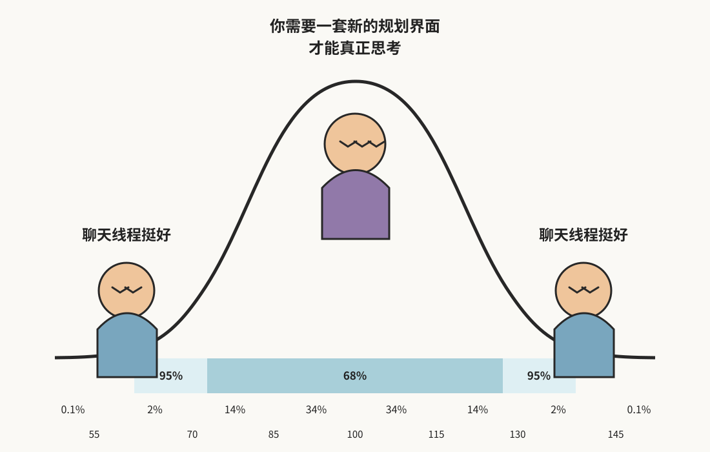
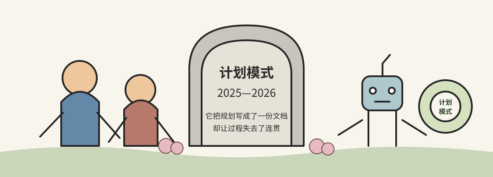

# 计划模式已死

> 作者：Ayman Nadeem（[@aymannadeem](https://x.com/aymannadeem)） 
> 原文：[Plan mode is dead](https://www.aymannadeem.com/artificial/intelligence,/developer/tools/2026/09/24/plan-mode-is-dead.html) 
> 翻译 Url：[https://github.com/samz406/local_wenzhang/blob/main/docs/计划模式已死/计划模式已死.md](https://github.com/samz406/local_wenzhang/blob/main/docs/计划模式已死/计划模式已死.md) 
> 发布日期：2026 年 9 月 24 日

今年早些时候，我还相信：在用 AI 构建软件这件事上，规划将成为最重要的环节。

我对此深信不疑，甚至围绕这个想法打造并发布了一款完整的桌面编程应用。[Nuanced](https://www.nuanced.dev/) 的出发点是这样一个观察：AI 已经从根本上提升了代码生成的速度和数量，但支撑这种全新工作节奏的界面却没能跟上。

Nuanced 的规划方案失败了，但这次失败也让我看清：从更广的层面来看，计划模式已经不像过去那么有用了。一直以来，计划模式承担着两个任务：一是给智能体足够精确的指令；二是帮助人类理解自己正在构建什么。

我认为，随着模型越来越强，第一个任务正迅速失去存在的必要。第二个任务反而比以往任何时候都重要，但计划模式并不是解决它的正确抽象——尤其是在我们同时运行的智能体越来越多的情况下。

## 我为什么打造 Nuanced

我当初想做的产品，归根结底是在回答一个我至今仍认为重要、而且会一直重要的问题：当机器修改软件系统的速度已经快到人类来不及逐一检查时，人要怎样才能维持对这个系统连贯、完整的心智模型？

模型几分钟就能写出几千行代码。这意味着，你甚至还没想清楚自己要做什么、为什么要做，就先背上了一大笔维护债。系统行为因此更难推演，那些过早凝固成代码的错误假设也更难调试。

这样生成代码确实轻松，也更容易带来多巴胺奖励；可它同时遮住了那些令人不适、却不可回避的工作：理解一件东西为什么值得做、它究竟值不值得做，以及严谨评估产品、设计与基础设施决策。我经常还没来得及有意识地做出任何产品决策，产品就已经摆在眼前了。如果我没有把架构说得足够清楚，智能体就会自行填补空白——哪怕它划分抽象边界的方式会在日后给我制造麻烦。关于预期行为和设计的误解，会一路蔓延进聊天界面之下的许多文件里，很容易被漏掉。在水面下四处打捞这些难以看透的问题，感觉还不如一开始就把东西设计正确来得高效。

这种体验会让人在精神上与工作脱节，像行尸走肉一样；当 Conductor、Codex 之类的编程应用让我们可以并行运行更多智能体后，这种感觉尤其强烈。我发现自己再也很难像从前那样真正集中注意力，也难以深入理解手头正在做的事。生成结果到底对不对，也因此更难验证。

从「用户提示 → 智能体决策 → 代码 → 产品行为」，中间没有一条清晰、可解释的轨迹。但这并不代表我想回到过去，重新逐行阅读代码、逐个翻看文件。恰恰相反，我觉得用自然语言推演想法更轻松，也更高效。我想自信地航行在代码之上，却又不必牺牲自己对系统运行方式的理解。

## 现有计划模式不够像真正的协作

计划模式虽然已经存在，但我总觉得，我们还没有找到一种真正适合做好规划的抽象。从 Claude Code CLI 到 Conductor，再到后来发布的 Codex，我轮番使用这些工具，反复细琢、删削计划，却始终没有一个明确的地方可以持续打磨它们。在 Codex 还没有批注功能时，我只能在聊天里讨论，再把计划片段复制到新消息中修改。这样的剪贴流程笨拙不堪：既要顺着一个想法往下推，又要始终掌握当前计划是什么，实在费劲。

我想给计划一个安身之处，让它扎根于完整的工作流，不再只是随着对话向前推进、消失在聊天记录深处的一团临时文字，而是一份鲜活、持久、不断演化的文档。我想让计划模式成为指导开发的一等原语，原因有几个：

- 我需要想清楚该做什么。
- 我需要确保自己描述得足够精确。
- 我需要理解已经完成了什么。
- 我需要知道什么时候出了问题，以及为什么会出问题。

## 把梦想中的流程做出来

我设想了自己梦寐以求的工作流，并决定把它编码成产品，让它真正运转起来。在 Nuanced 里，你可以开启多个线程，每个线程都是一段聊天。你与系统讨论想构建什么；系统会主动暴露其中的歧义，以及必须由你参与的决策；双方共同推导出一份持久的计划，之后才开始实现。接着，Nuanced 会落实这份计划，确保生成的代码遵守你的要求。我想要的是一条从意图出发，一路贯穿实现、审查和验证的端到端管线。与其说它是另一款编程应用，不如说它是一副为人类心智——或者说，为我这个 ADHD 大脑——打造的义肢：它既负责发出指令，也帮助我随时掌握究竟发生了什么。

## 我错在哪里

这倒不是说，我对现有工具缺口的判断错了，也不是说我看错了软件开发生命周期正在经历的变化。真正的问题是，我们的实现并没有交付预期中的答案。原因在于：

- 我把「规划」和「计划书」混为一谈；
- 模型变得非常强；
- 没人想读 AI 生成的文字；
- 我们把规划与构建拆开了，而且这种拆分打断了工作流。

### 「规划」不等于「计划书」

我们学到的第一件事，就是自己把规划过程和计划书混为了一谈。它们其实不是一回事。我的假设是：在动手实现之前，留出空间把一件事想透，是有价值的。我还以为，随着项目演进，把这些思考保存成一份庞大、结构化的产物，也会很有价值。可早期用户对这份规格文档的兴趣少得出奇。

### 模型变得非常强

随着模型借助上下文和记忆理解大型代码库的能力越来越好，它们已经很擅长探索仓库，并自行做出合理假设。想要得到深思熟虑的结果，过去必须显式写给模型的那些指令，如今已经少了很多。

我一开始从没想过，模型能力会与「为人类思考设计更好的界面」形成竞争；但从很多角度看，事实确实如此。因为模型每多一个可以可靠自主完成的决策，就少一个需要呈现在人类面前的决策。

### AI 生成的文字读起来很痛苦

规格文档提供了更多信息，却没有带来更多清晰度。原因很简单：我们的规格文档太长了。它们记录了重要决策，也装进了大量看似有用的上下文；可问题是，这些文字由 AI 生成。AI 文本的节奏，以及那种过度结构化的组织方式，总有些什么让人很难读下去。我的眼神总是不知不觉就飘走了。

发现这个问题后，我们没有直接砍掉规格文档，反而做了一个「规格导览」（Spec Tour）来补救。我们的想法是：与其要求用户消化整份文档，不如由规格导览带他们走过其中的重要部分。可这只是在系统上又加了一层复杂度，让屏幕上多出更多争夺注意力的文字。如果必须再生成一份更短的规格摘要，才能让原规格文档变得可用，那一开始为什么还要有那份完整文档？

### 我们拆开了一个本应连贯的过程

我们的工作流太线性，也太讲究先后顺序。整个过程大致是这样：

> 聊天 → 通过回答问题消除歧义 → 生成规格文档 → 审阅规格 → 修改规格 → 批准 → 实现 → 审查代码

真正的思考并不是这样发生的，把这些环节强行隔开，既人为又别扭。通常，你会先理解问题的一部分，接着尝试某个方案；第一轮生成又教会你一些新东西，让你改变主意，转而尝试别的方向。每前进一步，都会冒出一个新问题。规划与构建本就相互交织，比计划模式允许的方式——尤其是我们在 Nuanced 里的实现——自然得多。我们的界面逼着用户过早「结束思考」，好让构建工作得以开始。一旦进入实现阶段，再回到先前基于聊天的推理，就像是在工作流里倒退。可瀑布一旦落下，人是回不到上游的。

看看今天的 Codex，你会发现规划与执行之间的边界正在消失，二者逐渐合为一体。早期的编程智能体更适合由人类遵循这样的流程：

> 规划 → 批准 → 执行

那时，一旦走错方向，代价要高得多。但随着智能体更善于理解系统，它们也更能自主行动、检验自己的工作；检查结果后，它们也很擅长调整方法。于是，另一种循环成为可能：

> 理解 → 行动 → 检查 → 澄清 → 调整 → 再次行动

这个循环内部仍然发生着大量规划，只是它未必非要以一份名叫「计划」的文档呈现出来。我犯下的最大错误，或许就是把计划做成了一件静态产物，而不是设计一套能增进人类理解的过程。

## 计划模式与构建模式的分离很奇怪

Nuanced 同时有计划模式和构建模式，用户可以任选其一开始。计划模式一定会生成规格文档；构建模式则不会强迫用户先做规格，更适合那些不值得专门写规格的小任务。但把两种模式分开很别扭：用户必须先问自己一个元问题——这项任务值不值得规划？如果值得，还得记得通过按钮或键盘快捷键打开计划模式。我越来越觉得，这种判断本该由 AI 根据已有上下文替你完成；还要分心记住自己应该进入哪一种模式，只会平添认知负担。

想通这一点时，我感觉自己活成了那张「中间聪明人」迷因：原来，一个简单的聊天界面，让规划按需发生而不是默认强制发生，反而已经非常好用了。

## 我们仍未解决「理解」的问题

想清楚要构建什么、为什么重要，并对各种决策作出评估，依然不可或缺。人需要建立一套连贯的心智模型，理解眼前究竟发生了什么；但我不认为，一大篇 AI 生成的文字是承载这种理解的正确界面。在聊天中逐项讨论决策更符合直觉，可随着系统不断变化，如何让人的理解始终保持同步，至今仍是一个没有答案的问题。

当智能体从 5 个增加到几百个，这个问题只会更难。所谓「跟上进度」，不可能是读完每一段对话，再让每一次代码改动都生成一份解释。智能体必须找出数量尽可能少、但人类注意力能够产生最大影响的关键位置，并呈现足够的上下文，让这份注意力真正发挥作用。

当数百个能力越来越强的智能体同时改动一个系统时，我们依然不知道该怎样帮助人保持方向感。不过我认为，更深层的问题——人如何理解系统、如何穿行于复杂的信息层级、如何使用强大的工具——是一个不会消失的长期命题。界面会随着底层技术不断变化，但让复杂事物变得可以理解的需求，永远不会消失。

## 关于作者

Ayman Nadeem 正在打造 AI 编程产品 [Nuanced](https://www.nuanced.dev/)，并持续写作软件开发、编程语言与人机交互等主题。他曾任 GitHub 高级工程师。

联系邮箱：[holla@aymannadeem.com](mailto:holla@aymannadeem.com)
